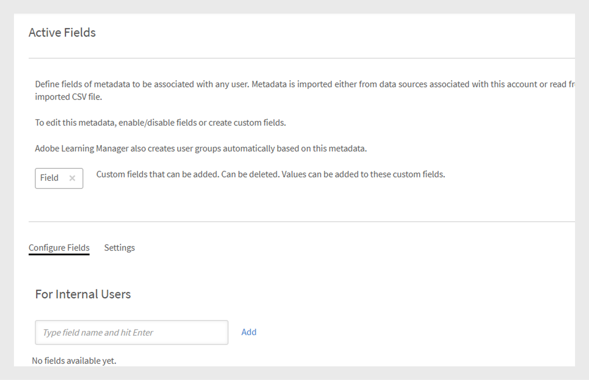

# Ajouter des utilisateurs et créer des groupes d’utilisateurs

Découvrez comment ajouter des utilisateurs ou des groupes d&#39;utilisateurs dans l&#39;application Learning Manager.

<!---->

## Gestion des groupes d’utilisateurs

>[!INFO]
>
>Dans cette formation, vous apprendrez à créer un groupe d’utilisateurs par noms, ID de messagerie et combinaison de plusieurs groupes d’utilisateurs générés automatiquement.    

<!--[Launch training](https://learningmanager.adobe.com/app/learner?accountId=98632&sdid=QLD1P6BS&mv=display&mv2=display#/course/7555694)-->

<!--In this training, you will learn how to create a user group by names, email IDs, and combining multiple auto-generated user groups.-->

<!---->

Si vous ne parvenez pas à lancer la formation, écrivez à <almacademy@adobe.com>.

## Vue d’ensemble {#overview}

Dans Adobe Learning Manager, vous pouvez assumer les rôles suivants :

* **Administrateur :** un administrateur définit la stratégie de formation de l’organisation. Un administrateur peut ajouter des élèves, rechercher les compétences requises pour les élèves, gérer et assigner des cours, créer des plans d’apprentissage, des certifications et des programmes d’apprentissage, et gérer des rapports pour l’ensemble de l’organisation.
* **Auteur :** les auteurs sont des concepteurs pédagogiques et des créateurs de contenu. Un auteur peut ajouter des modules et des cours à Learning Manager.
* **Responsable :** un responsable gère les activités d’apprentissage d’une équipe. Un responsable peut nommer des membres de l’équipe pour suivre un cours, approuver les demandes des membres de l’équipe et faire part de ses commentaires sur les performances des membres de l’équipe à la fin de la formation. Les responsables peuvent également consulter des rapports afin de suivre les performances de leur équipe.
* **Élève :** les élèves peuvent accéder aux cours, aux programmes d’apprentissage et aux certifications qui leur sont assignés. Les élèves peuvent également parcourir tous les cours disponibles en utilisant un catalogue et s’inscrire à des cours, des programmes d’apprentissage ou des certifications.

En tant qu’administrateur, vous pouvez créer des utilisateurs de trois manières :

* Interne
* Externe
* Groupes d’utilisateurs

## Ajouter un utilisateur unique {#addasingleuser}

Ajoutez des élèves internes à Adobe Learning Manager à l’aide d’une option d’utilisateur unique.

>[!INFO]
>
>Dans cette formation, vous apprendrez à ajouter des élèves internes à Adobe Learning Manager.    

Si vous ne parvenez pas à lancer la formation, écrivez à <almacademy@adobe.com>.

Pour ajouter des utilisateurs,

1. Connectez-vous à Adobe Learning Manager en tant qu’administrateur.
1. Sur la page d’accueil, cliquez sur **[!UICONTROL Ajouter des utilisateurs]**. Sur cette page, vous pouvez ajouter un ou plusieurs utilisateurs à la fois en utilisant un CSV. Vous pouvez également créer un lien d’auto-inscription pour les employés internes ou créer un profil d’élève externe.
1. Pour ajouter un utilisateur unique, cliquez sur **[!UICONTROL Ajouter]** dans le coin supérieur droit de la page et choisissez l’option **[!UICONTROL Utilisateur unique]**.

1. Pour ajouter un utilisateur unique, cliquez sur **[!UICONTROL Ajouter]** dans le coin supérieur droit de la page et choisissez l’option **Utilisateur unique**.

   
   *Ajout d’un utilisateur interne unique*

1. Dans la boîte de dialogue **[!UICONTROL Ajouter un utilisateur]**, saisissez les informations de l’élève. Pour le champ **[!UICONTROL Nom du responsable]**, sélectionnez le nom d’un utilisateur existant dans le système.

   
   *Boîte de dialogue Ajouter un utilisateur*

1. Pour ajouter le nouvel utilisateur dans Learning Manager, cliquez sur **[!UICONTROL Ajouter]**. Après l’ajout de l’utilisateur, celui-ci reçoit un e-mail de vérification. L’élève active ensuite le compte et commence à utiliser Learning Manager. Ce workflow est utile si vous devez ajouter un nombre limité d’élèves à votre compte Learning Manager. Mais si vous prévoyez d’inscrire tous les employés d’une grande organisation, vous pouvez les ajouter en une seule fois. Pour plus d’informations, voir la section suivante.

## Ajouter des utilisateurs par groupe {#addusersinbulk}

Généralement, la plupart des organisations utilisent un système de gestion des RH (HRMS), qui tient à jour tous les dossiers des employés, comme la désignation, le lieu, la date d’entrée en fonction ou la hiérarchie des employés. Vous pouvez exporter ces données au format CSV. Pour importer un CSV, suivez les étapes ci-dessous :

1. Cliquez sur **[!UICONTROL Ajouter]** dans le coin supérieur droit de la page et sélectionnez l’option **[!UICONTROL Charger un CSV]**.

   
   *Chargement d’un fichier CSV pour ajouter des utilisateurs en bloc*

1. Le CSV que vous chargez est constitué des champs, comme indiqué ci-dessous :

   
   *Structure du fichier CSV*

   Vous devez gérer un fichier CSV maître et effectuer tous les ajouts et suppressions sur le fichier CSV maître. Le fichier CSV maître contient les champs suivants :

   * nom &#42;
   * e-mail &#42;
   * profile
   * approuvés

   (&#42;) Champ obligatoire.

1. Après avoir cliqué sur l’option **[!UICONTROL Charger un CSV]**, la boîte de dialogue suivante s’affiche.

   
   *Boîte de dialogue Charger un fichier CSV*

1. Sélectionnez le CSV ou glissez-déposez le fichier. Après avoir choisi le fichier, mappez les champs de données avec ceux du fichier CSV. Cliquez sur le menu déroulant requis et sélectionnez le champ approprié.

   
   *Champs de mappage dans le fichier CSV*

1. Pour commencer à importer les utilisateurs, cliquez sur **[!UICONTROL Enregistrer]**. Vous pouvez voir un message de confirmation.

   
   *Message de confirmation indiquant que le chargement du fichier CSV a réussi*

1. Les nouveaux utilisateurs ont été ajoutés à votre compte Adobe Learning Manager. Pour sélectionner les nouveaux utilisateurs, cochez la case à côté des noms pour que tout le monde soit sélectionné.

   
   *Nouveaux utilisateurs ajoutés*

>[!NOTE]
>
>Pour plus d’informations, consultez la FAQ, [Ajouter des utilisateurs par groupe](../add-users-in-bulk.md).

Après avoir sélectionné les utilisateurs, vous pouvez effectuer les opérations suivantes :

## Enregistrer un utilisateur {#registerauser}

Une fois l’utilisateur sélectionné, cliquez sur **[!UICONTROL Actions]** dans le coin supérieur droit et cliquez sur **[!UICONTROL Enregistrer]**.

Les utilisateurs sélectionnés reçoivent un email de bienvenue. Si les élèves ont un ID Adobe existant, ils peuvent cliquer sur ce lien. S’ils n’ont pas d’Adobe ID existant, ils peuvent cliquer sur le lien Bienvenue pour créer un Adobe ID et le lier à leur compte Learning Manager.

## Attribuer un rôle {#assignarole}

Après avoir ajouté des élèves au compte Adobe Learning Manager, si vous souhaitez modifier leurs rôles, cliquez sur Actions dans le coin supérieur droit de la page. Sélectionnez l’option **[!UICONTROL Attribuer un rôle]**. Ici, vous pouvez décider si vous voulez donner l’accès en tant qu’auteur ou l’accès en tant qu’administrateur à l’élève. Une fois que vous avez attribué un rôle, cet élève dispose d’un accès d’auteur au compte et peut ajouter des modules et créer des cours.

*Attribution d’un rôle à un utilisateur*

## Supprimer un rôle {#removearole}

Vous pouvez également supprimer l’accès en tant qu’auteur ou administrateur pour les utilisateurs. Sélectionnez un ou plusieurs élèves, cliquez sur **[!UICONTROL Actions]**, puis sélectionnez **[!UICONTROL Supprimer le rôle]**. Choisissez une option, par exemple : **[!UICONTROL Supprimer l’auteur]**, et l’accès d’auteur est révoqué pour cet élève.

>[!NOTE]
>
>Vous ne pouvez pas attribuer manuellement un rôle de responsable à quelqu’un dans le système. Ils ont automatiquement accès au tableau de bord du responsable lorsqu’un ou plusieurs employés sont ajoutés à leur charge.

## Supprimer un utilisateur {#deleteauser}

Pour supprimer un utilisateur, cliquez sur **[!UICONTROL Actions]**, puis sélectionnez **[!UICONTROL Supprimer l’utilisateur]**. Dans la boîte de dialogue de confirmation, cliquez sur **[!UICONTROL Oui]** pour supprimer l’élève.

*Message de confirmation pour supprimer un utilisateur*

## Modifier un utilisateur {#editauser}

Dans la liste des utilisateurs, sélectionnez-en un, puis cliquez dessus. Dans les détails de l’utilisateur, cliquez sur le bouton **[!UICONTROL Modifier]** ( ). Dans la boîte de dialogue **[!UICONTROL Modifier l’utilisateur]**, effectuez les modifications nécessaires et cliquez sur **[!UICONTROL Enregistrer]** pour enregistrer les modifications.

*Boîte de dialogue Modifier l’utilisateur*

## Champs actifs

### Gestion des attributs utilisateur

>[!INFO]
>
>Dans cette formation, vous apprendrez à ajouter, personnaliser et configurer des champs actifs.    

Si vous ne parvenez pas à lancer la formation, écrivez à <almacademy@adobe.com>.

Adobe Learning Manager préserve la sensibilité à la casse de l’attribut utilisateur et de sa valeur. **Par exemple**, la sensibilité à la casse d&#39;un attribut utilisateur est &#39;location&#39; et sa valeur &#39;PARIS&#39; sera préservée et affichée de la même manière. En cas de problème, l’administrateur peut désormais modifier le nom et les valeurs de l’attribut pour corriger toute erreur de sensibilité à la casse.

Pour ce faire, l’administrateur peut visiter le site **[!UICONTROL Application d’administration]** > **[!UICONTROL Utilisateurs]** > **[!UICONTROL Groupes d’utilisateurs]** et en cliquant sur le nom du groupe.

Un administrateur peut ajouter et mettre à jour les valeurs d’attribut autorisées pour un élève via l’interface utilisateur.

Types de champs actifs :

* Regroupable : les élèves sont regroupés en fonction des valeurs
* Reportable : les groupes d’utilisateurs de rapport sont créés en fonction des champs actifs
* Exportable : les champs sont affichés dans le rapport de groupe d’utilisateurs exporté.

## Créer un lien d’auto-inscription {#createaselfregistrationlink}

Vous pouvez également permettre aux employés de votre organisation de s’inscrire en tant qu’élèves au compte Adobe Learning Manager, sans nécessiter votre aide en tant qu’administrateur. L’administrateur peut créer un lien d’auto-inscription et le partager avec les employés, qui peuvent ensuite s’inscrire à Learning Manager à l’aide de leurs identifiants d’Adobe.

Dans le coin supérieur droit de la page, cliquez sur **[!UICONTROL Ajouter]**, puis sélectionnez **[!UICONTROL Auto-inscription]**.

*Créer un lien pour s’inscrire automatiquement en tant qu’élève*

La boîte de dialogue **[!UICONTROL Ajouter un profil d’auto-inscription]** s’affiche. Donnez un nom à ce profil. Ajoutez ensuite le nom du responsable. Il est important de savoir que le responsable doit déjà être un élève inscrit dans Learning Manager.

*Ajouter un profil pour l’auto-inscription*

Après avoir cliqué sur **[!UICONTROL Enregistrer]**, une URL est générée. Vous pouvez la partager avec les élèves afin qu’ils puissent cliquer sur l’URL et s’enregistrer eux-mêmes.

## Inscrire les élèves externes {#enrollexternallearners}

Dans Adobe Learning Manager, vous pouvez également créer des liens d’inscription pour les partenaires externes ou les agences ayant un accès limité à votre compte et leur fournir du matériel pédagogique.

Il y a quelques différences entre les inscriptions internes et externes.

<table>
 <tbody>
  <tr>
   <td>
    
<b>Utilisateurs internes</b>
</td>
   <td>
    
<b>Utilisateurs externes</b>
</td>
  </tr>
  <tr>
   <td>
    
Connectez-vous avec votre Adobe ID ou identifiant SSO.
</td>
   <td>
    
Connectez-vous à l’aide de n’importe quel ID de messagerie.
</td>
  </tr>
  <tr>
   <td>
    
La ludification est disponible.
</td>
   <td>
    
La ludification n’est pas disponible.
</td>
  </tr>
  <tr>
   <td>
    
Des hiérarchies d’élèves sont disponibles.
</td>
   <td>
    
Les hiérarchies d’élèves ne sont pas disponibles.
</td>
  </tr>
 </tbody>
</table>

Pour inscrire des utilisateurs externes, suivez les étapes ci-dessous :

1. Dans le volet de navigation de gauche, cliquez sur **[!UICONTROL Externe]**.

   

   *Inscription d’utilisateurs externes*

1. Cliquez sur **[!UICONTROL Ajouter]** dans le coin supérieur droit de la page.

1. Dans la boîte de dialogue **Ajouter un profil d’inscription externe**, ajoutez les informations suivantes :

   * Nom du profil de l’organisation partenaire.
   * Adresse e-mail du responsable de l’organisation partenaire.
   * Limite de places pour l’inscription externe de ce partenaire.
   * Date d’expiration pour définir une date limite afin de ne plus autoriser de nouvelles inscriptions pour ce groupe. Après la date d’expiration, seuls les utilisateurs enregistrés existants peuvent accéder à cette formation.

   

   *Boîte de dialogue Ajouter un profil d’inscription externe*

   * Dans le panneau **[!UICONTROL Paramètres avancés]** dans la section, saisissez les informations suivantes :

      * **[!UICONTROL Configuration requise pour la connexion]:** Spécifiez une valeur en jours. Les élèves sont supprimés s’ils ne se connectent pas pendant la durée indiquée ci-dessus.
      * **[!UICONTROL Domaines autorisés]:** Liste séparée par des virgules des noms de domaine d’e-mail autorisés.
      * **[!UICONTROL Vérification de l’adresse e-mail requise]:** Sélectionnez cette option pour rendre la vérification par e-mail obligatoire pour un élève.

   

   *Saisissez les détails dans la section Paramètres avancés*

1. Après avoir cliqué sur **[!UICONTROL Enregistrer]**, vous pouvez voir le message de confirmation suivant. Vous devez partager l’URL avec votre partenaire externe.

   

## Activer un profil externe {#enableanexternalprofile}

Après la création d’un profil externe, vous devez activer son état. Dans la liste des profils externes, sélectionnez le profil requis et faites basculer le bouton d’état.

*Activation d’un profil externe*

Cela permet d’activer le lien Inscription externe. Un message de bienvenue est automatiquement envoyé au partenaire. Vous pouvez également copier le lien et le partager avec eux en cliquant sur l’icône Copier l’URL (), ou vous pouvez renvoyer le message de bienvenue à l’organisation partenaire en cliquant sur l’icône Courrier ().

Le responsable partenaire peut partager le lien avec les employés qui doivent suivre la formation dans PrLearning Manager. Quand ils cliquent sur le lien, ils peuvent procéder à leur auto-inscription après avoir indiqué quelques informations pour créer leur profil sur Learning Manager. Ces utilisateurs n’apparaîtront pas dans l’onglet Élèves avec les employés internes. Vous pouvez voir leurs noms sous l’onglet **[!UICONTROL Élèves externes]**.

## Suspendre un profil externe {#pause}

Après avoir ajouté un groupe d’utilisateurs externes à Learning Manager, vous pouvez également suspendre le processus d’inscription des utilisateurs externes. Lorsque vous interrompez, le processus d’inscription des utilisateurs externes est bloqué. Toutefois, ce processus fonctionne uniquement lorsque les utilisateurs ne se sont pas encore enregistrés en acceptant l’invitation.

Pour suspendre les groupes d’utilisateurs externes, choisissez un ou plusieurs groupes, cliquez sur **[!UICONTROL Actions]** dans le coin supérieur droit de la page et cliquez sur **[!UICONTROL Suspendre]**.

## Reprendre un profil externe {#resumeanexternalprofile}

Vous pouvez à tout moment révoquer l’état de suspension d’un partenaire externe et reprendre les services normaux. Cliquez sur **[!UICONTROL Actions]** dans le coin supérieur droit de la page et sélectionnez **[!UICONTROL Reprendre]**.

Les états suivants s’appliquent à des utilisateurs externes :

* **État inactif** - Dans cet état, l’inscription des utilisateurs externes a expiré. Les administrateurs définissent la date d’expiration pour les utilisateurs externes lorsqu’ils les ajoutent au flux de production d’ajout de l’utilisateur.
* **État actif :** dans cet état, les utilisateurs externes peuvent s’enregistrer dans l’application Learning Manager, puis se connecter à l’application.
* **Suspension :** dans cet état, le processus d’enregistrement des utilisateurs externes est bloqué. Toutefois, les utilisateurs existants peuvent toujours se connecter.

## Vérifier le nombre de places utilisées {#checkusedseats}

Dans la liste des profils externes, cliquez sur **[!UICONTROL Places utilisées]**. Vous pouvez voir le nombre d’élèves de l’organisation partenaire qui ont été ajoutés.

*Vérifier les places utilisées*

## Supprimer un utilisateur {#Deleteauser-1}

Choisissez un utilisateur, puis cliquez sur dans le coin supérieur droit. **[!UICONTROL Actions]** > **[!UICONTROL Supprimer l’utilisateur]**.

## Modifier le profil {#changeprofile}

Pour déplacer un utilisateur vers un autre profil externe, choisissez un utilisateur, puis cliquez sur dans le coin supérieur droit **[!UICONTROL Actions]** > **[!UICONTROL Modifier le profil]**. Dans la liste des profils, sélectionnez un profil, puis cliquez sur **[!UICONTROL Modifier]**.

## Attribuer un rôle {#Assignarole-1}

Choisissez un utilisateur, puis cliquez sur dans le coin supérieur droit. **[!UICONTROL Actions]** > **[!UICONTROL Attribuer un rôle]** > **Créer`<role>`**. L’utilisateur obtient un nouveau rôle.

## Supprimer un rôle {#Removearole-1}

Choisissez un utilisateur, puis cliquez sur dans le coin supérieur droit. **[!UICONTROL Actions]** > **[!UICONTROL Supprimer le rôle]** > **Supprimer`<role>`**. Le rôle sélectionné est supprimé de la liste des rôles qui ont été attribués à l’utilisateur.

## Créer des groupes d’utilisateurs {#createusergroups}

Un groupe d’utilisateurs est un ensemble d’utilisateurs appartenant à une catégorie. Les groupes d’utilisateurs aident les administrateurs à sélectionner les élèves dans leur organisation en fonction de leurs attributs, puis à leur attribuer un contenu d’apprentissage. En outre, ces groupes d’utilisateurs permettent aux administrateurs d’attribuer des logos et des catalogues personnalisés aux élèves et d’afficher des rapports personnalisés sur leur progression.

Pour accéder aux groupes d’utilisateurs, dans le volet de navigation de gauche, cliquez sur **[!UICONTROL Groupes d’utilisateurs]**.

*Création de groupes d’utilisateurs*

Il existe deux types de groupes dans Adobe Learning Manager : Personnalisé et Généré automatiquement. Lorsque vous ajoutez des élèves à votre compte, certains groupes sont automatiquement créés en fonction de leurs propriétés communes.

Pour voir les groupes créés automatiquement, cliquez sur l’onglet **[!UICONTROL Généré automatiquement]**.

*Afficher les groupes générés automatiquement*

Vous pouvez voir qu’il y a différents groupes, comme Tous les utilisateurs internes, Tous les responsables, ou encore des groupes basés sur le centre de coûts, basés sur le service, et basés sur les équipes des responsables.

En plus des groupes générés automatiquement, vous pouvez créer des groupes personnalisés. Pour ajouter un nouveau groupe personnalisé, dans le coin supérieur droit, cliquez sur **[!UICONTROL Ajouter]**.

1. Saisissez le nom et la description du groupe.
1. Saisissez un nom d’utilisateur ou un profil dans le champ de recherche en temps réel et ajoutez des utilisateurs en les sélectionnant dans la liste déroulante.

1. Pour ajouter d’autres élèves, cliquez sur **[!UICONTROL Ajouter plus d’utilisateurs]**.

1. Pour créer le groupe d’utilisateurs, cliquez sur **[!UICONTROL Enregistrer]**.

Ce groupe personnalisé est maintenant créé et ajouté au profil. Les groupes d’utilisateurs que vous créez sont de nature dynamique. Si de nouveaux utilisateurs avec des attributs similaires sont ajoutés, ils sont automatiquement ajoutés au groupe d’utilisateurs.

## Exclusion de groupes d’utilisateurs

Vous souhaiterez parfois exclure un petit groupe d’utilisateurs d’un grand groupe d’utilisateurs. Cette opération est nécessaire pour inscrire cet ensemble spécifique d’utilisateurs à des formations via des plans d’apprentissage ou pour configurer la visibilité correcte des catalogues. Dans cette version de Learning Manager, vous pouvez exclure des élèves ou des groupes d’utilisateurs lorsque vous créez un groupe d’utilisateurs personnalisé. La section Exclure des élèves de la boîte de dialogue Ajouter un groupe d’utilisateurs vous permet de le faire.

*Exclure des groupes d’utilisateurs*

Par exemple, si vous voulez configurer un plan d&#39;apprentissage de sortie que tous les utilisateurs situé en Californie, à l&#39;exception de Store-5 (situé en Californie) soient inscrits.

## Paramètres avancés {#advancedsettings}

### Sources de données {#datasources}

Vous pouvez utiliser cette fonctionnalité lorsque vous souhaitez importer/synchroniser les utilisateurs ou les données d’apprentissage de la base de données de votre organisation dans l’application Learning Manager. Vous pouvez également configurer la fréquence de cette fonction.

Cliquez sur **[!UICONTROL Sources de données]** dans le volet gauche sous **[!UICONTROL Avancé]** section.

*Sources de données pour importer ou synchroniser des utilisateurs*

Choisissez le type de source de données dans le menu **[!UICONTROL Source]** dans la liste déroulante, sélectionnez la fréquence de mise à jour et cliquez sur **[!UICONTROL Synchroniser maintenant]** si vous devez synchroniser immédiatement ou cliquez sur **[!UICONTROL Enregistrer].** Les types de source de données sont SFDC, FTP, etc. pour les utilisateurs internes.

Vous pouvez ajouter plusieurs sources de données.

### Champs actifs {#activefields}

Cette fonction permet aux administrateurs d&#39;ajouter des champs supplémentaires en sus de ce qui a été fourni lors de l&#39;enregistrement de l&#39;utilisateur.

Cliquez sur **[!UICONTROL Champs actifs]** disponible dans la page utilisateurs internes. Les élèves peuvent uniquement choisir parmi les valeurs données dans les valeurs personnalisées.

*Champs actifs*

### Configurer les champs {#configurefields}

**Utilisateurs internes**

Vous pouvez ajouter une valeur personnalisée pour les champs d’utilisateurs internes.

Pour ajouter des valeurs personnalisées, procédez comme suit :

1. Cliquez sur  **[!UICONTROL Modifier les valeurs]** pour un utilisateur interne.

   
   *Modification des valeurs pour les utilisateurs internes*

1. Le **Valeurs du champ personnalisé** s’affiche.

   
   *Valeurs dans la boîte de dialogue Champs personnalisés*

1. Sélectionnez la valeur à ajouter dans le menu déroulant **[!UICONTROL Sélectionner un champ]**.
1. Saisissez les nouvelles valeurs dans le champ **[!UICONTROL Nouvelle valeur]**.
1. Cliquez sur **[!UICONTROL Terminé]**.
1. Cliquez sur Enregistrer en haut à droite pour **[!UICONTROL enregistrer]** les modifications.

**Utilisateurs externes**

Ajoutez des valeurs personnalisées similaires à celles des utilisateurs internes.

*Modification des valeurs pour les utilisateurs externes*

### Paramètres {#settings}

**Affichage utilisateur**

Si l’option **Afficher uniquement les champs non remplis lors de la connexion de l’élève** Si est activé, l’utilisateur ne voit les champs vides qu’au moment de la connexion.

*Afficher les champs non remplis*

Grâce à cette option, un administrateur peut décider s’il veut afficher ou masquer les champs une fois qu’ils ont été remplis.

## Restriction des champs actifs dans les rapports {#restrictactivefields}

Learning Manager 27.7 introduit deux nouvelles options : **[!UICONTROL Déclarable]** et **[!UICONTROL Exportable]**, pour les champs actifs.

*Options dans les champs actifs*

Pour les champs CSV et les champs ajoutés manuellement, si un champ actif est marqué comme **[!UICONTROL reportable]**, il peut être recherché dans un filtre au sein d&#39;un rapport de tableau de bord.

*Filtres dans un rapport de tableau de bord*

Si un champ actif est marqué comme **[!UICONTROL exportable]**, il apparaît dans le fichier Excel lors du téléchargement d’un rapport au format Excel.

Ces options sont disponibles pour les champs actifs internes et externes.

Vous pouvez uniquement supprimer un champ actif personnalisé.

## Affichage utilisateur

Vous pouvez masquer l’intégralité de la page « Finaliser votre profil » aux élèves. La page ne s’affiche pas une fois l’élève connecté.

Notez que le comportement par défaut existant ne change pas. Il s’agit d’une fonctionnalité facultative désormais disponible pour les administrateurs.

Activez les options ci-dessous :

*Section Affichage de l’utilisateur*

## Prise en charge des champs CSV manuels par les connecteurs FTP et Box {#import-connector}

Souvent, les utilisateurs souhaitent que les champs Actifs soient fournis manuellement lorsqu’un élève se connecte à Learning Manager. Cela est actuellement possible dans Learning Manager, lorsque l’utilisateur importe un fichier CSV manuellement.

Le fichier CSV ne peut pas contenir tous les champs actifs. Pour tous les champs actifs qui ne sont pas mis à jour dans le fichier CSV chargé, l’utilisateur doit saisir les données de ces champs actifs.

Actuellement, tous les champs actifs doivent être mappés à un champ du fichier CSV source.

Il arrive qu’un utilisateur ne souhaite pas mapper un champ Actif à un champ spécifié dans le fichier CSV. Dans ce cas, l’utilisateur peut mapper le champ Actif à la valeur **[!UICONTROL PointImportFromSource]**. Sélectionnez cette valeur dans la liste déroulante, lors de l’importation d’utilisateurs à partir de connecteurs FTP et Box.

## Rôles personnalisés {#customroles}

Ajoutez un champ de votre choix dans le cadre des informations utilisateur, et cliquez sur **[!UICONTROL Enregistrer]**. Après avoir ajouté les champs, vous pouvez également vérifier les disponibilités des champs dans le panneau **[!UICONTROL Modifier les utilisateurs]** boîte de dialogue.

Après avoir ajouté les champs, vous pouvez noter que les champs repérés par une coche proviennent de la source de données ou de CSV, comme indiqué dans l&#39;instantané ci-dessous. L&#39;administrateur peut modifier ces champs de sources en activant ou en désactivant les champs.

**Valeurs des champs actifs dans Learning Manager**

Les valeurs des champs actifs sont récupérées de la manière suivante :

1. L&#39;application Learning Manager importe les métadonnées depuis les sources de données associées à votre compte.
1. Les métadonnées sont capturées manuellement à partir du fichier CSV importé.
1. Les stagiaires renseignent les métadonnées lorsqu&#39;ils ouvrent une session
1. L&#39;administrateur saisit des données pour les utilisateurs.

>[!NOTE]
>
>L&#39;application Learning Manager crée des groupes d&#39;utilisateurs automatiquement, à partir de ces métadonnées.

**Ajouter une valeur personnalisée**

Vous pouvez ajouter une valeur personnalisée pour les champs d’utilisateur Interne et Externe.

Pour ajouter des valeurs personnalisées, procédez comme suit :

Les champs personnalisés peuvent être ajoutés et supprimés, ils s&#39;appliquent à tous les utilisateurs. Les champs CSV peut être activés ou désactivés, ils ne prennent effet que lorsque vous tentez de télécharger un fichier CSV après avoir apporté les modifications dans les champs actifs. Tous les champs actifs internes s&#39;appliquent à tous les types d&#39;utilisateurs internes. Les champs externes s&#39;appliquent uniquement aux utilisateurs externes. Si un champ personnalisé est présent dans le fichier CSV, au prochain téléchargement, il est automatiquement converti en champ CSV et il est activé.

## Valeurs pour les champs CSV {#valuesforcsvfields}

Les utilisateurs peuvent choisir parmi les champs prédéfinis pour les champs CSV uniquement si la case **[!UICONTROL Limiter la sélection]** est disponible.

*Case à cocher Restreindre la sélection*

## Journaux d&#39;importation {#importlogs}

Dans cet espace, vous pouvez consulter l&#39;historique d&#39;importation CSV pour les utilisateurs que l&#39;administrateur a ajoutés à l&#39;aide de la fonction d&#39;importation en bloc. Vous pouvez également cliquer sur **[!UICONTROL Ajouter]** dans le coin supérieur droit de la page pour ajouter des utilisateurs à l’aide de la fonction de chargement CSV.

## Champs actifs à plusieurs valeurs

Avec cette fonctionnalité, vous pouvez avoir plusieurs champs pour un champ actif. Dans un compte, il peut y avoir au maximum trois champs actifs à plusieurs valeurs. Les champs actifs à plusieurs valeurs sont disponibles pour les utilisateurs externes et internes.

Une fois que vous avez marqué un champ actif comme à plusieurs valeurs, vous ne pouvez pas le reconvertir en champ à valeur unique. Cette opération est irréversible.

Un champ à valeur unique existant ne peut pas être marqué comme champ à plusieurs valeurs.

Pour créer un champ actif à plusieurs valeurs, procédez comme suit :

1. Ajoutez un champ actif.

   
   *Ajouter un champ actif*

1. Cliquez sur Ajouter.
1. Dans l’onglet Paramètres, marquez le nouveau champ comme à plusieurs valeurs.

   
   *Marquer comme à plusieurs valeurs*

   Il y a une autre case à cocher, **[!UICONTROL Configurable par l’élève]**, qui si elle est désactivée, l’élève ne pourra pas voir le champ sur la page Profil.

1. Ajoutez les valeurs à l’aide d’un fichier CSV ou en cliquant sur Modifier les valeurs.

   
   *Ajouter des valeurs*

1. Cliquez sur [!UICONTROL **Terminé**].

>[!NOTE]
>
>Une fois que le groupe d’utilisateurs est créé et que le champ est renseigné, les valeurs multiples ne peuvent pas être converties en valeurs uniques, et inversement.

### Ajouter un champ actif à plusieurs valeurs via CSV

Procédez comme suit :

1. Créez un fichier CSV avec les nouveaux champs actifs sous forme de colonnes (valeurs séparées par des virgules ou valeurs uniques).
1. Importez le fichier CSV.
1. Marquez les champs comme à plusieurs valeurs dans la boîte de dialogue Valeurs dans les champs personnalisés.
1. Importez à nouveau le fichier CSV.

Le fichier CSV doit avoir une colonne portant le même nom qu’un champ actif marqué comme à plusieurs valeurs.

Le fichier CSV contient les champs suivants :

* **[!UICONTROL Utilisateur]**: groupes d’utilisateurs créés en tant que rôles.
* **[!UICONTROL Rôles]**: champ actif à plusieurs valeurs avec des valeurs.

Si le fichier CSV est rechargé avec de nouvelles valeurs ou des valeurs supprimées, les champs actifs et les groupes sont également mis à jour en conséquence.

### Rapports

Tous les états incluent les champs actifs à plusieurs valeurs et leurs valeurs.

L’administrateur peut ajouter des champs actifs générés automatiquement et configurer des rapports d’activité et de formation des utilisateurs.

Le rapport Relevé de notes de l’élève contient tous les champs actifs et les valeurs séparées par des virgules. L’administrateur peut ensuite filtrer les données en conséquence.

## Forum aux questions {#faq}

+++Comment enregistrer des utilisateurs dans Learning Manager ?

Après avoir ajouté un utilisateur et lui avoir assigné un rôle, vous pouvez l’enregistrer en suivant les étapes ci-dessous :

1. L’utilisateur ou les utilisateurs étant sélectionnés, cliquez sur **[!UICONTROL Actions]** dans le coin supérieur droit, puis cliquez sur **[!UICONTROL S&#39;inscrire]**.

1. Dans la fenêtre pop-up, cliquez sur **[!UICONTROL Oui]**.

Le ou les utilisateurs sélectionnés reçoivent un courrier électronique de bienvenue. Si les élèves ont un Adobe ID existant, ils peuvent cliquer sur ce lien. S’ils n’ont pas d’Adobe ID existant, ils peuvent cliquer sur le lien Bienvenue pour créer un Adobe ID et le lier à leur compte Learning Manager.

Les élèves doivent obligatoirement cliquer sur l’un de ces liens dans l’e-mail, car cela aide Learning Manager à vérifier le compte de l’élève.

+++

+++Comment modifier les données utilisateur ?

Pour modifier un utilisateur, suivez les étapes ci-dessous :

1. Dans la liste des utilisateurs, cliquez sur l’utilisateur dont vous souhaitez modifier les données.
1. Cliquez sur l’icône crayon, comme indiqué ci-dessous.

Dans la boîte de dialogue **Modifier l’utilisateur**, effectuez les modifications que vous souhaitez. Cliquez sur **[!UICONTROL Enregistrer]** pour enregistrer les modifications.

+++

+++Comment suspendre et reprendre un utilisateur externe dans Learning Manager ?

Dans la liste des utilisateurs externes, sélectionnez l’utilisateur que vous souhaitez supprimer. Dans le coin supérieur droit, cliquez sur **[!UICONTROL Actions]** > **[!UICONTROL Pause]**.

Pour plus d’informations, voir [Suspendre un profil externe](add-users-user-groups.md#pause).

Lorsque vous suspendez un profil, le profil externe affiche l’état ***En pause***.

+++

+++Comment envoyer un e-mail de bienvenue à un profil externe nouvellement créé ?

Lors de l’ajout d’un utilisateur externe, dans la section **[!UICONTROL Ajouter un profil d&#39;inscription externe]** , saisissez l’adresse e-mail du responsable externe. Lorsque vous cliquez sur Enregistrer, un e-mail de bienvenue est également envoyé à l’adresse e-mail que vous avez spécifiée. Si vous souhaitez envoyer à nouveau l’e-mail de bienvenue, cliquez sur l’icône en forme d’enveloppe, comme indiqué ci-dessous :

+++

+++Comment créer des groupes d’utilisateurs personnalisés ?

Cliquez sur **[!UICONTROL Utilisateurs]** > **[!UICONTROL Groupes d’utilisateurs]** et sur la page Groupes d’utilisateurs, cliquez sur **[!UICONTROL Ajouter]**. Dans la boîte de dialogue Ajouter un groupe d’utilisateurs, ajoutez les utilisateurs individuellement et en équipe.

+++

+++Comment désactiver les champs actifs déjà remplis ?

Si vous souhaitez que les élèves voient uniquement les champs actifs qui ne sont pas renseignés par eux, procédez comme suit :

1. Cliquez sur **[!UICONTROL Utilisateurs]** > **[!UICONTROL Champs actifs]**.

1. Cliquez sur **[!UICONTROL Paramètres]** et activez l’option **[!UICONTROL Afficher uniquement les champs non remplis lors de la connexion de l’élève]**.

1. Cliquez sur **[!UICONTROL Enregistrer]**.

+++

+++Comment empêcher les élèves de saisir des valeurs aléatoires dans les champs actifs ?

Vous pouvez restreindre la sélection pour les élèves afin qu’ils puissent uniquement sélectionner les valeurs prédéfinies et qu&#39;ils ne puissent pas saisir de valeurs aléatoires. Procédez comme suit :

1. Cliquez sur **[!UICONTROL Utilisateurs]** > **[!UICONTROL Champs actifs]**.
1. Activez l’option **[!UICONTROL Restreindre la sélection]**.
1. Cliquez sur **[!UICONTROL Terminé]**.

+++

+++Comment différencier les champs actifs CSV et les champs actifs personnalisés ?

Vous pouvez uniquement activer ou désactiver les champs actifs CSV, mais vous ne pouvez pas les supprimer. En revanche, vous ne pouvez pas activer ni désactiver les champs actifs personnalisés.

+++
