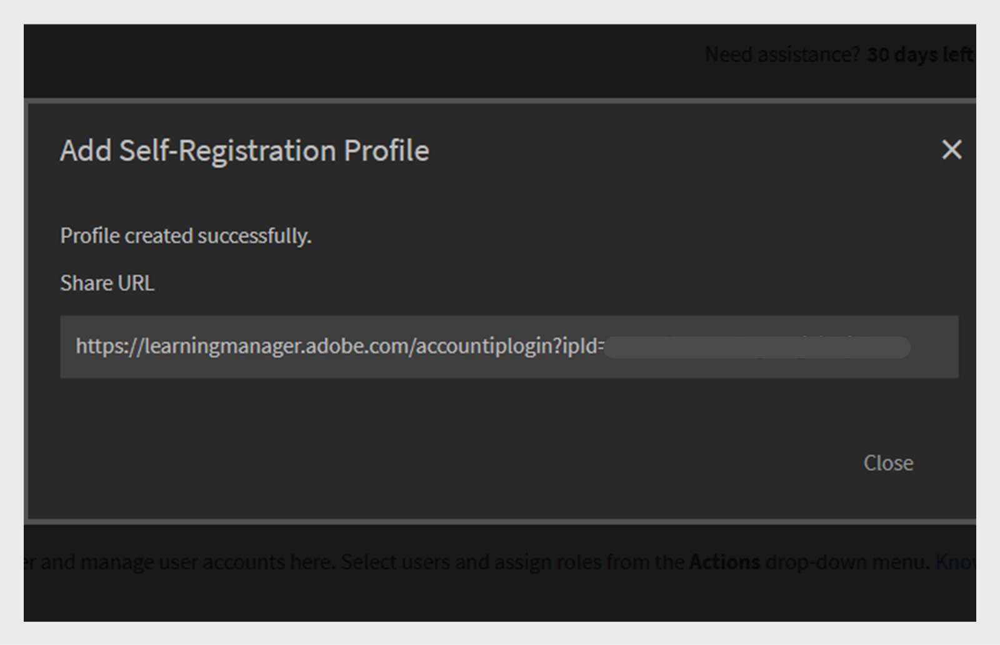
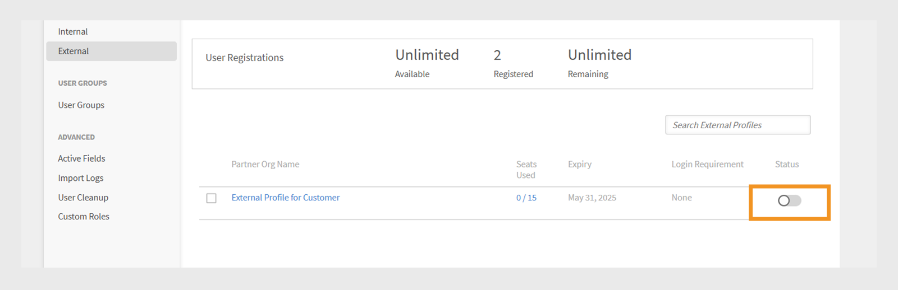

# Ajout d’utilisateurs dans Adobe Learning Manager

Dans Adobe Learning Manager, les utilisateurs sont des élèves qui utilisent la plateforme à des fins d’apprentissage ou de formation. Il existe deux types d’utilisateurs : les utilisateurs internes et les utilisateurs externes.

Les utilisateurs internes sont des employés ou des membres de l’équipe de votre organisation.

Les utilisateurs externes sont des élèves externes à votre entreprise, tels que des clients, des partenaires, des fournisseurs ou des clients, qui peuvent accéder à votre contenu d’apprentissage.

Adobe Learning Manager (ALM) permet aux administrateurs d’intégrer et de gérer les utilisateurs internes et externes à l’aide de diverses méthodes, notamment la saisie manuelle, le chargement de fichiers CSV, l’auto-inscription et les intégrations système.

## Utilisateurs internes

Les utilisateurs internes dans Adobe Learning Manager font référence aux employés ou aux membres de l’équipe au sein de votre organisation. Vous pouvez les ajouter manuellement, les télécharger en bloc ou les importer via les intégrations système. Après avoir ajouté ces utilisateurs, vous pouvez les organiser en groupes, attribuer des cours et suivre leur progression d’apprentissage.

Les utilisateurs de Adobe Learning Manager peuvent assumer différentes responsabilités et gérer diverses tâches en fonction des rôles qui leur sont attribués. Chaque rôle, y compris Administrateur, Auteur, Instructeur et Administrateur d’intégration, offre un ensemble de fonctionnalités spécifiques conçues pour prendre en charge les responsabilités de l’utilisateur au sein de la plate-forme.

### Méthodes pour ajouter des utilisateurs internes

Les administrateurs peuvent ajouter des utilisateurs internes à l’aide des méthodes suivantes :

* **Ajouter un seul utilisateur** : ajoutez manuellement un utilisateur à la fois.
* **Profil d&#39;auto-inscription** : permet aux élèves de s&#39;auto-inscrire dans Adobe Learning Manager à l&#39;aide d&#39;un lien d&#39;inscription créé par l&#39;administrateur.
* **Chargement en bloc via CSV** : chargez un fichier CSV pour ajouter plusieurs utilisateurs à la fois.

### Ajouter manuellement un utilisateur interne

Les administrateurs peuvent ajouter manuellement un utilisateur en indiquant son nom, son adresse e-mail, son identifiant unique et le nom du responsable. L’identifiant unique dans Adobe Learning Manager est un identifiant obligatoire que les administrateurs doivent attribuer lors de la création d’un utilisateur. Il doit être unique pour chaque utilisateur et servir de référence cohérente dans tout le système.

>[!INFO]
>
>Regardez cette formation ALM Academy pour en savoir plus sur l’ajout d’utilisateurs uniques dans Adobe Learning Manager.  

Pour ajouter un seul utilisateur à Adobe Learning Manager :

1. Connectez-vous en tant qu’administrateur.
2. Sélectionnez **Utilisateurs**, puis choisissez **Interne**.
3. Sélectionnez **Ajouter**, puis choisissez **Utilisateur unique**.

   
   _L&#39;interface administrateur affiche l&#39;option permettant d&#39;ajouter manuellement un seul utilisateur interne_
4. À l&#39;invite **Ajouter un utilisateur**, saisissez le **nom**, l&#39;**adresse électronique** et le **profil** (fonction) de l&#39;utilisateur.

   
   _Champs pour saisir le nom, l’adresse électronique, l’identifiant unique et le profil d’un nouvel utilisateur_
5. Recherchez le responsable de l’utilisateur et sélectionnez le nom dans la liste des responsables.
6. Sélectionnez **Ajouter**.
L’utilisateur reçoit un e-mail de bienvenue contenant une URL de connexion pour y accéder.

### Autoriser l’auto-inscription pour les utilisateurs internes

L’auto-inscription est un processus d’intégration en libre-service où les utilisateurs peuvent consulter une URL d’inscription, saisir leurs informations et s’inscrire automatiquement sur la plateforme. Cette méthode minimise les efforts administratifs en permettant aux utilisateurs de s’enregistrer par le biais de l’URL fournie.

Pour créer une URL d’auto-inscription pour un utilisateur :

1. Connectez-vous en tant qu’administrateur.
2. Sélectionnez **Utilisateurs**, puis choisissez **Interne**.
3. Sélectionnez **Ajouter**, puis choisissez **Auto-inscription.**

   
   _Menu déroulant pour sélectionner l&#39;option d&#39;auto-inscription_
4. Dans l&#39;invite **Ajouter un profil d&#39;auto-inscription**, saisissez le profil dans le champ **Nom du profil** (Fonction de l&#39;utilisateur).
5. Sélectionnez le responsable de l&#39;utilisateur en le recherchant dans le champ **Nom du responsable**. Le responsable affecté au profil d’auto-inscription doit être un utilisateur inscrit dans Adobe Learning Manager.

   
   _Champs de saisie pour définir le nom du profil et affecter un responsable à un profil d&#39;auto-inscription_
6. Sélectionnez une image en utilisant l&#39;option **Ajouter une image**. Cette image sera visible par les élèves dans la section du profil.
7. Sélectionnez **Enregistrer**.

   Adobe Learning Manager crée un profil utilisateur et génère une URL d’auto-inscription, qui peut être partagée avec les utilisateurs pour terminer leur inscription.

   
   _Message de confirmation indiquant la création réussie d&#39;une URL d&#39;auto-inscription_
8. Partagez l’URL avec les utilisateurs qui souhaitent s’enregistrer eux-mêmes.

   L’URL peut être partagée avec plusieurs utilisateurs pour l’enregistrement. Par exemple, vous pouvez générer une URL pour le profil **Sales Associate** et la partager avec l&#39;équipe Sales Associate afin qu&#39;elle puisse s&#39;inscrire.

_Le lien d&#39;auto-inscription ouvre une page d&#39;inscription_

### Afficher la liste des URL d’auto-inscription

Pour afficher la liste des URL d&#39;auto-inscription :

1. Sélectionnez **Utilisateurs**, puis choisissez **Interne**.
2. Sélectionnez **Auto-inscription**.

   Les administrateurs peuvent consulter la liste des URL d’auto-inscription.

_Mode Liste affichant les URL d’auto-inscription existantes disponibles pour les utilisateurs internes_

### Téléchargement en bloc d’utilisateurs internes

Les administrateurs peuvent ajouter plusieurs utilisateurs à la fois en chargeant un fichier CSV avec des informations utilisateur telles que le nom, l’adresse e-mail et le nom du responsable. Cette fonctionnalité de téléchargement massif permet de gagner du temps et de réduire les efforts par rapport à l’ajout individuel d’utilisateurs.

>[!INFO]
>
>Regardez cette formation ALM Academy pour apprendre à ajouter des utilisateurs en bloc via un fichier CSV.   

Pour ajouter plusieurs utilisateurs :

1. Connectez-vous en tant qu’administrateur.
2. Sélectionnez **Utilisateurs**, puis choisissez **Interne**.
3. Sélectionnez **Ajouter**, puis choisissez **Charger un fichier CSV**.

   
   _Option permettant de charger un fichier CSV pour l’importation d’utilisateurs en bloc_

4. Préparez un fichier CSV avec les champs suivants :

   * Nom de l’employé*
   * Adresse e-mail de l’employé*
   * Profil/Désignation de l’employé
   * ID/Adresse e-mail du responsable\
     (*) Champs obligatoires.

5. Avant d’ajouter l’ID de messagerie d’un responsable pour un employé, assurez-vous que le responsable est déjà inclus en tant qu’employé dans le fichier CSV. Par exemple, voir l&#39;employé nommé Howard Walters dans l&#39;instantané ci-dessous.

   
   _Image de l’exemple de fichier CSV avec tous les champs_

6. Chargez le fichier CSV et mappez les champs de données en conséquence.

   
   _Interface de mappage CSV pour aligner les colonnes de feuille de calcul sur les champs système_
7. Sélectionnez **Enregistrer** pour importer les utilisateurs.

   Un message de confirmation s’affiche une fois le téléchargement réussi.

   
   _L&#39;image montre l&#39;état du chargement CSV comme réussi_

>[!NOTE]
>
>Gérer un fichier CSV principal pour tous les ajouts et suppressions. La mise à jour et le rechargement d’un fichier CSV existant ne sont pas pris en charge.

Lorsque vous chargez un fichier CSV pour ajouter des utilisateurs, il est important d’inclure toutes les informations associées dans le bon ordre. Si vous affectez l’ID de messagerie d’un responsable à un employé, les détails du responsable doivent apparaître plus tôt dans le fichier CSV. Le système reconnaît ainsi le responsable en tant qu’utilisateur existant avant de le lier aux membres de son équipe. Par exemple, si Howard Walters est un responsable, incluez tous les détails de son utilisateur dans le fichier CSV avant de répertorier les employés qui relèvent de lui.

### Gestion de l’inscription des utilisateurs

Après avoir ajouté des utilisateurs individuellement ou en bloc, vous devez les enregistrer pour activer leurs comptes. Cela permet aux utilisateurs d’accéder à Adobe Learning Manager et de commencer à utiliser la plateforme.

Pour enregistrer les utilisateurs :

1. Sélectionnez **Utilisateurs** sur la page d&#39;accueil de l&#39;administrateur.
2. Cochez les cases en regard des noms des utilisateurs que vous souhaitez enregistrer.
3. Sélectionnez **Actions**, puis choisissez **S&#39;inscrire**.

   
   Bouton _S&#39;inscrire pour activer les utilisateurs sélectionnés dans Adobe Learning Manager_

4. Sélectionnez **Oui** pour activer l&#39;utilisateur.

Un e-mail de vérification est envoyé à l’utilisateur. L’utilisateur doit sélectionner le lien dans l’e-mail pour activer son compte et commencer à utiliser Adobe Learning Manager.

### Télécharger le rapport d’utilisateur

Les administrateurs peuvent exporter et télécharger les données utilisateur sous la forme d’un rapport complet. En exportant ces données, les administrateurs peuvent suivre l&#39;activité des élèves, surveiller le cycle de vie du compte, identifier les utilisateurs inactifs et conserver des enregistrements précis à des fins de conformité, d&#39;audit et de création de rapports.

Pour télécharger le rapport d’utilisateur :

1. Connectez-vous à Adobe Learning Manager en tant qu’administrateur.
2. Sélectionnez **Utilisateurs**, puis choisissez **Interne**.
3. Sélectionnez **Exporter les données utilisateur**. Vous serez averti lorsque le rapport sera prêt.

   
   _Les sections Utilisateur interne affichent l’option permettant d’exporter et de télécharger le rapport d’utilisateur._
4. Sélectionnez la notification et téléchargez le rapport d’utilisateur.

Le rapport contient les informations suivantes :

* Nom
* Courrier électronique
* Statut
* Date d’ajout (fuseau horaire UTC)
* Date de suppression (fuseau horaire UTC)
* Date de la dernière connexion (fuseau horaire UTC)
* ID Adobe
* userState
* profile
* Langue de l’interface
* Langue de contenu
* Fuseau horaire
* ID utilisateur interne
* Adresse électronique du responsable

## Utilisateurs externes

Adobe Learning Manager vous permet d’ajouter des utilisateurs en dehors de votre entreprise, tels que des clients, des partenaires, des fournisseurs ou des clients, pour accéder au contenu de formation. Une fois qu’ils ont été ajoutés, vous pouvez les regrouper, attribuer des cours et suivre leur progression d’apprentissage.

L’ajout d’utilisateurs externes dans Adobe Learning Manager implique les étapes suivantes :

* Création d’un profil d’enregistrement externe
* Activation du profil d’enregistrement
* Partager le lien d’enregistrement avec des utilisateurs externes
* Suspendre ou reprendre le profil si nécessaire

Adobe Learning Manager prend en charge l’inscription de ces utilisateurs via des profils d’inscription externes.

Pour créer un utilisateur externe, procédez comme suit :

1. Connectez-vous en tant qu’administrateur.
2. Sélectionnez **Utilisateurs**, puis choisissez **Externe**.
3. Sélectionnez **Ajouter** pour créer une inscription pour un utilisateur externe.
4. Dans la boîte de dialogue **Ajouter un profil d&#39;inscription externe**, fournissez les informations suivantes :

   * **Nom du profil :** Tapez le nom.
   * **Adresse e-mail du responsable :** Saisissez l&#39;adresse e-mail du responsable.
   * **Limite de places :** définissez le nombre maximal d&#39;inscriptions autorisé.
   * **Expiration :** définissez la dernière date pour les nouvelles inscriptions. Après son expiration, le lien ne fonctionnera plus pour l’enregistrement de nouveaux utilisateurs.

   
   _Boîte de dialogue permettant de saisir le nom du profil, l’adresse e-mail du responsable, la limite de places et l’expiration_

5. Sélectionnez une image avec l&#39;option **Ajouter une image**. Cette image sera visible par les élèves dans la section du profil.
6. Sélectionnez la section **Paramètres avancés** pour la développer et tapez les détails requis :
   * **Configuration requise pour la connexion :** saisissez le nombre de jours. Si les élèves restent inactifs pendant toute la période, ils seront automatiquement supprimés.
   * **Domaines autorisés :** Tapez la liste des domaines de messagerie autorisés séparés par des virgules. Seuls les utilisateurs disposant d’adresses e-mail de domaines approuvés peuvent s’inscrire.
   * **Vérification par e-mail requise :** sélectionnez cette option pour appliquer la vérification par e-mail lors de l&#39;inscription.

   
   _Panneau Paramètres avancés pour définir les exigences de connexion, les domaines autorisés et la vérification par e-mail_

7. Sélectionnez **Enregistrer**.

Une URL d’inscription est générée.

### Activation du profil externe

Pour activer le profil externe :

1. Recherchez le profil nouvellement créé dans la liste des profils externes.
2. Sélectionnez le bouton bascule **État** pour l&#39;activer.

L’administrateur peut partager cette URL avec le partenaire externe afin qu’il puisse s’inscrire et se connecter à Adobe Learning Manager à l’aide de cette URL.

_Sélectionnez le bouton pour activer le profil externe_

### Copier et partager l’URL d’inscription du profil externe

L&#39;URL d&#39;inscription d&#39;un profil externe peut être copiée à partir de la section **Utilisateurs externes**.

_Copier l&#39;URL d&#39;inscription d&#39;un profil externe_

### Différences clés entre les enregistrements d’utilisateurs internes et externes

Il existe quelques différences entre les enregistrements internes et externes :

| Utilisateurs internes | Utilisateurs externes |
|---|---|
| Connexion possible à l’aide des identifiants Adobe ID ou SSO. | Connexion possible avec n’importe quel ID de messagerie. |
| La ludification est disponible. | La ludification est disponible. L&#39;administrateur doit activer la ludification pour les élèves externes dans les [paramètres de ludification](https://experienceleague.adobe.com/en/docs/learning-manager/using/admin/gamification). |

### Suspendre le profil d&#39;inscription externe

Dans Adobe Learning Manager, les administrateurs peuvent gérer l’enregistrement des utilisateurs externes en suspendant leurs profils. Cela est utile lorsque vous souhaitez suspendre temporairement l’inscription de nouveaux utilisateurs à l’aide d’un profil d’inscription externe spécifique. Suspendre un profil empêche les utilisateurs qui ont reçu des invitations mais qui ne sont pas encore enregistrés de terminer le processus d’inscription. Cette action n’affecte pas les utilisateurs qui ont déjà terminé leur inscription.

Pour suspendre un profil externe :

1. Sélectionnez **Actions** dans le coin supérieur droit de la page **Utilisateurs externes**.
2. Sélectionnez **Suspendre** pour suspendre le profil d&#39;inscription externe.

Cela bloque les nouvelles inscriptions pour les utilisateurs qui n’ont pas accepté leurs invitations. Notez que cette action affecte uniquement les utilisateurs qui n’ont pas encore terminé leur inscription.

_Option permettant de suspendre un profil d&#39;inscription externe existant à partir du menu Actions_

### Reprendre le profil d&#39;inscription externe

Si un profil externe a été suspendu précédemment, les administrateurs peuvent le reprendre pour permettre aux nouveaux utilisateurs de terminer leur inscription. Cela réactive le processus d’enregistrement pour les utilisateurs qui ont été invités mais n’ont pas terminé leur inscription.

Pour reprendre un utilisateur externe :

1. Sélectionnez **Actions** dans le coin supérieur droit de la page.
2. Sélectionnez **Reprendre** pour reprendre l&#39;accès d&#39;un partenaire suspendu.

_Option permettant de reprendre un profil d&#39;inscription externe suspendu précédemment_

### Modification du profil externe

Les administrateurs peuvent réaffecter les élèves d&#39;un profil externe à un autre profil.

Pour modifier le profil externe :

1. Connectez-vous à Adobe Learning Manager en tant qu’administrateur.
2. Sélectionnez **[!UICONTROL Utilisateurs]**, puis **[!UICONTROL Externe]**.
3. Sélectionnez **[!UICONTROL Places utilisées]** dans la liste des profils externes.

   
   _Section de profil externe affichant le nombre de sièges utilisés_

4. Sélectionnez l’élève, puis **[!UICONTROL Actions]**.

   
   _Page de profil externe mettant en évidence l&#39;option Modifier le profil pour déplacer les élèves vers un autre profil_

5. Sélectionnez **[!UICONTROL Modifier le profil]**.
6. Recherchez et sélectionnez le profil externe correspondant.

   
   _L&#39;invite Modifier le profil affiche les options de recherche dans le profil externe_

L’élève sélectionné passera au profil externe sélectionné.

### Surveillance de l’utilisation des sièges externes

Les administrateurs peuvent suivre le nombre d’utilisateurs ajoutés à chaque profil externe dans Adobe Learning.

Pour vérifier les places utilisées :

1. Sélectionnez **Places utilisées** dans la liste des profils externes.

Vous pouvez afficher le nombre d’élèves ajoutés à l’organisation partenaire et si les élèves sont actifs.

## Gérer les utilisateurs et les utilisatrices

Les administrateurs peuvent modifier les détails des utilisateurs, supprimer des utilisateurs, attribuer des rôles et supprimer des rôles. Cela permet de s’assurer que chaque utilisateur dispose des droits d’accès et des tâches appropriés.

>[!INFO]
>
>Regardez cette formation ALM Academy pour apprendre à attribuer et à supprimer des rôles, à envoyer un e-mail de bienvenue, ainsi qu’à supprimer et purger des utilisateurs. [&#x200B; ![bouton]](https://content.adobelearningmanageracademy.com/app/learner?accountId=98632#/course/7555586) 

### Modifier un utilisateur

Utilisez l&#39;option **Modifier l&#39;utilisateur** dans Adobe Learning Manager pour mettre à jour les informations de profil d&#39;un utilisateur, telles que son nom, son adresse e-mail, son identifiant unique, son profil et le nom de son responsable. Les administrateurs peuvent effectuer ces modifications pour s’assurer que les données utilisateur restent exactes et à jour.

Pour modifier un utilisateur :

1. Sélectionnez **Utilisateurs** sur la page d&#39;accueil de l&#39;administrateur.
2. Sélectionnez l&#39;utilisateur à modifier dans la liste **Utilisateurs**.
3. Sélectionnez **Modifier le profil**.

   
   _Option Supprimer l&#39;utilisateur sous le menu Actions pour supprimer un utilisateur de la plateforme_

4. Sélectionnez **Oui** pour supprimer l&#39;utilisateur.

Un message de confirmation s’affiche lorsque l’utilisateur est supprimé avec succès.

## Attribuer un rôle à un utilisateur

Les rôles utilisateur dans Adobe Learning Manager définissent les actions que chaque personne peut effectuer dans le système. Chaque rôle est fourni avec des autorisations spécifiques en fonction des responsabilités de l’utilisateur.

Adobe Learning Manager prend en charge les rôles d’utilisateur suivants :

* **Administrateur** : gère les utilisateurs et les groupes d&#39;utilisateurs, attribue des rôles et configure les préférences système telles que les sources de données, les domaines autorisés et les options d&#39;affichage. Les administrateurs sont également responsables de la création et de l’organisation du contenu d’apprentissage, du suivi de la progression des élèves, de la génération de rapports et de la configuration des intégrations avec les systèmes externes.
* **Auteur** : crée et gère le contenu, y compris les modules et les cours.
* **Responsable** : supervise les activités d’apprentissage d’équipe, désigne les membres de l’équipe pour les cours, approuve les demandes et fournit des commentaires.
* **Administrateur d’intégration** : gère les intégrations système et les connexions de données entre ALM et les plateformes externes.
* **Rôles personnalisés** : les administrateurs peuvent créer des rôles personnalisés pour donner aux utilisateurs un accès personnalisé en fonction de leurs responsabilités. Reportez-vous à cet [article](/help/migrated/administrators/feature-summary/custom-role.md) pour plus d&#39;informations sur les rôles personnalisés.

Pour attribuer des rôles aux utilisateurs :

1. Sélectionnez **Utilisateurs** sur la page d&#39;accueil de l&#39;administrateur.
2. Sélectionnez l’utilisateur auquel attribuer un rôle.
3. Sélectionnez **Actions** dans le coin supérieur droit.
4. Sélectionnez **Attribuer un rôle**.
5. Sélectionnez le rôle requis.

   
   Les options du menu _Attribuer un rôle affichent les rôles disponibles pour l&#39;utilisateur sélectionné_

6. Sélectionnez **Oui** dans la boîte de dialogue de confirmation.

## Supprimer un rôle

La suppression d’un rôle d’utilisateur révoque les autorisations accordées par ce rôle.

Pour supprimer des rôles d’utilisateurs :

1. Sélectionnez **Utilisateurs** sur la page d&#39;accueil de l&#39;administrateur.
2. Sélectionnez le ou les utilisateurs dont vous souhaitez supprimer les rôles.
3. Sélectionnez **Actions**, puis **Supprimer le rôle**.

   
   _Option permettant de supprimer les rôles attribués d&#39;un utilisateur dans le menu Actions_

4. Sélectionnez **Oui** dans la boîte de dialogue de confirmation.

