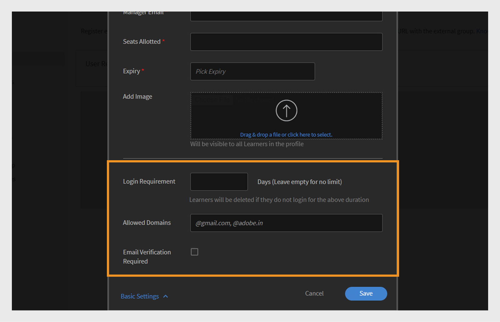

# Ajout d’utilisateurs dans Adobe Learning Manager

Dans Adobe Learning Manager, les utilisateurs sont des personnes qui utilisent la plateforme à des fins d’apprentissage ou de formation. Il existe deux types d’utilisateurs : les utilisateurs internes et les utilisateurs externes.

Les utilisateurs internes sont des employés ou des membres de l’équipe de votre organisation.

Les utilisateurs externes sont des personnes extérieures à votre entreprise, telles que des clients, des partenaires, des fournisseurs ou des clients, qui peuvent accéder à votre contenu d’apprentissage.

Adobe Learning Manager (ALM) permet aux administrateurs d’intégrer et de gérer les utilisateurs internes et externes à l’aide de diverses méthodes, notamment la saisie manuelle, le chargement de fichiers CSV, l’auto-inscription et les intégrations système.

## Utilisateurs internes

Les utilisateurs internes dans Adobe Learning Manager font référence aux employés ou aux membres de l’équipe au sein de votre organisation. Vous pouvez les ajouter manuellement, les télécharger en bloc ou les importer via les intégrations système. Après avoir ajouté ces utilisateurs, vous pouvez les organiser en groupes, attribuer des cours et suivre leur progression d’apprentissage.

Les utilisateurs de Adobe Learning Manager peuvent assumer différentes responsabilités et gérer diverses tâches en fonction des rôles qui leur sont attribués. Chaque rôle, y compris Administrateur, Auteur, Instructeur et Administrateur de l’intégration, offre un ensemble de fonctionnalités spécifiques conçues pour prendre en charge les responsabilités de l’utilisateur au sein de la plate-forme.

Adobe Learning Manager prend en charge les rôles d’utilisateur suivants :

* **Administrateur** : gère les utilisateurs et les groupes d&#39;utilisateurs, attribue des rôles et configure les préférences système telles que les sources de données, les domaines autorisés et les options d&#39;affichage. Les administrateurs sont également responsables de la création et de l’organisation du contenu d’apprentissage, du suivi de la progression des élèves, de la génération de rapports et de la configuration des intégrations avec les systèmes externes.
* **Auteur** : crée et gère le contenu, y compris les modules et les cours.
* **Responsable** : supervise les activités d’apprentissage d’équipe, désigne les membres de l’équipe pour les cours, approuve les demandes et fournit des commentaires.
* **Administrateur d&#39;intégration** : gère les intégrations système et les connexions de données entre ALM et les plateformes externes.
* **Rôles personnalisés** : les administrateurs peuvent créer des rôles personnalisés pour donner aux utilisateurs un accès personnalisé en fonction de leurs responsabilités. Reportez-vous à cet article pour plus d’informations sur les rôles personnalisés.

### Méthodes pour ajouter des utilisateurs internes

Les administrateurs peuvent ajouter des utilisateurs internes à l’aide des méthodes suivantes :

* **Ajouter un seul utilisateur** : ajoutez manuellement un utilisateur à la fois.
* **Profil d&#39;auto-inscription** : permet aux élèves de s&#39;auto-inscrire dans Adobe Learning Manager à l&#39;aide d&#39;un lien d&#39;inscription créé par l&#39;administrateur.
* **Chargement en bloc via CSV** : chargez un fichier CSV pour ajouter plusieurs utilisateurs à la fois.

### Ajouter manuellement un utilisateur interne

Les administrateurs peuvent ajouter manuellement des utilisateurs individuels en saisissant leur nom, leur ID de messagerie, leur identifiant unique et le nom du responsable. L’identifiant unique dans Adobe Learning Manager est un identifiant obligatoire que les administrateurs doivent attribuer lors de la création d’un utilisateur. Il doit être unique pour chaque utilisateur et servir de référence cohérente dans tout le système.

>[!INFO]
>
>Regardez cette formation ALM Academy pour en savoir plus sur l’ajout d’utilisateurs uniques dans Adobe Learning Manager.  

Pour ajouter un seul utilisateur à Adobe Learning Manager :

1. Connectez-vous en tant qu’administrateur.
2. Sélectionnez **Utilisateurs**, puis **Interne**.
3. Sélectionnez **Ajouter**, puis **Utilisateur unique**.

   
   _L&#39;interface administrateur affiche l&#39;option permettant d&#39;ajouter manuellement un seul utilisateur interne_
4. À l&#39;invite **Ajouter un utilisateur**, saisissez le **nom**, l&#39;**adresse électronique** et le **profil** (fonction) de l&#39;utilisateur.

   
   _Champs pour saisir le nom, l’adresse électronique, l’identifiant unique et le profil d’un nouvel utilisateur_
5. Recherchez le responsable de l’utilisateur et sélectionnez le nom dans la liste des responsables.
6. Sélectionnez **Ajouter**.
L’utilisateur reçoit un e-mail de bienvenue contenant une URL de connexion pour y accéder.

### Autoriser l’auto-inscription pour les utilisateurs internes

L’auto-inscription est un processus d’intégration en libre-service où les utilisateurs peuvent consulter une URL d’inscription, saisir leurs informations et s’inscrire automatiquement sur la plateforme. Cette méthode minimise les efforts administratifs en permettant aux utilisateurs de s’enregistrer par le biais de l’URL fournie.

Pour créer une URL d’auto-inscription pour un utilisateur :

1. Connectez-vous en tant qu’administrateur.
2. Sélectionnez **Utilisateurs**, puis **Interne**.
3. Sélectionnez **Ajouter** dans le coin supérieur droit, puis sélectionnez **Auto-inscription**.

   
   _Menu déroulant pour sélectionner l&#39;option d&#39;auto-inscription_
4. Dans l&#39;invite **Ajouter un profil d&#39;auto-inscription**, saisissez le profil dans le champ **Nom du profil** (Fonction de l&#39;utilisateur).
5. Sélectionnez le responsable de l&#39;utilisateur en le recherchant dans le champ **Nom du responsable**. Le responsable affecté au profil d’auto-inscription doit être un utilisateur inscrit dans Adobe Learning Manager.

   
   _Champs de saisie pour définir la fonction et affecter un responsable à un profil d&#39;auto-inscription_
6. Sélectionnez une image en utilisant l&#39;option **Ajouter une image**. Cette image sera visible par les élèves dans la section du profil.
7. Sélectionnez **Enregistrer**.

   Adobe Learning Manager crée un profil utilisateur et génère une URL d’auto-inscription, qui peut être partagée avec les utilisateurs pour terminer leur inscription.

   
   _Message de confirmation indiquant la création réussie d&#39;une URL d&#39;auto-inscription_
8. Partagez l’URL avec les utilisateurs qui souhaitent s’enregistrer eux-mêmes.

   L’URL peut être partagée avec plusieurs utilisateurs pour l’enregistrement. Par exemple, vous pouvez générer une URL pour le profil **Sales Associate** et la partager avec l&#39;équipe Sales Associate afin qu&#39;elle puisse s&#39;inscrire.

_Le lien d&#39;auto-inscription ouvre une page d&#39;inscription_

### Afficher la liste des URL d’auto-inscription

Pour afficher la liste des URL d&#39;auto-inscription :

1. Sélectionnez **Utilisateurs**, puis **Interne**.
2. Sélectionnez **Auto-inscription**.

   Les administrateurs peuvent consulter la liste des URL d’auto-inscription.

_Mode Liste affichant les URL d’auto-inscription existantes disponibles pour les utilisateurs internes_

### Téléchargement en bloc d’utilisateurs internes

Adobe Learning Manager permet aux administrateurs d’ajouter plusieurs utilisateurs à la fois en chargeant un fichier CSV contenant les informations de l’utilisateur, notamment son nom, son ID de messagerie et le nom du responsable. Cette fonctionnalité de téléchargement massif permet de gagner du temps et de réduire les efforts par rapport à l’ajout individuel d’utilisateurs.

>[!INFO]
>
>Regardez cette formation ALM Academy pour apprendre à ajouter des utilisateurs en bloc via un fichier CSV.   

Pour ajouter plusieurs utilisateurs :

1. Connectez-vous en tant qu’administrateur.
2. Sélectionnez **Utilisateurs**, puis **Interne**.
3. Sélectionnez **Ajouter** dans le coin supérieur droit et sélectionnez **Charger un fichier CSV**.

   
   _Option permettant de charger un fichier CSV pour l’importation d’utilisateurs en bloc_

4. Préparez un fichier CSV avec les champs suivants :

   * Nom de l’employé*
   * Adresse e-mail de l’employé*
   * Profil/Désignation de l’employé
   * ID/Adresse e-mail du responsable\
     (*) Champs obligatoires.

5. Avant d’ajouter l’ID de messagerie d’un responsable pour un employé, assurez-vous que le responsable est déjà inclus en tant qu’employé dans le fichier CSV. Par exemple, voir l&#39;employé nommé Howard Walters dans l&#39;instantané ci-dessous.

   
   _Image de l’exemple de fichier CSV avec tous les champs_

6. Chargez le fichier CSV et mappez les champs de données en conséquence.

   
   _Interface de mappage CSV pour aligner les colonnes de feuille de calcul sur les champs système_
7. Sélectionnez **Enregistrer** pour importer les utilisateurs.

   Un message de confirmation s’affiche une fois le téléchargement réussi.

   
   _L&#39;image montre l&#39;état du chargement CSV comme réussi_

>[!NOTE]
>
>Gérer un fichier CSV principal pour tous les ajouts et suppressions. La mise à jour et le rechargement d’un fichier CSV existant ne sont pas pris en charge.

Lorsque vous chargez un fichier CSV pour ajouter des utilisateurs, il est important d’inclure toutes les informations associées dans le bon ordre. Si vous affectez l’ID de messagerie d’un responsable à un employé, les détails du responsable doivent apparaître plus tôt dans le fichier CSV. Le système reconnaît ainsi le responsable en tant qu’utilisateur existant avant de le lier aux membres de son équipe. Par exemple, si Howard Walters est un responsable, incluez tous les détails de son utilisateur dans le fichier CSV avant de répertorier les employés qui relèvent de lui.

### Gestion de l’inscription des utilisateurs

Après avoir ajouté des utilisateurs individuellement ou en bloc, vous devez les enregistrer pour activer leurs comptes. Cela permet aux utilisateurs d’accéder à Adobe Learning Manager et de commencer à utiliser la plateforme.

Pour enregistrer les utilisateurs :

1. Sélectionnez **Utilisateurs** sur la page d&#39;accueil de l&#39;administrateur.
2. Cochez les cases en regard des noms des utilisateurs que vous souhaitez enregistrer.
3. Sélectionnez **Actions**, puis **S&#39;inscrire**.

   
   Bouton _S&#39;inscrire pour activer les utilisateurs sélectionnés dans Adobe Learning Manager_

4. Sélectionnez **Oui** pour activer l&#39;utilisateur.

Un e-mail de vérification est envoyé à l’utilisateur. L’utilisateur doit sélectionner le lien dans l’e-mail pour activer son compte et commencer à utiliser Adobe Learning Manager.

## Utilisateurs externes

Adobe Learning Manager vous permet d’ajouter des utilisateurs en dehors de votre entreprise, tels que des clients, des partenaires, des fournisseurs ou des clients, pour accéder au contenu de formation. Une fois qu’ils ont été ajoutés, vous pouvez les regrouper, attribuer des cours et suivre leur progression d’apprentissage.

L’ajout d’utilisateurs externes dans Adobe Learning Manager implique les étapes suivantes :

* Création d’un profil d’enregistrement externe
* Activation du profil d’enregistrement
* Partager le lien d’enregistrement avec des utilisateurs externes
* Suspendre ou reprendre le profil si nécessaire

Adobe Learning Manager prend en charge l’inscription de ces utilisateurs via des profils d’inscription externes.

Pour créer un utilisateur externe, procédez comme suit :

1. Connectez-vous en tant qu’administrateur.
2. Sélectionnez **Utilisateurs**, puis **Externe**.
3. Dans le coin supérieur droit, sélectionnez **Ajouter** pour créer une inscription pour un utilisateur externe.
4. Dans la boîte de dialogue **Ajouter un profil d&#39;inscription externe**, fournissez les informations suivantes :

   * **Nom du profil :** Tapez le nom de l’organisation partenaire qui souhaite accéder à Adobe Learning Manager
   * **Adresse e-mail du responsable :** Saisissez l&#39;adresse e-mail du responsable de l&#39;utilisateur.
   * **Limite de places :** définissez le nombre maximal d&#39;inscriptions autorisé.
   * **Expiration :** définissez la dernière date pour les nouvelles inscriptions. Après son expiration, le lien ne fonctionnera plus pour l’enregistrement de nouveaux utilisateurs.

   
   _Boîte de dialogue permettant de saisir le nom du profil, l’adresse e-mail du responsable, la limite de places et l’expiration_

5. Sélectionnez une image avec l&#39;option **Ajouter une image**. Cette image sera visible par les élèves dans la section du profil.
6. Sélectionnez la section **Paramètres avancés** pour la développer et tapez les détails requis :
   * **Configuration requise pour la connexion :** saisissez le nombre de jours. Si les élèves restent inactifs pendant toute la période, ils seront automatiquement supprimés.
   * **Domaines autorisés :** Tapez la liste des domaines de messagerie autorisés séparés par des virgules. Seuls les utilisateurs disposant d’adresses e-mail de domaines approuvés peuvent s’inscrire.
   * **Vérification par e-mail requise :** sélectionnez cette option pour appliquer la vérification par e-mail lors de l&#39;inscription.

   
   _Panneau Paramètres avancés pour définir les exigences de connexion, les domaines autorisés et la vérification par e-mail_

7. Sélectionnez **Enregistrer**.

Une URL d’inscription est générée.

### Activation du profil externe

Pour activer le profil externe :

1. Recherchez le profil nouvellement créé dans la liste des profils externes.

2. Sélectionnez le bouton bascule **État** pour l&#39;activer.

L’administrateur peut partager cette URL avec le partenaire externe afin qu’il puisse s’inscrire et se connecter à Adobe Learning Manager à l’aide de cette URL.

_Sélectionnez le bouton pour activer le profil externe_

### Copier et partager l’URL d’inscription du profil externe

L&#39;URL d&#39;inscription d&#39;un profil externe peut être copiée à partir de la section **Utilisateurs externes**.

_Copier l&#39;URL d&#39;inscription d&#39;un profil externe_

### Différences clés entre les enregistrements d’utilisateurs internes et externes

Il existe quelques différences entre les enregistrements internes et externes :

| Utilisateurs internes | Utilisateurs externes |
|---|---|
| Connexion possible à l’aide des identifiants Adobe ID ou SSO. | Connexion possible avec n’importe quel ID de messagerie. |
| La ludification est disponible. | La ludification est disponible. L&#39;administrateur doit activer la ludification pour les élèves externes dans les [paramètres de ludification](https://experienceleague.adobe.com/en/docs/learning-manager/using/admin/gamification). |

### Suspendre le profil d&#39;inscription externe

Dans Adobe Learning Manager, les administrateurs peuvent gérer l’enregistrement des utilisateurs externes en suspendant leurs profils. Cela s’avère utile lorsque vous souhaitez suspendre temporairement l’accès de nouveaux utilisateurs à l’aide d’un profil d’utilisateur externe spécifique. Suspendre un profil empêche les utilisateurs qui ont reçu des invitations mais qui ne sont pas encore enregistrés de terminer le processus d’inscription. Cette action n’affecte pas les utilisateurs qui ont déjà terminé leur inscription.

Pour suspendre un profil externe :

1. Sélectionnez **Actions** dans le coin supérieur droit de la page **Utilisateurs externes**.
2. Sélectionnez **Pause** pour suspendre le profil utilisateur externe.

Cela bloque le processus d’enregistrement pour les utilisateurs qui n’ont pas encore accepté leurs invitations. Notez que cette action affecte uniquement les utilisateurs qui n’ont pas encore terminé leur inscription.

_Option permettant de suspendre un profil utilisateur externe existant à partir du menu Actions_

### Reprendre le profil d&#39;inscription externe

Si un profil externe a été suspendu précédemment, les administrateurs peuvent le reprendre pour permettre aux nouveaux utilisateurs de terminer leur inscription. Cela réactive le processus d’enregistrement pour les utilisateurs qui ont été invités mais n’ont pas terminé leur inscription.

Pour reprendre un utilisateur externe :

1. Sélectionnez **Actions** dans le coin supérieur droit de la page.
2. Sélectionnez **Reprendre** pour reprendre l&#39;accès d&#39;un partenaire suspendu.

_Option permettant de reprendre un profil utilisateur externe suspendu précédemment_

### Surveillance de l’utilisation des sièges externes

Les administrateurs peuvent suivre le nombre d’utilisateurs ajoutés à chaque profil externe dans Adobe Learning.

Pour vérifier les places utilisées :

1. Sélectionnez **Places utilisées** dans la liste des profils externes.

Vous pouvez afficher le nombre d’élèves ajoutés à l’organisation partenaire et si les élèves sont actifs.

## Gérer les utilisateurs et les utilisatrices

Les administrateurs peuvent modifier les détails des utilisateurs, supprimer des utilisateurs, attribuer des rôles et supprimer des rôles. Cela permet de s’assurer que chaque utilisateur dispose des droits d’accès et des tâches appropriés.

>[!INFO]
>
>Regardez cette formation ALM Academy pour apprendre à attribuer et à supprimer des rôles, à envoyer un e-mail de bienvenue, ainsi qu’à supprimer et purger des utilisateurs. [ ![bouton]](https://content.adobelearningmanageracademy.com/app/learner?accountId=98632#/course/7555586) 

### Modifier un utilisateur

Utilisez l&#39;option **Modifier l&#39;utilisateur** dans Adobe Learning Manager pour mettre à jour les informations de profil d&#39;un utilisateur, telles que son nom, son adresse e-mail, son identifiant unique, son profil et le nom de son responsable. Les administrateurs peuvent effectuer ces modifications pour s’assurer que les données utilisateur restent exactes et à jour.

Pour modifier un utilisateur :

1. Sélectionnez **Utilisateurs** sur la page d&#39;accueil de l&#39;administrateur.
2. Sélectionnez l&#39;utilisateur à modifier dans la liste **Utilisateurs**.
3. Sélectionnez **Modifier le profil**.

   
   _Option Supprimer l&#39;utilisateur sous le menu Actions pour supprimer un utilisateur de la plateforme_

4. Sélectionnez **Oui** pour supprimer l&#39;utilisateur.

Un message de confirmation s’affiche lorsque l’utilisateur est supprimé avec succès.

## Attribuer un rôle à un utilisateur

Les rôles utilisateur dans Adobe Learning Manager définissent les actions que chaque personne peut effectuer dans le système. Chaque rôle est fourni avec des autorisations spécifiques en fonction des responsabilités de l’utilisateur.

Pour attribuer des rôles aux utilisateurs :

1. Sélectionnez **Utilisateurs** sur la page d&#39;accueil de l&#39;administrateur.
2. Sélectionnez l’utilisateur auquel attribuer un rôle.
3. Sélectionnez **Actions** dans le coin supérieur droit.
4. Sélectionnez **Attribuer un rôle**.
5. Sélectionnez le rôle requis.

   
   Les options du menu _Attribuer un rôle affichent les rôles disponibles pour l&#39;utilisateur sélectionné_

6. Sélectionnez **Oui** dans la boîte de dialogue de confirmation.

## Supprimer un rôle

La suppression d’un rôle d’utilisateur révoque les autorisations accordées par ce rôle.

Pour supprimer des rôles d’utilisateurs :

1. Sélectionnez **Utilisateurs** sur la page d&#39;accueil de l&#39;administrateur.
2. Sélectionnez le ou les utilisateurs dont vous souhaitez supprimer les rôles.
3. Sélectionnez **Actions**, puis **Supprimer le rôle**.

   
   _Option permettant de supprimer les rôles attribués d&#39;un utilisateur dans le menu Actions_

4. Sélectionnez **Oui** dans la boîte de dialogue de confirmation.
<!--# Add users and create user groups

Learn how to add users or user groups in Learning Manager application.

<!---->

<!--## Overview {#overview}

In Adobe Learning Manager, you can assume the following roles:

* **Administrator:** An Administrator defines the training strategy for the organization. An Administrator can add learners, search required skills for learners, manage and assign courses, create learning plans, certifications, and learning programs, and manage reports for the entire organization.
* **Author:** Authors are Instructional Designers and content creators. An Author can add modules and courses to Learning Manager.
* **Manager:** A Manager manages the learning activities of a team. A Manager can nominate team members to take a course, approve requests from team members, and provide feedback on performance of their team members post-completion of training. Managers can also view reports for their team to track their performance.
* **Learner:** Learners can access courses, learning programs, and certifications assigned to them. Learners can also browse through all the available courses by using a catalog and enroll themselves for either courses, learning programs, or certifications.

As an Administrator, you can add users in three ways:

* Internal
* External
* User groups

## Add a single user {#addasingleuser}

Add internal learners to the Adobe Learning Manager using a single user option.

>[!INFO]
>
>In this training, you will learn how to add internal learners to the Adobe Learning Manager.    

If you're unable to launch the training, write to <almacademy@adobe.com>.

To add users,

1. Log into Adobe Learning Manager as an Administrator. 
1. On the home page, click **[!UICONTROL Add Users]**. On this page, you can add a single user or multiple users at a time using a CSV. You can also create a self-registration link for internal employees or create an external learner profile.
1. To add a single user, click **[!UICONTROL Add]** on the upper-right corner and choose the option **[!UICONTROL Single User]**.

1. To add a single user, click **[!UICONTROL Add]** on the upper-right corner and choose the option **Single User**.

   
   *Add a single internal user*

1. On the **[!UICONTROL Add User]** dialog, enter the details of the learner. For the field **[!UICONTROL Manager's Name]**, pick the name of an existing user in the system.

   
   *Add user dialog box*

1. To add the new user in Learning Manager, click **[!UICONTROL Add]**. After the user is added, the user receives a verification mail. The Learner then activates the account and starts using Learning Manager. This workflow is helpful if you need to add limited number of learners to your Learning Manager Account. But if you're planning to enroll all the employees of a large organization, you can add them in a singe attempt. For more information, see the next section.

## Add users in bulk {#addusersinbulk}

Typically, most organizations work with an HR Management System (HRMS), which maintains all employee records, such as, designation, location, date of joining, or employee hierarchy. You can export this data in a CSV format. To import a CSV, follow the steps below:

1. Click **[!UICONTROL Add]** on the upper-right corner, and choose the option **[!UICONTROL Upload a CSV]**.

   
   *Upload a CSV to add users in bulk*

1. The CSV that you upload consists of the fields, as shown below:

   
   *Structure of the CSV*

   You must maintain a master CSV and perform perform all additions and deletions on the master CSV. The master CSV contains the following fields:

   * name &#42;
   * email &#42;
   * profile
   * manager

   (&#42;) Required field.

1. After you click the option **[!UICONTROL Upload a CSV]**, the following dialog displays.

   
   *Upload a CSV dialog*

1. Choose the CSV or drag-and-drop the file. After you've chosen the file, map the data fields with the ones in the CSV file. Click the required drop-down and choose the right field.

   
   *Map fields in CSV*

1. To start importing the users, click **[!UICONTROL Save]**. You can see a confirmation message.

   
   *Confirmation message for successful upload of the CSV*

1. The new users are now added to your Adobe Learning Manager account. To select the new users, select the check-box next to the names so that everybody is selected. 

   
   *New users added*

>[!NOTE]
>
>For more information, see the FAQ, [Add users in bulk](../add-users-in-bulk.md).

>[!INFO]
>
>In this training, you will learn how to add users in bulk through a CSV.    

If you're unable to launch the training, write to <almacademy@adobe.com>.

## Register a user {#registerauser}

With the user selected, click **[!UICONTROL Actions]** on the upper-right corner and click **[!UICONTROL Register]**.

The selected users receive a Welcome email. If the learners have an existing Adobe ID, they can click this link. If they don't have an existing Adobe ID, they can go ahead and click the Welcome link to create an Adobe ID and link it to their Learning Manager account.

### Manage users

In this training, you will learn how to assign and remove roles, send a welcome email, and delete and purge users. 

If you're unable to launch the training, write to <almacademy@adobe.com>.

## Assign a role {#assignarole}

After adding learners to the Adobe Learning Manager account, if you want to change their roles, click Actions on the upper-right corner of the page. Choose the option **[!UICONTROL Assign Role]**. Here you can decide whether you want to give Author access or Admin access to the learner. After you have assigned a role, this learner has Author access to the account and can add modules and create courses. 

*Assign a role to a user*

## Remove a role {#removearole}

You can also remove Author or Admin access for the users. Select one or more learners, click **[!UICONTROL Actions]**, and select **[!UICONTROL Remove Role]**. Choose an option, for example, **[!UICONTROL Remove Author]**, and the author access gets revoked for this learner. 

>[!NOTE]
>
>You cannot manually assign a Manager role to someone in the system. They automatically get access to the Manager dashboard when one or more employees are added under them.

## Delete a user {#deleteauser}

To delete a user, click **[!UICONTROL Actions]**, and choose **[!UICONTROL Delete User]**. On the confirmation dialog, click **[!UICONTROL Yes]**, and the learner gets deleted.

*Confirmation message to delete a user*

## Edit a user {#editauser}

On the list of users, choose a user, and click the user. On the user details, click the **[!UICONTROL Edit]** ( ) button. On the **[!UICONTROL Edit User]** dialog, make the necessary edits and to save the changes, click **[!UICONTROL Save]**.

*Edit User dialog*

## Active fields

Active Fields in Adobe Learning Manager are customizable metadata fields used to store and manage user-specific information. These fields help define key attributes or characteristics associated with each user in the system.

### Manage user attributes

>[!INFO]
>
>In this training, you will learn how to add, customize, and configure Active Fields.    

If you're unable to launch the training, write to <almacademy@adobe.com>.

Adobe Learning Manager preserves the case sensitivity of the user attribute and its value. **For example**, the case sensitivity of a user attribute is 'location' and its value as 'PARIS' will be preserved and displayed in the same manner. In case of any issues, the Administrator can now edit the attribute name and values to correct any case sensitivity errors. 

The Administrator can do this by visiting **[!UICONTROL Admin app]** > **[!UICONTROL Users]** > **[!UICONTROL User groups]** and clicking on the group name.  

An Admin can add and update allowed attribute values for a learner through UI.

Types of active fields:

* Groupable: Learners would get grouped on the basis of the Values
* Reportable: Reporting user groups would be created based on the active fields
* Exportable: The fields will be seen in exported in user group report.

## Create a self-registration link {#createaselfregistrationlink}

You can also enable employees in your organization to register themselves as Learners to Adobe Learning Manager Account, without taking help from you as an administrator. The administrator can create a Self-Registration link and share with the employees, who can further register to Learning Manager using their Adobe credentials.

On the upper-right corner of the page, click **[!UICONTROL Add]**, and select **[!UICONTROL Self-Registration]**.

*Create link to self-register as learner*

The **[!UICONTROL Add Self-Registration Profile]** dialog appears. Give this profile a name. Then add the manager's name. It's important to know that the manager must already be registered learner in Learning Manager.

*Add profile for self-registration*

After you click **[!UICONTROL Save]**, a URL gets generated, which you can share with the learners, so that they can click the URL and self-register themselves.

## Enroll external learners {#enrollexternallearners}

In Adobe Learning Manager, you can also create Registration links for external partners or agencies with limited access to your account and provide them learning material.

There are a few differences between internal and external registrations.

<table>
 <tbody>
  <tr>
   <td>
    
<b>Internal users</b>
</td>
   <td>
    
<b>External users</b>
</td>
  </tr>
  <tr>
   <td>
    
Log in using Adobe ID or SSO credentials.
</td>
   <td>
    
Log in using any email ID.
</td>
  </tr>
  <tr>
   <td>
    
Gamification is available.
</td>
   <td>
    
Gamification is available. The admin must enable gamification for external learners in the Gamification settings.
</td>
  </tr>
  <tr>
   <td>
    
Learner hierarchies are available.
</td>
   <td>
    
Learner hierarchies are not available.
</td>
  </tr>
 </tbody>
</table>

To enroll external users, follow the steps below:

1. In the left navigation pane, click **[!UICONTROL External]**.

   
   
   *Enroll external users*

1. On the upper-right corner of the page, click **[!UICONTROL Add]**.

1. On the **Add External Registration Profile** dialog, add the following details:

   * The profile name of the partner organization.
   * The email address of the manager of the partner organization.
   * Seat limit for external enrollment for this partner.
   * Expiry date to set a deadline to stop allowing new registrations to this group. After the Expiry date, only the existing registered users can access this training.

   

   *Add External Registration Profile dialog*

   * In the **[!UICONTROL Advanced Settings]** section, enter the following:

     * **[!UICONTROL Login Requirement]:** Specify a value in days. Learners get deleted if they do not login for the above duration.
     * **[!UICONTROL Allowed Domains]:** A comma-separated list of whitelisted email domain names.
     * **[!UICONTROL Email Verification Required]:** Select this option to make email verification mandatory for a learner.

   

   *Enter the details in the Advanced Settings section* 

1. After you click **[!UICONTROL Save]**, you can see the following confirmation message. You must share the URL with your external partner.

   

## Enable an external profile {#enableanexternalprofile}

After an external profile has been created, you must enable its status. From the list of external profiles, choose the required profile, and toggle the status button.

*Enable an external profile*

This enables the External Enrollment link. A welcome email is automatically be sent to the partner. You can also copy the link and share with them by clicking the Copy URL icon (), or you can resend the welcome email to the partner organization by clicking the Mail icon ().

The partner manager can share the link with the employees who must take the training in PrLearning Managerime. When they click the link, they can self-enroll themselves after filling out some details to create their profile on Learning Manager. These users will not appear on the Learners tab along with the internal employees. You can see their names under the **[!UICONTROL External Learners]** tab.

## Pause an external profile {#pause}

After adding an external user group to Learning Manager, you can also pause the external users' registration process. When you pause, the external users' registration process is blocked. However, this process works only when the users haven't registered yet by accepting the invitation.

To pause the external user groups, choose a group or groups, click **[!UICONTROL Actions]** from the upper-right corner of the page, and click **[!UICONTROL Pause]**.

## Resume an external profile {#resumeanexternalprofile}

At any time, you can always revoke the paused state of an external partner and resume normal services. Click **[!UICONTROL Actions]** at the upper-right corner of the page and select **[!UICONTROL Resume]**.

The following states are applicable for external users:

* **Inactive state** - In this state, the external users' registration is expired. Administrators set the expiry date for the external users while adding them through the add user workflow.
* **Active state** - In this state, the external users can register to the Learning Manager application, and log in to the application.
* **Pause** - In this state, the registration process for external users is blocked. However, the existing users can continue to log in.

## Check used seats {#checkusedseats}

On the list of external profiles, click **[!UICONTROL Seats Used]**. You can view the number of learners in the partner organization who have been added.

*Check used seats*

## Delete a user {#Deleteauser-1}

Choose a user, and from the upper-right corner, click **[!UICONTROL Actions]** > **[!UICONTROL Delete User]**.

## Change profile {#changeprofile}

To move a user to another external profile, choose a user, from the upper-right corner, click **[!UICONTROL Actions]** > **[!UICONTROL Change Profile]**. From the list of profiles, choose a profile, and click **[!UICONTROL Change]**.

## Assign a role {#Assignarole-1}

Choose a user, and from the upper-right corner, click **[!UICONTROL Actions]** > **[!UICONTROL Assign Role]** > **Make `<role>`**. The user gets a new role.

## Remove a role {#Removearole-1}

Choose a user, and from the upper-right corner, click **[!UICONTROL Actions]** > **[!UICONTROL Remove Role]** > **Remove `<role>`**. The selected role gets removed from the list of roles that were assigned to the user.

>[!NOTE]
>
>Assigning a new role will not affect custom user groups. However, it will impact auto-generated user groups such as All Admins, All Authors, and similar role-based groups.

## Create user groups {#createusergroups}

A User Group is a set of users who are related to a category. User Groups help administrators to select learners in their organization based on their attributes, and then assign learning content to them. Also, these User Groups enable administrators to assign customized logos and catalogs to learners and show customized reports on their progress.

To access User Groups, on the left navigation pane, click **[!UICONTROL User Groups]**.

*Create user groups*

### Manage user groups

>[!INFO]
>
>In this training, you will learn how to create a user group by names, email IDs, and combining multiple auto-generated user groups.    

If you're unable to launch the training, write to <almacademy@adobe.com>.

There are two types of groups in Adobe Learning Manager, Custom and Auto-generated. When you add learners to your account, some groups are automatically created based on their common properties.

To see the automatically created groups, click the tab **[!UICONTROL Auto-generated]**.

*View Auto-generated groups*

You can see that there are different groups, like All Internal Users, All Managers, groups based on the Cost Center, based on the department, and based on the teams of the managers.

In addition to Auto-generated groups, you can create Custom groups. To add a new Custom Group, on the upper-right corner, click **[!UICONTROL Add]**. 

1. Enter the name, and description for the group.
1. Enter user name or profile in search-as-you-type field and select from the drop-down list, to add users.

1. To add more learners, click **[!UICONTROL Add More Users]**.

1. To create the user group, click **[!UICONTROL Save]**.

This Custom Group is now created and added to the profile. The User Groups that you create are dynamic in nature. If new users are added with similar attributes, they're automatically added to the User Group.

To view the list of groups a user belongs to, navigate to **[!UICONTROL User]** > **[!UICONTROL User Groups]**, search for the user's name, and select it. This will display all the groups the user is part of.

### Download the list of users in a user group

To download the list of users in a specific user group, navigate to **[!UICONTROL User]** > **[!UICONTROL User Groups]**, select the **[!UICONTROL Download icon]** next to the group. This will generate a CSV file containing the list of users in that group.

 

## Exclusion of user groups

At times you would want to exclude a small set of users from a large user group. This is required to enroll this specific set of users into training via Learning Plans or to setup the correct visibility of catalogs. In this release of Learning Manager, you can exclude learners or User Groups when you create a custom user group. In the Add User Group dialog, the Exclude Learners section enables you to achieve so.

*Exclude user groups*

For example, if you want to set up a Learning Plan so that all users belonging to location = California except Store-5 (located in California) get enrolled. 

## Advanced settings {#advancedsettings}

### Data Sources {#datasources}

You can use this feature when you want to import/sync the users or learning data from your organization's database in to the Learning Manager application. You can also set up the frequency of this sync. 

Click **[!UICONTROL Data Sources]** on the left pane under **[!UICONTROL Advanced]** section. 

*Data sources to iport or sync users*

Choose the data source type from the **[!UICONTROL Source]** drop-down, select the update frequency, and click **[!UICONTROL Sync now]** if you need to sync immediately or click **[!UICONTROL Save].** Data source types are SFDC, FTP, and so on for internal users. 

You can add multiple data sources. 

### Active Fields {#activefields}

This feature enables administrators to add more active fields in addition to what has been provided during user registration. 

Click **[!UICONTROL Active Fields]** available inside users page. Learners can only choose from the values given in custom values.

*Active fields*

### Configure Fields {#configurefields}

**Internal users**

You can add custom value for user fields for internal users.

To add  custom values, follow these steps:

1. Click  **[!UICONTROL Modify Values]** for an Internal user. 

   
   *Modify values for internal users*

1. The **Values in Custom field** dialog box appears.

   
   *Values in Custom Fields dialog box*

1. Select the value to add from the **[!UICONTROL Select Field]** drop-down menu.
1. Enter new values in the **[!UICONTROL New Value]** field.
1. Click **[!UICONTROL Done]**. 
1. Click Save on the top right corner to **[!UICONTROL Save]** changes.

**External users**

Add custom values similar to that for internal users.

*Modify values for external users*

### Settings {#settings}

**User Display**

If the option **Show only unfilled fields on Learner login** is enabled, a user only sees the blank fields upon login.

*Show unfilled fields*

Using this option, an Administrator can decide whether he/she wants to show the fields or hide them once these have been populated.

## Restrict Active Fields in reports {#restrictactivefields}

Learning Manager 27.7 introduces two new options- **[!UICONTROL Reportable]** and **[!UICONTROL Exportable]**, for Active Fields.

*Options in Active Fields*

For CSV fields and manually added fields, if an Active Field is marked as **[!UICONTROL Reportable]**, the Active Field becomes searchable in a filter inside a dashboard report.

*Filters in a dashboard report*

If an Active Field is marked as **[!UICONTROL Exportable]**, then the Active Field appears in the Excel file upon downloading any Excel report.

These options appear for both internal and external Active Fields.

You can only delete a custom Active Field.

## User Display

You can hide the entire 'Complete your profile' page from the learners. The page will not pop up once the learner logs in.

Note that the existing default behavior does not change. This is an optional capability now available to Administrators. 

Enable the options below:

*User Display section*

## Support for manual CSV fields by FTP and Box connectors {#import-connector}

Often, users want Active fields to be manually provided when a learner logs in to Learning Manager. This is possible in Learning Manager at present, when the user imports a CSV manually.

The CSV may not contain all the Active fields. For all the Active fields that are not updated in the uploaded CSV, the user needs to enter the data for such Active fields.

Presently, all Active fields must be mapped to some field from the source CSV.

It so happens that sometimes a user does not want to map an Active field to a field specified in the CSV. In such cases, the user can map the Active field to the value **[!UICONTROL DontImportFromSource]**. Select this value from the drop-down list, when importing users from FTP and Box connectors.

## Custom Roles {#customroles}

Add any field of your choice as part of your user information and click **[!UICONTROL Save]**. After adding the fields, you can also cross check the availabilities of the fields in the **[!UICONTROL Edit users]** dialog. 

After adding the fields, you can notice that the fields marked with tick mark are sourced from data source or CSV as mentioned in the below snapshot. Administrator can edit these sourced fields by enabling or disabling the fields. 

**Values for active fields in Learning Manager**

The values for active fields are fetched in the following ways: 

1. Learning Manager application imports metadata from data sources associated with your account. 
1. Metadata captured from the manually imported CSV file. 
1. Learners fill up metadata when they log in
1. Administrator enters data for the users. 

>[!NOTE]
>
>Learning Manager application creates user groups automatically, from these metadata. 

**Add custom value**

You can add custom value for user fields in the Internal and External user fields.

To add  custom values, follow these steps:

Custom fields can be added and deleted, they are applicable to all users. CSV fields can be enabled or disabled, they come into effect only when you upload CSV after making the modifications in Active fields. All internal active fields are applicable to all types of Internal users. External fields are applicable only to external users. If a custom field is present in CSV, on next upload it gets converted to a CSV field automatically and it is enabled. 

## Values for CSV fields {#valuesforcsvfields}

Users can only choose from predefined fields for CSV fields if the **[!UICONTROL Restrict Selection]** check-box is enabled.

*Restrict selection check-box*

## Import Logs {#importlogs}

In this space, you can view the CSV import history for the users the administrator has added using bulk import feature. You can also click **[!UICONTROL Add]** at the upper-right corner of the page to add users using CSV upload feature. 

## Multi-valued Active Fields

With this feature, you can have more than one field for an active field. In an account, there can be at most three multi-valued active fields. The multi-valued active fields are available for both external and internal users.

Once you mark an active field as multi-valued, you cannot convert it back to single valued. This is irreversible.

An existing single valued field cannot be marked as multi-valued field.

To create a multi-valued active field, follow the steps below:

1. Add an active field.

   
   *Add an active field*

1. Click Add.
1. In the Settings tab, mark the new field as multi-valued.

   
   *Mark as multi-valued*

   There is another checkbox, **[!UICONTROL Learner Configurable]**, which when disabled, the learner will not be able to see the field on the Profile page.

1. Add the values using a CSV or by clicking Modify Values.

   
   *Add values*

1. Click [!UICONTROL **Done**].

>[!NOTE]
>
>Once is the user group is created and the field is populated, multi values cannot be converted to single values, and vice versa.

### Add multi-valued active field via CSV

Follow the steps below:

1. Create a CSV with the new active fields as columns (comma-separated or single values).
1. Import the CSV.
1. Mark the fields as multi-valued in the Values in Custom Fields dialog.
1. Import the CSV again.

The CSV must have a column with the same name as that of an active field that was marked as multi-valued.

The CSV contains the fields:

* **[!UICONTROL User]**: User groups created as roles.
* **[!UICONTROL Roles]**: Multi-valued active field with values.

If the CSV is re-uploaded with new values or deleted values, the active fields and groups also get updated accordingly.

### Reports

All reports include the multi-valued active fields and their values.

The Administrator can add auto-generated active fields, and configure user activity and training reports.

The Learner Transcript report contains all the active fields and comma-separated values. The Administrator can then filter the data accordingly.

## User group report

Adobe Learning Manager's new User Group Report helps manage user groups by providing visibility into groups left unmanaged when admins left. Admins can access the reports under the **[!UICONTROL Users]** > **[!UICONTROL User Group]** section. It provides detailed information about each group, including:

* User group type
* Group name
* Description
* Created by (Name)
* Created by (Email)
* Created on (UTC Timezone)
* Number of Users

To download the report, follow these steps:

1. Log in as an **[!UICONTROL Admin]**.
2. Select **[!UICONTROL Users]** > **[!UICONTROL User Group]**.
3. Select **[!UICONTROL Actions]** > **[!UICONTROL Download User Group Report]**.

 
_Download the User Group report_

## Frequently Asked Questions {#faq}

+++How to register users in Learning Manager?

After adding a user and assigning a role to the user, you can register the user by performing the steps below:

1. With the user or users selected, click **[!UICONTROL Actions]** on the upper-right corner, and click **[!UICONTROL Register]**.

1. On the pop-up window, click **[!UICONTROL Yes]**.

The selected user(s) receive a Welcome email. If the learners have an existing Adobe ID, they can click this link. If they don't have an existing Adobe ID, they can go ahead and click the Welcome link to create an Adobe ID and link it to their Learning Manager account.

Clicking one of these links in the email is mandatory for the learners as it helps Learning Manager to verify the learner's account.

+++

+++How to edit user data?

To edit a user, follow the steps below:

1. In the list of users, click the user for who you want to edit the data.
1. Click the pencil icon, as shown below.

In the **Edit User** dialog, update the fields accordingly. To save the changes, click **[!UICONTROL Save]**.

+++

+++How to pause and resume an external user in Learning Manager?

In the list of External Users, choose the user that you want to delete. On the upper-right corner, click **[!UICONTROL Actions]** > **[!UICONTROL Pause]**.

For more information, see [Pause an external profile](add-users-user-groups.md#pause).

After you pause a profile, the external profile displays the status as ***Paused***.

+++

+++How to send welcome email to newly created external profile?

When adding an external user, in the **[!UICONTROL Add External Registration Profile]** dialog, enter the email of the external manager. When you click Save, a welcome email also gets sent to the email address that you had specified. If you want to send the welcome mail again, click the envelope icon, as shown below:

+++

+++How to create Custom User Groups?

Click **[!UICONTROL Users]** > **[!UICONTROL User Groups]** and on the User Groups page, click **[!UICONTROL Add]**. In the Add User Group dialog, add the users both individually and as a team.

+++

+++How to disable already filled active fields?

If you want learners to only see the active fields that are not filled by them, then follow the steps below:

1. Click **[!UICONTROL Users]** > **[!UICONTROL Active Fields]**.  

1. Click **[!UICONTROL Settings]** and enable the option **[!UICONTROL Show only unfilled fields on Learner login]**.

1. Click **[!UICONTROL Save]**.

+++

+++How to prevent learners from entering random values in the active fields.?

You can restrict the selection for learners so that they can only select the values that are pre-defined and not enter any random values. Follow the steps below:

1. Click **[!UICONTROL Users]** > **[!UICONTROL Active Fields]**.
1. Enable the option **[!UICONTROL Restrict Selection]**.
1. Click **[!UICONTROL Done]**.

+++

+++How do I differentiate CSV active fields and Custom Active fields?

You can only enable or disable CSV active fields, but cannot delete them. On the other hand, you cannot enable or disable custom active fields.

+++-->