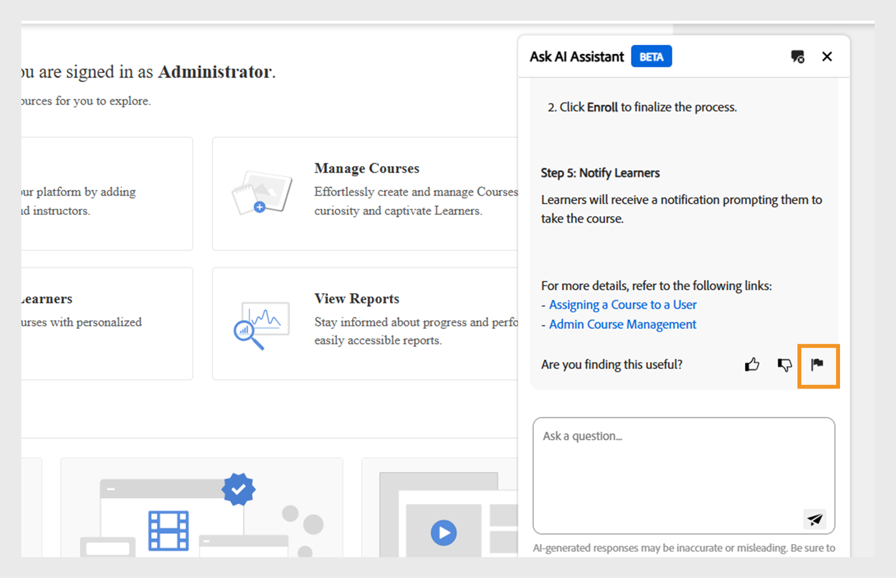

# Admin AI Assistant (Beta) dans Adobe Learning Manager

Dans les configurations d’apprentissage complexes, les administrateurs peuvent avoir des difficultés à trouver du contenu ou à effectuer des tâches en raison de menus complexes et de workflows déconnectés. Par exemple, des tâches telles que l’exécution de rapports ou l’accès à des informations spécifiques peuvent nécessiter la navigation sur plusieurs écrans. L’Assistant Admin AI (Beta) vous aide à trouver les informations appropriées pour comprendre et effectuer des tâches efficacement.

L’Assistant Admin AI (Beta) de Adobe Learning Manager permet aux administrateurs de trouver rapidement des réponses aux questions courantes, d’explorer les fonctionnalités du système et de comprendre comment effectuer une tâche essentielle, simplement en posant des questions en langage clair. Que vous débutiez avec Adobe Learning Manager ou que vous recherchiez des moyens plus rapides de résoudre les problèmes, l’Assistant Admin AI (Beta) simplifie votre workflow en fournissant une aide contextuelle directement dans la plateforme.

Il utilise les fonctionnalités d’IA d’Adobe pour activer les requêtes en langage naturel dans le contenu d’apprentissage et les workflows système.  Les administrateurs peuvent poser des questions telles que **Comment ajouter des utilisateurs à Adobe Learning Manager** ou **Comment ajouter des parcours d’apprentissage**. L&#39;assistant Adobe Learning Manager Admin AI Assistant (Beta) est formé exclusivement à la documentation publique appartenant à l&#39;Adobe, telle que les ressources hébergées sur **[!UICONTROL Experience League]**. Il n’apprend pas ni n’accède au contenu client, au matériel de formation interne ou aux données générées par les utilisateurs.

Cet assistant réduit la dépendance à la navigation manuelle, raccourcit le temps de découverte et permet d’afficher rapidement des informations exploitables.

<!--## Key benefits

* Perform common administrator tasks faster with conversational guidance.
* Get instant answers without browsing through extensive menus.
* Gain real-time insights and step-by-step guidance for administrative workflows.-->

>[!IMPORTANT]
>
>Elle est disponible uniquement pour les administrateurs et ne prend actuellement en charge que l’anglais.

## Confidentialité, sécurité et gouvernance

L’assistant Admin AI (Beta) est conçu pour garantir la sécurité et la confidentialité des données. Voici ce à quoi vous pouvez vous attendre :

* Admin AI Assistant (Beta) n’utilise aucune donnée personnelle, y compris à des fins de formation.
* Il n’a pas accès aux données d’apprentissage ou au contenu stocké dans Adobe Learning Manager.
* L’Assistant Admin AI (Beta) n’accède ni ne partage aucune Information personnelle identifiable (PII) et ne partage aucune information privée ou sensible.
* Les invites fournies par les utilisateurs (telles que les questions ou les requêtes) ne sont pas partagées avec d’autres clients.

>[!IMPORTANT]
>
>Admin AI Assistant (Beta) sera déployé par phases, les clients recevant un préavis de deux semaines. Pour toute assistance, contactez votre gestionnaire de succès client (CSM).

## Accès à l’assistant Admin AI (Beta)

Procédez comme suit pour lancer l’assistant Admin AI (Beta) :

1. Connectez-vous en tant qu’administrateur.
2. Sélectionnez l’icône de chat pour lancer Admin AI Assistant (Beta).

   
   _Sélectionnez la bulle de conversation pour lancer Admin AI Assistant (Beta)_

   >[!NOTE]
   >
   >Lors du premier lancement de l’assistant Admin AI (Beta), vous devez donner votre consentement avant de l’utiliser. La boîte de dialogue de consentement s’affiche uniquement lors de ce lancement initial. Pour tous les lancements suivants, vous serez directement redirigé vers l’assistant Admin AI (Beta) pour saisir vos invites.

3. Sélectionnez **[!UICONTROL Commencer]**. Vous êtes maintenant prêt à utiliser l’Assistant Admin AI (Beta).

   
   _Inviter à accepter la stratégie d&#39;utilisation avant la première utilisation_

## Comment utiliser l’assistant Admin AI (Beta)

Pour utiliser l’assistant Admin AI (Beta) :

1. Saisissez votre invite et appuyez sur **[!UICONTROL Entrée]**. La réponse s’affiche dans l’Assistant Admin AI (Beta).

   
   _Exemple de requête et de réponse de l’Admin AI Assistant (Beta)_

### Exemples d’invites

Voici quelques exemples d’invites que les administrateurs peuvent utiliser pour utiliser efficacement l’assistant Admin AI (Beta) :

* **Attribuer un cours à un utilisateur**
   * **Invite** : « Comment puis-je attribuer un cours à un utilisateur ? »

  
  _Réponse à l&#39;invite Comment assigner un cours à un utilisateur_

* **Dernier rapport d&#39;inscription**
   * **Invite** : Afficher le dernier rapport d&#39;inscription.

  
  _Réponse à l’invite Afficher le dernier rapport d’inscription_

* **Supprimer un utilisateur**
   * **Invite** : « Comment puis-je supprimer un utilisateur ? »

  
  _Réponse à l’invite Comment puis-je supprimer un utilisateur_

### Conseils pour utiliser efficacement Admin AI Assistant (Beta)

* **Soyez précis dans vos invites** : lorsque vous posez une question, incluez un contexte et des détails clairs. Par exemple, au lieu de demander « Comment ajouter un utilisateur dans Adobe Learning Manager ? », demandez « Comment attribuer un cours à un utilisateur dans Adobe Learning Manager ? »
* **Utilisez un langage clair et concis** : posez des questions simples et précises. Cela permet à l’Assistant Admin AI (Beta) de comprendre votre intention et de fournir une réponse plus précise.
* **Explorez différentes fonctionnalités** : renseignez-vous sur diverses fonctionnalités telles que les rapports d&#39;inscription, la progression des élèves, l&#39;affectation de contenu ou le suivi de certification pour découvrir toute la gamme de support disponible.
* **Envoyer un commentaire** : après avoir reçu une réponse, faites-nous savoir si elle a été utile. Utilisez les fonctionnalités Pouces vers le haut, Pouces vers le bas, Rapport ou Commenter pour partager vos commentaires. Vos commentaires jouent un rôle clé dans l’amélioration de l’assistant.

## Envoyer des commentaires sur les réponses de l’Assistant Admin AI (Beta)

Vos commentaires sur les réponses générées par l’Assistant Admin AI (Beta) contribuent à améliorer sa précision, sa pertinence et ses performances globales.

### Aimer ou ne pas aimer une réponse

* Sélectionnez **[!UICONTROL Pouce vers le haut]** si la réponse a été utile et précise.
* Sélectionnez **[!UICONTROL Pouce vers le bas]** si la réponse était incorrecte ou inutile.

### Marquer une réponse

Procédez comme suit pour marquer une réponse :

1. Sélectionnez **[!UICONTROL Indicateur]** à la fin de la réponse.

   
   _Sélectionner un rapport dans l&#39;écran de l&#39;Assistant Admin AI_

2. Sélectionnez un ou plusieurs motifs, ajoutez des commentaires si nécessaire, puis sélectionnez **[!UICONTROL Envoyer]**.

   
   _Les administrateurs notent la réponse à l&#39;aide des pouces vers le haut ou vers le bas avec des commentaires facultatifs_

Adobe utilise ces commentaires pour améliorer l’Assistant Admin AI (Beta) au fil du temps.

## Forum aux questions

+++ Puis-je utiliser l’Admin AI Assistant (Beta) en tant qu’élève ?

Non. Cet assistant est uniquement disponible pour les administrateurs.

+++

+++Est-il disponible dans l’application mobile ?

Pas pour le moment.

+++

+++ Peut-il effectuer des actions d’administration ?

Non. L’Assistant Admin AI (Beta) fournit uniquement des conseils.

+++

+++Prendra-t-il en charge davantage de langues ?

L’équipe Adobe Learning Manager évalue la prise en charge multilingue pour les futures mises à jour.

+++
