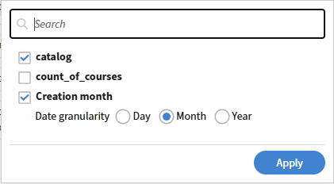

# Commencer avec un modèle de Report Builder

Les modèles sont des configurations de rapport prêtes à l’emploi fournies par Adobe Learning Manager. Chaque modèle est conçu pour un cas d’utilisation spécifique, tel que le suivi des inscriptions et de l’achèvement, les rapports de conformité ou les performances des instructeurs. Vous pouvez télécharger un modèle directement ou le dupliquer pour créer une copie modifiable.

1. Connectez-vous à Adobe Learning Manager en tant qu’administrateur.
2. Sélectionnez **Rapports** dans le volet de gauche, puis **Report Builder**.
3. Sélectionnez l&#39;onglet **Modèles**.
4. Parcourez les modèles disponibles. Chaque modèle est nommé en fonction de son cas d’utilisation.
   
5. Sélectionnez un nom de modèle pour ouvrir son aperçu en lecture seule. Pour cet exemple, sélectionnez Dupliquer près du modèle MoM Catalog Wise - Course Count. Vérifiez les colonnes, les filtres appliqués et l’ordre de tri. Lorsque vous dupliquez un modèle, Report Builder ouvre une copie modifiable avec la configuration existante du modèle préchargée. Le nom, la description, les colonnes, les filtres et le tri du rapport peuvent être modifiés avant l’enregistrement.

## Nommer et décrire le rapport

1. Dans le champ **Nom**, remplacez le nom par défaut (par exemple, _copie de Catalog Wise_ - _Mois du nombre de cours_) par un nom unique pour votre rapport. Un nom est requis.
2. Dans le champ **Description**, saisissez un court résumé de ce que contient le rapport. Cela aide les autres administrateurs à comprendre l’objectif du rapport lorsqu’ils le consultent ou le modifient.

## Ajout et configuration de colonnes

La section **Colonnes** comporte deux panneaux : **Sélectionner des colonnes** à gauche et **Sélectionner des colonnes** à droite.

### Ajout d’une colonne

1. Dans le panneau **Sélectionner des colonnes**, développez un jeu de données en sélectionnant son nom. Par exemple, **Catalogue** ou **Groupe d&#39;utilisateurs sur le terrain actif**.
2. Sélectionnez l&#39;icône **+** en regard de la colonne que vous souhaitez ajouter. La colonne apparaît dans le panneau **Colonnes sélectionnées** à droite.
   
3. Pour ajouter la même colonne plusieurs fois. Par exemple, pour appliquer deux agrégats différents au même champ. Sélectionnez à nouveau **+** pour cette colonne.

### Réorganiser les colonnes

Faites glisser la poignée à gauche de n&#39;importe quelle ligne de colonne dans le panneau **Colonnes sélectionnées** pour la déplacer vers une autre position. L’ordre des colonnes dans le panneau correspond à celui du rapport téléchargé.

### Renommer une colonne

1. Sélectionnez l&#39;icône **modifier** (crayon) sur une ligne de colonne.
   
2. Entrez un alias. L’alias s’affiche comme en-tête de colonne dans le rapport téléchargé au lieu du nom de champ par défaut.
   

### Suppression d’une colonne

Sélectionnez l&#39;icône **×** sur une ligne de colonne pour la supprimer du rapport.

## Appliquer le regroupement par

La commande **Regrouper par** apparaît en haut du panneau **Colonnes sélectionnées**.

1. Sélectionnez **Regrouper par : sélectionnez**.
   
2. Sélectionnez les colonnes à regrouper. Vous pouvez en sélectionner plusieurs. Dans la capture d&#39;écran, le rapport est regroupé par _catalogue_ et _mois de création_.
3. Chaque colonne Groupe par sélectionnée apparaît sous la forme d’une balise sous le contrôle Groupe par. Pour supprimer une colonne groupe par groupe, sélectionnez **×** sur sa balise.

>[!NOTE]
>
>Lorsque l&#39;option Regrouper par est appliquée, une fonction d&#39;agrégation doit être appliquée à chaque colonne qui n&#39;est pas une colonne Regrouper par. Une colonne sans agrégat provoque une erreur.

## Application d&#39;un agrégat à une colonne

1. Sur toute colonne sans regroupement dans le panneau **Colonnes sélectionnées**, sélectionnez **Agréger par**.
2. Choisissez une fonction dans la liste déroulante. Dans la capture d&#39;écran, **Objet d&#39;apprentissage** - **ID de l&#39;objet d&#39;apprentissage** utilise **Count Distinct**, alias ount_of_course.

Fonctions d&#39;agrégation disponibles :

| Fonction | Ce qu’il renvoie |
|----------|-----------------|
| Nombre | Nombre total de lignes dans le groupe |
| Compter les éléments distincts | Nombre de valeurs uniques dans le groupe |
| Count If (Compter Si) | Nombre de lignes correspondant à une valeur que vous spécifiez |
| Somme | Total d’un champ numérique dans le groupe |
| Min | Valeur la plus faible du groupe |
| Max | Valeur la plus élevée du groupe |
| Moyenne | Valeur moyenne dans le groupe |

## Appliquer des filtres

La section **Filtres** se trouve sous la section **Colonnes**. Les filtres limitent les lignes qui apparaissent dans le rapport.

1. Pour ajouter un filtre, sélectionnez l’icône **+** à droite de la section Filtres.
2. Sélectionnez le champ sur lequel filtrer.
   
3. Sélectionnez un opérateur et saisissez ou choisissez une valeur.

Pour modifier un filtre existant, sélectionnez l&#39;icône **crayon** sur la ligne de filtre. Pour ajouter un groupe de filtres imbriqués, sélectionnez l’icône + avec des crochets à droite d’une ligne de filtre.

## Configurer le tri

La section Tri se trouve sous la section Filtres.

1. Sélectionnez **+ Ajouter le tri** pour ajouter un tri.
2. Choisissez la colonne à trier et sélectionnez **Croissant** ou **Décroissant**.
   
3. Répétez l’opération pour ajouter des tris secondaires. Faites glisser la poignée à gauche de chaque ligne de tri pour modifier la priorité.

>[!TIP]
>
>Appliquez toujours au moins un tri. Sans tri, l’ordre des lignes peut différer selon le téléchargement d’un même rapport.

## Enregistrer le rapport

Sélectionnez **Enregistrer le rapport** dans le coin supérieur droit. Le rapport est enregistré dans votre onglet **Rapports** et est prêt à être téléchargé.

## Bonnes pratiques

* Utilisez des alias sur chaque colonne afin que le rapport téléchargé comporte des en-têtes significatifs au lieu de noms de champ tels que _Objet d’apprentissage_ - _ID d’objet d’apprentissage_.
* Utilisez Nombre Distinct au lieu de Nombre lorsque vous souhaitez des enregistrements uniques, par exemple, des cours distincts par catalogue plutôt que des lignes de total.
* Appliquez le tri avant l’enregistrement, en particulier pour les rapports que vous partagerez ou auxquels vous vous abonnerez.
* Gardez la description à jour. D’autres administrateurs s’y fient pour comprendre la portée du rapport sans l’ouvrir.
