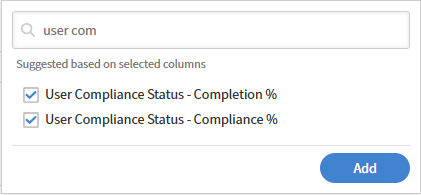
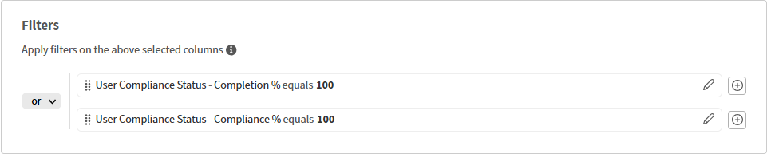
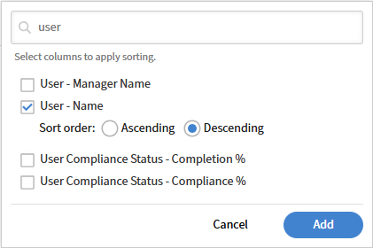

# Création d’un rapport personnalisé dans Report Builder

## Présentation

Créer à partir de zéro fonctionne mieux lorsque vous disposez d’une image claire des colonnes et de la sortie dont vous avez besoin et qu’aucun modèle existant ne correspond à votre cas d’utilisation. Si vous débutez avec Report Builder, pensez à commencer avec un modèle.

## Création d’un rapport personnalisé

Dans cet exemple, vous identifierez les élèves de chaque responsable qui sont exposés au risque de suivre des cours de conformité.

1. Connectez-vous à Adobe Learning Manager en tant qu’administrateur.
2. Sélectionnez **Rapports**, puis **Report Builder**.
3. Sélectionnez l&#39;onglet **Rapports**, puis sélectionnez **Créer un rapport**.
4. Entrez un nom de rapport. Un nom est requis. Le cas échéant, saisissez une description.

   

5. Dans le panneau de colonnes, sélectionnez les jeux de données suivants et développez-les :

   * Utilisateur
   * Objet d’apprentissage
   * État de conformité de l’utilisateur

6. Sélectionnez **+** à côté des colonnes suivantes que vous souhaitez inclure. Les colonnes sélectionnées apparaissent dans la zone de travail du rapport.

   * Nom d’utilisateur
   * Nom de l’utilisateur et du responsable
   * Objet d’apprentissage - Nom de l’objet d’apprentissage
   * État de conformité de l’utilisateur - % d’achèvement
   * État de conformité de l’utilisateur - % de conformité

   

7. Réorganisez les colonnes en les faisant glisser dans la zone de travail.
8. Pour renommer une colonne, entrez un nom dans le champ d&#39;alias de la colonne. L’alias apparaît comme l’en-tête de colonne dans le fichier téléchargé.
9. Sélectionnez **Enregistrer le rapport**.

## Télécharger le rapport

1. Sélectionnez **Actions** dans le coin supérieur droit.

   

2. Sélectionnez **Télécharger**. Vous pouvez télécharger le rapport à partir de l’icône de notifications lorsqu’il est prêt.

Le rapport téléchargé (csv) contient les colonnes suivantes :

* name
* managerName
* name
* completionPct
* compliancePct

## Appliquer le regroupement, les filtres et le tri

### Filtre

Maintenant que vous avez téléchargé le rapport, appliquez un filtre avec completionPct OR compliancePct égal à 100.

1. Ouvrez le rapport et sélectionnez **Modifier** dans le coin supérieur droit.
2. Sélectionnez **Ajouter un filtre** et recherchez dans les colonnes où vous souhaitez appliquer les filtres.

   

3. Sélectionnez **Ajouter**.
4. Combinez les filtres avec une logique ET/OU ; sélectionnez l’opérateur pour basculer entre les lignes de filtre.

   

5. Sélectionnez **Enregistrer le rapport** et téléchargez le rapport.

Le rapport téléchargé contient des enregistrements où completionPct OU compliancePct est égal à 100.

### Regrouper par

Regrouper les enregistrements par responsable pour :

* Agréger les données des élèves par responsable
* Calculer les moyennes au niveau du responsable
* Compter les élèves sous chaque responsable

1. Ouvrez le rapport et sélectionnez **Modifier** dans le coin supérieur droit.
2. Sélectionnez **Regrouper par:Select** et sélectionnez la colonne **Nom du gestionnaire d&#39;utilisateurs**.

   

3. Regroupez les colonnes suivantes :

   * User-Name
   * Objet d’apprentissage - Nom de l’objet d’apprentissage

4. Sélectionnez **Count** comme fonction d&#39;agrégation pour les colonnes.

   

5. Répétez l’opération pour Objet d’apprentissage - Nom de l’objet d’apprentissage.

   

6. Sélectionnez **Enregistrer le rapport** et téléchargez le rapport.

Le rapport téléchargé contient un résumé des performances de formation des élèves à l’attention du responsable. Elle affiche les taux moyens d’achèvement, les scores de conformité moyens et le nombre total d’élèves pour chaque responsable. Les données indiquent que tous les groupes suivent une formation universelle, tandis que les performances en matière de conformité varient considérablement entre les responsables.

### Trier

Triez le rapport par ordre décroissant en fonction du nombre d’élèves pour chaque responsable.

1. Ouvrez le rapport et sélectionnez **Modifier** dans le coin supérieur droit.
2. Sélectionnez **Ajouter un tri**.
3. Recherchez le nom d&#39;utilisateur et sélectionnez **Nom-utilisateur**.
4. Sélectionnez **Descendant**.

   

5. Sélectionnez **Ajouter**.
6. Sélectionnez **Enregistrer le rapport** et téléchargez le rapport.

Le rapport téléchargé contient le nombre d’élèves par responsable dans l’ordre décroissant.
