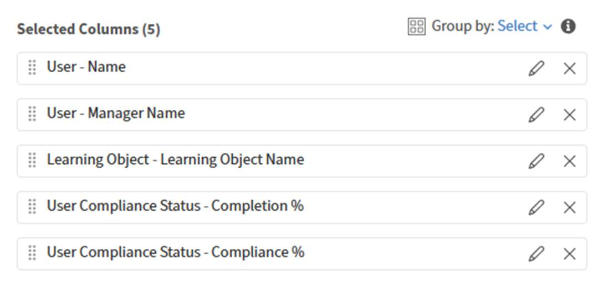

# Ajout et combinaison de filtres dans un rapport

Les filtres vous permettent d’étendre votre rapport aux enregistrements dont vous avez besoin. Vous pouvez appliquer un seul filtre, combiner plusieurs filtres avec une logique AND ou OR et créer des groupes imbriqués pour des conditions complexes.

## Ajout d’un filtre

Utilisez des filtres pour limiter votre rapport à un sous-ensemble spécifique de données au lieu de tout afficher.

Par exemple, vous pouvez vouloir comprendre le nombre d&#39;élèves inscrits à des cours au cours des 365 derniers jours. Dans ce cas, vous appliquez un filtre de date à la date d&#39;inscription pour inclure uniquement les activités récentes.

1. Lancez Report Builder et sélectionnez **Créer un rapport**.
2. Saisissez le nom et la description du rapport\.
3. Sélectionnez les colonnes suivantes : &lt;`dataset>:<column name>`
a. Date d’inscription
b. Nom-utilisateur
   
4. Dans la section Rapports, sélectionnez **Ajouter un filtre**.
5. Recherchez ou accédez au champ sur lequel vous souhaitez filtrer. Dans cet exemple, sélectionnez **Date d&#39;inscription**.
   
6. Sélectionnez **Ajouter**.
7. Sélectionnez un opérateur. Les opérateurs disponibles dépendent du type de données du champ :
a. Champs de chaîne : contient, est égal à, commence par
b. Champs numériques — supérieur à, inférieur à, égal à, entre
c. Champs de date : est égal à, avant, après, entre les N derniers jours
d. Champs de liste (enum) : est dans, n&#39;est pas dans
8. Dans ce cas, sélectionnez **l&#39;année dernière**.
   
9. Sélectionnez **Enregistrer le rapport** et sélectionnez **Actions** > **Télécharger** pour télécharger le rapport.

Le rapport téléchargé répertorie tous les utilisateurs qui se sont inscrits à un objet d’apprentissage au cours des 365 derniers jours.

### Ajout de plusieurs filtres avec logique ET/OU

Lorsque vous ajoutez un second filtre, la relation par défaut entre les filtres est AND ; les deux conditions doivent être vraies pour qu’une ligne apparaisse.

Par exemple, vous pouvez souhaiter identifier les élèves qui se sont inscrits aux cours au cours des 365 derniers jours ET qui rendent compte à un responsable spécifique. Dans ce cas, les deux conditions doivent être vraies, de sorte que les filtres sont combinés à l&#39;aide de la logique AND.

1. Lancez Report Builder et sélectionnez **Créer un rapport**.
2. Saisissez le nom et la description du rapport.
3. Sélectionnez les colonnes suivantes : `<dataset>:<column name>`
a. Nom-utilisateur
b. Nom du gestionnaire d’utilisateurs
c. Date d’inscription
   

4. Regroupez par la colonne **Nom du gestionnaire d&#39;utilisateurs**.
5. Dans la section **Filtre**, sélectionnez les filtres suivants :
a. La date d&#39;inscription **est antérieure à l&#39;année dernière**
b. Le nom du gestionnaire d&#39;utilisateurs **commence par N**
c. Le nom du gestionnaire d&#39;utilisateurs **n&#39;est pas vide**
   
6. Sélectionnez **Enregistrer le rapport** et sélectionnez **Actions** > **Télécharger** pour télécharger le rapport.

Le rapport téléchargé répertorie tous les utilisateurs qui se sont inscrits à un objet d’apprentissage au cours des 365 derniers jours et rend compte à un responsable dont le nom commence par N.

### Création de groupes de filtres imbriqués

Les groupes imbriqués vous permettent de créer des conditions avec plusieurs niveaux logiques, équivalents aux crochets dans une formule\. Par exemple : (Catalog = Safety OR Catalog = Hygiene) AND La date d’achèvement est dans les 90 derniers jours.

Utilisez des groupes de filtres imbriqués lorsque votre logique comprend une combinaison de conditions AND et OR qui doivent être évaluées ensemble.

Par exemple, utilisez la logique de filtre imbriquée pour identifier les inscriptions incomplètes où les élèves ont une progression inférieure à 50 % ou une formation en retard, en démontrant comment les conditions AND et OR fonctionnent ensemble.

1. Lancez **Report Builder** et sélectionnez **Créer un rapport**.
2. Saisissez le nom et la description du rapport.
3. Sélectionnez les colonnes suivantes : `<dataset>:<column name>`
a. Inscription - Statut
b. Inscription - Pourcentage de progression
c. Inscription - En retard
   
4. Dans la section **Filtre**, sélectionnez les filtres suivants :
a. Le statut d&#39;inscription **n&#39;est égal à aucun des** terminés.
b. Sélectionnez **+**.
c. Recherche du pourcentage de progression de l’inscription.
d. Sélectionnez le filtre.
e. Sélectionnez **Ajouter comme groupe**.
   
f. Ajouter un pourcentage de progression d&#39;inscription **inférieur à** 50
   
g. Sélectionnez **+**.
h. Recherchez Inscription - En retard.
i. Sélectionnez le filtre.
j. Sélectionnez **Ajouter comme groupe**.
   
k. Ajouter Inscription - En retard est égal à VRAI.
l. Remplacez l’opérateur AND imbriqué par OR.
   
5. Sélectionnez **Enregistrer le rapport** et sélectionnez **Actions** > **Télécharger** pour télécharger le rapport.

Le rapport téléchargé répertorie toutes les inscriptions en cours ou non commencées, dont le pourcentage de progression est inférieur à 50 % ou en retard.
