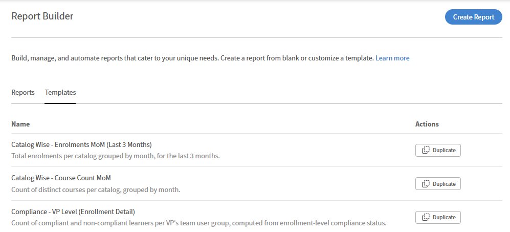

# Report Builder : concepts et terminologie

## Modèles et rapports

**Les modèles** sont des configurations de rapport prédéfinies fournies par Adobe Learning Manager. Ils sont conçus pour les cas d’utilisation courants, le suivi des inscriptions et de l’achèvement, les rapports de conformité, les performances des instructeurs et sont prêts à être téléchargés immédiatement. Les modèles sont en lecture seule ; vous ne pouvez pas les modifier ni les remplacer.

Les **rapports** sont vos propres configurations enregistrées. Vous pouvez créer un rapport à partir de zéro ou en dupliquant un modèle et en modifiant la copie. Lorsque vous dupliquez un modèle, la copie devient un rapport dans l’onglet Rapports.

Les modèles et les rapports apparaissent dans le Report Builder, mais sous des onglets distincts.

## Jeux de données

Un jeu de données est un groupe nommé de colonnes associées dans le Report Builder. Lorsque vous ajoutez des colonnes à un rapport, vous choisissez parmi ces jeux de données. Considérez chaque ensemble de données comme une table d’informations sur un aspect de vos données d’apprentissage.

Voici un exemple de jeux de données disponibles dans Report Builder :

* **Utilisateur :** données de profil d’élève, y compris les champs actifs
* **Relevé de notes :** enregistrements d&#39;inscription et d&#39;achèvement
* **Objet d’apprentissage :** cours, parcours d’apprentissage et données de certification
* **Instance d’objet d’apprentissage :** détails au niveau de l’instance
* **Catalogue :** données de catalogue et d&#39;étiquette de catalogue
* **Groupe d&#39;utilisateurs :** appartenance et hiérarchie du groupe d&#39;utilisateurs
* **Session de module :** données de salle de classe et de session virtuelle, y compris les détails du module d&#39;apprentissage en ligne

>[!NOTE]
>
>Les ensembles de données peuvent être joints de manière sélective. Toutes les combinaisons ne sont pas disponibles dans un seul rapport.

## Colonnes et bouton Ajouter

Chaque colonne que vous ajoutez apparaît sous la forme d’une ligne dans la zone de travail du rapport et devient une colonne dans le fichier téléchargé. Vous pouvez ajouter la même colonne plusieurs fois. Ceci est utile lorsque vous souhaitez mesurer deux valeurs différentes à partir du même champ. Par exemple, vous pouvez ajouter la colonne État deux fois : une fois pour compter les inscriptions et une fois pour compter les élèves en cours à l&#39;aide du nombre d&#39;agrégats.

Vous pouvez également renommer une colonne en entrant un alias. L’alias s’affiche comme en-tête de colonne dans le rapport téléchargé.

## Regrouper par et agrégation

Regrouper par récapitule vos données en fonction d&#39;un champ choisi au lieu d&#39;afficher des lignes individuelles. Par exemple, le regroupement par nom d’instructeur vous donne une ligne par instructeur plutôt qu’une ligne par inscription.

Regrouper par suit le comportement standard de la base de données : une fois que vous appliquez l&#39;option Regrouper par sur une colonne, une fonction d&#39;agrégation doit être appliquée à toutes les autres colonnes du rapport. Vous ne pouvez pas mélanger des données de ligne individuelles avec des données groupées. Les **fonctions** d&#39;agrégation disponibles sont les suivantes :

* **Nombre :** nombre total de lignes
* **Compter si :** nombre de lignes où le champ correspond à une valeur que vous spécifiez
* **Somme :** total d&#39;un **champ numérique**
* **Min :** plus petite valeur dans un champ numérique
* **Max:** la valeur la plus élevée dans un champ numérique
* **Moyenne :** valeur moyenne d&#39;un champ numérique

Si vous avez utilisé des tableaux croisés dynamiques dans Excel, grouper par fonctionne de la même manière au niveau des colonnes.

## Filtres

Les filtres restreignent les lignes à afficher dans votre rapport. Vous pouvez appliquer plusieurs filtres et les combiner avec une logique AND ou OR.

Les opérateurs de filtre dépendent du type de données de la colonne :

* **Champs de chaîne :** contient, égale, commence par (recherche par frappe anticipée disponible pour les valeurs reconnues)
* **Champs numériques :** supérieur à, inférieur à, égal à, entre
* **Champs de date :** est égal à, avant, après, entre et à des plages relatives (par exemple, les 90 derniers jours)
* **Énumérer (liste) les champs :** est dans, n&#39;est pas dans (sélecteur de valeurs à sélection multiple)

## AND/OR logique et groupes de filtres imbriqués

Par défaut, plusieurs filtres utilisent la logique AND. Toutes les conditions doivent être réunies pour qu’une ligne s’affiche. Vous pouvez permuter l’opérateur entre deux filtres en OR. Vous pouvez également regrouper les filtres à l’aide de l’option Ajouter en tant que groupe, qui crée un crochet. Les filtres du groupe sont évalués ensemble avant d’être combinés avec des filtres extérieurs.

Cela vous permet de créer des conditions telles que :

(catalogue = Sécurité OU catalogue = Hygiène) ET la date d&#39;achèvement est dans les 90 derniers jours.

Vous pouvez imbriquer des groupes dans d’autres groupes pour prendre en charge une logique complexe à plusieurs niveaux.

## Tri

Vous pouvez trier sur une ou plusieurs colonnes. La première colonne sur laquelle vous effectuez un tri est le tri principal. Des tris supplémentaires s’appliquent dans les liens de la colonne principale.

Appliquez toujours au moins un tri lorsque vous avez besoin d’une sortie cohérente. Étant donné que la génération de rapports s’exécute sur un système distribué, l’ordre des lignes n’est pas garanti entre deux téléchargements du même rapport, sauf si le tri est appliqué.

## Données de tendance par rapport aux données de cliché

Tout rapport qui utilise un agrégateur de tendances, tel que mensuel ou hebdomadaire, reflète les données d&#39;instantané actuelles regroupées par date. Il ne reflète pas l&#39;état historique des données à chaque date passée.

Par exemple, une tendance d&#39;inscription regroupée par mois indique le nombre d&#39;inscriptions existant aujourd&#39;hui, réparties sur les mois de création. Cela ne tient pas compte des élèves qui se sont ensuite désinscrits ou ont modifié des groupes d’utilisateurs. Ces modifications ne sont pas appliquées rétroactivement aux mois précédents.

## Élèves supprimés et champs actifs

Report Builder prend en charge l’inclusion des élèves supprimés dans les rapports et la récupération de leurs valeurs de champ actives. Utilisez la colonne **Date de suppression** dans le jeu de données **Utilisateur** pour créer le rapport.

## Bonnes pratiques

* Lisez la référence des ensembles de données disponibles avant de créer un rapport à partir de zéro. Savoir quel ensemble de données contient les champs dont vous avez besoin permet de gagner un temps de configuration important.
* Appliquez le tri avant de vous abonner à un rapport planifié. Cela garantit la cohérence de l’ordre des lignes à chaque livraison.
* Si vous voyez des lignes en double inattendues, vérifiez si votre rapport inclut un champ qui peut avoir plusieurs valeurs par ligne, tel que le nom d’un instructeur pour une session avec plusieurs instructeurs.
