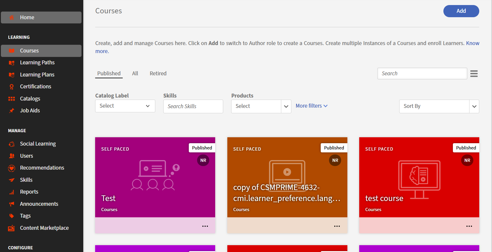
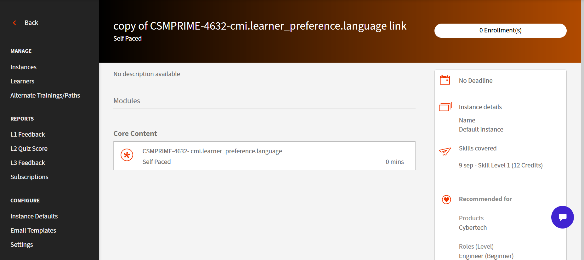

# Suppléants et équivalents

## Introduction

Dans de nombreuses organisations, les élèves rencontrent des situations de formation où différents cours peuvent légitimement satisfaire la même exigence. Par exemple, à quel moment un nouveau cours doit-il remplacer un ancien ? Quand un cours plus complet devrait-il remplacer un cours plus court ou quand devrait-on offrir un cours de remplacement spécial?

La fonctionnalité Cours alternatifs ou parcours d’apprentissage donne à ALM un moyen formel de dire :

« Si l’élève a terminé cette formation, traitez-le comme ayant satisfait à cette exigence de formation connexe. »

La fonctionnalité fonctionne dans tous les cours et parcours d’apprentissage, garantit que les exigences en aval telles que les conditions préalables et les règles de conformité sont respectées, et le fait sans forcer les élèves à passer par du contenu redondant. Il permet également de garder les rapports exacts en enregistrant ce qui a été rempli directement par rapport à ce qui a été satisfait par l&#39;intermédiaire d&#39;un autre système.

Au cœur de la fonctionnalité, le concept d’une autre fin de formation : un état d’achèvement spécial créé automatiquement lorsqu’un élève termine une formation source configurée qui est prise en compte dans une autre formation cible.

## Autres relations

Certaines relations de formation sont bidirectionnelles, ce qui signifie que chaque cours peut répondre aux exigences de l&#39;autre. Il s&#39;agit en fait d&#39;un scénario dans lequel deux formations sont considérées comme mutuellement substituables. En revanche, les relations unidirectionnelles permettent à une formation de satisfaire à une autre exigence, mais pas l&#39;inverse. ALM modélise les deux scénarios en utilisant le même mécanisme d’achèvement alternatif sous-jacent.

* **Relation bidirectionnelle (équivalents) :** terminer l&#39;une ou l&#39;autre formation satisfait aux exigences de l&#39;autre.
* **Relation unidirectionnelle :** terminer la formation A satisfait la formation B, mais terminer B ne satisfait pas A. Cela se produit généralement lorsqu’une version plus récente ou plus complète doit être prise en compte dans une ancienne exigence, mais pas l’inverse.

Par exemple, lorsqu’un cours sur-ensemble plus complet couvre tout dans un cours de sous-ensemble plus simple. Le fait de remplir le sur-ensemble doit satisfaire aux exigences du sous-ensemble, mais pas nécessairement l&#39;inverse.

Un cours plus récent et plus développé qui devrait être pris en compte dans une ancienne exigence.

Cours conçu pour un public spécifique (par exemple, une variante régionale ou adaptée à l’accessibilité) qui répond toujours aux mêmes exigences que le cours principal.

Nouvelle version améliorée d&#39;un cours que l&#39;organisation souhaite compter pour une ancienne exigence, mais l&#39;ancienne version ne doit pas être prise en compte pour la nouvelle exigence.

Dans Variantes, la relation est normalement unidirectionnelle. Si le cours A est une alternative au cours B, terminer A peut répondre aux exigences de B, mais terminer B ne répond pas nécessairement à A.

Lorsqu’une formation source configurée est terminée, ALM produit automatiquement une autre fin pour une ou plusieurs formations cibles.

## Quels problèmes cela résout-il ?

Sans alternatives, les administrateurs et les élèves sont confrontés à plusieurs problèmes récurrents :

* Les élèves sont fréquemment invités à répéter des cours qui couvrent le contenu qu&#39;ils ont déjà terminé dans une version ou un format différent.
* La mise à jour des programmes de conformité est plus simple, car les administrateurs peuvent remplacer ou restructurer les formations sans forcer les élèves qui ont terminé les anciennes versions à reprendre le contenu alternatif ou remplacé.
* La logique prérequise est rigide. Si un parcours nécessite un cours particulier comme condition préalable, il n&#39;existe aucun moyen propre de reconnaître qu&#39;une autre formation est suffisante.
* Les rapports et les audits sont plus difficiles. Il n&#39;y a pas de signal formel indiquant qu&#39;une exigence a été satisfaite au moyen d&#39;une autre exécution et il n&#39;y a pas de moyen simple de retracer la source du crédit.

La fonction de remplacement résout ces problèmes en :

* Empêcher les efforts en double pour les élèves lorsque les alternatives sont valides.
* Autoriser les administrateurs à modifier les structures de formation (par exemple, échanger un cours à l’intérieur d’un parcours) sans interrompre les achèvements pour les élèves qui ont suivi la version antérieure.
* Permettre aux conditions préalables et aux contrôles de conformité de respecter à la fois les finalisations directes et les finalisations alternatives ou équivalentes.
* Indiquer clairement, dans les transcriptions et les rapports, si une formation a été suivie directement ou si elle a été suivie par une autre relation, avec laquelle la formation a servi de source.

## Fonctionnement conceptuel de la fonctionnalité

La fonctionnalité repose sur trois idées principales : **relations**, **achèvement alternatif** et **comportement en aval**.

### Relations entre les formations

Les administrateurs définissent les relations entre les cours et les parcours d’apprentissage. Pour chaque relation, ils choisissent une source et une ou plusieurs cibles. Un cours peut avoir jusqu’à 30 objectifs en fonction du nombre de formations antérieures ou connexes qu’il doit satisfaire.

Pour les équivalents, les administrateurs peuvent rendre la relation bidirectionnelle s’ils souhaitent que les deux formations se satisfassent mutuellement. Pour les variantes, les administrateurs conservent normalement le sens une*façon de refléter le fait que seules certaines substitutions sont autorisées.

Ces relations sont stockées au niveau de la formation, pas au niveau de l’élève. Une fois configurés et activés, ils peuvent s’appliquer   à toutes les terminaisons actuelles et futures de la formation source, sous réserve des paramètres au niveau du compte*tels que l’activation ou non de l’achèvement rétroactif.

### Autre achèvement

Lorsqu’un élève termine une formation source, ALM examine toutes les autres relations configurées et, pour chaque formation cible pertinente, crée un autre enregistrement d’achèvement. Cet enregistrement est différent d’une fin normale :

* Elle marque la formation cible pour l’élève, mais assure le suivi pour s’assurer qu’elle a été terminée par des remplaçants plutôt que directement.
* Il enregistre quelle formation source a été utilisée pour satisfaire la cible.
* Il est stocké dans une structure dédiée afin que les rapports puissent faire la distinction entre les finalisations directes et alternatives.

Les élèves verront une autre réalisation même s’ils ne sont pas inscrits. Le rapport Relevé de notes de l’élève (LT) inclut uniquement les enregistrements des formations auxquelles l’élève est inscrit.

#### Expérience de l’application de l’élève pour des achèvements alternatifs et équivalents

Les autres achèvements apparaissent distinctement dans l’application de l’élève afin que celui-ci puisse clairement comprendre comment une exigence de formation a été satisfaite, tout en conservant la cohérence avec les relevés de notes et les rapports.

#### Comportement de la carte LO

##### Autre état d’achèvement

Lorsqu&#39;un élève termine une formation via une autre relation, la carte Objet d&#39;apprentissage affiche un statut distinct qui est **Terminé via une autre relation**. Cette distinction visuelle aide les élèves à différencier les achèvements directs des achèvements accordés via des relations configurées.

#### Indicateur de méthode d’achèvement

La carte d’objet d’apprentissage comprend un indicateur de méthode d’achèvement (par exemple, une étiquette ou une icône) pour montrer que l’achèvement a été réalisé par l’intermédiaire d’un autre. Si une autre fin de formation est révoquée ultérieurement en raison de modifications telles que l’inachèvement rétroactif ou la suppression de la formation source, ALM annulera tous les ajouts d’interface utilisateur qu’il a effectués pour une autre fin. L’élève ne pourra toujours pas cibler l’objet d’apprentissage conformément au comportement d’accès au catalogue actuel.

#### Transparence et détails d’audit

Les élèves peuvent ouvrir la carte objet d’apprentissage pour afficher des détails supplémentaires, notamment :

* Cours ou parcours d’apprentissage source qui a accordé l’autre achèvement

Cela assure la transparence.

#### Filtrage et vues

##### Filtre Méthode d’achèvement

L’application de l’élève fournit un filtre qui permet aux élèves de distinguer entre :

* Terminé
* Terminé par remplacement (filtre les objets d’apprentissage qui n’ont que des fins de production de remplacement. Si un objet d’apprentissage a une exécution alternative et directe, il ne sera pas inclus.)
* Lorsque vous sélectionnez **Terminé** et **Terminé via l&#39;autre**, vous pourrez voir toutes les finalisations

Cela permet aux élèves de comprendre rapidement comment leurs exigences d’apprentissage ont été remplies.

##### Vues de transcription et de progression

Le filtre de méthode d’achèvement est disponible dans les vues orientées apprenant. Par exemple :

* Sections de suivi de la progression et de l’achèvement

Ces points de vue indiquent clairement quelles formations ont été suivies directement et lesquelles ont été satisfaites par des remplaçants.

<!--
## Configure equivalent courses (complete each other)

Use this workflow to define courses that are **equal in value**, where completing either course should automatically complete the other.

1. Launch ALM and navigate to courses.
2. Select a course to configure.
3. Navigate to the **Alternates** section.
4. Search for and select one or more related courses.
5. For each selected course, enable **Completes each other**.
6. Save the configuration.

**Result**

- ALMm records a **bi-directional equivalence relationship**.
- Either course can act as a completion source for the other.

## Configure alternate courses (superset → subset)

Use this workflow when one course is a **superset** of another and should satisfy completion for the simpler or subset course.

1. Launch ALM and navigate to courses.
2. Select the **superset (primary)** course.
3. Go to the **Alternates** section.
4. Select one or more **alternate (subset)** courses.
5. Leave the relationship as **alternate** (do not enable completes each other).
6. Save the configuration.

**Result**

- Completion flows **one-way** from the source course to the alternate.
- Reverse completion is not applied.

## Apply completion logic after source course completion

Automatically evaluate and apply alternate or equivalent completion once a learner completes a configured source course. ALM:

1. Detects completion of a **source course**.
2. Evaluates configured relationships:
   - Equivalent relationships
   - Alternate relationships
3. For each related course:
   - Marks the course as completed if conditions are met
4. Creates a completion record with method **Alternate**.

**Key system rules**

- Alternate completion:
  - Satisfies prerequisites
  - Allows progress in learning paths and certifications
- Alternate completion does **not** award:
  - Skills
  - Badges
  - Gamification credits

## Record completion in Learning Transcript

Ensure alternate and equivalent completions are clearly distinguishable from direct completions for audit and reporting. ALM:

1. Updates the **Learner Transcript (LT)**.
2. Sets:
   - Completion status = Completed
   - Completion method = **Alternate**
3. Sets completion date equal to the **source course completion date**.

## Enable retroactive completion (optional)

Apply alternate or equivalent completion benefits to learners who completed source courses **before** the relationships were configured.

1. Open **Account-level settings** from Administrator home > Settings > General.
2. Enable **Retroactive completion**.
3. Save the configuration.

ALM:

1. Scans historical learner completions.
2. Applies alternate or equivalent completion where applicable.
3. Updates learner transcripts automatically.

## Enable retroactive incompletion (irreversible)

Revoke previously applied alternate or equivalent completions when relationships are removed or corrected.

1. Open **Account-level settings**.
2. Enable **Retroactive incompletion**.
3. Modify or remove alternate/equivalent relationships.

ALM:

1. Identifies impacted alternate completions.
2. Revokes previously applied alternate or equivalent completions.
3. Updates transcript entries to **Alternate (Revoked)**.
-->

### Flux de bout en bout

**Pour les élèves**

1. Accédez à **Mon apprentissage** ou **Cours terminés** dans l’application de l’élève.
2. Passez en revue les cartes d&#39;objet d&#39;apprentissage pour identifier les formations marquées comme **Terminées via un autre**.
3. Ouvrez une carte objet d’apprentissage pour afficher des détails (dans la page Présentation ) sur la formation source.
4. Utilisez le filtre pour sélectionner **Direct**, **Alternatif** ou **Tous**.
5. Passez en revue la liste mise à jour en fonction de la méthode d’achèvement sélectionnée.

**Pour les administrateurs et les auteurs**

* Configurez d’autres relations entre les cours ou les parcours d’apprentissage dans l’interface d’administration.

## Comportement d’achèvement et d’inachèvement rétroactif

ALM prend en charge l’achèvement rétroactif et l’inachèvement rétroactif pour garantir que les autres relations restent exactes au fil du temps, même lorsque les relations sont modifiées ou supprimées une fois que les élèves ont déjà terminé la formation.

### Achèvement rétroactif

#### Définition

Lorsque l’achèvement rétroactif est activé, les élèves qui ont terminé un cours source dans le passé reçoivent automatiquement un autre achèvement pour le cours cible si une autre relation est créée ultérieurement. Cela garantit que l’apprentissage de l’histoire est respecté sans exiger des élèves qu’ils reprennent la formation.

#### Fonctionnement du logiciel

1. Un administrateur active la saisie semi-automatique rétroactive au niveau du compte.
2. L’administrateur définit une autre relation entre une formation source et une formation cible.
3. Le système analyse les enregistrements d’achèvement historiques pour la formation source.
4. Les élèves éligibles se voient attribuer une autre fin pour la formation cible.
5. Ces enregistrements apparaissent comme **Terminés via un autre** dans les relevés de notes et les rapports des élèves.

>[!NOTE]
>
>Lorsque la saisie semi-automatique rétroactive est activée, elle s’applique uniquement aux relations créées par la suite. Elle ne s’applique pas aux relations qui existaient déjà avant l’activation du paramètre rétroactif.

### Inachèvement rétroactif

#### Définition

Lorsque l’inachèvement rétroactif est activé, les autres fins de production sont révoquées si la relation de remplacement sous-jacente est supprimée ou si la formation source est supprimée.
Cela garantit que le système reflète les relations de formation actuelles et valides.

#### Fonctionnement du logiciel

1. Un administrateur active l’inachèvement rétroactif au niveau du compte.
2. L’administrateur supprime une autre relation ou supprime la formation source.
3. Le système identifie les élèves qui ont reçu un autre achèvement par le biais de la relation affectée.
4. Les autres enregistrements d&#39;achèvement correspondants sont révoqués.
5. Les enregistrements révoqués sont marqués comme **Alternatif (révoqué)** dans les transcriptions et les rapports pour la visibilité de l’audit.

#### Impact sur les conditions préalables

Les achèvements alternatifs (y compris ceux accordés rétroactivement) sont considérés comme des achèvements valides lors de l&#39;évaluation des conditions préalables. Si un élève a **Terminé via une autre**, il est autorisé à poursuivre les cours qui nécessitent la formation cible.

Si une autre fin est révoquée ultérieurement par inachèvement rétroactif, l’élève peut perdre son éligibilité aux cours qui dépendent de cette condition préalable. Si l’élève n’a pas démarré l’objet d’apprentissage dépendant/subséquent, l’éligibilité administrée par l’objet d’apprentissage source est annulée. Si l’élève a déjà commencé ou terminé l’objet d’apprentissage dépendant/ultérieur, il n’y aura aucun impact.

#### Impact sur les parcours d’apprentissage et les certifications

Les autres achèvements contribuent à l’achèvement des parcours d’apprentissage et des certifications permanentes. Les élèves peuvent faire progresser ou terminer ces programmes lorsque les formations requises sont satisfaites via d’autres relations.

Si une autre réalisation est révoquée, les parcours d’apprentissage ou certifications concernés peuvent perdre leur progression jusqu’à ce que l’exigence soit satisfaite par une réalisation valide.

### Workflow de bout en bout

#### Activation de l&#39;achèvement ou de l&#39;inachèvement rétroactif

1. Les administrateurs accèdent aux paramètres du compte et activent l’achèvement et/ou l’inachèvement rétroactifs.
2. Les administrateurs créent, modifient ou suppriment les autres relations entre les formations.

#### Actions système

* **Pour l&#39;achèvement rétroactif** :
Le système attribue d&#39;autres déclarations de production en fonction des déclarations de production d&#39;origine historiques.
* **Pour l&#39;inachèvement rétroactif** :
Le système révoque les autres achèvements lorsque des relations sont supprimées ou des formations sources supprimées.

#### Expérience des élèves

Les élèves voient les états d’achèvement mis à jour sur les cartes d’objet d’apprentissage et dans les relevés de notes, tels que :

* **Terminé via un autre**

Lorsqu’une autre fin est révoquée, aucune étiquette n’est affichée sur l’interface utilisateur de l’élève. Dans les rapports et les transcriptions, les méthodes d’achèvement s’affichent comme suit :

* Cours/parcours alternatif
* Cours/parcours alternatif (révoqué)
* Direct

Les vérifications de prérequis, la progression du parcours d’apprentissage et l’état de certification se mettent à jour de manière dynamique en fonction de l’état d’achèvement actuel.

Les objets d’apprentissage ordonnés se déverrouillent dynamiquement en fonction de l’achèvement alternatif.

Les compétences, les badges, les points de ludification ou les commentaires ne seront pas attribués aux élèves une fois les cibles atteintes.

#### Rapports et audit

Toutes les modifications rétroactives sont reflétées dans le rapport Relevé de notes de l’apprentissage (LT). Une fois la source supprimée, le relevé de notes de l&#39;élève peut toujours afficher un ID de formation source en regard de **Autre révoqué**. Les rapports font clairement la distinction entre les déclarations de production directes, les déclarations de production alternatives et les déclarations de production alternatives révoquées pour prendre en charge la conformité, les enquêtes et les audits.

Le rapport d’inscription laisse le champ Source d’achèvement vide en cas d’achèvement direct, tandis que le relevé de notes de l’élève affiche l’adresse électronique et le type de celle-ci.

Lorsqu&#39;une cible est supprimée de la source (ou la source elle-même est supprimée), le rapport d&#39;inscription peut ne pas afficher le même état **Alternatif ou Alternatif (Révoqué)** comme indiqué dans le relevé de notes de l&#39;élève.

Même lorsque   Les **variantes** sont désactivées, les entrées historiques des lignes **Audit de contenu** ou **Inscription** peuvent toujours afficher l&#39;activité liée aux variantes.

La date d’achèvement peut précéder la date d’inscription lorsqu’un objet d’apprentissage est terminé via un autre parcours **avant** l’inscription réelle de l’élève. Étant donné que d’autres achèvements peuvent avoir lieu quel que soit le statut de l’élève (**Inscrit**, **Non inscrit** ou **En cours**), les élèves peuvent terminer l’objet d’apprentissage en premier et ne s’inscrire au cours cible que plus tard.

## Impact du retrait et de la suppression de la formation source dans les variantes

L’état du cycle de vie d’une formation source (retirée ou supprimée) affecte directement la façon dont les autres achèvements sont conservés pour les élèves. ALM traite ces scénarios différemment pour préserver la précision historique tout en s’assurant que les relations actuelles restent valides.

### Retirer la formation source

#### Définition

Le retrait d’un cours le rend indisponible pour les nouvelles inscriptions tout en le conservant dans le système à des fins de référence historique, de création de rapports et d’audit.

#### Impact

* Les autres achèvements existants accordés dans le cadre du cours source retiré demeurent valides.
* Les élèves qui ont précédemment terminé le cours source conservent une autre fin pour le cours cible.
* Aucune autre achèvement n&#39;est généré à partir du cours retiré, car il ne peut pas être terminé par de nouveaux élèves.
* Les relevés de notes et les rapports des élèves continuent d&#39;afficher **Terminé via l&#39;alternative** pour les élèves concernés.

### Supprimer la formation source

#### Définition

La suppression d&#39;un cours le supprime entièrement du système, y compris ses enregistrements d&#39;achèvement et ses relations configurées.

#### Impact

* Si une formation source est supprimée, l&#39;état peut passer à **Autre (Révoqué)**. Le retrait d’un objet d’apprentissage ne déclenche pas ce statut.
* Si l’inachèvement rétroactif est activé, toutes les autres achèvements accordés via le cours source supprimé sont révoqués.
* Les relevés de notes et les rapports des élèves sont mis à jour pour afficher **Alternative (Révoquée)** pour la visibilité de l&#39;audit et de la conformité.
* L’achèvement des parcours d’apprentissage et la disponibilité des certificats ne sont pas affectés.
* Aucune autre achèvement alternatif ne peut être accordé à partir du cours supprimé.

#### Procédure

1. Un administrateur retire ou supprime le cours source à l’aide de l’interface d’administration.
2. Le système évalue toutes les autres terminaisons dérivées du cours source.
3. L’état d’achèvement est mis à jour en fonction de l’état du cours :
   * **Retiré :** les autres fins de production existantes restent inchangées.
   * **Supprimé :** les autres terminaisons sont révoquées si l&#39;inachèvement rétroactif est activé.
4. Les relevés de notes et les rapports des élèves reflètent l’état mis à jour pour prendre en charge les exigences de conformité et d’audit.

## Aucun enchaînement de relations

ALM ne prend pas en charge l&#39;enchaînement de relations alternatives. Les autres achèvements sont accordés uniquement pour les relations directement configurées et ne se répercutent pas sur plusieurs niveaux de cours.

### Concept : pas d’enchaînement des relations

#### Définition

Le chaînage fait référence à la possibilité de propagation de relations alternatives entre plusieurs cours. Par exemple, si le cours A est un cours alternatif au cours B et que le cours B est un cours alternatif au cours C, l’enchaînement impliquerait que terminer le cours A permet de terminer le cours C.

#### Politique

Le chaînage n&#39;est pas pris en charge. Les relations alternatives et équivalentes sont évaluées uniquement à un seul niveau. Le fait de terminer un cours source permet d’obtenir une autre fin uniquement pour son ou ses cours cibles immédiats, et non pour des cibles en aval.

### Procédure

#### Paramétrage des relations

Un administrateur définit d&#39;autres relations entre les cours, telles que :

* Cours A → Cours B
* Cours B → Cours C

#### Événement d’achèvement

Un élève termine le cours A directement.

#### Action système

* Le système accorde une autre fin pour le cours B, si la relation A → B est définie.
* Le système n’accorde pas d’autre achèvement pour le cours C, même s’il existe une relation B → C.

#### Exigence d’achèvement direct

Pour être remplacé dans le cours C, l’élève doit :

* Terminer directement le cours B, ou
* Terminer un cours explicitement configuré comme alternative directe ou équivalent pour le cours C.

## Implications

### Aucun avantage indirect

Les élèves ne peuvent pas recevoir de crédit d’achèvement pour les cours situés plus bas dans une chaîne de relations à moins que chaque cours (ou son alternative directe) ne soit terminé. Cela garantit que les exigences d’apprentissage sont satisfaites de manière explicite et prévisible.

### Audit et reporting simplifiés

Les rapports et les relevés de notes des élèves affichent des déclarations de fin alternatives uniquement pour les relations directes. Cela évite les pistes d’audit complexes à sauts multiples et garantit la clarté lors de la révision de la manière dont une achèvement a été accordée.

## Partage de catalogue avec des comptes de pairs : relations non partagées

Le partage de catalogue permet de partager des objets d’apprentissage entre des comptes de pairs, mais les relations alternatives et équivalentes sont gérées indépendamment au sein de chaque compte et ne sont pas partagées.

### Concept : partage de catalogue et relations

#### Partage de catalogue

Les comptes peuvent partager des catalogues avec des comptes de pairs pour fournir un accès aux cours, aux parcours d’apprentissage et à d’autres objets d’apprentissage entre les comptes.

#### Relations non partagées

Les relations d’achèvement alternatives, équivalentes et alternatives configurées dans le compte source ne sont pas partagées ou répliquées lorsqu’un catalogue est partagé. Chaque compte gère et évalue ses propres relations indépendamment.

### Procédure

#### Partage de catalogue

Un administrateur du **compte A** partage un catalogue contenant des objets d&#39;apprentissage avec le **compte B**.

#### Configuration de la relation

Le compte A peut avoir d’autres relations définies entre les objets d’apprentissage dans le catalogue partagé.

#### Accès au compte de pairs

Le compte B reçoit l’accès aux objets d’apprentissage partagés, mais n’hérite pas des autres relations configurées dans le compte A.

#### Gestion indépendante

Si le compte B nécessite un autre comportement similaire, un administrateur du compte B doit configurer manuellement les relations au sein de ce compte.

#### Implications

##### Aucune propagation automatique des relations

Les relations alternatives ne sont pas automatiquement disponibles dans les comptes de pairs via le partage de catalogue.

##### Configuration manuelle requise

Chaque compte de pairs est responsable de la définition et de la gestion de ses propres relations pour les objets d’apprentissage partagés.

##### Considérations de cohérence

Le comportement d’achèvement, la satisfaction des conditions préalables et le reporting peuvent différer d’un compte à l’autre, sauf si les relations sont alignées intentionnellement via une configuration manuelle.

## Comportement en aval

Une fois qu’une autre fin existe pour une formation cible, ALM l’utilise dans les vérifications en aval :

* Si la formation cible est un **prérequis** pour d’autres formations, l’élève devient éligible à ces formations comme s’il avait terminé la cible.
* Si la cible est un **cours obligatoire dans un parcours d’apprentissage**, la logique d’achèvement du parcours peut traiter l’élève comme ayant terminé cette partie et marquer le parcours comme terminé lorsque d’autres conditions sont remplies.
* Les tableaux de bord de conformité et autres, tels que Tableau de bord de réussite de groupe, qui dépendent du respect d’une exigence de formation peuvent inclure des élèves qui n’ont que d’autres achèvements.

Le système fait la distinction entre l&#39;achèvement réel et l&#39;achèvement alternatif de sorte que :

* Si l’élève suit directement la formation cible et la termine ultérieurement, cette achèvement direct peut remplacer le besoin de l’autre achèvement.
* Si la relation entre la source et la cible est supprimée ou modifiée, ALM peut supprimer les autres déclarations de fin sans toucher aux déclarations de fin authentiques, à condition que les déclarations de fin rétroactives soient activées pour le compte.

Les autres achèvements sont conçus pour ne pas interférer avec l’activité réelle de l’élève sur la formation cible. Elles agissent comme une superposition qui peut être révisée si les relations changent.

## E-mails et notifications

Dès qu’un élève termine un cours, il reçoit une notification dans l’application et un e-mail indiquant l’état du cours et la manière dont il a été terminé, c’est-à-dire s’il a été terminé par un autre cours.

>[!NOTE]
>
>L’autre achèvement peut toujours déclencher des notifications pour les objets d’apprentissage cibles dans les catalogues que l’élève ne peut pas voir. Les autres notifications d’achèvement/d’inachèvement peuvent ne pas s’afficher de la même manière sur l’application immersive mobile qu’ailleurs.

## Ajouter un autre cours

En tant qu’administrateur, vous pouvez ajouter des cours et des parcours alternatifs afin que les élèves aient plusieurs choix pour terminer leurs cours et parcours.

1. Accédez à la section **Formation** > **Cours**. Une liste des cours disponibles s’affiche.
   
   *Liste des cours*
2. Accédez au cours pour lequel vous souhaitez ajouter un autre cours.
   
   *Ajouter un autre cours à un cours*
3. Accédez à la section **Gérer** > **Autres cours/parcours**.
   
   *Autres formations/parcours*
4. Sélectionnez **Ajouter des cours/parcours**. Une liste des cours disponibles s’affiche.
   
   *Liste des cours disponibles*
5. Sélectionnez les cours que vous souhaitez marquer comme **alternatifs** en cochant la case de chaque cours en haut à gauche de la vignette.
   
   *Ajouter un autre cours*
6. Sélectionnez **Ajouter**.

   >[!NOTE]
   >
   >À ce stade, vous pouvez supprimer les autres cours si vous le souhaitez. Pour supprimer les autres cours, sélectionnez **Supprimer l&#39;alternative** en regard de chaque cours sur la droite.

7. Sélectionnez **Enregistrer**. Les autres cours sont maintenant enregistrés.

La progression n’est pas affectée par l’autre achèvement. Lorsqu’un cours ou un parcours d’apprentissage est terminé(e) via une autre achèvement, l’élève peut toujours y accéder et le suivre directement pour renforcer l’apprentissage et obtenir des avantages en aval (par exemple, des points de ludification). Dans de tels cas, l’état de progression reflète la progression réelle de l’élève à partir de la consommation directe, indépendamment de l’autre état d’achèvement. Vous recevrez également une notification dans l’application et une notification par e-mail concernant l’accomplissement de la tâche par l’intermédiaire d’un autre.

Cette opération présente de nombreux avantages, qui sont énumérés ci-dessous :

* Cela compte comme l’achèvement dans le cadre du parcours d’apprentissage où cela est présent.
* Cela ouvre également d’autres cours/parcours liés.

## Paramètres pour les utilisateurs expérimentés

Les paramètres suivants permettent aux utilisateurs expérimentés d&#39;utiliser des déclarations de production et des déclarations de production rétroactives.

1. Accédez à la section **Configurer** > **Paramètres** > section **Principes de base** > **Général** > **Autre cours/autre(s) parcours**.
2. Sélectionnez **Activer les terminaisons rétroactives** et **Activer les terminaisons rétroactives** ou l&#39;une des deux selon vos besoins.
   
   *Activer l&#39;achèvement ou l&#39;inachèvement rétroactif*

## Rapports Relevé de notes de l’élève

La façon dont un élève termine un cours/parcours est capturée dans le rapport Relevé de notes de l’élève. Les scénarios suivants sont capturés :

1. Lorsqu’un élève termine un cours directement sans choisir un autre cours, cela est indiqué dans le rapport Relevé de notes de l’élève
2. Lorsqu’un élève termine un autre cours, cela est indiqué dans le rapport Relevé de notes de l’élève
3. Lorsque toutes les autres terminaisons sont révoquées en raison d’une inachèvement rétroactive et de la suppression de la relation, cela est reflété dans le rapport Relevé de notes de l’élève.
