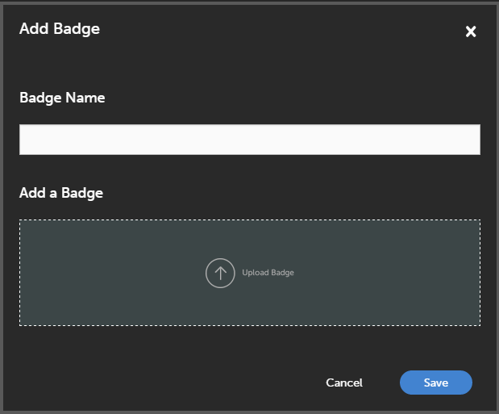

# Badges

Les badges sont une mesure de l’accomplissement que vos collaborateurs peuvent obtenir à l’achèvement d’un cours. Adobe Learning Manager introduit l’un des plus récents concepts d’apprentissage en ligne appelé Badges. Les professionnels à travers le monde utilisent ces badges en tant que représentation de l’acquisition d’une compétence particulière ou de l’achèvement d’un apprentissage.

Vous pouvez définir des badges qui peuvent servir de motivation aux utilisateurs.

Les administrateurs peuvent créer des badges pour les participants comme suit :

1. Connectez-vous en tant qu’administrateur Adobe Learning Manager.
2. Sélectionnez **[!UICONTROL Badges]** dans le volet de gauche. Une liste de badges d’élève s’affiche.

   >[!NOTE]
   >
   >Par défaut, une liste de quelques exemples de badges est disponible.

3. Sélectionnez **[!UICONTROL Ajouter]** dans le coin supérieur droit de la page. La boîte de dialogue **[!UICONTROL Ajouter un badge]** s&#39;affiche.

   

   *Ajouter un nom de badge et son image*

4. Tapez le **[!UICONTROL Nom du badge]**. Téléchargez le badge en cliquant sur **[!UICONTROL Télécharger un badge]** puis cliquez sur **[!UICONTROL Enregistrer]**.

>[!NOTE]
>
>Contactez l’équipe d’assistance Adobe Learning Manager à l’adresse [learningmanagersupport@adobe.com](mailto:learningmanagersupport@adobe.com) pour ajouter des badges ou des certificats personnalisés pour les élèves à la fin des cours ou des parcours d’apprentissage.

