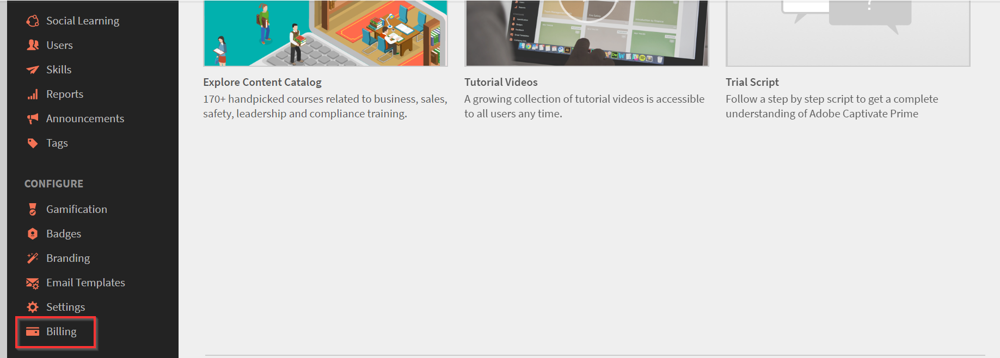
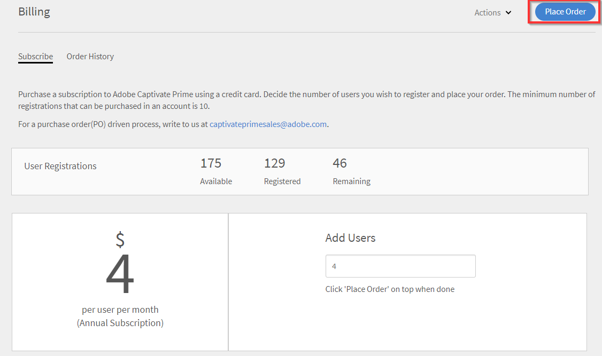

# Gérer les commandes et la facturation Learning Manager

L’achat par carte de crédit est uniquement disponible dans la [région États-Unis](http://learningmanager.adobe.com/).

Gérez la facturation Learning Manager, passez des commandes en utilisant une carte de crédit, abonnez-vous en utilisant un bon de commande, ou via un abonnement d’utilisateurs actifs mensuels.

Adobe Learning Manager possède un modèle de tarification souple et conviviale, considéré comme l&#39;un des meilleurs modèles de tarification pour répondre aux besoins de votre organisation. Pour plus d&#39;informations, consultez la page [Learning Manager](https://www.adobe.com/products/learningmanager.html).

Seuls les administrateurs de votre organisation peuvent gérer la facturation.

Si vous souhaitez contacter Adobe pour obtenir plus d’informations sur l’abonnement Learning Manager et la facturation, écrivez-nous à l’adresse suivante : [learningmanagersales@adobe.com](mailto:learningmanagersales@adobe.com).

## Page Facturation

Pour accéder à la page Facturation, connectez-vous à Adobe Learning Manager en tant qu&#39;administrateur et sélectionnez **[!UICONTROL Facturation]** dans le volet de navigation de gauche.

La page Facturation contient les onglets suivants :

| Tabulation | Objectif |
|---|---|
| **Abonnement** | Affichez les détails du compte, les droits de licence et la consommation de places. Gérer l’activation de la formule. |
| **Historique des commandes** | Vérifiez les commandes passées sur le compte. |

### Onglet Abonnement

**Détails du compte**

La carte **Détails du compte** en haut de l&#39;onglet **Abonnement** affiche quatre identificateurs en lecture seule pour votre compte.

| Champ | Description |
|---|---|
| **ECCID** | Numéro de référence Adobe pour votre compte. Citez ce message lorsque vous contactez l’assistance technique de l’Adobe. |
| **ID de compte** | Votre identifiant de compte Adobe Learning Manager unique. |
| **Nom du compte** | Nom d’affichage de votre compte Adobe Learning Manager. |
| **ID d’organisation IMS** | Organisation Adobe Admin Console liée à ce compte. Vide si pas encore lié. |

**Licences**

La section **Licences** répertorie chaque licence ou droit actif sur le compte. Chaque bloc indique le nom de la licence, une description du forfait, le cas échéant, et une ligne de statistiques indiquant les chiffres de consommation pour la période du contrat en cours.

Les colonnes des lignes de statistiques varient selon le type de licence :

| Type de licence | Colonnes affichées |
|---|---|
| Licence payante (par exemple, Adobe Learning Manager Ultimate) | Acheté / Utilisé / Utilisé par des comptes de pairs / Restant |
| Licence d’évaluation (par exemple, Virtual Coach) | Disponible / Utilisé / Restant |

Sélectionnez **[!UICONTROL Afficher les détails d&#39;utilisation]** sous la ligne de statistiques pour développer une répartition intégrée. La section développée affiche :

- Une liste déroulante **Sélectionner la période** pour filtrer par période de contrat, y compris les périodes historiques
- Une table **Utilisation globale** avec des colonnes : Acheté / Utilisé par ce compte / Utilisé par des comptes de pairs / Restant
- Un lien **Afficher la répartition du compte** pour voir l&#39;utilisation répartie entre les différents comptes de pairs
- Lien **Télécharger le rapport détaillé** pour exporter les données d&#39;utilisation sous forme de fichier

**Bloc de licence Agent Orchestrator**

Lorsqu&#39;une licence Agent Orchestrator est liée, la ligne d&#39;état affiche :

| Colonne | Description |
|---|---|
| **Acheté** | Total des crédits Gen AI achetés pour la période du contrat. |
| **Utilisé** | Crédits consommés dans tous les services utilisant cette licence. |
| **Utilisé par ALM** | Crédits consommés spécifiquement par Adobe Learning Manager. |
| **Restant** | Crédits toujours disponibles. |

Si votre organisation utilise des comptes parents et enfants, la section **Licences** du compte parent affiche une colonne **Utilisé par les comptes de pairs** reflétant la consommation de crédit sur tous les comptes enfants liés. Les comptes enfants affichent leur attribution en tant que **places approuvées** plutôt qu&#39;achetées.

## Lier votre compte Adobe Learning Manager à Adobe Admin Console

Pour que les fonctionnalités d’IA de génération puissent être activées, votre compte Adobe Learning Manager doit être connecté à une organisation Adobe Admin Console. Une fois lié, Adobe Learning Manager détecte la licence Agent Orchestrator et rend l&#39;onglet **Crédits** disponible.

La liaison est établie automatiquement lorsque votre compte a été acheté via le processus de commande standard d’Adobe ou lorsque vous avez activé votre compte à l’aide d’une clé d’activation. Vous pouvez vérifier le lien dans l&#39;onglet **Abonnement**. Si le champ **ID d&#39;organisation IMS** dans **Détails du compte** est renseigné, le compte est déjà lié.

### Lier votre compte manuellement

Si votre compte a été configuré indépendamment et que le champ **ID d&#39;organisation IMS** est vide, créez un lien manuellement.

**Conditions préalables :**
- Vous devez être administrateur du compte Adobe Learning Manager.
- Vous devez détenir le rôle d’administrateur système dans l’organisation Adobe Admin Console que vous souhaitez lier.
- L&#39;organisation Adobe Admin Console doit disposer d&#39;une licence Agent Orchestrator active.

1. Sélectionnez **[!UICONTROL Facturation]**, puis sélectionnez l&#39;onglet **[!UICONTROL Abonnement]**.
2. Dans la carte **Détails du compte**, sélectionnez **[!UICONTROL Lier l’organisation IMS]**.
3. Une fenêtre de connexion s’ouvre. Saisissez les informations d’identification de votre compte Adobe et sélectionnez votre organisation dans la liste. Adobe Learning Manager confirme que le compte qui se connecte possède le rôle d’administrateur système dans l’organisation Adobe Admin Console et que le même compte possède le rôle d’administrateur dans Adobe Learning Manager.
4. Si les deux vérifications réussissent, le lien est établi. Le champ **ID d&#39;organisation IMS** est mis à jour avec l&#39;identifiant de votre organisation et le solde de crédit apparaît dans la section **Licences**.
5. Si l’une des vérifications échoue, un message d’erreur s’affiche. Confirmez les conditions préalables ci-dessus et réessayez.

### Dissocier votre compte

Après la dissociation, les fonctionnalités Gen AI sont désactivées pour tous les élèves et l&#39;onglet **Crédits** n&#39;est pas disponible tant que le compte n&#39;est pas à nouveau lié.

1. Sélectionnez **[!UICONTROL Facturation]**, puis sélectionnez l&#39;onglet **[!UICONTROL Abonnement]**.
2. Dans la carte **Détails du compte**, sélectionnez **[!UICONTROL Dissocier l’organisation IMS]**.
3. Connectez-vous à nouveau pour confirmer votre rôle d’administrateur dans l’organisation.
4. Le lien est supprimé. Le champ **ID d&#39;organisation IMS** revient vide et l&#39;onglet **Crédits** est masqué.

Pour restaurer l’accès, répétez les étapes de liaison manuelle ci-dessus.

## Passer des commandes à l’aide de cartes de crédit {#placeordersusingcreditcards}

Vous pouvez acheter un abonnement pour un maximum de 3 500 élèves par commande en payant par carte de crédit. La première commande du compte doit être effectuée pour un minimum de 10 élèves.

1. Dans l’application Administrateur, cliquez sur **[!UICONTROL Facturation]** dans le volet de navigation de gauche.

   

   *Lancer la facturation Adobe Learning Manager*

1. Sur la page **[!UICONTROL Informations de facturation]**, ajoutez le nombre d&#39;utilisateurs dans le champ **[!UICONTROL Ajouter des utilisateurs]**. Lorsque vous utilisez une carte de crédit pour des abonnements prépayés, vous pouvez voir le nombre d’utilisateurs que vous pouvez ajouter pour l’abonnement Le nombre d’utilisateurs que vous pouvez ajouter ne doit pas dépasser le nombre mentionné dans la section Reste.1.

   

   *Ajouter un nombre d’utilisateurs*

1. Après avoir spécifié le nombre d’utilisateurs à ajouter, cliquez sur Passer une commande dans le coin supérieur droit de la page.

   

1. Vérifiez le devis qui s’affiche sur l’écran de l’ordinateur.

   

   *Passer une commande*

   Le montant de l’abonnement annuel est calculé en fonction du nombre d’utilisateurs qui sont ajoutés à l’abonnement. Par exemple, si quatre utilisateurs sont ajoutés, les frais annuels sont calculés en utilisant l’expression 4 utilisateursX$4X$12, ce qui donne 192 $.

   Cliquez sur **[!UICONTROL Continuer]**.

   *Vérifier l&#39;estimation*

1. Sur la page Détails de paiement, le prix estimé de votre commande s’affiche. La devise s’affiche en fonction de la langue actuelle.

   

   *Afficher les détails de paiement*

   Vous pouvez également modifier les paramètres régionaux en sélectionnant le pays dans la liste déroulante.

   

   *Sélectionner le pays de facturation*

1. Saisissez vos coordonnées, sélectionnez le type de carte de crédit et saisissez les détails de votre carte de crédit. Après avoir entré les détails requis, cliquez sur **[!UICONTROL Terminer la commande]**.
1. Après avoir passé commande, pour voir les packs récemment commandés, cliquez sur l&#39;onglet **[!UICONTROL Historique des commandes]** sur la page **[!UICONTROL Facturation]**.

   

   *Afficher l&#39;historique des commandes*

## Vérifier l’état de la commande {#checkorderstatus}

Toutes les commandes peuvent avoir l’un des quatre états suivants :

**Actif :** une commande est active et les utilisateurs sont enregistrés correctement.

**Suspendu :** une commande passe à l&#39;état suspendu dans les scénarios suivants :

- Retard dans la réception du paiement par carte de crédit
- Expiration de la carte de crédit.
- Paiement refusé pour n’importe quel cycle de paiement récurrent.

**Annulation initiée :** l’annulation d’une commande est initiée en cas de désactivation du compte par l’administrateur de Learning Manager. L’état de la commande passe à Annulé après réception de la confirmation d’annulation de commande.

## Mettre à jour les détails de l’abonnement {#updatesubscriptiondetails}

1. Dans la liste des commandes, cliquez sur **[!UICONTROL Modifier]**.

   

   *Mettre à jour les détails de l&#39;abonnement*

1. Dans la page Détails de l’abonnement, cliquez sur **[!UICONTROL Modifier l’abonnement]**.
1. Sélectionnez l’élément que vous voulez modifier :

   - Mode de paiement : utilisez cette option pour mettre à jour les détails de paiement, tels que les données de carte bancaire.
   - Adresse : utilisez cette option pour mettre à jour les détails de l’adresse.

## Annuler un abonnement {#cancelasubscription}

Pour annuler une commande :

1. Dans le volet gauche de la page Administrateur, cliquez sur Facturation.
1. Dans la page Facturation, dans le coin supérieur droit, sélectionnez **[!UICONTROL Actions]** > **[!UICONTROL Désactiver le compte]**.
1. Une fois que l’administrateur a désactivé le compte, toutes les commandes existantes dans le compte sont annulées à partir du cycle de facturation suivant.

Lorsqu’un compte est désactivé par le client, il entre dans un état d’essai pendant les 30 jours suivants. Le titulaire du compte reçoit trois courriers électroniques de rappel pour réactiver le compte. Si le propriétaire ne réactive pas le compte, aucun des utilisateurs ne peut accéder à Learning Manager à part lui.

## Passer des commandes à l’aide d’un bon de commande {#placeordersusingpurchaseorder}

Vous pouvez sélectionner le traitement par bon de commande comme moyen de paiement alternatif. Comme condition préalable, le compte de votre organisation doit être enregistré auprès d’Adobe. Votre compte d’entreprise est facturé au moment du traitement. Le compte est facturé en fonction des activités d’un élève. Seules les activités au niveau de l’objet d’apprentissage sont facturées. Pour passer une commande à l’aide d’un bon de commande :

1. Envoyez un courrier électronique à [learningmanagersales@adobe.com](mailto:learningmanagersales@adobe.com) en mentionnant le nombre d’abonnements d’élève requis.
1. Vous recevrez une clé d’activation de la part de l’équipe de Learning Manager.
1. Dans la page Facturation de l’application Administrateur, saisissez la clé d’activation.
1. Cliquez sur Activer dans le coin supérieur droit de la page.

## Vérifier l’état du compte {#checkaccountstatus}

Après l’activation d’un compte, celui-ci peut se trouver dans l’un des états suivants :

- **Version d’évaluation** : vous pouvez créer un compte Adobe Learning Manager et l’utiliser sans aucun paiement pendant une période de 30 jours. Le nombre d’élèves enregistrés n’est pas limité pendant la période d’essai.
- **Actif** : dans cet état, le compte comporte des abonnements d&#39;élève actifs avec un paiement mensuel récurrent conformément à la commande d&#39;abonnement.
- **Inactif** : un compte passe à l’état inactif dans les scénarios suivants :

  - Après la période d’essai, s’il n’y a aucune commande d’abonnement active pour le compte.
  - L’administrateur désactive le compte, ce qui entraîne l’annulation de toutes les commandes existantes dans un compte à partir du prochain cycle de facturation de l’abonnement.
  - Le paiement est refusé pour des commandes actives d’un compte, même après rappels.

L’état Inactif ne provoque pas immédiatement l’annulation du compte. Vous recevez au moins deux rappels de la part de l’équipe Learning Manager vous demandant de fournir les dernières informations concernant votre carte de crédit si elle a expiré. Dans un état inactif, seul un administrateur peut se connecter au compte Adobe Learning Manager. Aucun autre utilisateur ne peut accéder au compte.

- **Activation requise** : votre compte passe dans cet état lorsque l’administrateur de Learning Manager choisit de désactiver le compte. Toutes les commandes de ce compte sont annulées. L’encaissement de ces commandes n’est pas effectué à partir du prochain cycle de facturation. L’état du compte ne change pas jusqu’au jour du dernier cycle de facturation. Dans ce cas, tous les utilisateurs peuvent continuer à utiliser l’application sans incidence jusqu’à la date de fin du dernier paiement récurrent.

## Annuler un abonnement {#Cancelasubscription-1}

Pour annuler un abonnement actif, contactez l’équipe d’assistance Learning Manager.

## Frais de résiliation de compte {#accountterminationfee}

Si vous souhaitez annuler l’abonnement avant la fin du terme annuel, des frais de résiliation anticipée sont facturés. Les frais de résiliation équivalent à 50 % du prix de l’abonnement de la période d’engagement restante.

## Plan d’utilisateurs actifs mensuels {#monthlyactiveusersmauplan}

Vous pouvez choisir le plan d’utilisateurs actifs mensuels comme méthode de facturation préférée. Cette option génère la facturation en fonction du nombre d’utilisateurs actifs uniques mensuels. Les utilisateurs actifs uniques mensuels sont ajoutés de manière cumulative pendant une période de 12 mois à partir du mois de l’activation du plan. Ce nombre est utilisé pour la facturation de cette période.

Utilisez l’exemple suivant pour comprendre comment le plan d’utilisateurs actifs mensuels est calculé.

Imaginez un scénario dans lequel le nombre d’utilisateurs par mois est comme suit :

- Mois 1 = 50
- Mois 2 = 500
- Mois 3 = 5 000
- Mois 4 à 12 = 10

Nombre total d’utilisateurs actifs mensuels qui sont facturés = Mois 1 + Mois 2 + Mois 3 + Mois 4 à 12 = 50 + 500 + 5 000 + 90 = 5 640.

La facturation pour la période concernerait 5 640 utilisateurs.

Au terme de la période de 12 mois, le nombre d’utilisations est remis à zéro et une nouvelle période du plan d’utilisateurs actifs mensuels commence. Vous pouvez ajouter plusieurs clés d’activation pour augmenter le nombre de licences achetées.

Tout utilisateur qui effectue les actions suivantes ou atteint ses objectifs suite à des actions prises par d’autres est considéré comme un utilisateur actif unique mensuel pour ce mois calendaire.

- Consommation d’un cours, d’un programme d’apprentissage ou d’une certification.
- Consommation, téléchargement d’une assistance à la tâche ou de pièces jointes à un cours.
- Consommation, téléchargement ou création de notes personnelles.
- Participation à l’apprentissage par les réseaux sociaux en créant des forums, des messages ou des commentaires.
- Atteinte des objectifs en raison de l’approbation de la présentation d’un certificat externe ou de la participation à une classe ou à des séances virtuelles en salle de classe.

## Afficher les informations d’utilisation {#viewusagedetails}

1. Pour afficher le nombre d’utilisateurs actifs par mois, cliquez sur **[!UICONTROL Afficher les informations d’utilisation]**.

   

   *Afficher les utilisateurs actifs par mois*

1. Sur la page qui s’affiche, vous pouvez voir ce qui suit :

   - **Utilisation globale :** vous pouvez vérifier le nombre total d’utilisateurs actifs, le nombre d’utilisateurs qui consomment Learning Manager au cours d’un mois et le nombre d’utilisateurs qui ne se sont pas encore inscrits à un cours.
   - **Utilisation mensuelle :** vous pouvez voir un tableau des utilisateurs actifs uniques par mois.

## Télécharger le rapport d’utilisation {#downloadusagereport}

Vous pouvez également télécharger les données concernant le nombre d’utilisateurs actifs par mois et par année. Pour effectuer le téléchargement, cliquez sur **[!UICONTROL Télécharger le rapport détaillé]**.

Dans la boîte de dialogue **Générer une demande de rapport**, saisissez les mois et l’année requis, puis cliquez sur **[!UICONTROL Générer]**.

*Télécharger le rapport d&#39;utilisation active*

Si vous fermez la fenêtre du navigateur, le téléchargement démarrera la prochaine fois que vous vous connecterez à Learning Manager.

Les rapports sont enregistrés dans le dossier Téléchargements de votre navigateur.

## Annuler un abonnement

Pour annuler un abonnement actif, contactez l’équipe d’assistance Learning Manager.

<!--
## Gen AI credits {#genaicredits}

### How Gen AI credits work

Gen AI credits are consumed each time a learner interacts with an AI-powered feature — for example, when asking a question through the AI Assistant or generating a personalized learning recommendation. Before each interaction begins, Adobe Learning Manager checks that credits are available. If credits are available, the interaction proceeds. If the balance has been exhausted, the learner sees a message that the feature is temporarily unavailable.

Credits are purchased as part of an Adobe Experience Platform Agent Orchestrator license. That license is managed in your Adobe Admin Console, and Adobe Learning Manager connects to it automatically to detect available credits.

**Credit priority rule:** If your Adobe Learning Manager plan includes bundled Gen AI credits and you also have an Agent Orchestrator license, the bundled credits are consumed first. Agent Orchestrator credits are used only after the bundled credits are exhausted.

**Shared credit pools:** If your organization has multiple Adobe Learning Manager accounts all linked to the same Adobe Admin Console organization, all accounts draw from a single shared credit pool.

>[!IMPORTANT]
>
>All Gen AI features are turned off by default. You must enable each feature and set a credit usage limit before learners can access it.

### Access the Gen AI Credits tab

1. Select **[!UICONTROL Admin]** > **[!UICONTROL Billing]**.
2. Select the **[!UICONTROL Credits]** tab.

The **Credits** tab is visible only when Gen AI credits have been purchased or were historically active on the account. If the tab is not visible, verify that your account is linked to an Adobe Admin Console organization that has an active Agent Orchestrator license.

### Gen AI Features table

The **Gen AI Features** table lists every AI feature available on the account.

| Column | Description |
|---|---|
| **Feature Name** | Name of the AI feature. Select the name to go to that feature's settings page. |
| **Status** | Whether the feature is on or off. Toggle the feature from its settings page. |
| **Max Credits Usage Limit** | Maximum credits this feature can consume during the contract period. Must be set before the feature can be enabled. Applies to learner-facing features only. |
| **Credits Used** | Total credits consumed by this feature since the contract start date, updated in real time. |

### Enable a Gen AI feature

1. On the **[!UICONTROL Credits]** tab, locate the feature in the **Gen AI Features** table.
2. In the **Max Credits Usage Limit** column, enter the maximum number of credits this feature can consume during the contract period.
3. Select the feature name to go to its **Feature Settings** page.
4. On the **Feature Settings** page, toggle the feature on.
5. Complete any additional configuration, such as assigning learners and catalogs to the AI Assistant.

### What happens when credits run out

- If a feature reaches its **Max Credits Usage Limit**, learners see a message that the feature is temporarily unavailable. Raise the limit at any time from the **Credits** tab.
- If overall account credits are exhausted, all Gen AI features stop working for learners until additional credits are purchased. Usage reports and credit metrics remain accessible to admins.
- If a learner is mid-interaction when credits are exhausted, that interaction completes. All subsequent interactions are blocked.
- Admins can set a credit limit higher than the number of purchased credits. Over-allocation is permitted, and a true-up can happen at renewal.

### Monthly Credits Usage chart

Below the Gen AI Features table, a **Monthly Credits Usage** chart shows credits consumed per feature per month. By default, the chart shows the current contract year period based on the Agent Orchestrator contract start date. Select **[!UICONTROL Download]** to export the monthly report for the selected period. Report generation is asynchronous — you receive an in-app notification and email when the file is ready.

### Gen AI usage reports

Adobe Learning Manager provides two Gen AI usage reports under **[!UICONTROL Reports]** > **[!UICONTROL AI Reports]**.

**Monthly credits usage report**

Shows credits consumed per feature per month. Useful for budget planning and contract renewal.

- **Columns:** Month | Feature | Credits Used
- **Filter:** Select a date range spanning one or more contract periods
- **Download:** Asynchronous — you receive an in-app notification and email when the file is ready

**Learner Gen AI credits usage report**

An audit trail showing which learners used which features and how many credits each interaction consumed.

- **Columns:** Date | Learner Name | Learner Email | Feature | Credits Used
- **Filter:** Select the date range you want to audit
- **Download:** Asynchronous — you receive an in-app notification and email when the file is ready

### Credit usage alerts

Adobe Learning Manager automatically notifies you when credit consumption crosses key thresholds. Notifications are delivered both in-app and by email.

| Trigger | Notification |
|---|---|
| Account credits reach 90% of total purchased | Warning — credits are nearly exhausted at the account level |
| Account credits reach 100% of total purchased | Alert — all credits are consumed and Gen AI features stop for learners |
| A feature reaches its individual Max Credits Usage Limit | Alert — names the specific feature; that feature stops for learners |

When you receive a 90% warning, contact your Adobe account team to purchase additional credits before the 100% threshold is reached.
-->

## Forum aux questions {#frequentlyaskedquestions}

**Comment ajouter/supprimer des abonnements d’un compte ?**

Pour ajouter des abonnements dans un compte, ajoutez le nombre d’utilisateurs pour lesquels vous souhaitez acheter des abonnements. Puis, dans le coin supérieur droit, cliquez sur **[!UICONTROL Passer une commande]**. Vérifiez le devis, puis cliquez sur **[!UICONTROL Continuer]**. Saisissez les détails de votre compte et de votre carte bancaire. Pour acheter les abonnements, cliquez sur **[!UICONTROL Terminer la commande]**.

Pour supprimer un abonnement actif, contactez l’équipe d’assistance Learning Manager.

**Comment modifier une carte bancaire pour les abonnements ?**

Dans l&#39;onglet **[!UICONTROL Historique des commandes]**, pour un compte actif, cliquez sur **[!UICONTROL Modifier]**. Puis, dans la page Détails de l’abonnement, cliquez sur **[!UICONTROL Modifier l’abonnement]**. Entrez les nouvelles informations de votre carte bancaire, puis cliquez sur **[!UICONTROL Mettre à jour le mode de paiement]**.

*Afficher les détails de la carte de crédit*

**Comment mettre à jour les informations de facturation dans Learning Manager ?**

Pour mettre à jour les informations de facturation, procédez comme suit :

1. Connectez-vous en tant qu&#39;**administrateur** et cliquez sur **[!UICONTROL Facturation]**.
1. Dans la liste des commandes, cliquez sur **[!UICONTROL Modifier]**.
1. Dans la page Détails de l’abonnement, cliquez sur **[!UICONTROL Modifier l’abonnement]**.

Sélectionnez l’élément que vous voulez modifier :

1. **[!UICONTROL Mode de paiement]:** utilisez cette option pour mettre à jour les détails de paiement, tels que les données de carte de crédit.
1. **[!UICONTROL Adresse]:** Utilisez cette option pour mettre à jour les détails de l&#39;adresse.

**Puis-je annuler partiellement un abonnement ?**

Non, vous ne pouvez pas annuler un abonnement partiellement. Si vous devez réduire le nombre de places que vous avez achetées, vous pouvez annuler l’abonnement à la fin du cycle de facturation, puis acheter le nombre de places requises.

**Comment obtenir une facture pour les paiements par carte de crédit ?**

Contactez [FastSpring](https://fastspring.com/) pour obtenir une facture pour vos paiements, en utilisant l’une des méthodes suivantes :

- Créez une demande de service avec FastSpring en utilisant le lien `https://questionacharge.com`.
- Envoyez un e-mail à FastSpring le `orders@fastspring.com` pour lui demander la facture.

## Résolution des problèmes de crédit liés à l’IA générale

| Problème | Solution |
|---|---|
| L&#39;onglet **Crédits n&#39;est pas visible** | Les crédits IA de génération n’ont pas été achetés ou appliqués à ce compte. Vérifiez votre licence Agent Orchestrator dans votre Adobe Admin Console, puis confirmez qu&#39;une organisation est liée sous **[!UICONTROL Facturation]** > **[!UICONTROL Abonnement]** > **Détails du compte**. |
| **Le champ ID d’organisation IMS est vide** | Votre compte n’est pas encore lié. Sélectionnez **[!UICONTROL Lier l’organisation IMS]** dans la carte **Détails du compte** et suivez les étapes de liaison ci-dessus. |
| **La liaison échoue avec une erreur** | Vérifiez que vous disposez du rôle Administrateur à la fois dans Adobe Learning Manager et dans l’organisation Adobe Admin Console que vous essayez de lier. Les deux vérifications doivent réussir pour que le lien soit établi. |
| **Le champ ID d’organisation IMS est vide après l’application d’une clé d’activation** | La liaison automatique ne se produit que pour les comptes activés via le flux de commande standard d&#39;Adobe. Pour des comptes configurés indépendamment, effectuez les étapes de liaison manuelle ci-dessus après avoir activé la clé. |
| **Après la dissociation, les fonctionnalités Gen AI ne sont plus disponibles** | La dissociation supprime l’accès à toutes les fonctionnalités d’IA de génération et masque l’onglet Crédits. Rétablissez les liens de votre compte avec une organisation Adobe Admin Console disposant d&#39;une licence Agent Orchestrator active pour restaurer l&#39;accès. |

<!-- 
# Manage Learning Manager orders and billing

Credit card-based purchase is only available in the [US region](http://learningmanager.adobe.com/).

Manage Learning Manager billing, place orders by using a credit card, subscribe using a Purchase Order, or via a Monthly Active Users plan.

Adobe Learning Manager has a flexible, customer-friendly, and one of the best pricing models to cater to your organization needs. For more information, see the [Learning Manager](https://www.adobe.com/products/learningmanager.html) page.

Only the Administrators of your organization can manage billing.

If you want to contact Adobe for more information about Learning Manager subscription and billing, write to us at [learningmanagersales@adobe.com](mailto:learningmanagersales@adobe.com).

## Place orders using credit cards {#placeordersusingcreditcards}

You can buy a subscription for a maximum of 3500 learners through any single credit card payment order. The first order in the account must be for a minimum of 10 learners.

1. On the Administrator app, click **[!UICONTROL Billing]** on the left navigation pane.

   

   *Launch Adobe Learning Manager billing*

1. On the **[!UICONTROL Billing Information]** page, add the number of users in the **[!UICONTROL Add Users]** field. When using a credit card for pre-paid subscriptions, you can see the number of users that you can add for the subscription. The number of users you can add must not exceed the number mentioned in the section Remaining.1. 

   

   *Add number of users*

1. After specifying the number of users to add, click Place Order in the upper-right corner of the page.

   

1. Review the estimate that appears on the screen.

   

   *Place an order*

   The annual subscription fee is calculated based on the number of users who are added for the subscription. For example, if four users are being added, the annual fee is calculated using the expression 4 usersX$4X$12, which returns $192.

   Click **[!UICONTROL Proceed]**.

   *Review the estimate*

1. On the Payment Details page, you can view the estimated price of the order. The currency appears based on the current locale.

   

   *View payment details*

   You can also change the locale by choosing the country from the drop-down list.

   

   *Select the country of billing*

1. Enter your contact information, choose the credit card type, and provide the details of the credit card. After you've entered the required details, click **[!UICONTROL Complete Order]**.
1. After you've placed the order, to see the recently ordered packages, click the **[!UICONTROL Order History]** tab on the **[!UICONTROL Billing]** page.

   

   *View order history*

## Check order status {#checkorderstatus}

All orders can have one of the four statuses:

**Active:** An order is active, and users are registered successfully.

**Suspended:** An order moves into suspended state in the following scenarios:

* Delay in receipt of payment from the credit card
* Expiry of the credit card.
* Payment is declined for any recurring payment cycle.

**Canceled initiated:** An order moves into this state when the Learning Manager Administrator deactivates the account. The order then moves into a canceled state after receiving the cancellation confirmation of the order.

## Update subscription details {#updatesubscriptiondetails}

1. In the list of orders, click **[!UICONTROL Edit]**.

   

   *Update subscription details*

1. In the Subscription details page, click **[!UICONTROL Edit Subscription]**.
1. Choose the item that you want to edit:

   * Payment method: Use this option to update payment details, such as, credit card.
   * Address: Use this option to update address details.

## Cancel a subscription {#cancelasubscription}

To cancel an order:

1. In the left pane of the Administrator page, click Billing.
1. In the Billing page, on the upper-right corner, choose **[!UICONTROL Actions]** > **[!UICONTROL Deactivate Account]**.
1. Once the Administrator deactivates the account, all existing orders in the account are canceled from the next billing cycle.

When an account is deactivated by the customer, it enters a trial state for the next 30 days. The account owner receives three reminder emails to revive the account. If the owner does not reactivate the account, none of the users are able to access Learning Manager apart from the owner.

## Place orders using Purchase Order {#placeordersusingpurchaseorder}

You can choose purchase order process as an alternative mode of payment. As a pre-requisite, your organization's account must be registered with Adobe. Your organization account is charged for this process. The account is charged based on a learner's activities. Only Learning Object-level activities are charged. To place an order using PO:

1. Send an email to [learningmanagersales@adobe.com](mailto:learningmanagersales@adobe.com) and mention the number of required learners.
1. The Learning Manager team sends you an activation key.
1. In the Billing page of the Administrator app, enter the activation key.
1. Click Activate in the upper-right corner of the page.

## Check account status {#checkaccountstatus}

After an account gets activated, the account can be in any of the following states:

* **Trial** - You can create an Adobe Learning Manager account and use it without any payment for a period of 30 days. There is no limit on the number of learners registered during the trial period.
* **Active** - In this state, the account has active learner subscriptions with recurring monthly payment as per the subscription order.
* **Inactive** - An account moves into inactive state in the following scenarios:

  * After the trial period if there are no active subscription orders in the account.
  * Administrator deactivates the account, which results in canceling all the existing orders in an account from the next billing cycle of subscription.
  * Payment is declined for active orders in an account even after reminders.

An inactive state does not cancel your account with immediate effect. You receive at least a couple of reminders from the Learning Manager team asking you to provide the latest information about

your credit card if it has expired. In an inactive state, only an administrator can log in to the Captivate

Learning Manager account. All other users cannot access the account.

* **Activation required** - Your account moves into this state when the Learning Manager administrator chooses to deactivate the account. All the orders of this account get canceled. The collection of payment for these orders does not happen from the next billing cycle. The status of the account remains in this state until the day of the last billing cycle. In this state, all users can continue to use the application without any impact until the end of the last recurring payment date.

## Cancel a subscription {#Cancelasubscription-1}

To cancel an active subscription, contact the Learning Manager support team.

## Account termination fee {#accountterminationfee}

If you want to cancel the subscription before the completion of the annual term, an early termination fee is charged. The termination fee is equivalent to 50% of the subscription price of the remaining commitment period.

## Monthly Active Users (MAU) plan {#monthlyactiveusersmauplan}

You can choose a MAU plan as your preferred way of billing. This option generates billing based on the number of monthly unique active users. The monthly unique active users are added cumulatively for a period of 12 months starting from the month of plan activation. This number is used for billing for the period.

Use the following example to understand how MAU is calculated.

Let there be a case where the number of users per month are as follows:

* Month 1 = 50
* Month 2 = 500
* Month 3 = 5000
* Month 4 to 12 = 10

Total Monthly Active Users that are billed = Month 1 + Month 2 + Month 3 + Month 4 to 12 = 50 + 500 + 5000 + 90 = 5640.

The billing for the period would be for 5640 users.

At the end of the 12-month period, the usage count is reset back to zero and a new period for MAU plan starts. You can add multiple activation keys to increase the purchased number of seats.

Any user who performs the following actions or achieves completions due to actions taken by others is considered as a monthly unique active user for that calendar month.

* Consuming a course, learning program or certification.
* Consuming, downloading a Job Aid or course attachments.
* Consuming, downloading or creating personal notes.
* Participating in Social Learning by creating Boards, posts or comments.
* Achieving completions due to External Certificate submission approvals or attendance for a classroom/virtual classroom sessions.

## View usage details {#viewusagedetails}

1. To view the number of active users by month, click **[!UICONTROL View Usage Details]**.

   

   *View active users by month*

1. On the page that displays, you can view the following:

   * **Overall usage:** You can check the total number of active users, users who are consuming Learning Manager in a month, and the number of users who have not yet signed up for any course.

   * **Monthly usage:** You can see a table of unique active users per month.

## Download usage report {#downloadusagereport}

You can also download the data of the number of active users by month and year. To download, click **[!UICONTROL Download Detailed Report]**.

On the **Generate Report Request** dialog, enter the required months and year, and click **[!UICONTROL Generate]**.

*Download active usage report*

If you close the browser window, the download starts the next time you visit Learning Manager.

The reports are saved in the Downloads folder of your browser.

## Cancel a subscription

To cancel an active subscription, contact the Learning Manager support team.

## Frequently Asked Questions {#frequentlyaskedquestions}

+++How to add/remove subscriptions from an account?

To add subscriptions in an account, add the number of users for who you'd like to purchase subscriptions. Then on the upper-right corner, click **[!UICONTROL Place Order]**. Review the estimate and click **[!UICONTROL Proceed]**. Enter your account details and also your credit card details. Then to purchase the subscriptions, click **[!UICONTROL Complete Order]**.

To remove an active subscription, contact the Learning Manager support team.
+++

+++How to change a credit card for subscriptions?

In the **[!UICONTROL Order History]** tab, for an active account, click **[!UICONTROL Edit]**. Then on the Subscription Details page, click **[!UICONTROL Edit Subscription]**. Enter your new credit card details and click **[!UICONTROL Update Payment Method]**.

*View credit card details*
+++

+++How to update the Billing information on Learning Manager?

To update the billing information, follow the steps below:

1. Log in as **Admin** and click **[!UICONTROL Billing]**.
1. In the list of orders, click **[!UICONTROL Edit]**.
1. In the Subscription details page, click **[!UICONTROL Edit Subscription]**.

Choose the item that you want to edit:

1. **[!UICONTROL Payment method]:** Use this option to update payment details, such as, credit card.
1. **[!UICONTROL Address]:** Use this option to update address details.
+++

+++Can I partially cancel a subscription?

No, you cannot cancel a subscription partially. If you need to reduce the number of seats that you have purchased, you can cancel the subscription at the end of the billing cycle and then purchase the number of seats required.
+++

+++How do I get an Invoice for my Credit card payments?

Contact [FastSpring](https://fastspring.com/) to get an invoice for your payments, using one of the following ways:

* Create a service request with FastSpring using the link `https://questionacharge.com`.
* Send an email to FastSpring on `orders@fastspring.com` requesting for the invoice.
-->
