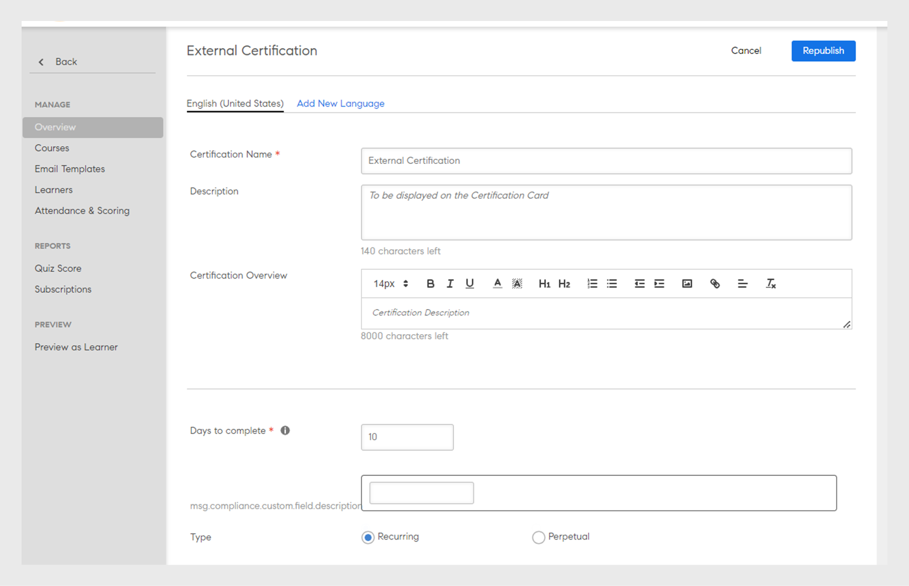

# Certifications

Découvrez comment créer des certifications, inscrire des élèves et modifier des certifications publiées.

Certifiez vos élèves individuellement ou selon un cadre chronologique périodique à l’aide de cette fonction. Seuls les administrateurs peuvent définir les certifications des participants.

En tant qu’administrateur, vous pouvez créer un programme de certification hébergé en interne ou piloté par un tiers. En cas de certification interne, définissez les cours qu’un élève doit terminer pour obtenir la certification. Publiez le programme puis affectez-le aux participants.

## Création d’une certification {#createacertification}

1. Cliquez sur **[!UICONTROL Certification]** dans le volet de gauche.\
   Une page s’affiche avec une liste de tous les brouillons et l’état de publication des certifications.

1. Afficher les certifications dans différents modes :

   1. Cliquez sur **[!UICONTROL Brouillon]** pour afficher toutes les certifications qui sont à l&#39;état de brouillon. Vous devez terminer leur création.
   1. Cliquez sur **[!UICONTROL Publié]** pour afficher toutes les certifications que vous avez publiées.
   1. Cliquez sur **[!UICONTROL Tous]** pour afficher les certifications dans tous les états.
   1. Triez et affichez la liste des certifications par ordre croissant, décroissant ou selon la date à laquelle vous les avez mises à jour.

1. Cliquez sur **[!UICONTROL Ajouter]**.

   Une nouvelle page de certification s’affiche.

*Afficher la page pour ajouter une certification*

1. Ajoutez le nom du certificat, et sa description.

<table>
 <tbody>
  <tr>
   <th>Champ</th>
   <th>Description</th>
  </tr>
  <tr>
   <td>Nombre de jours restants</td>
   <td>L’échéance de la certification. Saisissez une valeur numérique.</td>
  </tr>
  <tr>
   <td>Type</td>
   <td>
    
Le type de certification :

    <ul>
     <li><b>Récurrente</b> : sélectionnez cette option si la certification doit avoir lieu chaque année, tous les deux ans ou tous les trois ans.</li>
     <li><b>Perpétuelle</b> : sélectionnez cette option si la certification ne doit être demandée qu’une fois.</li>
    </ul></td>
  </tr>
  <tr>
   <td>Réaffectation</td>
   <td>Choisissez si vous souhaitez que le certificat soit réaffecté en fonction de la date d’achèvement ou de la date d’inscription. </td>
  </tr>
  <tr>
   <td>Validité (en mois)  </td>
   <td>Indiquez la durée de validité de la certification.</td>
  </tr>
  <tr>
   <td>Séquencement des cours </td>
   <td>Décidez si les élèves doivent suivre les cours de manière ordonnée ou non ordonnée. </td>
  </tr>
  <tr>
   <td>Désinscription </td>
   <td>Activez ou désactivez l’option pour permettre aux élèves de se désinscrire.</td>
  </tr>
  <tr>
   <td>Émetteur de la certification </td>
   <td>
    
Choisir <b>Interne</b> s’il appartient à votre organisation, ou choisissez <b>Externe</b> pour les certifications d’organisations externes.

    
Lorsque vous choisissez <b>Certification externe</b>, deux options supplémentaires s’affichent :

    <ul>
     <li>Identique à la date d’approbation </li>
     <li>Envoyé(e) par l’élève </li>
    </ul>
    
Les élèves peuvent indiquer la date d’achèvement correcte pour les certifications externes. Dans les versions précédentes, la date d'achèvement était définie par défaut par Prime, en fonction de la date d'approbation du responsable. La date d’achèvement indiquée par l’élève doit être ultérieure à la date de création du certificat.
</td>
  </tr>
  <tr>
   <td>Durée</td>
   <td>Si vous avez choisi Certification externe, spécifiez la durée en minutes.</td>
  </tr>
  <tr>
   <td>Balises</td>
   <td>Saisissez les balises que vous souhaitez associer au certificat. Les balises sont utiles lorsque vous souhaitez rechercher le certificat.</td>
  </tr>
  <tr>
   <td>Sélectionner des catalogues </td>
   <td>Choisissez le catalogue du certificat.</td>
  </tr>
 </tbody>
</table>

Sélectionnez le niveau de produits, de rôles et de rôles dans la liste **[!UICONTROL Recommander pour]** pour suggérer ce parcours d’apprentissage aux utilisateurs qui ont exprimé leur intérêt pour ces produits et rôles.

*Recommandation*

Choisir les cours à ajouter à la certification à partir de **[!UICONTROL Cours]** > **[!UICONTROL Catalogue]** onglet.

Passez le curseur de la souris sur chaque vignette de cours, cliquez sur + pour les ajouter à la certification. Cliquez sur **[!UICONTROL Aperçu]** pour afficher le cours en tant qu’élève avant de l’ajouter.

1. Cliquez sur **[!UICONTROL Curriculum]** pour afficher/vérifier la liste des cours que vous avez ajoutés.
1. Cliquez sur **[!UICONTROL Publier]**.

## Mappage d’instance de cours pour les certifications {#courseinstancemappingforcertifications}

Pour mapper le cours et l’instance pour les certifications :

1. Cliquez sur Certifications dans le volet de gauche.
1. Dans la liste des certifications, sélectionnez Afficher la certification pour celle pour laquelle vous souhaitez mapper le cours et l’instance.
1. Dans le volet de gauche, cliquez sur Cours. Les cours pour la certification sont affichés. Cliquez sur Modifier.
1. Placez le pointeur sur le cours pour lequel vous souhaitez définir le mappage d’instance et sélectionnez Mappage d’instance de cours.
1. Dans la fenêtre contextuelle qui s’affiche, sélectionnez l’instance de cours qui doit être fournie pour la certification sélectionnée.
1. Cliquez sur Enregistrer.

Un administrateur peut ajouter des cours de type salle de classe et salle de classe virtuelle à un programme d&#39;apprentissage. Quelle que soit la session donnée par l’auteur lors de la création du cours, elle devient l’instance par défaut. Lorsque l’administrateur ajoute des cours à un programme d’apprentissage, ils sont par défaut mappés à une instance par défaut de tous les types de cours mais l’administrateur peut modifier le mappage de l’instance. Le nombre de cours ajoutés à un programme d’apprentissage est également visible sur la page des instances comme indiqué ci-dessous.

## Activer le contrôle complet du catalogue {#catalog}

À l’instar du [contrôle de catalogue complet pour les apprentissages ou les modules](shared-catalog-full-control.md), vous pouvez également activer le contrôle de catalogue complet pour les certifications.

## Inscrire ou désinscrire des élèves à la certification {#enrollorunenrolllearnerstothecertification}

Pour plus d’informations sur l’inscription des élèves et les étapes à suivre, voir[ Inscription des élèves](courses.md#main-pars_header_1058138132).

## Désinscription des stagiaires {#unenrollmentforlearners}

Lors de la création des certifications, l’administrateur dispose d’une option pour décider si les stagiaires peuvent se désinscrire eux-mêmes de la certification. Si l’administrateur choisit cette option, les stagiaires peuvent se désinscrire eux-mêmes.

*Choisir de désinscrire des élèves*

## Marquer comme terminé {#markcompletion}

Les administrateurs peuvent marquer une certification comme terminée à lֹ’aide de l’option qui leur est proposée. Pour indiquer qu’une certification est terminée, suivez les étapes suivantes.

1. Ouvrir **[!UICONTROL Certification]** > **[!UICONTROL Élèves]**.

   La page Élèves s’ouvre avec la liste des élèves inscrits.

1. Sélectionnez un/plusieurs/tous les élèves et marquez la certification comme terminée à l’aide de la case à cocher disponible pour tous les élèves.
1. Cliquez sur  **[!UICONTROL Action]** > **[!UICONTROL Marquer comme terminé.]**

   Remarque : si une certification comprend plusieurs cours, tous les cours seront marqués comme terminés.

## Cours obligatoires pour la certification externe {#mandatory}

Dans les versions précédentes de Learning Manager, l’achèvement du cours d’un élève en certification externe n’était pas obligatoire pour obtenir un certificat.

Vous pouvez désormais rendre les cours obligatoires en activant l’option **[!UICONTROL Définition des cours obligatoires comme étant obligatoires pour l’obtention de la certification]** dans l’onglet Curriculum lors de la modification de la certification.

## Modification d’une certification publiée {#editingapublishedcertification}

Une certification peut être modifiée par un administrateur à l’état publié. À ce stade, l’administrateur peut modifier toutes les parties d’une certification et les republier.

Pour modifier une certification publiée, cliquez sur la carte de certification, puis sur **[!UICONTROL Modifier]** dans le coin supérieur droit de la page.

Lors de la modification des sections d’une certification, si vous devez vous extraire de la page, vous devez publier de nouveau la certification. Vous recevez une confirmation par l’intermédiaire d’une boîte de dialogue vous demandant de publier de nouveau la certification.

*Modification d’un certificat*

## Inscription {#subscription}

Un administrateur peut récupérer les scores de quiz et les rapports d’état des élèves. Il peut définir la fréquence des rapports, l’objet des courriers électroniques et l’identifiant de messagerie électronique des destinataires. Selon la fréquence définie, le destinataire recevra un courrier électronique avec le rapport en pièce jointe.

*Définition de la fréquence des rapports et d’autres propriétés*
