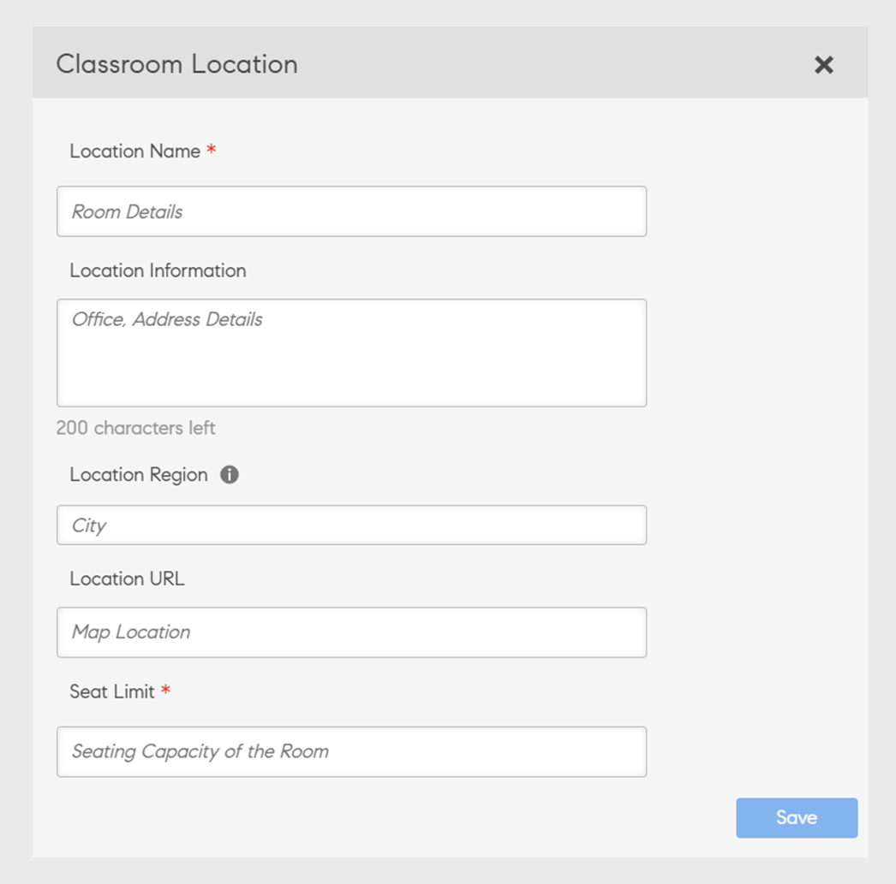

# Salle de classe

## Présentation

Les administrateurs peuvent désormais configurer une bibliothèque d’emplacements de salle de classe. Pour chaque emplacement de salle de classe, les administrateurs peuvent définir les métadonnées qui incluent le nom de l’emplacement, la limite de places ainsi que des informations supplémentaires telles que l’URL de l’emplacement. Les auteurs et les administrateurs peuvent ensuite utiliser ces emplacements de salle de classe préconfigurés pour configurer des événements de formation dirigée par un instructeur (modules de salle de classe).

Vous pouvez utiliser les deux méthodes suivantes pour ajouter un emplacement de salle de classe.

## Ajout de salles de classe à l’aide de l’interface utilisateur

Vous pouvez ajouter un emplacement de salle de classe en utilisant l’interface utilisateur :

1. Dans l’application Administration (interface utilisateur des rôles d’administrateur), cliquez sur **[!UICONTROL Paramètres]** > **[!UICONTROL Lieux de salle de classe]**.

1. Cliquez sur le bouton **[!UICONTROL Ajouter]** bouton.

1. Dans le panneau **[!UICONTROL Lieu de la salle de classe]** dans la boîte de dialogue, entrez les informations suivantes :

   * Saisissez le **[!UICONTROL Nom du lieu de salle de classe]**. Utilisez un nom unique. Sinon, Learning Manager affiche un message d’erreur.
   * Saisissez la description de l’emplacement dans le champ **[!UICONTROL Informations de localisation]** champ. Ce champ est facultatif.
   * Saisissez le **[!UICONTROL URL d’emplacement]**. L’élève peut voir ces informations dans les détails de la salle de classe. L’URL peut également être une URL d’emplacement de mappage, si nécessaire. Il s’agit d’un champ facultatif.
   * Saisissez le nombre de sièges disponibles dans le champ **[!UICONTROL Limite de places]** champ. Cela indique la capacité en sièges de la salle de classe. Cette valeur peut être modifiée lors de la création de l’événement de formation dirigée par un instructeur.

   

   *Ajouter un emplacement de salle de classe*

Après avoir ajouté l’emplacement, le **[!UICONTROL Paramètres]** > **[!UICONTROL Lieux de salle de classe]** la page répertorie les salles de réunion :

*Voir toutes les salles de réunion*

La liste comporte les champs suivants :

**[!UICONTROL Nom de l’emplacement]** - Nom du lieu de la salle de classe.

**[!UICONTROL Sessions futures]** - Nombre d&#39;événements qui se produiront à l&#39;emplacement correspondant. Cliquez sur le numéro pour afficher les détails dans une boîte de dialogue.

*Afficher les sessions futures*

La boîte de dialogue affiche les détails de chaque session, y compris le nom de la session, le nom de la formation qui inclut la session et le calendrier de la session. L’heure affichée s’aligne sur le fuseau horaire système de l’élève.

Le **[!UICONTROL Sessions futures]** affichages de champ **zéro** lorsque la salle de classe n’est utilisée pour aucune session ou lorsqu’elle est associée à des sessions précédentes.

**URL d’emplacement** - URL fournie lors de la création de l’emplacement de la salle de classe.

**Informations de localisation** - Les informations sur la salle de classe que vous avez fournies lors de sa création.

## Ajout d’une salle de classe à l’aide du fichier CSV

Vous pouvez également ajouter un ou plusieurs emplacements de salle de classe en important un fichier CSV contenant les informations de la salle de classe.

Entrée **[!UICONTROL Application d’administration]** > **[!UICONTROL Paramètres]** > **[!UICONTROL Lieux de salle de classe]**, cliquez sur le bouton **[!UICONTROL Importer les emplacements au format CSV]** bouton. Accédez à l’emplacement contenant le fichier CSV et sélectionnez le fichier.

Le fichier CSV utilise ces champs pour stocker des détails sur un ou plusieurs emplacements de salle de classe :

* nom
* infos
* url
* seatLimit

Vous pouvez personnaliser les en-têtes.

Le fichier CSV doit obligatoirement contenir toutes les colonnes dans l’ordre spécifié ici.

Une fois que le système a importé le fichier CSV, les emplacements sont ajoutés à la bibliothèque.

## Rechercher des salles de classe

Un auteur ou un administrateur peut commencer à saisir le nom de l’emplacement pour voir les résultats pertinents qui commencent à apparaître. Un auteur ou un administrateur peut ensuite sélectionner un emplacement parmi les résultats affichés. Si aucun emplacement n’est affiché dans les résultats de la frappe anticipée, l’utilisateur peut toujours ajouter le nom du nouvel emplacement de salle de classe. Notez que ce nom d’emplacement créé à l’aide du flux de création de session n’est pas ajouté à la bibliothèque d’emplacements créée par l’administrateur.

Lorsqu’une salle de classe est ajoutée, la plateforme d’apprentissage indique également si la salle de classe est déjà réservée pour la période mentionnée. Il fournit même des créneaux horaires alternatifs comme suggestions. Par conséquent, cela permet à l’auteur d’ajuster l’heure de la réunion s’il décide d’utiliser le même emplacement de salle de classe.

*Rechercher des salles de classe*

## Se limiter à une liste prédéterminée d’instructeurs

Actuellement, les utilisateurs peuvent ajouter n’importe quel utilisateur inscrit en tant qu’instructeur lors de la création d’une salle de classe ou d’une session de classe virtuelle. Cette fonctionnalité reste inchangée dans cette version.

Cependant, les administrateurs disposent désormais d’une option supplémentaire pour contrôler plus précisément qui est affecté en tant qu’instructeur sur la plateforme d’apprentissage. Cela empêche tout ajout accidentel d’un nouvel instructeur lors de la création d’une session.

## Administrateur

Un administrateur peut sélectionner l’option **[!UICONTROL Gestion des instructeurs]** option (disponible sous **[!UICONTROL Application d’administration]** > **[!UICONTROL Paramètres]** > **[!UICONTROL Généralités]**) pour vous assurer que seuls les utilisateurs qui sont des instructeurs prédéterminés peuvent être ajoutés en tant qu’instructeurs pour une session.

Pour configurer un instructeur, les administrateurs peuvent sélectionner **[!UICONTROL GÉRER]** > **[!UICONTROL Utilisateurs]** pour ouvrir la page Gestion des utilisateurs, sélectionnez un utilisateur, puis attribuez le rôle d’instructeur à l’utilisateur (à l’aide de **[!UICONTROL Actions]** > **[!UICONTROL Attribuer un rôle]**).

## Auteur

Si l’administrateur sélectionne l’option **[!UICONTROL Gestion des instructeurs]** , un auteur peut uniquement rechercher et ajouter les utilisateurs dotés du rôle d’instructeur aux sessions de salle de classe, aux sessions de classe virtuelle, aux listes de contrôle et aux modules d’envoi de fichiers.

En outre, un auteur peut :

* Ajoutez et supprimez des instructeurs dans les sessions existantes.
* Ajoutez des instructeurs aux sessions existantes qui ont déjà un ou plusieurs instructeurs.

Par conséquent, une fois qu’un administrateur a activé le paramètre **[!UICONTROL Gestion des instructeurs]** , seuls les utilisateurs dotés du rôle d’instructeur peuvent être ajoutés en tant qu’instructeur.

>[!NOTE]
>
>Cela ne s’applique pas lorsque vous migrez des sessions à l’aide du fichier CSV des sessions. Dans ce cas, un utilisateur qui ne dispose pas du rôle d’instructeur peut être ajouté en tant qu’instructeur.

## Annuler la session existante

Un auteur ou un administrateur peut annuler une session et la replanifier, si nécessaire.

Lorsqu’un utilisateur annule une session, le système envoie un e-mail d’annulation de réunion à tous les élèves et instructeurs inscrits. L’e-mail inclut les détails de la session mis à jour.

Il existe un modèle appelé **[!UICONTROL Annulation de session]** cela permet d’annuler une session.

Sur la **[!UICONTROL Instance de cours]** , chaque session répertoriée sous une instance de cours inclut une option permettant d&#39;annuler la session.

*Annuler une session existante*

Lorsque vous cliquez sur le bouton **[!UICONTROL Annuler la session]** , un message d’avertissement s’affiche.

Dans la boîte de dialogue Message d’avertissement, si vous cliquez sur **[!UICONTROL Continuer]**, le système annule la session.

Le système efface également les détails suivants après l’annulation d’une session :

* Date de début de la session
* Date de fin de la session
* Heure de début de la session
* Heure de fin de la session
* Instructeurs ajoutés à la session
* URL de la salle de classe virtuelle
* Emplacement/lieu ajouté à la session
* Limite de liste d’attente ajoutée par l’instructeur

## Administrateur

Sur la **[!UICONTROL Instance de cours]** , un administrateur peut annuler une ou plusieurs sessions. Une fois que l’administrateur a annulé une session, le système efface tous les détails de la session, à l’exception de la limite de sièges.

En outre, un administrateur peut :

* Afficher les élèves inscrits et les élèves inscrits sur liste d’attente d’une session.
* Désinscrire des élèves d’un cours avec une ou plusieurs sessions annulées.
* Marquer la participation pour les sessions annulées.
* Marquer un cours comme terminé qui contient une ou plusieurs sessions annulées.
* Replanifier une session annulée.
* Ajouter un instructeur à une session annulée lors de sa replanification.

Notez que même après l’annulation, les élèves inscrits à l’instance de formation restent inscrits. Leur statut d’inscription (inscription confirmée, liste d’attente et attente de l’approbation du responsable) reste inchangé. Cela est utile car l’administrateur peut configurer et replanifier la session annulée à l’avenir.

## Auteur

Sur la **[!UICONTROL Instance de cours]** , un Auteur peut annuler une ou plusieurs sessions. Une fois que l’auteur a annulé une session, le système efface tous les détails de la session, à l’exception de la limite de sièges.

Par conséquent, un auteur peut utiliser la fonction **[!UICONTROL Annuler la session]** des liens pour annuler une ou plusieurs sessions de classe ou sessions de classe virtuelle disponibles dans la même instance de cours ou dans des instances de cours différentes.
