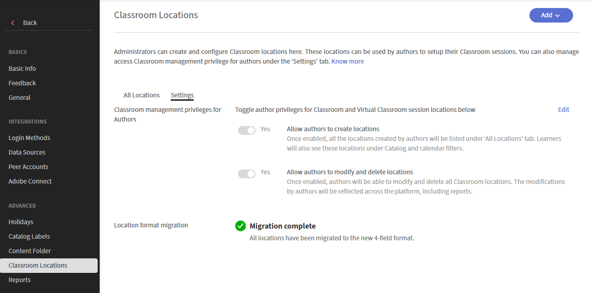
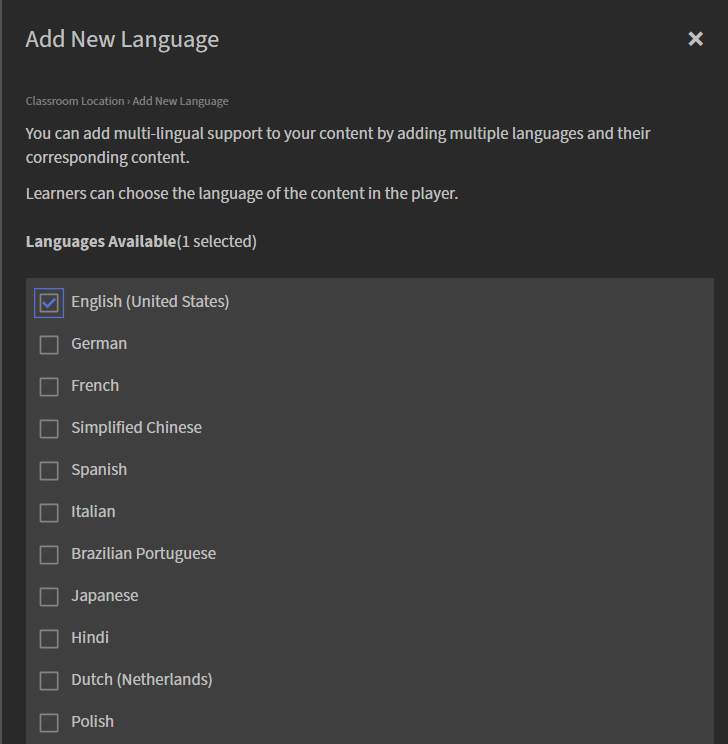

# Ajouter des lieux de salles de classe

Les administrateurs peuvent créer et gérer une bibliothèque d’emplacements de salle de classe à réutiliser lors de la configuration d’événements de formation dirigée par un instructeur dans le module Salle de classe et salles de classe virtuelles. Pour chaque emplacement, vous pouvez définir des détails tels que le nom de l’emplacement, la limite de places et des informations supplémentaires, y compris une URL d’emplacement. Les auteurs peuvent ensuite sélectionner ces emplacements prédéfinis lors de la création d&#39;un cours.

Par défaut, Adobe Learning Manager utilise un format d’emplacement à champ unique. Pour les organisations qui gèrent les emplacements de salle de classe dans plusieurs pays et langues, Learning Manager prend également en charge un format structuré à quatre champs qui comprend **Pays**, **État/Province/Région**, **Ville** et **Nom de l’emplacement**. Ce format fournit des fonctionnalités supplémentaires telles que le filtrage basé sur l’emplacement et la prise en charge linguistique pour des emplacements individuels. Les administrateurs peuvent passer au format à quatre champs par le biais d’une migration unique.

>[!NOTE]
>
>Si le format d’emplacement à quatre champs n’est pas activé, les auteurs et les élèves peuvent continuer à utiliser les emplacements de salle de classe comme d’habitude. Le format d’emplacement de champ unique existant reste disponible et aucune modification n’est requise. Voir [Migrer vers la méthode à quatre champs](#migrate-classroom-locations-to-the-four-field-format) pour plus d&#39;informations.

## Configurer les paramètres d’emplacement de salle de classe

Les administrateurs peuvent contrôler si les auteurs peuvent créer et gérer les emplacements de salle de classe. Utilisez les paramètres **Emplacements de salle de classe** pour définir le niveau d’accès disponible pour les auteurs.

Pour configurer les **emplacements de salle de classe** :

1. Connectez-vous à Adobe Learning Manager en tant qu&#39;**administrateur**.
1. Sélectionnez **Paramètres** > **Emplacements de salle de classe**.

   La page **Emplacements de salle de classe** s&#39;affiche.

1. Sélectionnez l&#39;onglet **Paramètres**.

   

   *Activez les privilèges d&#39;auteur pour les emplacements de salle de classe et de salle de classe virtuelle à partir de l&#39;onglet **Paramètres**.*

1. Sélectionnez **Modifier**.

   Le bouton devient modifiable, ce qui vous permet de mettre à jour les paramètres suivants :

   | **Paramètre** | **Description** |
   |---|---|
   | **Autoriser les auteurs à créer des emplacements** | Activez cette option pour permettre aux auteurs de créer des emplacements de module de salle de classe et de salle de classe virtuelle lors de la création de sessions de formation dirigée par un instructeur. |
   | **Autoriser les auteurs à modifier et à supprimer des emplacements** | Activez cette option pour permettre aux auteurs de modifier ou de supprimer les emplacements de salle de classe et de salle de classe virtuelle. |

1. Sélectionnez **Enregistrer**.

## Créer et gérer des emplacements de salle de classe

Les administrateurs peuvent créer et gérer des emplacements de salle de classe que les auteurs peuvent réutiliser lors de la création de sessions de formation en salle de classe et en salle de classe virtuelle. Adobe Learning Manager prend en charge deux formats d’emplacement :

* **Format de champ unique** : chaque lieu de salle de classe est identifié par un seul champ **Nom du lieu**. Pour plus d&#39;informations, consultez [Ajouter un emplacement de salle de classe en utilisant un format à champ unique](#add-a-classroom-location-using-a-single-field-format).
* **Format à quatre champs** : chaque lieu de salle de classe est organisé en **pays**, **état/province/région**, **ville** et **nom du lieu**, ce qui facilite la gestion des lieux dans plusieurs régions. Si votre compte utilise actuellement le format à un seul champ, effectuez la migration unique avant de passer au format à quatre champs. Voir [Migrer vers la méthode à quatre champs](#migrate-classroom-locations-to-the-four-field-format) pour plus d&#39;informations.

### Ajout d’un emplacement de salle de classe à l’aide d’un format à champ unique

Vous pouvez ajouter un lieu de salle de classe en utilisant le format de champ unique :

1. Connectez-vous à Adobe Learning Manager en tant qu&#39;**administrateur**.
1. Sélectionnez **Paramètres** > **Emplacements de salle de classe**.
1. Sélectionnez **Ajouter** > **Nouvel emplacement**.
1. Saisissez les détails suivants dans la boîte de dialogue **Emplacements de salle de classe** :

   1. Tapez le **Nom de l&#39;emplacement**. Utilisez un nom unique. Sinon, Learning Manager affiche un message d’erreur.
   1. Saisissez la description de l’emplacement dans le champ **Informations de localisation**. Ce champ est facultatif.
   1. Saisissez l’**URL de localisation**. Les élèves peuvent voir ces informations dans les détails de la salle de classe. L’URL peut également être une URL d’emplacement de mappage, si nécessaire. Il s’agit d’un champ facultatif.
   1. Tapez et sélectionnez la **région d&#39;emplacement**. Ce champ est facultatif.
   1. Saisissez le nombre de places disponibles dans le champ **Limite de places**. Cela indique la capacité en sièges de la salle de classe. Cette valeur peut être modifiée lors de la création de l’événement de formation dirigée par un instructeur.
      
      *Ajoutez un emplacement de salle de classe en utilisant le format à champ unique.*

### Migration des emplacements de salle de classe vers le format à quatre champs

Si votre compte utilise le format hérité Emplacement de salle de classe à champ unique, migrez vos emplacements de salle de classe existants avant d’activer le format à quatre champs. Le format à quatre champs organise les données de localisation en **pays**, **état/province/région**, **ville** et **nom de l&#39;emplacement**, ce qui facilite la gestion des emplacements dans plusieurs régions.

Cette migration est un processus unique. Après avoir basculé vers le format à quatre champs, vous ne pouvez pas rétablir le compte au format à un seul champ.

Pour migrer des emplacements existants :

1. Accédez à **Administrateur** > **Emplacements de salle de classe** et sélectionnez l’onglet **Paramètres**.
1. Sélectionnez **Exporter** dans la section **Migration du format d&#39;emplacement**.

   Un fichier CSV avec vos emplacements de salle de classe existants est téléchargé. Les colonnes suivantes sont disponibles :

   1. **room_id** : identifiant unique de l&#39;emplacement.
   1. **paramètres régionaux** : paramètres régionaux pour le nom d&#39;emplacement traduit et les informations d&#39;emplacement.
   1. **name** : nom de la salle de classe.
   1. **pays** : pays où se trouve la salle de classe.
   1. **état** : État, province ou région où se trouve la salle de classe.
   1. **ville** : ville où se trouve la salle de classe.
   1. **informations** : détails supplémentaires, tels que le nom du bâtiment, l&#39;étage ou le numéro de chambre.
   1. **url** : URL associée à l&#39;emplacement, telle qu&#39;un lien de mappage.
   1. **seatlimit** : capacité maximale en sièges de la salle de classe.

   >[!NOTE]
   >
   >Le fichier CSV exporté inclut toujours les colonnes de format d’emplacement à quatre champs, même si le format à quatre champs n’est pas activé.

   

   *Vérifiez la progression de la migration avant de passer au format d’emplacement à quatre champs.*

1. Pour chaque nom de colonne, mettez à jour le fichier CSV avec les informations requises, telles que le pays, l’état, la ville, ainsi que toute autre information requise.
1. Sélectionnez **Importer**, puis chargez le fichier CSV mis à jour.

   Adobe Learning Manager valide les données et met à jour la progression de la migration.

1. Lorsque la barre de progression de la migration atteint 100 %, sélectionnez **Passer au nouveau format à 4 champs**. L&#39;état de la migration du format **Location** est mis à jour en **Migration terminée**.

   

   *Mises à jour de la migration du format d&#39;emplacement vers l&#39;état Migration terminée.*

## Ajouter des emplacements de salle de classe à l’aide d’un format à quatre champs

Après avoir terminé la migration unique, les administrateurs peuvent créer des emplacements de salle de classe dans le format à quatre champs. Les auteurs peuvent ensuite réutiliser ces emplacements lors de la création de sessions de formation dirigées par un instructeur. Les administrateurs peuvent ajouter des emplacements de salle de classe individuellement ou importer plusieurs emplacements de salle de classe à partir d’un fichier CSV.

### Ajouter un emplacement de salle de classe

Utilisez les emplacements de salle de classe pour normaliser les lieux de formation et simplifier la planification des sessions pour les auteurs.

Pour ajouter un emplacement de salle de classe :

1. Dans l&#39;application Administration, sélectionnez **Paramètres** > **Emplacements de salle de classe**.

   

   *Sélectionnez l&#39;onglet **Tous les emplacements**&#x200B;pour ajouter un emplacement de salle de classe.*

1. Sélectionnez **Ajouter** > **Nouvel emplacement** dans le coin supérieur droit.

   La fenêtre contextuelle **Emplacement de la salle de classe** s&#39;affiche.

   

   *Saisissez les détails dans la fenêtre contextuelle Emplacement de la salle de classe.*

1. Dans la fenêtre contextuelle **Emplacement de la salle de classe**, entrez les détails suivants :

   | **Champ** | **Description** |
   |---|---|
   | **Pays** | Sélectionnez le pays où se trouve la salle de classe. |
   | **État/Province/Région** | Sélectionnez l’état, la province ou la région. |
   | **Ville** | Sélectionnez la ville où se trouve la salle de classe. |
   | **Nom de l&#39;emplacement** | Entrez le nom de la salle de classe ou de la salle. |
   | **Informations de localisation** | Entrez des détails supplémentaires, tels que le nom du bâtiment, l&#39;étage ou le numéro de la pièce. |
   | **URL d&#39;emplacement** | Entrez une URL pour l’emplacement, telle qu’un lien de mappage. |
   | **Limite de places** | Entrez la capacité maximale en sièges de la salle de classe. |

1. Sélectionnez **Enregistrer**.

   Le lieu de la salle de classe est enregistré et répertorié dans l&#39;onglet **Tous les lieux**.

### Importer des emplacements de salle de classe en bloc

Utilisez l’importation en bloc pour ajouter plusieurs emplacements de salle de classe ou mettre à jour des emplacements existants à l’aide d’un fichier CSV.

Pour importer des emplacements de salle de classe en bloc :

1. Dans l&#39;application Administration, sélectionnez **Paramètres** > **Emplacements de salle de classe**.
1. Sélectionnez **Télécharger CSV** dans l&#39;onglet **Tous les emplacements**.

   Un fichier CSV contenant vos emplacements de salle de classe existants est téléchargé. Les colonnes suivantes sont disponibles :

   1. **room_id** : identifiant unique de l&#39;emplacement.
   1. **paramètres régionaux** : paramètres régionaux pour le nom d&#39;emplacement traduit et les informations d&#39;emplacement.
   1. **name** : nom de la salle de classe.
   1. **pays** : pays où se trouve la salle de classe.
   1. **état** : État, province ou région où se trouve la salle de classe.
   1. **ville** : ville où se trouve la salle de classe.
   1. **informations** : détails supplémentaires, tels que le nom du bâtiment, l&#39;étage ou le numéro de chambre.
   1. **url** : URL associée à l&#39;emplacement, telle qu&#39;un lien de mappage.
   1. **seatlimit** : capacité maximale en sièges de la salle de classe.

1. Pour chaque nom de colonne, mettez à jour le fichier CSV avec les informations requises, telles que le pays, l’état, la ville, ainsi que toute autre information requise.
1. Sélectionnez **Ajouter** > **Emplacements d&#39;importation en bloc** dans le coin supérieur droit.

   La fenêtre contextuelle **Importer des emplacements CSV** s&#39;affiche.

   

   *Faites glisser et déposez le fichier CSV avec les informations mises à jour.*

1. Glissez-déposez le fichier CSV mis à jour dans la zone de téléchargement.
1. Sélectionnez **Importer**.

   Les emplacements de salle de classe sont mis à jour.

## Ajouter des traductions pour un emplacement de salle de classe

Ajoutez des traductions pour les champs **Nom du lieu** et **Informations sur le lieu** pour afficher les détails du lieu de salle de classe dans les langues préférées de l&#39;élève.

Pour ajouter des traductions pour un emplacement de salle de classe :

1. Sélectionnez **Tous les emplacements** > **Ajouter** dans les **emplacements de salle de classe**.
1. Sélectionnez **Nouvel emplacement**.

   La fenêtre contextuelle **Emplacement de la salle de classe** s&#39;affiche.

1. Sélectionnez **Ajouter une nouvelle langue**.

   La fenêtre contextuelle **Ajouter une nouvelle langue** s&#39;affiche.

   

   *Sélectionnez les langues dans la fenêtre contextuelle Ajouter une nouvelle langue.*

1. Sélectionnez **Enregistrer**.

   Les traductions sont enregistrées et affichées aux utilisateurs.

>[!NOTE]
>
>Seuls les champs **Nom de l&#39;emplacement** et **Informations d&#39;emplacement** prennent en charge les traductions. Les détails de l&#39;emplacement tels que **Pays**, **État/Province/Région** et **Ville** ne sont pas traduits.

## Modifier un emplacement de salle de classe

Pour modifier un emplacement de salle de classe, procédez comme suit :

1. Dans l&#39;application Administration, sélectionnez **Paramètres** > **Emplacements de salle de classe**.
1. Passez la souris sur l’emplacement de salle de classe que vous souhaitez modifier.

   

   *Survolez l’emplacement de salle de classe requis et sélectionnez l’icône Modifier.*

1. Sélectionnez l&#39;icône **Modifier l&#39;emplacement de la salle de classe**.

   La fenêtre contextuelle Emplacement de la salle de classe s’affiche.

1. Modifiez l&#39;emplacement de la salle de classe et sélectionnez **Enregistrer**.

## Supprimer un emplacement de salle de classe

Pour supprimer un emplacement de salle de classe, procédez comme suit :

1. Dans l&#39;application Administration, sélectionnez **Paramètres** > **Emplacements de salle de classe**.
1. Survolez l’emplacement de salle de classe que vous souhaitez supprimer.
1. Sélectionnez l&#39;icône **Supprimer l&#39;emplacement de salle de classe**.

   La fenêtre contextuelle Confirmation requise s’affiche.

   

   *Sélectionnez Supprimer pour confirmer la suppression d’un emplacement de salle de classe.*

1. Sélectionnez **Supprimer**.

## Foire aux questions

1. **Qu’advient-il des emplacements de salle de classe existants une fois la migration terminée ?** 
Vous pouvez activer le format d’emplacement à quatre champs uniquement après la migration de tous les emplacements existants, soit manuellement, soit par le biais d’un chargement CSV. Une fois le format à quatre champs activé, tous les cours existants qui utilisent des emplacements de salle de classe affichent des emplacements dans le nouveau format.

1. **Dois-je restructurer manuellement le fichier CSV exporté pour qu’il corresponde au format d’emplacement à quatre champs ?** 
Non. Le fichier CSV exporté utilise toujours le format d’emplacement à quatre champs, qu’il soit actuellement activé ou non. Il vous suffit de mettre à jour les valeurs manquantes avant d’importer le fichier.

1. **La migration affecte-t-elle les rapports Adobe Learning Manager ?** 
Oui. Après la migration, les rapports qui incluent les informations de localisation de la salle de classe affichent les emplacements au format suivant :

   **Pays > État/Province/Région > Ville > Nom de l’emplacement**

   Ce format remplace la valeur d’emplacement de champ unique précédente.

1. **Que se passe-t-il si je n&#39;active pas le format d&#39;emplacement à quatre champs ?** 
Rien ne change pour les auteurs ou les élèves. Les emplacements de salle de classe continuent d’apparaître et de fonctionner comme à l’heure actuelle, en utilisant le format de champ unique existant jusqu’à ce qu’un administrateur termine la migration et active le format à quatre champs.
