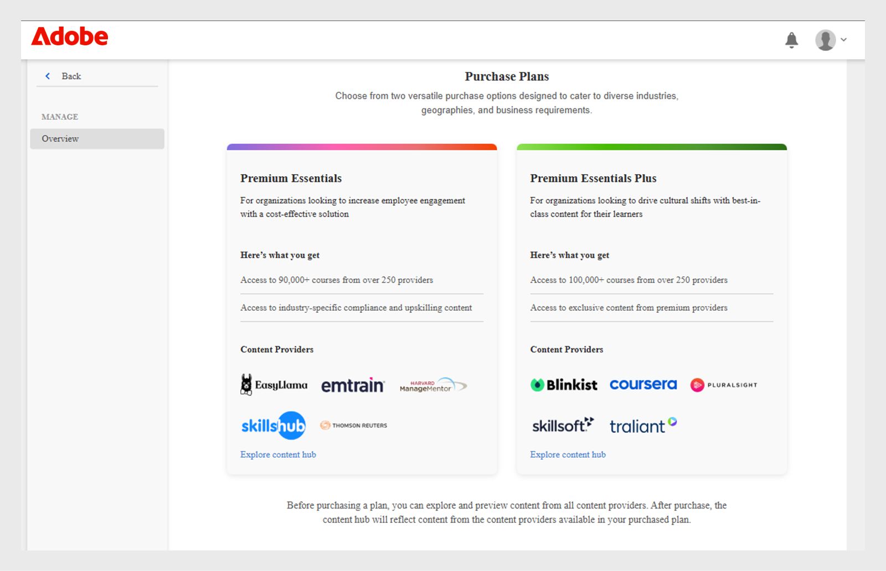

# Marché de contenus

Les administrateurs d’apprentissage rencontrent souvent des difficultés pour rechercher et télécharger du contenu de qualité. Le Marché de contenus de Adobe Learning Manager simplifie ce processus en permettant l’attribution de licences pour des cours premium proposés par des fournisseurs de confiance, ce qui accélère et rend plus évolutive la prestation de l’apprentissage. À l’aide du Marché de contenus, les administrateurs peuvent parcourir, prévisualiser et acheter la licence de cours tiers proposés par des fournisseurs.

Le Marché de contenus propose les formules suivantes pour l’acquisition de contenu :

* **[!UICONTROL Premium Essentials]**
* **[!UICONTROL Premium Essentials Plus]**

| **[!UICONTROL Premium Essentials]** | **[!UICONTROL Premium Essentials Plus]** |
|---|---|
| Accès à plus de 90 000 cours | Accès à plus de 100 000 cours |
| Contenu provenant de plus de 250 fournisseurs | Comprend tout le contenu Premium Essentials |
| Contenu exclusif de fournisseurs approuvés tels que :<li>EasyLlama</li><li>Skillshub</li><li>Thomson Reuters</li><li>Emtrain</li><li>Harvard ManageMentor</li> | Cours exclusifs des meilleurs fournisseurs tels que : <li>Blinkist</li><li>Pluralsight</li>Skillsoft</li><li>Traliant</li><li>Coursera</li> |

<!--**[!UICONTROL Premium Essentials]**:
A cost-effective solution designed to enhance employee engagement. 

* Access to over 90,000 courses
* Content from more than 250 providers
* Focus on compliance and skill improvement
* Exclusive content from trusted providers such as:
   * EasyLlama
   * Skillshub
   * Thomson Reuters
   * Emtrain
   * Harvard ManageMentor

**[!UICONTROL Premium Essentials Plus]**:

* Access to more than 100,000 courses
* Includes all Premium Essentials content
* Exclusive courses from top providers like:
   * Blinkist
   * Pluralsight
   * Skillsoft
   * Traliant
   * Coursera

Select the plan that best meets your organization's learning goals and budget.-->

## Acquisition de contenu auprès de fournisseurs

Pour parcourir et acquérir du contenu provenant de fournisseurs de contenu, procédez comme suit :

1. Sélectionnez **[!UICONTROL Marché de contenus]** dans la page d&#39;accueil de l&#39;administrateur. La page **[!UICONTROL Marché de contenus]** s&#39;affiche.

   
   _Consultez les formules d’achat sur la page Marché de contenus_

2. Les administrateurs peuvent prévisualiser et explorer le Hub de contenu pour les formules **[!UICONTROL Premium Essentials]** et **[!UICONTROL Premium Essentials Plus]**.

Les fournisseurs de contenu gèrent la suppression du contenu obsolète, en veillant à ce qu’aucun matériel d’apprentissage ne soit mis hors service sans avis préalable.

<!--Learning Manager now offers Content Marketplace for you to explore and purchase trainings. Explore 70,000+ courses that cover a wide range of topics, available in multiple formats. Choose from curated playlists that cater to a vast variety of roles and meet your learning and upskilling needs.

In the Administrator app, there is a new option **[!UICONTROL Content Marketplace]**, which you'll find on the left panel.

Users can purchase from curated playlists covering various topics or purchase the entire catalog. 

On the page, you can see two tiles, Enterprise Training and Creative Cloud Training. The first tile launches the marketplace, using which you can acquire courses for your learners. The latter launches the content catalog.

The Enterprise Training page in the Administrator app enables you to invite users and download the Express Interest report, and also purchase the entire catalog or curated playlist.-->

## Demander un devis

Les administrateurs peuvent sélectionner une formule, telle que Premium Essentials ou Premium Essentials Plus, spécifier le nombre de places requises et générer un formulaire de demande de devis téléchargeable. Une fois rempli, le formulaire est envoyé à l’équipe commerciale de Adobe Learning Manager pour traitement. Le processus d&#39;appel d&#39;offres permet également à l&#39;Adobe de fournir des prix personnalisés en fonction des besoins de l&#39;organisation.

Pour télécharger l&#39;appel d&#39;offres, procédez comme suit :

1. Sélectionnez le **[!UICONTROL Marché de contenus]** dans la page d&#39;accueil de l&#39;administrateur.

2. Sélectionnez le type de licence et saisissez le nombre de licences pour générer le devis dans la section **[!UICONTROL Demander un devis]**.

3. Sélectionnez **[!UICONTROL Télécharger l&#39;appel d&#39;offres]** pour télécharger le devis.

_Télécharger l&#39;appel d&#39;offres après avoir sélectionné une formule_

Envoyez le devis à [learningmanagersales@adobe.com](mailto:learningmanagersales@adobe.com) pour activer votre licence. Vous pouvez également contacter votre chargé de réussite client Adobe pour lancer le processus d’achat.

## Inviter des élèves dans le Hub de contenu

Invitez les élèves à explorer le contenu et à exprimer leur intérêt dans le Marché de contenus. En tant qu’administrateur, vous pouvez inviter tous les élèves du compte ou inviter des élèves sélectionnés. Les élèves doivent être invités avant de pouvoir explorer le contenu. Consultez [l&#39;article](/help/migrated/administrators/feature-summary/content-marketplace.md#content-hub) pour plus d&#39;informations sur le Hub de contenu.

Pour inviter les élèves :

1. Sélectionnez le **[!UICONTROL Marché de contenus]** dans la page d&#39;accueil de l&#39;administrateur.
2. Sélectionnez **[!UICONTROL Inviter des élèves]** et sélectionnez les élèves requis.
3. Sélectionnez **[!UICONTROL Inviter des élèves]**.

Les administrateurs peuvent également révoquer l&#39;accès au **[!UICONTROL Content Hub]** en sélectionnant le lien **[!UICONTROL Supprimer l&#39;accès de tous les utilisateurs]**. Une fois l’accès révoqué, les élèves ne verront plus la page Hub de contenu dans leur application d’élève.

_Inviter les utilisateurs à accéder au Hub de contenu_

Par défaut, cette option est activée pour tous les nouveaux comptes. Pour les comptes existants, les administrateurs doivent inviter manuellement les élèves à accéder au Marché de contenus.

<!--## Purchase

You get unlimited access to the entire library of courses. Click the **[!UICONTROL Purchase]** button to download a Purchase Request form.

*Enter the number of seats to purchase*

Specify the number of seats for which you want to purchase the courses for. Download the purchase request form and then send the form to the sales team of Learning Manager.

The team will then validate the information and then generate a key, which will be provided to you. This is the activation key using which you'll grant access to your users to the content offering.

After the key is generated by the CSAM team, the Administrator can use the key to import the courses, and migrate the courses into the existing catalog or the new catalog.

During migration of courses, the status displays as **[!UICONTROL Importing Courses]**. Once the migration completes, the Administrator gets a notification that migration is complete and successful.

The **[!UICONTROL Licenses]** section then displays all the licenses that are acquired for the account.

The Administrator can see the links of the purchased catalogs in the Catalog Overview page.

Once the courses are added to the catalog, the Administrator can then grant access to the trainings to various user or user groups.

*Grant access to training to users and user groups*-->

<!--## Express interest report

When a learner clicks Express interest to Catalog in the Learner app, the interest is recorded in an Express interest report. The Administrator can download the report. The report (csv) contains the following fields:

* Name of the catalog
* Number of users expressing interest
* Email of the user expressing interest-->

## Hub de contenu

Le Hub de contenu permet aux administrateurs de présélectionner les listes de lecture requises dans l’application de l’élève. La page Hub de contenu est toujours visible par les administrateurs dans leur rôle d’élève, car elle leur permet de présélectionner facilement des listes de lecture. Pour vous aider à présélectionner la liste de lecture appropriée, les administrateurs peuvent rendre cette page accessible aux experts en la matière dans leur compte.

Adobe Learning Manager se synchronise régulièrement avec le Hub de contenu, ce qui garantit que les nouveaux ajouts et mises à jour sont automatiquement répercutés sur la plateforme.

Tout le contenu est mappé vers les langues prises en charge, ce qui permet aux administrateurs de filtrer et de gérer le contenu plus efficacement en fonction des préférences de langue.

## Modèles de courriers électroniques

Adobe Learning Manager propose des modèles de courrier électronique préconfigurés qui informent les administrateurs et les élèves des achats de contenu, des mises à jour système et des activités d’apprentissage.

Vous pouvez utiliser trois modèles de courrier électronique :

1. **[!UICONTROL Activation du contenu réussie] :** envoyé aux administrateurs après l’achat réussi de contenu tiers. Cette notification confirme que l’activation est terminée et que le contenu acheté est maintenant disponible dans le système pour l’affectation des élèves.
2. **[!UICONTROL Échec du chargement automatisé des utilisateurs]:** déclenché lorsqu’une importation automatisée des utilisateurs via CSV échoue. Cette alerte aide les administrateurs à identifier rapidement les problèmes dans les mises à jour utilisateur planifiées, afin que des actions correctives puissent être entreprises.
3. **[!UICONTROL Inviter les utilisateurs à explorer le contenu]:** e-mail d&#39;invitation envoyé aux élèves une fois que l&#39;administrateur a acheté du contenu sur le marché. Après cela, les utilisateurs peuvent commencer leur parcours d’apprentissage immédiatement.

<!--Purchased courses cannot be added in recurring certificates.
Purchased courses cannot be shared to peer accounts.
Purchased courses can be consumed by all users who get access to it. Configure the catalog visibility to restrict the visibility of purchased courses to limited users.
Purchased courses cannot be consumed once the activation key expires. Please purchase/activate another key to allow consumption.-->

<!--## Content Hub in Content Marketplace

Content Hub allows Administrators and Subject Matter Experts (SMEs) to shortlist required playlists from learner app. Once shortlisted, Admins can download the Purchase Request Form and share it with the Adobe Sales agent.

An Admin can invite SMEs to shortlist the playlist which they are interested in. 

*Launch Content Hub from the marketplace*

Content Hub is available in Learner role for all Administrators. Administrators allow SMEs to shortlist the playlist which they are interested in purchasing.

The Content Hub page is visible to Administrators in their learner role all the time as it allows them to shortlist playlists easily. To help you in shortlisting the right playlist, Admins can make this page accessible to limited Subject matter experts in their account. Just visit the Enterprise Training page on Admin side and take steps to provide access.  

*View resources in the Content hub*

Learning Manager also enables Administrators to download a shortlisted playlist and share it with Adobe Sales team. Before downloading the shortlist, visit the Content Hub and shortlist a playlist by adding a playlist to your library. 

Then as Administrator, click **[!UICONTROL Content Marketplace]** > **[!UICONTROL Enterprise Training]** > **[!UICONTROL Purchase section]** > **[!UICONTROL Curated Playlists]**. Click the **[!UICONTROL Purchase]** button to download the Purchase request form which contains the details of your shortlisted playlist.

*Download the Purchase Request form*

The courses and Playlist which you see in the Content Hub are the same as what you see in the Content Marketplace. Content Hub simply provides an ability for Administrators and limited SMEs to shortlist playlist easily for purchase.-->
