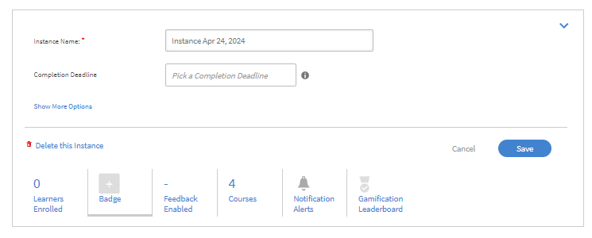

# Création d’instances de cours et de parcours d’apprentissage

Ce document fournit une aide destinée au rôle d’administrateur pour créer des modules de cours, des instances et des cours.

Les auteurs créent des cours. Les élèves peuvent prendre des cours et les administrateurs peuvent suivre les performances des élèves selon le nombre de cours suivis.

## Vue d’ensemble {#overview}

Les auteurs créent des cours. Les élèves peuvent ensuite prendre des cours et les administrateurs peuvent suivre les performances des élèves selon le nombre de cours suivis. Les administrateurs peuvent afficher les cours créés par les auteurs et mener à bien certaines activités comme décrit dans cette section. En tant qu’administrateur, vous pouvez créer des programmes d’apprentissage uniques avec un ensemble prédéfini de cours destinés aux élèves.

## Création de l’instance d’un cours {#createinstanceofacourse}

### Configuration d’instances

Dans cette formation, vous apprendrez à configurer les paramètres par défaut des instances, à ajouter une nouvelle instance, à retirer et rouvrir une instance, et à configurer des modèles de courrier électronique pour une instance.

Si vous ne pouvez pas lancer la formation, écrivez à <almacademy@adobe.com>.

### Création d’une instance

Une fois qu’un auteur a créé un cours, vous pouvez créer des instances de ce cours. En créant des instances d’un cours, vous pouvez offrir le même cours à vos élèves à différentes périodes. Les élèves peuvent choisir n’importe quelle instance et s’y inscrire. Pour chaque instance, il est possible de configurer un jeu de badges, un retour d’informations et d’autres paramètres.

Pour créer une instance,

1. Sur l’application Web d’administrateur, cliquez sur **[!UICONTROL Cours]** dans le volet de gauche.
1. Dans la liste des cours, choisissez le cours requis, puis cliquez sur **[!UICONTROL Afficher le cours]**.

   

   *Afficher un cours*

1. Pour créer des instances, cliquez sur **[!UICONTROL Instances]** dans le volet de gauche. Chaque cours a une instance par défaut. Vous pouvez modifier l’instance par défaut ou ajouter des instances. Vous ne pouvez pas supprimer cette instance du cours.
1. Pour créer une instance, cliquez sur **[!UICONTROL Ajouter une nouvelle instance]** dans le coin supérieur droit de la fenêtre d’informations sur le cours. Une nouvelle instance du cours est affichée.
1. Saisissez les propriétés de l’instance :

   * Dans le champ **[!UICONTROL Nom de l&#39;instance]**, saisissez le nom de l&#39;instance que vous souhaitez associer au cours. Assurez-vous d’utiliser un nom unique pour l’instance.
   * Spécifiez l&#39;échéance d&#39;achèvement de l&#39;instance. Les élèves doivent avoir achevé le cours au plus tard à cette date.
   * Cliquez sur **[!UICONTROL Afficher plus d&#39;options]** pour afficher d&#39;autres options d&#39;échéance.
   * **[!UICONTROL Échéance d&#39;inscription]:** Il s&#39;agit de la date à laquelle un élève doit s&#39;inscrire à un objet d&#39;apprentissage en cas d&#39;auto-inscription.
   * **[!UICONTROL Échéance de désinscription]:** Vous pouvez choisir de restreindre la désinscription par l&#39;élève lui-même en fixant une échéance de désinscription.
   * **[!UICONTROL Fuseau horaire]:** recherchez, puis sélectionnez le **[!UICONTROL fuseau horaire]** dans la liste déroulante.

   L’administrateur peut décider de fixer ou non une date d’échéance d’achèvement pour un cours ou un programme d’apprentissage en fonction des besoins. Toutefois, il est recommandé d’en fixer une pour les formations en salle de classe/en salle de classe virtuelle.

   

   *Définir l&#39;échéance d&#39;achèvement*

### Affichage des propriétés de l’instance {#viewpropertiesoftheinstance}

*Afficher les propriétés de l&#39;instance*

1. **Modules :** nombre de modules créés par l’auteur du cours.
1. **Élèves inscrits :** nombre d’élèves inscrits au cours par l’administrateur.
1. **Sessions :** nombre de modules de salle de classe virtuelle et de modules de salle de classe dans le cours.
1. **Retour d’information activé :** affiche si les retours d’informations L1, L2 et L3 sont activés pour ce cours.

>[!NOTE]
>
>L’administrateur annule les sessions en accédant à Instances > Sessions et en sélectionnant Annuler la session.

### Gestion des instances

>[!INFO]
>
>Dans cette formation, vous apprendrez à modifier les détails et les propriétés de l&#39;instance.    

Si vous ne pouvez pas lancer la formation, écrivez à <almacademy@adobe.com>.

### Retrait d’une instance {#retireaninstance}

Pour retirer une instance, procédez comme suit :

1. Dans l&#39;instance, sélectionnez le menu déroulant et choisissez l&#39;option **[!UICONTROL Retirer l&#39;instance]**.

   

   *Retrait d&#39;une instance*

1. Pour rechercher toutes les instances retirées, cliquez sur l’onglet **[!UICONTROL Retirées]** sur la page Instances.

### Restauration d’une instance {#restoreaninstance}

Pour restaurer une instance retirée et la replacer en état d’activation, procédez comme suit :

1. Dans l’instance, cliquez sur le menu déroulant et choisissez l’option **[!UICONTROL Rouvrir l’instance]**.

   

   *Restaurer une instance*

1. L’instance est maintenant restaurée en mode actif.

### Suppression d’une instance

Les administrateurs peuvent supprimer l&#39;instance à l&#39;aide de l&#39;option **Supprimer cette instance** immédiatement après la création. Vous ne pouvez pas supprimer d’instances si une session est liée à celle-ci ou si des élèves y sont inscrits.

*Supprimer une instance*

>[!NOTE]
>
>Vous ne pouvez pas supprimer l&#39;instance par défaut.

### Envoyer des e-mails d’instance

Pour envoyer aux élèves inscrits des e-mails au niveau de l’instance :

1. Sur la page **[!UICONTROL Instances]**, sélectionnez les options sur n&#39;importe quelle instance, puis cliquez sur **[!UICONTROL Envoyer un e-mail aux élèves inscrits]**.

*Envoyer un e-mail aux élèves inscrits à l&#39;instance*

1. Dans la boîte de dialogue **[!UICONTROL Créer une annonce]**, sélectionnez Type comme E-mail. Spécifiez l’objet, saisissez le message, puis cliquez sur **[!UICONTROL Enregistrer]**. La formation est automatiquement sélectionnée.

   

   *Créer une annonce par e-mail*

1. Après avoir cliqué sur **[!UICONTROL Enregistrer]**, un message de confirmation s’affiche pour confirmer la création de l’annonce. Pour publier l’annonce, cliquez sur **[!UICONTROL Publier maintenant]**.

   

## Inscription d’élèves à des cours

Dans cette formation, vous apprendrez à vous inscrire, à vous désinscrire et à vous réinscrire des élèves.

Si vous ne pouvez pas lancer la formation, écrivez à <almacademy@adobe.com>.

### Inscrire des élèves dans diverses instances

1. Sélectionner un cours dans la liste de cours.
1. Sélectionner **[!UICONTROL Élèves]** dans le panneau de gauche.
1. Sélectionner **[!UICONTROL Inscription]**.

   

   *Publish du cours*

1. Dans la boîte de dialogue [!UICONTROL **Inscription des élèves**], vous pouvez :

   * Sélectionnez une instance pour inscrire un élève à partir de la liste déroulante Sélectionner une instance.
   * Sélectionnez l’utilisateur ou les groupes d’utilisateurs, ou les deux, dans le champ Inclure les élèves.
   * Sélectionnez les élèves que vous souhaitez exclure de l&#39;instance dans le champ Exclure des élèves.
   * Au bas de la boîte de dialogue, sélectionnez Oui si vous souhaitez qu&#39;un ou plusieurs élèves soient inscrits à l&#39;instance sélectionnée.

1. Sélectionnez **[!UICONTROL Continuer]**.

   

   *Poursuivre l&#39;inscription des élèves*

### Afficher le rapport d’inscription d’une instance

1. Sélectionner un cours dans la liste de cours.
1. Sélectionner **[!UICONTROL Élèves]** dans le panneau de gauche.
1. Sélectionnez **[!UICONTROL Actions]** > **[!UICONTROL Exporter]**.

Le fichier Excel contient des feuilles de calcul pour chaque instance. Une feuille de calcul se compose des champs suivants :

* Élèves
* Courrier électronique
* ID utilisateur unique
* Nom du cours
* ID unique d’objet d’apprentissage
* Statut
* Critères de sélection
* Date d’inscription/Date de désinscription (fuseau horaire UTC)
* Date d’achèvement (fuseau horaire UTC)
* Date d’échéance (Fuseau horaire UTC)
* Date de début (fuseau horaire UTC)
* Score du quiz
* Nom du responsable
* Adresse
* userState
* Domaine d’expertise
* Commentaires
* Nombre de visites
* Dates de visite
* Dates et heures (fuseau horaire UTC)
* Temps passé (minutes)

>[!NOTE]
>
>L’activation de l’inscription multiple entraîne l’ajout de plusieurs lignes au rapport de relevé de notes de l’élève pour chaque cours (une ligne par instance).
>
>Si la configuration de Reporting Automation ne prévoit qu&#39;une seule ligne par cours, vous devez effectuer les ajustements nécessaires avant d&#39;activer la fonction d&#39;inscription multiple.

### Gérer la liste des élèves pour un cours {#managelearnerslistforacourse}

1. Cliquez sur le nom du cours dans la vignette du cours.
1. Dans le volet de gauche, cliquez sur **[!UICONTROL Élèves]**.

*Sélectionner des élèves dans un cours*

Vous pouvez réaliser les actions suivantes depuis la page Élèves :

* Sélectionnez l&#39;élève que vous souhaitez supprimer, puis cliquez sur [!UICONTROL **Actions**] > [!UICONTROL **Supprimer**].
* Sélectionnez l&#39;élève dont vous souhaitez marquer l&#39;assiduité, puis cliquez sur [!UICONTROL **Actions**] > [!UICONTROL **Marquer comme terminé**].

Pour permettre aux élèves de réinitialiser un module et de le réutiliser, cliquez sur [!UICONTROL **Réinitialiser**]. Dans la boîte de dialogue contextuelle, cliquez sur Oui pour confirmer la réinitialisation. Les modules terminés ne peuvent pas être réinitialisés. Seuls les modules auxquels les élèves ont échoué ou qui sont incomplets peuvent être réinitialisés.

Vous pouvez également exporter la liste des élèves dans une feuille Excel. Pour exporter la liste des élèves, cliquez sur [!UICONTROL **Actions**] > [!UICONTROL **Exporter**].

>[!NOTE]
>
>S&#39;il existe plusieurs instances d&#39;un cours, la liste des élèves dans Excel est fournie dans chaque onglet séparément. La liste des élèves est constituée du nom des stagiaires, de leur statut et des critères de sélection. Le statut des élèves peut être **Pas commencé**, **En cours** ou **Terminé**.

### Exporter les apprenants dans l’état d’approbation en attente

Un administrateur, un gestionnaire ou un administrateur personnalisé peut exporter les données des apprenants en attente d’une inscription à l’approbation. Vous pouvez exporter les données via l’onglet **Cours > Learner**, puis cliquer sur la liste déroulante Action.

L’option est présente lorsqu’aucun stagiaire n’est inscrit/en attente d’approbation du cours approuvé par le gestionnaire et un rapport vide est généré. Vous pouvez également exporter lorsque les élèves sont dans l&#39;état d&#39;approbation en attente, l&#39;état inscrit, l&#39;état en attente et l&#39;état non inscrit.

Le rapport contient les données des utilisateurs actifs, supprimés et suspendus s’ils sont en attente d’approbation. Le rapport contient également les données des utilisateurs internes et externes, qui sont en attente d&#39;approbation.

Si un élève qui se trouvait auparavant dans l’état d’approbation en attente se désinscrit, son enregistrement ne sera pas présent dans le rapport. En outre, si un stagiaire qui se trouvait auparavant dans l’état d’approbation en attente est inscrit au cours par inscription d’administrateur/de gestionnaire/d’administrateur personnalisé, son enregistrement est présent dans le rapport.

## Liste d’attente

La section Liste d&#39;attente permet aux élèves d&#39;être sur liste d&#39;attente pour des cours en classe lorsque les places sont limitées, en fonction de leur ordre d&#39;inscription. Les administrateurs peuvent gérer cela en sélectionnant les élèves inscrits sur liste d&#39;attente et en allouant des places au-delà de la limite initiale. Une fois une place allouée par l’administrateur, l’élève est immédiatement inscrit au cours.

### Rapport de liste d’attente

Adobe Learning Manager permet aux administrateurs de télécharger la liste d’élèves inscrits sur liste d’attente pour toutes les instances d’un cours. Les administrateurs peuvent accéder à ce rapport à partir de la section Liste d&#39;attente sur la page **[!UICONTROL Présentation du cours]**.

En suivant les colonnes disponibles dans le rapport Liste d’attente :

* Nom du cours
* Nom d’instance
* ID d’instance
* État d’instance
* Nom d’utilisateur
* Courrier électronique
* ID utilisateur unique
* Date d’inscription (fuseau horaire UTC)
* Statut
* Nombre de listes d’attente
* Limite de liste d’attente
* Limite de postes

Pour télécharger le rapport à partir de la section Administrateur :

1. Connectez-vous en tant qu&#39;**[!UICONTROL administrateur]**.
2. Accédez à la section **[!UICONTROL Cours]** et sélectionnez le cours requis.
3. Sélectionnez l&#39;option **[!UICONTROL Liste d&#39;attente]** dans la page **[!UICONTROL Présentation du cours]**.
4. Sélectionnez **[!UICONTROL Actions]** > **[!UICONTROL Exporter le rapport]** pour télécharger le rapport **[!UICONTROL Liste d&#39;attente]**.

   
   _Exporter le rapport_

## Exporter le rapport d’assiduité des élèves {#attendance}

Vous pouvez télécharger la liste des participants à n’importe quel cours en classe ou virtuel.

Sur la page Détails du cours, cliquez sur **[!UICONTROL Assiduité et notation]** dans le volet de droite.

Dans le coin supérieur droit de la page, cliquez sur la liste déroulante **[!UICONTROL Actions]**. Cliquez ensuite sur l’option **[!UICONTROL Exporter la liste des élèves (PDF)]**.

*Exporter la liste des élèves en tant que PDF*

Sur le PDF, vous pouvez afficher le même groupe d’élèves qu’un instructeur.

Lorsque vous téléchargez le PDF, vous pouvez voir le fuseau horaire (UTC) utilisé lors de la création du cours.

## Ajout d’un retour d’informations L1 et L3 {#addl1andl3feedback}

Vous pouvez ajouter des options de retour d’informations L1 et L3 lorsque vous créez des cours :

1. Cliquez sur Cours dans le volet de gauche après vous être connecté en tant qu’administrateur. La liste de tous les cours apparaît sur la page du côté droit.
1. Cliquez sur la vignette du cours pour lequel vous souhaitez ajouter un retour d&#39;informations L1 ou L3.
1. Cliquez sur la valeur d’instance par défaut dans le volet de gauche.
1. Cliquez sur le cercle du bouton bascule en regard du retour d’informations L1 ou L3 pour l’activer.
1. Ajoutez une question de retour d’informations L3 dans la zone de texte située sous la question L3.

### Retour d’informations L1 obligatoire {#mandatory-l1-feedback}

Vous pouvez rendre obligatoires toutes les questions ou la première question d&#39;un retour d&#39;informations L1.

*Rendre obligatoires toutes les questions ou la première question d&#39;un retour d&#39;informations L1*

Vous pouvez maintenant créer les questions, qui deviennent obligatoires.

*Créer les questions*

Si les deux questions obligatoires, pour une raison quelconque, n’ont pas de texte, les questions n’apparaîtront pas dans le formulaire de retour d’informations.

>[!NOTE]
>
>Il ne suffit pas d&#39;activer ces paramètres dans l&#39;instance du programme d&#39;apprentissage. Vous devez également activer ces paramètres au niveau de l’instance de cours pour chaque cours du programme d’apprentissage.

Dans la page Valeurs par défaut de l&#39;instance, si vous activez l&#39;option **[!UICONTROL Rendre toutes les questions obligatoires]**, toutes les nouvelles instances créées par la suite hériteront de ces paramètres.

*Afficher la page Valeurs par défaut de l&#39;instance*

### Retour d’informations L1 au niveau du cours {#l1-feedback-course-level}

Dans les versions précédentes de Learning Manager, un administrateur pouvait activer le retour d&#39;informations L1 pour le programme d&#39;apprentissage.

Dans cette version de Learning Manager, l&#39;administrateur peut envoyer un retour d&#39;informations L1 pour tous les cours faisant partie du programme d&#39;apprentissage. L&#39;administrateur doit s&#39;assurer que le retour d&#39;informations L1 est activé pour tous les cours au niveau de l&#39;instance de cours.

1. Pour activer le retour d&#39;informations L1 pour chaque cours, dans l&#39;application Administration, cliquez sur **[!UICONTROL Programmes d&#39;apprentissage]** > **[!UICONTROL Afficher le programme d&#39;apprentissage]**.

1. Cliquez sur **[!UICONTROL Instances]** > **[!UICONTROL Retour d&#39;informations L1 activé]**.

1. Activez l&#39;option **[!UICONTROL Activer pour chaque cours]**.

   

   *Activer le retour d&#39;informations sur le cours*

   Seule l’activation de cette option au niveau du programme d’apprentissage ne déclenchera pas le retour d’informations L1 pour les cours de ce programme. Pour activer le retour d&#39;informations L1, accédez à chaque cours du programme d&#39;apprentissage et activez le bouton Retour d&#39;informations L1.

   

   *Activer le retour d&#39;informations L1 pour chaque cours*

   Si le retour d&#39;informations L1 est activé pour tous les cours, mais désactivé dans l&#39;instance du programme d&#39;apprentissage, le retour d&#39;informations L1 ne sera pas déclenché pour les cours.

### Rapports de quiz spécifiques à la langue

Les rapports de quiz permettent d&#39;évaluer la performance d&#39;un apprenant après l&#39;achèvement d&#39;un programme ou d&#39;un cours d&#39;apprentissage.

Learning Manager facilite actuellement l’apprentissage dans 13 langues d’interface et 32 langues de contenu. Bien que cette option soit conviviale pour les apprenants et soit pratique pour prendre en charge nos apprenants globaux, il est difficile pour les administrateurs d’extraire les rapports tentés dans différentes langues.

Un rapport de quiz contiendra des données dans différentes langues si le cours est proposé en plusieurs langues. Jusqu’à présent, les réponses étaient affichées l’une après l’autre dans les rapports générés par l’administrateur, quelle que soit la langue dans laquelle le quiz était tenté. **Par exemple**, si un utilisateur a répondu à un quiz en néerlandais, l&#39;administrateur ne pourra afficher que les rapports de quiz tentés par des utilisateurs en néerlandais à la fois. L’administrateur qui a sélectionné l’anglais comme langue d’interface n’a pas pu afficher les rapports pour tous les utilisateurs à la fois, indépendamment des paramètres régionaux tentés dans.

Cela est désormais corrigé, car l’administrateur est désormais en mesure d’afficher tous les rapports dans la langue respective que l’apprenant a tenté tous en même temps, indépendamment de la langue de contenu choisie. Dans cette version, si le cours est disponible dans plusieurs langues, les réponses au quiz fournies dans différentes langues seront ajoutées en tant que colonnes supplémentaires dans le rapport de quiz.

### Activer le retour d’informations L1 au niveau du compte {#l1-feedback-account-level}

*Activer le retour d&#39;informations L1 au niveau du compte*

Un administrateur pourra activer le retour d’informations L1 pour les cours et le programme d’apprentissage nouvellement créés en activant ce paramètre au niveau du compte. Toutefois, l’activation de ce paramètre n’a aucune incidence sur les cours et programmes d’apprentissage existants

Si cette option est activée, le retour d’informations sera activé par défaut pour toutes les nouvelles formations et toutes les nouvelles instances. Si un auteur/administrateur consulte l’instance, celle-ci est rétablie à ses valeurs par défaut et se désactive manuellement, puis elle est activée.

Pour activer le retour d&#39;informations L1, dans l&#39;application Administration, cliquez sur **[!UICONTROL Paramètres]** > **[!UICONTROL Retour d&#39;informations]**.

*Afficher la page Paramètres de retour d&#39;informations*

Cliquez sur **[!UICONTROL Modifier]** dans le coin supérieur droit et activez l&#39;option pour activer le retour d&#39;informations L1.

Lorsqu&#39;un auteur crée un cours, sur la page Instance de l&#39;application d&#39;administration, le **[!UICONTROL retour d&#39;informations L1]** est automatiquement activé pour le nouveau cours.

<!---->

Vous pouvez également désactiver le retour d&#39;informations L1 en activant l&#39;option **[!UICONTROL Activer]**, comme indiqué ci-dessous :

*Activer ou désactiver le retour d&#39;informations L1*

### Ajout de questions descriptives pour le retour d’informations L1 ou L3 {#descriptive}

Dans la version de novembre de Learning Manager, une option permettant d’ajouter des questions descriptives a été ajoutée. Les administrateurs ont la possibilité d’ajouter ces questions pour les élèves. Cette fonctionnalité vient s’ajouter à l’ensemble de questions par défaut fournies par Learning Manager. Si nécessaire, vous pouvez également les rendre obligatoires en sélectionnant l’option située sous la question.

Vous pouvez ajouter deux questions descriptives pour le retour d’informations L1 et une pour le retour d’informations L3.

Une fois que vous avez activé le retour d’informations L1, vous pouvez voir ces options, comme le montre la capture d’écran suivante.

*Ajout de questions descriptives pour le retour d&#39;informations L1 et L3*

Si vous souhaitez que l’élève voie le questionnaire s’afficher dès la fin du cours, vous pouvez sélectionner l’option correspondante.

Un exemple de sortie du questionnaire L1 est fourni ci-dessous pour référence. Les élèves peuvent voir le questionnaire dans le format ci-dessous. Test-1 et Test-2 sont les questions descriptives.

*Exemple de questions de retour d&#39;informations sur le cours*

Une fois que vous avez activé le retour d&#39;informations L3, vous pouvez afficher les options comme indiqué dans l&#39;instantané ci-dessous :

*Activer le retour d&#39;informations L3*

Question 2 est la question descriptive pour le retour d’informations L3. Vous pouvez la rendre obligatoire en cliquant sur l’option correspondante sous la question.

Un exemple de sortie du questionnaire L3 est fourni ci-dessous pour référence. Les élèves peuvent voir le questionnaire dans le format ci-dessous.

*Afficher la sortie du retour d&#39;informations L3*

### Configuration du questionnaire de retour d’informations L1 et L3 {#setupl1andl3feedbackquestionnaire}

Vous pouvez configurer un questionnaire de retour d’informations L1 et L3 et également définir des rappels au niveau du compte.

1. Cliquez sur **[!UICONTROL Paramètres]**, puis sur **[!UICONTROL Retour]** dans le volet de gauche après vous être connecté en tant qu&#39;administrateur.\
   La page des paramètres de retour d&#39;informations s&#39;affiche avec deux onglets : **[!UICONTROL Retour L1]** et **[!UICONTROL Retour L3]**.\
   L&#39;onglet **[!UICONTROL Retour d&#39;informations L1]** se compose d&#39;un questionnaire **[!UICONTROL Retour d&#39;informations L1]** par défaut pour les cours en salle de classe et en auto-apprentissage, ainsi que de paramètres de rappel. Dans l&#39;onglet **[!UICONTROL Retour d&#39;informations L3]**, vous pouvez afficher la déclaration par défaut du retour d&#39;informations L3 et les paramètres de rappel.

1. Cliquez sur Modifier dans l’angle supérieur droit de la page, pour modifier le questionnaire existant.\
   Dans l&#39;onglet **[!UICONTROL Retour d&#39;informations L1]**, vous pouvez activer/désactiver chaque question en cliquant sur le bouton bascule Oui/Non.\
   Dans l&#39;onglet **[!UICONTROL Retour d&#39;informations L3]**, vous pouvez modifier la déclaration de retour d&#39;informations par défaut.\
   Cliquez sur **[!UICONTROL Ajouter un nouveau rappel]** en bas de la page et choisissez quand envoyer les rappels.

1. Cliquez sur **[!UICONTROL Enregistrer]** dans le coin supérieur droit de la page.

Dans Retour d’informations L1, vous pouvez voir deux jeux de questions avec une question par défaut. Le premier jeu de questions fait référence aux cours en auto-apprentissage, qui peuvent également être utilisés pour les cours basés sur des activités. Le deuxième jeu de questions peut être utilisé pour le type de cours de salle de classe et de classe virtuelle.

## Affichage des retours d’informations L1 et L3 {#viewl1andl3feedback}

Vous pouvez afficher le retour d’informations L1 fourni par les élèves au sujet d’un cours et un retour d’informations L3 fourni par les responsables des élèves.

1. Cliquez sur n’importe quelle vignette de cours dans la liste des cours.
1. Cliquez sur Retour d’informations L1 ou Retour d’informations L3 dans le volet de gauche afin de visualiser les retours d’informations reçus.
1. Sélectionnez l’instance dans la liste déroulante pour afficher le retour d’informations de cette instance particulière.

## Forum de discussion

La fonctionnalité Forum de discussion permet aux élèves d&#39;afficher les discussions du cours. En tant qu’administrateur, vous pouvez supprimer tous les commentaires nécessaires. Les administrateurs peuvent activer cette option dans les paramètres du cours.

## Modération de cours {#coursemoderation}

Dès qu’un auteur ajoute, met à jour ou supprime des modules et republie un cours, tous les administrateurs reçoivent des notifications à ce sujet. En tant qu’administrateur, vous pouvez afficher les modifications et comparer le nouveau contenu à l’ancien en cliquant sur le lien, puis approuver ou rejeter les modifications en conséquence.

Pour activer la modération du cours, cliquez sur **[!UICONTROL Paramètres]** > **[!UICONTROL Général]**. Cochez la case **[!UICONTROL Modération de cours]** pour activer cette fonction.

*Activer la modération de cours*

Cliquez sur la notification pour afficher les modifications que l’auteur a apportées au cours. Ensuite, approuvez ou rejetez ces modifications. Si vous les approuvez, le cours sera republié. Si vous les rejetez, la version précédente du cours continuera d’exister. Dans les deux cas, l’auteur recevra une notification.

*Demandes de l’auteur pour des mises à jour de cours*

Si plusieurs auteurs mettent à jour le même cours, la dernière modification effectuée s’affichera dans la notification de l’administrateur. Vous pouvez ensuite approuver ou rejeter les modifications les plus récentes.

## Exporter les données de liste de contrôle {#export-checklist-data}

Dans la liste des cours, ouvrez un cours contenant une liste de contrôle. Le volet de gauche affiche une option **[!UICONTROL Liste de contrôle]**.

*Exporter les données de liste de contrôle*

Cliquez sur l’option puis, sur la page du cours, effectuez les opérations suivantes :

1. Sélectionnez l’instance et le module.
1. Cliquez sur **[!UICONTROL Actions]** > **[!UICONTROL Exporter]**, puis exportez le rapport de liste de contrôle de l&#39;élève.

Sur la page **[!UICONTROL Liste de contrôle]**, un instructeur peut exporter le rapport de liste de contrôle à partir de la liste déroulante **[!UICONTROL Actions]**.

Le rapport CSV contient les champs suivants :

* Le nom d’utilisateur
* E-mail de l’utilisateur
* Nom et e-mail du responsable
* Nom de la formation
* Instance de formation
* Nom et e-mail du formateur
* Envoyé le
* Statut d’évaluation
* Questions avec texte réel
* État de l’utilisateur
* Profil
* Champ(s) actif(s)

Lorsque vous téléchargez un rapport après avoir sélectionné un filtre d&#39;état, le rapport sur le relevé de notes de l&#39;élève téléchargé contient les données de l&#39;élève en fonction du filtre d&#39;état appliqué. Ce filtre ajouté s&#39;affiche également à l&#39;administrateur et au gestionnaire personnalisés lorsqu&#39;ils sont sur le point de générer un relevé de notes de l&#39;élève.

## Affichage des cours {#viewingcourses}

En tant qu’administrateur, vous pouvez afficher une liste de tous les cours disponibles.   Cliquez sur **[!UICONTROL Cours]** dans le volet de gauche pour afficher la liste des cours avec les options de recherche et de filtre. Vous pouvez également afficher le pourcentage d’efficacité de cours pour chaque cours sur les vignettes de cours.

>[!NOTE]
>
>Vous pouvez retirer un cours après que le cours a été suivi par les élèves ou lorsque vous souhaitez retarder un cours particulier après l’avoir publié. Vous pouvez retirer un cours uniquement s’il est publié. La liste de tous les cours retirés peut être consultée en cliquant sur l&#39;onglet **[!UICONTROL Retiré]**.

## Affichage des scores du quiz {#viewquizscores}

1. Cliquez sur le nom du cours dans la vignette du cours.
1. Cliquez sur Score du quiz dans le volet de gauche.

Vous pouvez afficher les scores du quiz de tout cours particulier selon le nom d’utilisateur ou en fonction de chaque question. Sélectionnez les onglets Par utilisateur ou Par question en conséquence.

Sélectionnez le type d’instance dans la liste déroulante pour afficher les scores en fonction de chaque instance du cours.

## Instance par défaut

Les administrateurs peuvent définir des badges par défaut, des paramètres de ludification et des rappels dans la page **[!UICONTROL Instance par défaut]**. Pour modifier les paramètres d&#39;instance par défaut, sélectionnez **[!UICONTROL Instance par défaut]** > **[!UICONTROL Modifier]**.

* **[!UICONTROL Badge]** : sélectionnez les badges par défaut dans le menu déroulant.
* **[!UICONTROL Ludification]** : configurez les paramètres de ludification, notamment les points d&#39;achèvement, d&#39;achèvement précoce et d&#39;achèvement en temps opportun. Les administrateurs ont la possibilité de sélectionner les paramètres au niveau du compte ou de personnaliser les points de ludification pour cette instance.
* **[!UICONTROL Retour d&#39;informations L1]** : activez les questions prédéfinies pour le retour d&#39;informations de l&#39;élève à la fin du cours, avec des options pour rendre les questions obligatoires.
***[!UICONTROL Retour d&#39;informations L3 sur le changement de comportement]** : activez les questions de retour d&#39;informations pour le responsable de l&#39;élève à la fin du cours.
***[!UICONTROL Paramètres de rappel]** : définissez et gérez des rappels pour les échéances, avec des options de réaffectation.

### Définir le niveau d’escalade {#escalation}

Pour envoyer des notifications par e-mail, un administrateur doit choisir explicitement le niveau d’escalade pour les personnes suivantes :

* Responsable
* Responsable direct et N+2

*Définir le niveau d&#39;escalade*

## Commentaires d’achèvement

Les administrateurs peuvent laisser des commentaires lorsqu’ils marquent un élève comme terminé pour les cours, les parcours d’apprentissage ou les certifications. Ces commentaires facilitent les opérations de conformité et d’audit. Les administrateurs peuvent facilement ajouter des commentaires pour un ou plusieurs élèves à la fois.

### Ajouter des commentaires d’achèvement

Procédez comme suit pour ajouter des commentaires d’achèvement :

1. Connectez-vous en tant qu&#39;**[!UICONTROL administrateur]**.
2. Accédez à la page **[!UICONTROL Cours]** et sélectionnez un cours.
3. Sélectionnez **[!UICONTROL Élèves]** sur la page du cours.
4. Sélectionnez un ou plusieurs élèves.
5. Sélectionnez **[!UICONTROL Actions]**, puis sélectionnez**[!UICONTROL  Marquer comme terminé]**.
6. Saisissez votre commentaire d’achèvement dans la boîte de dialogue.

   
   _Commentaire d&#39;achèvement_

Ce processus est identique pour les parcours d’apprentissage et les certifications. Pour les parcours d’apprentissage, vous pouvez filtrer pour sélectionner tous les cours ou uniquement des cours individuels à marquer comme terminés.

_Sélectionner plusieurs cours à terminer_

Les commentaires seront visibles dans le rapport [Relevés de notes des élèves](/help/migrated/administrators/feature-summary/reports.md#learner-transcripts).

## Aperçu des cours {#previewcourses}

L&#39;administrateur peut prévisualiser les cours en cliquant sur l&#39;option **[!UICONTROL Aperçu en tant qu&#39;élève]** lors de l&#39;affichage des modules de cours.

1. Cliquez sur **[!UICONTROL Cours]** dans le volet de gauche après vous être connecté en tant qu&#39;administrateur.
1. Cliquez sur n’importe quelle vignette de cours dans la liste des cours de la page.
1. Cliquez sur Aperçu en tant qu’élève dans le volet de gauche et cliquez sur le nom du module dans la page pour prévisualiser le module de cours dans le lecteur.

## Efficacité des cours {#courseeffectiveness}

L’efficacité du cours est évaluée pour comprendre l’utilité d’un cours pour l’élève. Il s’agit d’une combinaison des résultats des retours d’informations de l’élève sur le contenu du cours, des résultats du quiz de cours pour un élève et du retour d’informations du responsable évaluant un élève en fonction des apprentissages du cours.

L’administrateur peut afficher l’évaluation de l’efficacité des cours sur les vignettes de cours comme illustré dans l’instantané ci-dessous. Le score d’évaluation de ce cours est de 100.

<!---->

La valeur de l’évaluation de l’efficacité du cours est obtenue à partir des valeurs de retour d’informations L1, L2 et L3. Pour afficher la répartition de chaque retour d’informations, cliquez sur la valeur de l’efficacité des cours. Une fenêtre contextuelle s’affiche comme illustré ci-dessous.

*Afficher l&#39;efficacité des cours pour les retours L1, L2 et L3*

Dans cet exemple, 1 sur 1 utilisateur a reçu les trois retours d’information, par conséquent le score est 100/100. Ce tableau vous permet de comprendre que si l’un des trois retours d’informations (L1, L2 et L3) n’est pas fourni pour un cours, il y a un impact négatif sur l’efficacité globale. Cliquez sur la flèche vers le bas dans l’angle inférieur droit de la fenêtre contextuelle pour voir comment les calculs d’efficacité de cours sont générés.

*Calcul de l&#39;efficacité du cours*

Selon le diagramme circulaire ci-dessus, le retour d’informations L3 de la part du responsable est davantage pondéré.

## Recherche de cours et de programmes d’apprentissage {#searchingcoursesandlearningprograms}

Adobe Learning Manager facilite la recherche rapide des cours de votre choix. Vous pouvez rechercher vos cours de deux manières :

1. À l’aide du champ Rechercher. Cliquez sur l’icône Rechercher affichée dans l’angle supérieur droit. Un champ de recherche s’affiche. Saisissez le nom du cours ou tout mot-clé associé à vos cours pour localiser vos cours/programmes d&#39;apprentissage. Vous pouvez également effectuer une recherche à l’aide de balises prédéfinies telles que Captivate, C, Java et HTML. Les balises sont indexées à l’intérieur du champ de recherche, ce qui signifie que les balises s’affichent dans le champ de recherche lors de la saisie.
1. En filtrant la liste de cours/programmes d’apprentissage à l’aide de filtres. Vous pouvez filtrer les cours par état (Tous, Publié, Version préliminaire et Retiré). En mode Administrateur, le filtre Version préliminaire n’apparaît pas.

Vous pouvez rechercher par compétences en cliquant sur Compétences et en les sélectionnant. En tant qu’administrateur, vous pouvez trier les cours de quatre manières, afin de mieux localiser le cours requis. Cliquez sur Trier par et choisissez l’ordre croissant alphabétique, l’ordre décroissant alphabétique, la date de mise à jour du cours ou l’efficacité des cours.

<!---->

Vous pouvez trier les programmes d’apprentissage de trois façons : ordre croissant alphabétique, ordre décroissant alphabétique et selon la date de mise à jour.

## Inscription des élèves {#enrollinglearners}

Vous pouvez suivre les mêmes étapes pour inscrire des élèves à ce didacticiel, au programme de formation et aux certifications. Les managers peuvent également inscrire des élèves en dessous à l’aide des étapes suivantes.

L’administrateur inscrit certains élèves à des cours obligatoires en raison des exigences de l’organisation :

1. Placez le curseur de la souris sur les vignettes de cours publiées et cliquez sur Inscrire des élèves.\
   Vous pouvez également cliquer sur une vignette de cours publié et cliquer sur Élèves dans le volet de gauche. Une page s’affiche avec une liste des élèves. Cliquez sur Inscrire.\
   La boîte de dialogue Inscrire des élèves s&#39;affiche.

1. Sélectionnez une instance dans la liste déroulante de sélection des instances. La liste déroulante répertorie toutes les instances, y compris les instances actives, retirées et expirées.

>[!NOTE]
>
>L&#39;administrateur peut supprimer tous les élèves inscrits à un cours en cliquant sur la flèche déroulante de la page des élèves et en cliquant sur **[!UICONTROL Actions]** > **[!UICONTROL Supprimer]**.

*Ajouter des commentaires lors de l&#39;inscription des élèves*

*Inscrire des élèves*

## Utilisateurs

+++Inclure les élèves

Sélectionnez les groupes d’utilisateurs et les élèves individuels (à l’aide de l’identifiant ou du nom de messagerie) que vous souhaitez inclure. Ajoutez tous les groupes d’utilisateurs dans une intersection sous le même ensemble. Pour ajouter un autre groupe d&#39;utilisateurs dans l&#39;union, utilisez un nouveau jeu d&#39;inclusion.

+++

+++Exclure des élèves

Sélectionnez les groupes d’utilisateurs et les élèves individuels (à l’aide de l’identifiant ou du nom de messagerie) que vous souhaitez exclure. Ajoutez tous les groupes d’utilisateurs dans une intersection sous le même ensemble. Pour ajouter un autre groupe d’utilisateurs dans une union, utilisez un nouveau groupe d’inclusion.

+++

## Identifiant de messagerie utilisateur

+++ID d’e-mail

Copiez et collez les identifiants de messagerie des élèves à inscrire, séparés par un point virgule, une virgule ou un espacement de ligne. Utilisez l’option **[!UICONTROL Valider les ID de messagerie]** pour valider les entrées. Toutes les entrées non valides apparaîtraient marquées en rouge. Supprimez ou corrigez ces entrées et cliquez sur **[!UICONTROL Continuer]**.

*Inscrire des élèves*

La boîte de dialogue Résumé affiche le nombre d’utilisateurs du groupe d’inclusion, du groupe d’exclusion et les utilisateurs déjà enregistrés dans l’instance du cours.

+++

### Ajout de commentaires lors de l’inscription d’élèves {#enroll-comments}

<!----->

En tant qu&#39;administrateur ou responsable, vous pouvez ajouter des commentaires lorsque vous inscrivez des élèves à un cours. Vous pouvez mentionner des informations supplémentaires sur le groupe d’utilisateurs inscrits. Ces données sont exportées dans les rapports de cours.

Le commentaire **n&#39;est pas** affiché pour l&#39;élève.

Lorsqu’un administrateur génère le rapport de cours de l’élève, tous les commentaires, si vous en ajoutez, apparaissent dans le rapport. La boîte de dialogue Résumé affiche le nombre d’utilisateurs du groupe d’inclusion, du groupe d’exclusion et les utilisateurs déjà enregistrés dans l’instance du cours.

Dans la boîte de dialogue **[!UICONTROL Inscription d’élèves]**, développez l’option **[!UICONTROL Options avancées]**. Dans le champ **[!UICONTROL Commentaire supplémentaire]**, saisissez le commentaire requis.

*Ajouter des commentaires pour les élèves*

## Rechercher des utilisateurs inscrits {#searchforusers}

Recherchez les utilisateurs inscrits dans la section Élève de l’objet d’apprentissage à l’aide de la recherche par frappe anticipée. À l’aide de la recherche par frappe anticipée, vous pouvez rechercher progressivement les utilisateurs inscrits à l’aide du nom, de l’identifiant de messagerie et de l’UUID.

*Procédure pas à pas pour rechercher des utilisateurs inscrits*

Ce type de recherche est aussi parfois appelé recherche automatique, recherche incrémentielle, recherche à la carte, recherche en ligne ou recherche instantanée.

Lorsque vous recherchez un utilisateur ou un groupe d’utilisateurs dans le champ de recherche, une ou plusieurs correspondances pour le(s) terme(s) de recherche sont trouvées et s’affichent immédiatement.

Le processus vous permet de trouver ce que vous recherchez de manière beaucoup plus rapide et moins fastidieuse que d’exécuter plusieurs recherches à la suite.

Les élèves ou groupes d’utilisateurs de toutes les instances s’affichent après une recherche. Pour chaque élève, l&#39;instance dans laquelle il est inscrit s&#39;affiche dans la colonne **[!UICONTROL Instance]**.

*Afficher les résultats de recherche*

À l’aide de la recherche par frappe anticipée, vous pouvez :

* Afficher tous les utilisateurs, quelles que soient les instances, qui sont inscrits.
* Afficher tous les groupes d’utilisateurs ayant un ou plusieurs utilisateurs inscrits.

Une fois la recherche exécutée, vous ne pouvez pas filtrer les élèves par instances. L’option pour sélectionner une instance dans la liste déroulante **[!UICONTROL Sélectionner une instance]** est désactivée.

En outre, à l’aide des résultats de la recherche, vous pouvez choisir un élève ou un groupe d’utilisateurs et effectuer les actions suivantes :

* Désinscrire
* Marquer comme terminé
* Réinitialiser le module

Lors d&#39;une recherche, l&#39;option Désinscrire > En bloc dans la liste déroulante Actions est désactivée pour le cours/programme d&#39;apprentissage.

## Partager le code QR avec des élèves pour inscription, finalisation ou les deux {#shareqrcodewithlearnerstoenrollcompleteorboth}

Les administrateurs d’Adobe Learning Manager peuvent partager les codes QR avec les élèves pour s’inscrire rapidement au cours. Les trois codes QR différents sont utilisés pour marquer l&#39;inscription, l&#39;achèvement ou l&#39;inscription et l&#39;achèvement d&#39;un cours.

Les élèves peuvent simplement utiliser l’application pour appareil Adobe Learning Manager afin de numériser le code QR correspondant.

**Pour télécharger le code QR, procédez comme suit** :

1. Cliquez sur **[!UICONTROL Cours]** dans la section Apprentissage du panneau de navigation de gauche.
1. Sélectionnez un cours > **[!UICONTROL Afficher le cours]**.
1. Cliquez sur **[!UICONTROL Instances]** > **[!UICONTROL Plus]** > **[!UICONTROL Code QR]**.

   <!---->

1. Activez le code QR, puis cliquez sur les icônes de téléchargement Inscription, Terminé et Inscription et Terminé pour télécharger un fichier PDF contenant le code QR correspondant. L’administrateur peut ensuite partager le code QR avec les élèves.

   

   *Partager le code QR avec les élèves*

## Cycle de vie du cours {#courselifecycle}

Un cycle de vie habituel de cours se présente comme suit :

**Version préliminaire** : lorsqu&#39;un auteur termine la création d&#39;un cours et l&#39;enregistre. À ce stade, le cours n’est pas encore disponible pour les élèves. Vous pouvez supprimer un cours à cet état.

**Publié** : lorsqu&#39;un auteur termine la publication d&#39;un cours. À ce stade, le cours est disponible pour que les élèves s’y inscrivent.

**Retiré** : après la publication d&#39;un cours, un auteur peut le passer au stade retiré s&#39;il ne veut pas que le cours apparaisse dans le catalogue de cours pour les élèves. Vous pouvez republier ou supprimer un cours dans cet état.

**Supprimé** : un cours est à l&#39;état Supprimé lorsqu&#39;il a été complètement supprimé de l&#39;application Adobe Learning Manager. Les cours peuvent être supprimés par l’auteur uniquement lorsqu’ils sont à l’état de brouillon. Vous pouvez également supprimer des cours de l&#39;état retiré.

*Workflow du cycle de vie d&#39;un cours*

## Paramètres de notification {#notificationsettings}

En tant qu’administrateur, vous pouvez ajuster les paramètres de notification. Pour plus d’informations, voir [Notifications.](user-notifications.md)

## Forum aux questions {#frequentlyaskedquestions}

+++Comment réinitialiser le module en tant qu’administrateur ?

Sur la page Élèves d&#39;un cours, choisissez l&#39;élève ou les élèves ou un groupe, cliquez sur **[!UICONTROL Actions]** > **[!UICONTROL Réinitialiser les modules]**.

*Option d&#39;affichage pour réinitialiser les modules*

Une fois que vous avez cliqué sur l’option, l’état des modules de tous les apprenants sélectionnés est réinitialisé. Les modules terminés ne seront pas réinitialisés.

+++

+++Comment ajouter l’URL du cours afin que les élèves soient redirigés directement vers le cours ?

Placez le curseur sur une carte de cours et cliquez sur **[!UICONTROL Copier l’URL]**. Après avoir copié l’URL, les apprenants peuvent accéder au cours directement à l’aide de l’URL.

+++

+++Comment rouvrir une instance ?

Dans l’instance, cliquez sur le menu déroulant et choisissez l’option **[!UICONTROL Rouvrir l’instance]**.

+++
