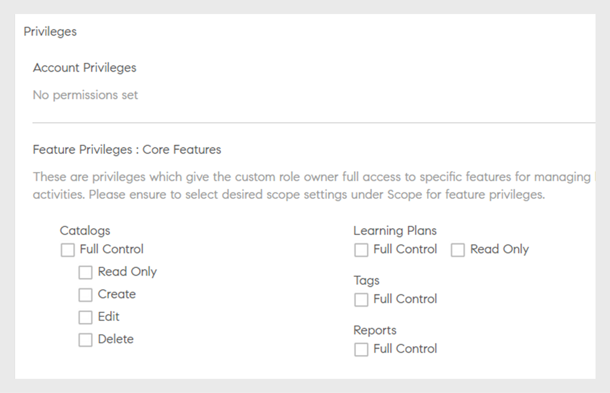
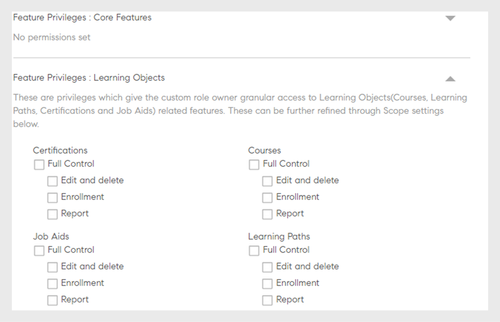

# Rôles personnalisés

Cette fonctionnalité vous aide à définir des rôles personnalisés et à affecter des responsabilités spécifiques à un ensemble d’utilisateurs. Cette fonction vous permet d&#39;attribuer des responsabilités en dehors du rôle existant de la personne.

Vous pouvez créer un rôle personnalisé pour fournir des fonctionnalités de création limitées à un catalogue particulier. Vous pouvez également créer un rôle dédié à la gestion des rapports. Ces rôles peuvent ensuite être attribués à des personnes qui sont censées assumer ces responsabilités spécifiques.

## Créer un rôle personnalisé {#create-role}

1. Connectez-vous en tant qu’administrateur. Ouvrir **[!UICONTROL Utilisateurs]** > **[!UICONTROL Rôle personnalisé]**.
1. Sélectionner **[!UICONTROL Créer un rôle]**. Le **[!UICONTROL Créer un rôle]** l’onglet s’ouvre.

   

   *Créer un rôle personnalisé*

1. Saisissez le nom dans le champ **[!UICONTROL Nom du rôle]** champ.
1. **[!UICONTROL Privilèges de compte]**: ces privilèges donnent aux propriétaires des rôles l’accès à des aspects spécifiques de la configuration du système et qui agissent sur l’ensemble du compte. Choisissez les autorisations d’accès. L’utilisateur a un contrôle total sur les autorisations attribuées.

>[!NOTE]
>
>   La portée ne s’applique pas à ces privilèges.

*Définir la portée*

1. **Droits de fonctionnalités - fonctionnalités de base**: utilisé pour accorder l’accès à des fonctionnalités spécifiques de gestion des activités d’apprentissage. Cette option permet d’accorder des autorisations pour les fonctionnalités suivantes.

   * Catalogues
   * Rapports
   * Balises

   

   *Définir l&#39;étendue des catalogues, rapports et balises*

1. **Droits de fonctionnalité - Objets d’apprentissage :**  Utilisez cette option pour donner accès aux fonctionnalités liées aux objets d’apprentissage. Vous pouvez fournir l’accès aux objets d’apprentissage suivants.

   * Certifications
   * Cours
   * Assistances à la tâche
   * Programmes d’apprentissage

   Vous pouvez également accorder un contrôle d’opération spécifique pour les objets d’apprentissage. L’autorisation peut être l’une des suivantes :

   * Contrôle total
   * Modifier et supprimer
   * Inscription
   * Signaler

   

   *Octroi d’autorisations spécifiques*

1. **Portée des privilèges de fonctionnalité :** La portée des privilèges de fonctionnalité alloués à ce rôle peut être limitée à un groupe d’utilisateurs spécifique ou à un ou plusieurs catalogues.

   Catalogues : utilisez la case d’option pour contrôler **[!UICONTROL Tous les catalogues]** ou utilisez **[!UICONTROL Définir l’accès par catalogue]** pour donner accès à des catalogues spécifiques. Vous pouvez également sélectionner plusieurs catalogues.

   Groupes d’utilisateurs : permet d’accéder à **[!UICONTROL Tous les groupes d’utilisateurs]** ou utilisez **[!UICONTROL Définir l’accès par groupe d’utilisateurs]** pour fournir l’accès à des groupes d’utilisateurs spécifiques. Un seul groupe d’utilisateurs peut être spécifié.

   >[!NOTE]
   >
   >Si vous avez sélectionné Annonce, Ludification, Modèles d’e-mail, Compétences et Utilisateurs sous Privilèges de compte, l’accès Groupe d’utilisateurs est fourni à tous les groupes d’utilisateurs par défaut et cette option est désactivée.

   Si vous avez sélectionné Plans d&#39;apprentissage sous Privilèges de compte, l&#39;accès à tous les catalogues et groupes d&#39;utilisateurs est fourni par défaut et ces options sous Portée sont désactivées.

   

   *Définition de l’étendue des privilèges*

>[!NOTE]
>
>   Dans Learning Manager 27.6, vous pouvez créer un rôle personnalisé dont la portée s’étend à plusieurs catalogues disposant chacun d’ensembles d’autorisations différents.

Pour accorder diverses autorisations aux catalogues, procédez comme suit :

1. Cliquez sur l’option **[!UICONTROL Définir l’accès par catalogue]**.
1. Choisissez les catalogues et vous pouvez voir le niveau d’autorisation pour chaque catalogue. Les autorisations sont les suivantes :

   <table>
        <tbody>
        <tr>
          <td>
          
<b>Autorisation</b>
</td>
          <td>
          
<b>Description</b>
</td>
        </tr>
        <tr>
          <td>
          
Contrôle total
</td>
          <td>
          
Permet un contrôle total sur tous les objets d’apprentissage. Les autorisations incluent Ajouter, Modifier, Supprimer, Lire, Inscrire et Rapport. 
</td>
        </tr>
        <tr>
          <td>
          
Signaler
</td>
          <td>
          
Accorde l’accès à l’onglet Rapports uniquement de l’objet d’apprentissage.
</td>
        </tr>
        <tr>
          <td>
          
S’inscrire
</td>
          <td>
          
Autorise uniquement l’inscription à l’objet d’apprentissage.
</td>
        </tr>
        <tr>
          <td>
          
Lecture seule
</td>
          <td>
          
Autorise uniquement l’affichage des objets d’apprentissage dans le catalogue.
</td>
        </tr>
        </tbody>
      </table>

1. Activez ou désactivez les autorisations en fonction de vos besoins.
1. Pour enregistrer les modifications, cliquez sur **[!UICONTROL OK]**. Ensuite, pour enregistrer les modifications pour le rôle personnalisé, cliquez sur **[!UICONTROL Enregistrer]**.

Prenons par exemple le scénario suivant.

L&#39;autorisation résultante, qu&#39;un utilisateur personnalisé aurait sur un objet d&#39;apprentissage, est une intersection de l&#39;autorisation de l&#39;objet d&#39;apprentissage et de l&#39;autorisation du catalogue.

Un utilisateur personnalisé dispose d&#39;une autorisation complète sur les cours et d&#39;un accès en lecture seule uniquement sur le catalogue A, mais d&#39;une autorisation complète sur le catalogue B. Les résultats sont un accès en lecture seule sur les cours du catalogue A et un contrôle total sur les cours du catalogue B.

Un utilisateur avec un rôle personnalisé peut :

* Afficher uniquement le contenu des catalogues auxquels il a accès.
* Accédez à n’importe quel objet d’apprentissage en fonction des autorisations du catalogue dont l’objet d’apprentissage fait partie.

En tant qu’administrateur, vous pouvez :

* Choisissez plusieurs catalogues pour un rôle personnalisé.
* Modifiez les autorisations d’un catalogue à tout moment.
* Supprimez les catalogues d’une étendue pour laquelle vous ne souhaitez plus accorder d’autorisations.
* Accordez implicitement l’autorisation Lecture seule à un catalogue lorsque vous accordez des autorisations au catalogue.

Le tableau ci-dessous illustre comment les autorisations sont accordées.

<table>
    <tbody>
     <tr>
      <td>
       
<strong> </strong>
</td>
      <td>
       
<strong>Autorisation au niveau du catalogue</strong>
</td>
     </tr>
     <tr>
      <td>
       
<strong>Autorisation au niveau de l’objet d’apprentissage</strong>

       
<strong>(Ex. : Cours)</strong>
</td>
      <td>
       
Contrôle total
</td>
      <td>
       
S’inscrire
</td>
      <td>
       
Signaler
</td>
      <td>
       
Lecture seule
</td>
     </tr>
     <tr>
      <td>
       
Contrôle total
</td>
      <td>
       
Contrôle total
</td>
      <td>
       
S’inscrire
</td>
      <td>
       
Signaler
</td>
      <td>
       
Lecture seule
</td>
     </tr>
     <tr>
      <td>
       
S’inscrire
</td>
      <td>
       
S’inscrire
</td>
      <td>
       
S’inscrire
</td>
      <td>
       
Lecture seule
</td>
      <td>
       
Lecture seule
</td>
     </tr>
     <tr>
      <td>
       
Modifier et supprimer
</td>
      <td>
       
Modifier et supprimer
</td>
      <td>
       
Lecture seule
</td>
      <td>
       
Lecture seule
</td>
      <td>
       
Lecture seule
</td>
     </tr>
     <tr>
      <td>
       
Signaler
</td>
      <td>
       
Signaler
</td>
      <td>
       
Lecture seule
</td>
      <td>
       
Signaler
</td>
      <td>
       
Lecture seule
</td>
     </tr>
    </tbody>
   </table>
1. **Utilisateurs :** utilisez cette option pour déterminer les utilisateurs auxquels ce rôle est attribué. Vous pouvez choisir un ou plusieurs utilisateurs à l’aide de la zone de recherche.

**Ajouter des utilisateurs au chargement CSV de rôle personnalisé :** Pour ajouter des utilisateurs via le chargement CSV, ajoutez une colonne CustomRole au fichier .csv que l’administrateur a utilisé pour importer des utilisateurs. Entrez le rôle de l’utilisateur dans la colonne CustomRole pour les utilisateurs auxquels vous souhaitez attribuer un rôle personnalisé. Pour charger le fichier CSV, cliquez sur  **[!UICONTROL Ajouter > Charger un fichier CSV]**.

CustomRole columnNote :

* Vous ne pouvez pas rechercher dans les groupes d’utilisateurs.
* Vous ne pouvez pas rechercher les utilisateurs auxquels un rôle Administrateur a déjà été attribué.
* L’affectation d’un nouveau rôle personnalisé à un utilisateur remplace le rôle personnalisé précédent de l’utilisateur.

<!---->

* Un administrateur personnalisé ayant l’autorisation d’accéder à Paramètres pourra configurer la planification pour la synchronisation ou synchroniser les utilisateurs à partir de la source de données même s’ils n’ont pas l’autorisation d’accéder à l’entité Utilisateurs.
* Si un administrateur personnalisé dispose d’une autorisation sur l’entité Utilisateurs, il peut s’attribuer un rôle d’administrateur et devenir un administrateur standard.

## Restreindre l’accès au dossier pour les auteurs personnalisés {#folder-custom-author}

Learning Manager prend déjà en charge la possibilité de donner accès à la bibliothèque de contenu à l’aide de rôles personnalisés. Tous les auteurs personnalisés qui ont déjà accès à la bibliothèque de contenu continueront d’avoir accès à tous les fichiers de contenu même après la configuration des dossiers de contenu. Il s’agit de conserver le comportement hérité. Les administrateurs n’ont pas besoin d’apporter de modifications s’ils souhaitent continuer à adopter le comportement actuel.

S’ils souhaitent restreindre l’accès à ces auteurs personnalisés, les administrateurs doivent modifier le rôle personnalisé existant et le configurer en ne donnant accès qu’à des dossiers de contenu spécifiques.

*Restreindre l’accès au dossier pour les auteurs personnalisés*

Lors de la création d’un auteur personnalisé, vous pouvez désormais lui attribuer des dossiers de contenu. Choisir l’option **Dossiers sélectionnés**.

Après avoir cliqué sur l’option, une nouvelle boîte de dialogue s’ouvre, dans laquelle vous pouvez attribuer les dossiers à l’auteur personnalisé.

*Sélectionner les dossiers de l’auteur personnalisé*

Sélectionnez les dossiers et cliquez sur **[!UICONTROL OK]**.

## Tableau de bord Résumé de l’apprentissage pour l’administrateur personnalisé {#custom-admin-dashboard}

Les administrateurs personnalisés peuvent afficher la même vue que les autres utilisateurs. Un administrateur personnalisé peut stocker des données en dehors de son périmètre. Cela s’applique uniquement si l’administrateur personnalisé a une portée complète. Pour accorder une portée complète, lors de la création d’un administrateur personnalisé, activez l’option **[!UICONTROL Contrôle total]** dans Rapport récapitulatif du compte.

*Créer un rôle personnalisé*

Par conséquent, les options, **[!UICONTROL Tous les catalogues]** et **[!UICONTROL Tous les groupes d’utilisateurs]** sera sélectionné et le reste désactivé.

*Définition de l’étendue des privilèges*

## Autorisations implicites {#implicitpermissions}

Lorsqu&#39;un utilisateur se voit attribuer un rôle avec une entité spécifique, il peut y avoir des cas où il a besoin d&#39;accéder à d&#39;autres entités également pour pouvoir effectuer des tâches sur l&#39;entité accordée. Par exemple, si un utilisateur dispose d’un accès Créer sur l’entité Cours, il doit avoir accès aux entités Compétence et Balise afin de pouvoir les associer au cours en cours de création. Ce tableau fournit des informations sur ces autorisations implicites.

<table>
 <tbody>
  <tr>
   <th>Type d’accès</th>
   <th>Autorisation d’entité accordée par l’administrateur</th>
   <th>Autorisation d'entité implicite</th>
   <th>Accès implicite</th>
  </tr>
  <tr>
   <td>Gérer</td>
   <td>Utilisateur</td>
   <td>Groupe</td>
   <td>Grossier</td>
  </tr>
  <tr>
   <td>S’inscrire</td>
   <td>Toutes les pertes (cours, aide à l'emploi, programme d'apprentissage, certification)</td>
   <td>Utilisateur 
     Plan d’apprentissage</td>
   <td>Lecture</td>
  </tr>
  <tr>
   <td>Créer</td>
   <td>
    
Groupe de contenus 
      Assistance à la tâche 
</td>
   <td>Balise</td>
   <td>Lecture</td>
  </tr>
  <tr>
   <td>Créer</td>
   <td>Cours</td>
   <td>Groupe de contenus 
     Balise 
     Compétence 
     Badge 
     Assistance à la tâche</td>
   <td>Lire sur tout</td>
  </tr>
  <tr>
   <td>Créer</td>
   <td>Programme d’apprentissage 
     Certification </td>
   <td>Cours 
     Balise 
     Compétence 
     Badge</td>
   <td>Lecture</td>
  </tr>
  <tr>
   <td>Créer</td>
   <td>Plan d’apprentissage</td>
   <td>Catalogue 
     Groupe 
     Compétence 
     Toutes les pertes (cours, aide à l'emploi, programme d'apprentissage, certification)</td>
   <td>Lecture</td>
  </tr>
  <tr>
   <td>Créer</td>
   <td>Annonce</td>
   <td>Utilisateur 
     Groupe 
     Toutes les pertes (cours, aide à l'emploi, programme d'apprentissage, certification)</td>
   <td>Lecture</td>
  </tr>
  <tr>
   <td>Créer</td>
   <td>Ludification</td>
   <td>Branding</td>
   <td>Écriture</td>
  </tr>
  <tr>
   <td>*</td>
   <td>Utilisateur</td>
   <td>Facturation</td>
   <td>Lecture</td>
  </tr>
  <tr>
   <td>*</td>
   <td>Catalogue</td>
   <td>Groupe 
     Toutes les pertes (cours, aide à l'emploi, programme d'apprentissage, certification)</td>
   <td>Lecture</td>
  </tr>
  <tr>
   <td>*</td>
   <td>Paramètre</td>
   <td>Branding 
     Utilisateur</td>
   <td>Lecture</td>
  </tr>
  <tr>
   <td>*</td>
   <td>Branding</td>
   <td>Paramètre</td>
   <td>Lecture</td>
  </tr>
  <tr>
   <td>*</td>
   <td>Facturation 
     Ludification</td>
   <td>Utilisateur</td>
   <td>Lecture</td>
  </tr>
 </tbody>
</table>

## Accès à un rôle personnalisé {#accessacustomrole}

Lorsqu’un administrateur attribue un rôle personnalisé, vous recevez une notification par e-mail.

Remarque : si vous êtes déjà connecté à Learning Manager sous un rôle personnalisé, vous devrez vous reconnecter à Learning Manager pour accéder au nouveau rôle.

Pour basculer entre les rôles, cliquez sur l’icône de profil dans le coin supérieur droit de Learning Manager et sélectionnez le rôle.

## Portée des plans d’apprentissage définie en fonction de rôles configurables {#scopeconfigure}

Dans les versions antérieures de Learning Manager, tout rôle personnalisé autorisé à créer des plans d&#39;apprentissage pouvait étendre le plan d&#39;apprentissage à tous les types de groupes d&#39;utilisateurs et d&#39;objets d&#39;apprentissage.

Le paramètre d&#39;étendue était désactivé lorsque l&#39;accès au plan d&#39;apprentissage était accordé, ce qui donnait à l&#39;utilisateur l&#39;accès à Tous les catalogues et Tous les groupes d&#39;utilisateurs par défaut.

Tous les plans d’apprentissage créés par un administrateur, par défaut, s’appliquent à tous les utilisateurs. Les utilisateurs peuvent également se voir attribuer n’importe quel objet d’apprentissage. D&#39;autre part, les utilisateurs avec des rôles personnalisés ont accès à des portées complètes, par exemple, tous les catalogues, objets d&#39;apprentissage ou groupes d&#39;utilisateurs. Cela signifiait que les administrateurs n’étaient pas en mesure de créer des rôles personnalisés comme prévu, qui permettaient d’accéder aux plans d’apprentissage pour les utilisateurs avec une portée limitée.

Dans cette mise à jour de Learning Manager, vous pouvez créer des rôles personnalisés pour les plans d&#39;apprentissage qui permettent de définir la portée des utilisateurs et des objets d&#39;apprentissage. En d’autres termes, les plans d’apprentissage peuvent être créés avec une portée limitée dérivée de la portée du rôle d’un administrateur personnalisé.

Désormais, un administrateur peut définir ou restreindre la portée tout en accordant un accès en tant que responsable du plan d&#39;apprentissage.

Les administrateurs personnalisés peuvent créer des plans d’apprentissage avec une portée limitée, déterminée par la portée du rôle configurable de l’administrateur personnalisé. Ces plans d’apprentissage sont uniquement accessibles aux administrateurs personnalisés ayant le même rôle, en plus d’être accessibles aux administrateurs réguliers. En outre, les administrateurs personnalisés ne peuvent pas voir d’autres plans d’apprentissage dans le compte.

Les administrateurs personnalisés existants qui ont accès aux plans d’apprentissage auront toujours une portée complète (par définition). Ils auront accès à tous les plans d’apprentissage du compte, tout comme les administrateurs habituels. Les nouveaux rôles personnalisés créés avec une portée complète et les nouveaux administrateurs personnalisés ajoutés à ces rôles continueront d&#39;avoir accès à tous les plans d&#39;apprentissage.

Les plans d’apprentissage créés par les administrateurs et les administrateurs personnalisés avec une portée complète seront créés comme d’habitude et ne seront pas limités par la portée.

Dans la section **Portée des privilèges de fonctionnalité**, accordez l’accès aux groupes d’utilisateurs et/ou au catalogue pour le rôle personnalisé.

*Octroyer l’accès aux groupes d’utilisateurs et/ou au catalogue pour le rôle personnalisé*

Attribuez un utilisateur au rôle personnalisé.

*Affectation d’un utilisateur à un rôle personnalisé*

L’utilisateur se connecte désormais à Learning Manager en tant qu’administrateur personnalisé et ajoute désormais un plan d’apprentissage.

Lorsqu’un nouvel élève est ajouté, l’administrateur personnalisé peut uniquement sélectionner une formation à partir des catalogues étendus du rôle configurable.

Ce plan d&#39;apprentissage ne s&#39;applique désormais à l&#39;élève que si l&#39;utilisateur est également ajouté au groupe au sein du groupe d&#39;utilisateurs de la portée du plan d&#39;apprentissage. Tous les autres élèves sont exemptés de ce plan d’apprentissage.

## L’élève est ajouté au groupe {#learnergetsaddedtothegroup}

<!---->

L’administrateur personnalisé peut sélectionner n’importe quel groupe d’utilisateurs ayant des utilisateurs dans le groupe d’utilisateurs dont la portée est celle du rôle.

Lorsqu&#39;un utilisateur est ajouté au groupe spécifié, seuls les utilisateurs qui font déjà partie du groupe d&#39;utilisateurs étendu du plan d&#39;apprentissage et qui n&#39;ont pas été ajoutés au groupe d&#39;utilisateurs spécifié se verront attribuer l&#39;objet d&#39;apprentissage.

## Modification de l’étendue {#changeinscope}

Lorsque l’administrateur modifie l’étendue du rôle personnalisé, la modification est également répercutée sur l’administrateur personnalisé. Lorsque l’administrateur personnalisé choisit un plan d’apprentissage dont la portée était déjà définie par un rôle personnalisé précédent, un message s’affiche, comme indiqué ci-dessous :

*Message après les modifications de l’étendue*

L’administrateur personnalisé doit maintenant mettre à jour ou actualiser l’étendue précédente vers la nouvelle étendue.

Clic **[!UICONTROL Actualiser la portée]** met à jour la portée. Un message d’avertissement s’affiche.

*Message d’avertissement après l’actualisation d’une portée*

Clic **[!UICONTROL Oui]** met à jour la portée.

## Ajouter un rapport de ludification à un rôle personnalisé {#gamification-custom}

Un administrateur peut activer les rapports de ludification pour un utilisateur personnalisé.

1. Dans le panneau **[!UICONTROL Rôles personnalisés]** , saisissez le nom du rôle personnalisé.
1. Dans le panneau **[!UICONTROL Privilèges de fonctionnalité : fonctionnalités principales]** section, activer l’option **[!UICONTROL Contrôle total]** pour la catégorie **[!UICONTROL Rapports]**.

1. Dans la section **[!UICONTROL Utilisateurs]**, sélectionnez l’utilisateur auquel sera attribué le rôle personnalisé nouvellement créé.
1. Cliquez sur **[!UICONTROL Enregistrer]**.

Lorsqu’un utilisateur se connecte en tant qu’administrateur personnalisé et clique sur **[!UICONTROL Rapports]** dans le volet de gauche, les transcriptions s’affichent, comme indiqué ci-dessous :

*Télécharger les transcriptions de ludification*

Cliquez sur **[!UICONTROL Transcriptions de ludification]**, choisissez un utilisateur et générez le rapport.

Si un administrateur modifie les points de niveau, les rapports affichent les niveaux en fonction des points actuels.

La réinitialisation de la ludification ne réinitialise pas le niveau atteint à la date spécifiée.

## Foire aux questions {#frequentlyaskedquestions}

+++Comment créer un rôle personnalisé ?

Un rôle personnalisé est comparable à un sous-ensemble d’un rôle d’auteur ou d’administrateur. Autorisez un ou plusieurs privilèges, définissez l’étendue et attribuez le rôle à un utilisateur.

Cliquez sur **[!UICONTROL Utilisateurs]** > **[!UICONTROL Rôles personnalisés]**. Dans la page Rôles personnalisés, cliquez sur **[!UICONTROL Créer un rôle]**. Entrez le nom du rôle personnalisé et définissez les privilèges du rôle. Pour plus d’informations, voir [Créer un rôle personnalisé](custom-role.md#create-role).
+++
