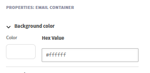
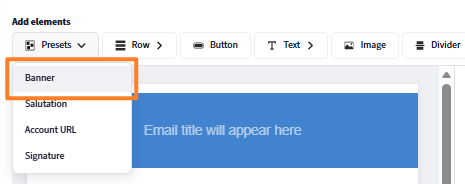
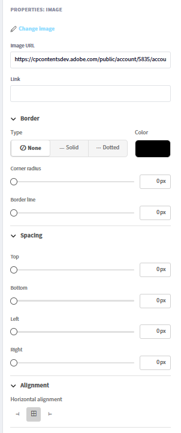
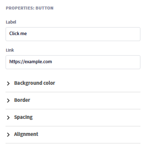

## Créateur d’e-mails basé sur des composants

Adobe Learning Manager comprend un créateur d’e-mails basé sur des composants qui permet aux administrateurs et aux auteurs de créer des e-mails de marque professionnelle à l’aide d’un éditeur visuel moderne, sans HTML d’écriture. Chaque e-mail envoyé par votre organisation, des confirmations d’inscription aux rappels de session, peut correspondre précisément à l’apparence de votre marque.

**Pour les administrateurs :** concevez une mise en page globale une fois*, un en-tête et un pied de page réutilisables qui enveloppe automatiquement chaque e-mail, puis personnalisez les modèles individuels selon vos besoins. Composez des e-mails dans un éditeur glisser-déposer en ligne à l’aide de composants riches : texte avec mise en forme de texte riche complète, images, bannières, boutons, liens vers les médias sociaux, diviseurs, etc.

**Pour les auteurs :** appliquez les mêmes fonctionnalités d&#39;éditeur aux courriers électroniques dont la portée s&#39;étend à des cours et instances spécifiques, afin que les communications de formation puissent être adaptées à chaque expérience d&#39;apprentissage sans affecter les paramètres du compte.

Le générateur prend en charge un modèle hiérarchique : le même modèle de courrier électronique peut être configuré au niveau de l’instance, du cours ou du compte. Lorsqu’un modèle n’a pas été modifié individuellement, il hérite automatiquement des paramètres de son niveau parent. Lorsque vous avez besoin d’une conception entièrement personnalisée, vous dissociez le modèle et prenez le contrôle total. Un aperçu intégré vous permet de vérifier exactement comment un e-mail apparaîtra dans les boîtes de réception des destinataires avant son envoi.

## Fonctionnement du système de modèles de courrier électronique

Chaque e-mail sortant dans Adobe Learning Manager se compose de trois parties structurelles :

* **En-tête :** l&#39;image ou la couleur de la bannière et le nom de l&#39;organisation
* **Corps :** la zone de contenu dynamique unique à chaque type d&#39;e-mail ; contient le texte du message et les espaces réservés des variables
* **Pied de page :** l’URL du compte, la signature électronique, le lien d’aide et d’autres éléments

La **disposition globale** est la conception principale appliquée à plus de 130 modèles de courrier électronique simultanément. Lorsque vous mettez à jour la mise en page globale, chaque modèle qui lui est toujours lié reflète automatiquement la modification. Les modèles peuvent être dissociés de la mise en page globale à tout moment pour une personnalisation indépendante.

### Hiérarchie des e-mails

Les paramètres et la conception passent d’un niveau supérieur à des niveaux inférieurs par héritage. Chaque niveau peut remplacer ou personnaliser entièrement ce dont il hérite.

| Niveau | Qui le configure ? | État par défaut | Éléments modifiables |
| --- | --- | --- | --- |
| **Disposition globale** | L’administrateur | Racine ; pas de parent | Disposition complète : toutes les parties, tous les composants |
| **Modèle d’e-mail de compte** | Administrateur | Lié à la disposition globale | Corps uniquement (lié) ; mise en page complète (non lié) |
| **Mise en page de l’objet d’apprentissage par l’auteur** | Auteur | Lié au modèle de compte | Mise en page complète à la portée de l’objet d’apprentissage |
| **Modèle d’e-mail d’authentification d’auteur** | Auteur | Lié à la mise en page LO | Corps uniquement (lié) ; mise en page complète (non lié) |
| **Modèle d’e-mail de l’auteur et de l’instance** | Auteur | Lié au modèle objet d’apprentissage | Corps uniquement (lié) ; mise en page complète (non lié) |

### Règles d’héritage de base

* Chaque niveau commence à être lié à son parent immédiat jusqu’à ce qu’il soit explicitement modifié.
* La modification du **corps** d&#39;un modèle ne dissocie pas ce dernier. L’en-tête et le pied de page continuent de refléter le parent.
* La modification de la **disposition** ou la sélection de **Dissocier** rompt la connexion parente pour ce modèle uniquement.
* **Rétablir l&#39;original** relie le modèle à son parent et réinitialise la disposition et le corps à la version parent.
* La dissociation à un niveau n’a aucun effet sur les niveaux situés au-dessus ou en dessous.

## Configuration de la disposition globale

La mise en page globale définit l’en-tête, le pied de page et l’enveloppe structurelle partagés qui sont placés dans chaque e-mail lié. Configurez-le d’abord pour que tous les modèles commencent par un branding cohérent.

### Ouvrir l’éditeur de mise en page globale

1. Connectez-vous à Adobe Learning Manager en tant qu’administrateur.
2. Dans le volet de navigation de gauche, sélectionnez **Modèles de courrier électronique**.
3. Sélectionnez l&#39;onglet **Disposition globale**.

   La zone de travail de l’éditeur se charge avec la disposition globale actuelle. La zone **Corps dynamique**, affichée en tant qu&#39;espace réservé au centre, représente la zone dans laquelle le contenu de message unique de chaque modèle apparaît. Vous ne pouvez pas modifier le corps dynamique à partir de la disposition globale.

   

### Configuration du conteneur de courrier électronique

Le conteneur d’e-mails est l’enveloppe externe de chaque e-mail. Ses paramètres affectent le cadre visuel autour de tout le contenu.

1. Sélectionnez **Modifier** près de **Disposition globale des e-mails**
2. Sélectionnez le conteneur de courrier électronique sur la zone de travail.
3. Dans le panneau **Propriétés** à droite, définissez les paramètres suivants :
   * **Couleur d&#39;arrière-plan :** la couleur derrière tout le contenu du courrier électronique

   

   * **Bordure :** style, largeur et couleur de la bordure extérieure

   

   * **Espacement :** remplissage autour des directions du contenu du courrier électronique

   

   * **Espacement des lignes :** l&#39;écart vertical appliqué entre toutes les lignes de la disposition

   

### Utilisation des lignes et des colonnes

Tout le contenu de l&#39;éditeur de courrier électronique est placé dans **lignes**. Chaque ligne contient une ou plusieurs **colonnes** et chaque colonne contient un ou plusieurs **composants**.

Pour ajouter une ligne :

1. Sélectionnez **Ligne** en haut de la zone de travail.

   

2. Sélectionnez une disposition de colonnes : **1 colonne**, **2 colonnes**, **3 colonnes** ou **4 colonnes**.

   

   La nouvelle ligne apparaît sur la zone de travail prête pour les composants.

Pour configurer une ligne :

1. Sélectionnez la ligne sur la zone de travail.

   

2. Dans le panneau **Propriétés**, définissez :
   * **Couleur d&#39;arrière-plan :** arrière-plan au niveau de la ligne, remplace la couleur du conteneur pour cette ligne
   * **Bordure :** style, largeur et couleur de la bordure de ligne
   * **Espacement :** écart horizontal entre les colonnes de cette ligne

   

**Pour réorganiser les lignes :**

* Faites glisser une ligne par sa poignée (affichée lorsque vous survolez le bord gauche) pour la déplacer vers le haut ou vers le bas.

**Pour supprimer une ligne :**

* Sélectionnez la ligne et sélectionnez l&#39;icône **Supprimer** dans la barre d&#39;outils de la ligne.

### Ajout et organisation des composants

Les composants sont des blocs fonctionnels du contenu des e-mails. Faites-les glisser depuis le panneau **Composants** en haut et déposez-les dans n&#39;importe quelle cellule de colonne. Utilisez le panneau **Propriétés** sur la gauche pour personnaliser le composant sélectionné.

Lorsque vous faites glisser et déposez un composant, un indicateur « + » bleu indique où le composant peut être placé.

**Pour ajouter un composant :**

1. Dans le panneau Composant, recherchez le composant souhaité.

   

2. Faites-le glisser dans une cellule de colonne de la zone de travail.

   

3. Le composant est ajouté à cette cellule. Sélectionnez-le pour ouvrir ses propriétés dans le panneau de droite.

   

**Pour déplacer un composant :**

* Faites glisser le composant par sa poignée vers une position de colonne ou de ligne différente.

**Pour supprimer un composant :**

* Sélectionnez le composant et sélectionnez l&#39;icône **Supprimer** dans la barre d&#39;outils du composant.

### Modification des composants prédéfinis

La **disposition globale** inclut des composants prédéfinis intégrés qui correspondent aux champs partagés configurés dans les paramètres de messagerie. Les composants prédéfinis peuvent être modifiés directement sur la zone de travail ou supprimés entièrement.

| Composant prédéfini | Contenu par défaut | Peut être supprimé ? |
| --- | --- | --- |
| **Bannière** | Image ou couleur de bannière par défaut | Oui |
| **Salutation** | « Bonjour {{user}}, » | Oui |
| **Corps dynamique** | Espace réservé pour le contenu par modèle | Non- obligatoire |
| **URL du compte** | URL de la plateforme de votre compte | Oui |
| **Signature** | Texte de signature configuré | Oui |

**Pour modifier un composant prédéfini :**

1. Ajoutez le composant prédéfini, par exemple la bannière.

   

2. Sélectionnez la bannière sur la zone de travail.
3. Dans le panneau **Propriétés**, modifiez la police, la taille de police et d&#39;autres propriétés visuelles de la bannière .

   

**Pour supprimer un composant prédéfini de tous les e-mails :**

1. Sélectionnez le composant prédéfini sur la zone de travail.
2. Sélectionnez **Supprimer** dans la barre d&#39;outils du composant.

La suppression d’un composant prédéfini de la mise en page globale le supprime de chaque e-mail lié. Les modèles non liés conservent le composant jusqu’à ce que vous le supprimiez manuellement de chacun d’eux.

### Enregistrement de la disposition globale

Sélectionnez **Enregistrer** une fois votre mise en page terminée. La mise à jour est immédiatement appliquée à tous les modèles d’e-mail qui sont toujours liés à la mise en page globale.

## Configuration des paramètres prédéfinis de messagerie globale

Définissez des éléments courants tels qu’une bannière, une formule de salut et une signature à réutiliser dans vos e-mails. Ils peuvent être utilisés dans la mise en page globale ou dans des modèles de courrier électronique individuels basés sur des événements dans Adobe Learning Manager. Les modifications apportées ici sont automatiquement reflétées partout où ces paramètres prédéfinis sont utilisés. Vous pouvez également choisir de remplacer ces paramètres prédéfinis et de concevoir des éléments personnalisés directement dans l’outil de création d’e-mails.

Configurez les éléments suivants :

### Bannière de l’adresse électronique

1. Sélectionnez **Modifier** en regard de **Bannière d&#39;e-mail.**
2. Chargez une image de bannière ou définissez une couleur d’arrière-plan unie.

   

3. Sélectionnez **Enregistrer.**

### Formule de politesse de l’e-mail

1. Sélectionnez **Modifier** en regard de **Salutation par e-mail**
2. La valeur par défaut est « Bonjour {{user}} ». La variable {{user}} renseigne avec le nom du destinataire à l’exécution.

   

3. Modifiez le texte de salutation ou supprimez complètement la salutation.
4. Sélectionnez **Enregistrer**.

### URL du compte

1. Sélectionnez **Modifier** en regard de **URL du compte**.
2. Saisissez l’URL de votre plate-forme d’apprentissage ; elle apparaît dans tous les e-mails sortants.

   

3. Sélectionnez **Enregistrer**.

### Signature de l’adresse électronique

1. Sélectionnez **Modifier** en regard de **Signature par e-mail**
2. Entrez le texte de fin.

   

3. Sélectionnez **Enregistrer**.

## Ajout et configuration de composants individuels

### Composant de texte

Le composant de texte prend en charge l’édition de texte enrichi complet.

1. Faites glisser un composant de **texte** dans une cellule de colonne.
2. Sélectionnez-le pour passer en mode de modification.

   

3. Tapez ou collez votre contenu.
4. Appliquez les options de mise en forme suivantes :
   * **Police :** faites votre choix parmi les polices web sécurisées (Arial, Helvetica, Georgia et autres) ou les polices personnalisées configurées pour votre compte
   * **Taille :** taille de police en points
   * **Gras**, **Italique**, **Souligné**, **Barré**
   * **Exposant** et **Indice**
   * **Couleur du texte** et **Couleur d&#39;arrière-plan** (surbrillance du texte)
   * **Alignement :** à gauche, au centre, à droite ou justifier
   * **Interligne :** multiplicateur de hauteur de ligne
   * **Remplissage horizontal et vertical :** espacement interne dans le bloc de texte
5. Pour ajouter un hyperlien :
   * Sélectionnez le texte à lier
   * Sélectionnez l&#39;icône **Lien** dans la barre d&#39;outils
   * Saisir l’URL de destination

   

6. Sélectionnez **Appliquer**

### Composant d’image

1. Faites glisser un composant **Image** dans une cellule de colonne.
2. Sélectionnez **Charger** pour charger un nouveau fichier image (JPEG et GIF pris en charge) ou sélectionnez **Parcourir** pour faire votre choix dans votre bibliothèque d&#39;images.
3. Avec l’image sélectionnée, configurez :

   

   * **Modifier l&#39;image :** chargez une nouvelle image ou remplacez l&#39;image actuellement sélectionnée.
   * **URL de l&#39;image :** spécifie l&#39;URL source de l&#39;image à afficher. L’image est chargée à partir de cet emplacement.
   * **Lien :** ajoute un hyperlien cliquable à l&#39;image. Les utilisateurs sont redirigés vers l’URL spécifiée lorsque l’utilisateur clique sur l’image.
   * **Type de bordure :** définit le style de la bordure de l&#39;image. Les options disponibles sont les suivantes : Aucun, Continu et Pointillé.
   * **Couleur de la bordure :** définit la couleur de la bordure de l&#39;image lorsqu&#39;un style de bordure est appliqué.
   * **Rayon :** contrôle l&#39;arrondi des angles de l&#39;image. Des valeurs élevées créent des angles plus arrondis.
   * **Ligne de bordure :** ajuste l&#39;épaisseur (largeur) de la bordure de l&#39;image.
   * **Espacement supérieur :** ajoute de l&#39;espace au-dessus de l&#39;image.
   * **Espacement inférieur :** ajoute de l&#39;espace sous l&#39;image.
   * **Espacement à gauche :** ajoute de l&#39;espace à gauche de l&#39;image.
   * **Espacement à droite :** ajoute de l&#39;espace à droite de l&#39;image.
   * **Alignement horizontal :** détermine la position de l&#39;image dans son conteneur. Les options incluent généralement l’alignement à gauche, au centre et à droite.

### Composant Button

1. Faites glisser un composant **Button** dans une cellule de colonne.
2. Sélectionnez-le et configurez :

   

   * **Libellé :** le texte du bouton
   * **Lien :** URL de destination lorsque l&#39;utilisateur clique sur le bouton
   * **Police :** famille et taille de police pour l’étiquette du bouton
   * **Couleur du texte :** couleur du libellé
   * **Couleur d&#39;arrière-plan :** couleur de remplissage du bouton
   * **Taille :** largeur et hauteur du bouton
   * **Style d&#39;angle :** arrondi, carré ou circulaire
   * **Alignement :** à gauche, au centre ou à droite dans la colonne
   * **Remplissage :** espacement interne entre le texte de l&#39;étiquette et les bords du bouton

### Composants de séparation et d’espacement

**Séparateur :** ajoute une ligne horizontale visible entre les sections de contenu.

1. Faites glisser un composant **Diviseur** dans une colonne.
2. Définissez le **style de ligne** (continu, en pointillés, en pointillés), la **couleur**, la **largeur** et la **hauteur** (espace vertical au-dessus et au-dessous de la ligne) dans le panneau Propriétés.

   **Espaceur :** ajoute un espace vertical invisible entre les éléments sans ligne visible.

3. Faites glisser un composant d&#39;**espacement** et définissez sa **hauteur** dans le panneau Propriétés.

## Insertion et gestion de variables

Les variables sont des espaces réservés dynamiques remplacés par des données réelles lorsqu’un e-mail est envoyé. Les variables disponibles dépendent du type de modèle spécifique. Un e-mail de confirmation d’inscription comporte des variables différentes d’un rappel de session.

### Insertion d’une variable à l’aide du sélecteur

1. Placez votre curseur dans un composant de texte à l’endroit où vous souhaitez que la variable apparaisse.
2. Sélectionnez **Insérer une variable** dans la barre d&#39;outils de l&#39;éditeur de texte. Le sélecteur de variables s’ouvre et affiche toutes les variables disponibles pour ce type de modèle.
3. Sélectionnez une variable. Par exemple, **Nom du cours**, **Nom de l’élève** ou **Nom du parcours d’apprentissage**.

   

### Insertion d’une variable par saisie

Saisissez le nom de la variable directement entre doubles accolades : {\{variable_name}\}. L’éditeur le reconnaît automatiquement et le met en surbrillance en tant que jeton de variable.

**Exemples de variables courantes :**

| Variable | Remplacé par |
| --- | --- |
| Nom complet du destinataire | {\{learnerName}\} |
| Adresse e-mail du destinataire | {\{learnerEmail}\} |
| Nom d’utilisateur du destinataire | {\{user}\} |
| Type d’utilisateur | {\{userType}\} |
| Nom de l’organisation | {\{organizationName}\} |
| Nom du cours | {\{courseName}\} |
| Description du cours | {\{courseDescription}\} |
| Auteur du cours | {\{courseAuthor}\} |
| Lien vers le cours | {\{courseLink}\} |
| Compétences requises pour le cours | {\{courseSkillDetails}\} |
| Badges dans le cours | {\{courseBadge}\} |
| Date limite d’inscription au cours | {\{courseEnrollmentDeadline}\} |
| Échéance d’achèvement du cours | {\{courseCompletionDeadline}\} |
| Date d’achèvement du cours | {\{courseCompletionDate}\} |
| Nom du parcours d’apprentissage | {\{LPName}\} |
| Lien du parcours d’apprentissage | {\{LPLink}\} |
| Échéance d’inscription au parcours d’apprentissage | {\{LPEnrollmentDeadline}\} |
| Échéance d’achèvement du parcours d’apprentissage | {\{LPCompletionDeadline}\} |
| Date d’achèvement du parcours d’apprentissage | {\{LPCompletionDate}\} |
| Nom de la certification | {\{certificationName}\} |
| Date limite d’inscription à la certification | {\{certificationEnrollmentDeadline}\} |
| Date d’achèvement de la certification | {\{certificationCompletionDate}\} |
| Durée de l’échéance du cours | {\{deadlineDuration}\} |
| Durée d’expiration du cours | {\{expiryDuration}\} |
| Date d’expiration du cours | \{\{expiryDate\}\} |
| Nom de la session | \{sessionName\}\} |
| Date de début de la session | \{\{sessionDate\}\} |
| Date de fin de la session | \{\{endSessionDate\}\} |
| Heure de début de la session | \{sessionTime\}\} |
| Heure de fin de la session | \{\{endSessionTime\}\} |
| Nom du lieu | \{\{venueName\}\} |
| Informations sur le lieu | \{\{venueInfo\}\} |
| URL du lieu | \{\{venueURL\}\} |
| Région du lieu | \{\{venueRegion\}\} |
| URL de classe virtuelle | \{\{vcUrl\}\} |
| Compte de fournisseur de salle de classe virtuelle requis | \{\{VCProviderAccountReq\}\} |
| Nom du formateur | \{\{instructorName\}\} |
| Nom du module | \{moduleName\}\} |
| Nom de l’objet d’apprentissage | \{\{learningObjectName\}\} |
| Date d’achèvement de l’objet d’apprentissage | \{\{loCompletionDate\}\} |
| Autres noms d’objets d’apprentissage | \{\{alternateLoNameList\}\} |
| Autres liens d’objets d’apprentissage | \{\{alternateLoNameListLinks\}\} |
| Autre objet d’apprentissage supprimé | \{\{removedAlternateLog\}\} |
| Texte prérequis | \{\{preRequisiteText\}\} |
| Nombre de conditions préalables requises | \{\{preRequisiteCountText\}\} |
| Nom de l&#39;élément de configuration | \{\{ciName\}\} |
| Nom du tableau de bord de rapport | \{\{reportDashboardName\}\} |
| Nom de l’assistance à la tâche | \{\{jobAidName\}\} |
| Contenu de l’annonce | \{\{announcementContentText\}\} |
| Nom du profil | \{profileName\}\} |
| Limite de places pour le cours | \{\{seatLimit\}\} |
| Lien vers la page d’accueil du document d’aide | \{\{captivatePrimeHelp\}\} |
| Lien vers la page d’aide | \{\{helpPageLink\}\} |
| Nombre | \{\{count\}\} |

>[!NOTE]
>
>Les variables sont spécifiques au modèle. Toutes les variables ne sont pas disponibles dans chaque modèle. Utilisez le sélecteur de **variable d&#39;insertion** pour afficher uniquement les variables qui s&#39;appliquent au modèle que vous modifiez. La saisie d’un nom de variable non reconnu entre accolades ne génère pas d’erreur dans l’éditeur, mais il s’affiche sous forme de texte dans l’e-mail envoyé.

### Variables dans la bannière

1. La ligne d’objet de l’e-mail prend également en charge les variables. Pour ajouter une variable au sujet :
2. Ouvrez un modèle et localisez le champ **Objet de l&#39;e-mail**.
3. Saisissez directement la variable. Par exemple, « Votre inscription à {\{course_name}\} est confirmée ». La variable s’affiche avec le nom réel du cours lors de l’envoi de l’e-mail.
4. Vous pouvez également sélectionner **Ajouter une variable**, puis **Cours**.

   

### Variables et mise en page globale

Les variables de la disposition globale sont indépendantes du modèle et se résolvent différemment en fonction du contexte. Utilisez uniquement des variables universellement applicables, telles que {\{user}\} et {\{account_url}\}, dans la mise en page globale. Les variables spécifiques au modèle (telles que {\{course_name}\}) doivent être placées dans des corps de modèle individuels, et non dans la disposition globale.

## Lier et dissocier des modèles

### État lié et état non lié

Chaque modèle est soit **lié** à son parent, soit **dissocié** et entièrement indépendant.

**Lorsqu&#39;il est lié :**

* L&#39;en-tête et le pied de page apparaissent **grisés** dans l&#39;éditeur. Il s’agit de l’indicateur visuel indiquant que le modèle est lié

* Seul le corps est modifiable
* Les modifications apportées à l’enchaînement de la mise en page parente dans ce modèle sont automatiques

**En cas de dissociation :**

* L’en-tête et le pied de page sont entièrement modifiables. Il n’y a pas de zones grisées
* Le modèle est entièrement indépendant ; les modifications du gabarit ne l’affectent pas
* Le modèle commence à partir de la conception du parent au moment de la dissociation

**Règle clé :** la modification du **corps** ne dissocie jamais un modèle. La modification de la **disposition** ou la sélection explicite de **Dissocier** rompt la connexion parente.

### Quand créer un lien (rester lié)

* Vous souhaitez que l’image de marque globale continue à affluer automatiquement
* Il vous suffit de modifier le texte ou les variables du message dans ce modèle
* Vous gérez une vaste bibliothèque de modèles et souhaitez un contrôle centralisé de la marque

### Quand dissocier

* Vous avez besoin d’une bannière, d’un jeu de couleurs ou d’une disposition structurelle différent pour un modèle spécifique
* Vous créez une expérience de marque distincte pour un cours, une certification ou un public spécifique
* Vous êtes un auteur qui souhaite un contrôle de conception complet pour un objet d’apprentissage ou une instance

### Dissociation d’un modèle au niveau du compte - administrateur

1. Sélectionnez **Modèles de courrier électronique** et ouvrez un modèle. Par exemple, Cours - Auto-inscription.
2. Sélectionnez **Rompre le lien**.

   

3. Lisez le message de confirmation et sélectionnez **Oui**.
4. L’en-tête et le pied de page deviennent entièrement modifiables.
5. Personnalisez n’importe quelle partie du modèle.
6. Sélectionnez **Enregistrer**.

Le modèle conserve la mise en page du gabarit comme point de départ, mais ne reçoit plus les futures mises à jour du gabarit.

### Rétablissement d’un modèle dans sa version parent

Rétablir l’original relie le modèle et le réinitialise exactement à ce que le parent fournit.

* Si le modèle a été **modifié dans le corps uniquement** (toujours lié) : rétablit le message du corps par défaut du parent. L’en-tête et le pied de page restent inchangés, car ils provenaient déjà du parent.
* Si le modèle était **entièrement dissocié** : remplace tout, l&#39;en-tête, le corps et le pied de page par la version parent. Toutes les personnalisations indépendantes sont supprimées définitivement.

>[!CAUTION]
>
>La restauration de l’original ne peut pas être annulée. Copiez tout contenu que vous souhaitez conserver avant de rétablir.

**Pour rétablir :**

1. Ouvrez le modèle dans l’éditeur.
2. Sélectionnez **Rétablir l&#39;original**.

   

### Dissociation d’un modèle au niveau de l’instance - auteur

1. Ouvrez un cours et sélectionnez **Modèles de courrier électronique**.
2. Ouvrez un modèle, par exemple Fin de cours.
3. Sélectionnez **Rompre le lien** et confirmez.
4. Apportez des modifications et sélectionnez **Enregistrer**.

Cela n&#39;affecte que cette instance. Les autres instances ne sont pas affectées. Le modèle d’instance démarre à partir de la conception de modèle au niveau de l’objet d’apprentissage au moment de la dissociation, et non de la disposition globale.

Les modèles d’administration reviennent à la version de la mise en page globale et sont liés à nouveau à la mise en page globale. Les modèles d’objet d’apprentissage d’auteur reviennent à la version du modèle de compte administrateur. Les modèles d’instance d’auteur reviennent à la version du modèle d’objet d’apprentissage (ou au modèle de compte si le modèle d’objet d’apprentissage est lié).

## Personnaliser un modèle individuel

### Accès à un modèle

1. Dans **Modèles de courrier électronique**, sélectionnez une catégorie dans la liste. Par exemple, **Généralités**, **Activité d’apprentissage** ou **Rappels et mises à jour**.
2. Recherchez le modèle par nom. Les modèles sont répertoriés avec leur événement de déclenchement et leur statut actuel d’activation/de désactivation.
3. Sélectionnez le nom du modèle pour l’ouvrir dans l’éditeur.

### Modification du corps (modèle lié)

Lorsqu’un modèle est lié, seul le corps est modifiable. L’en-tête et le pied de page apparaissent grisés.

1. Ouvrez le modèle. Vérifiez que l’en-tête et le pied de page sont grisés (état lié).
2. Sélectionnez n’importe où dans le corps pour passer en mode de modification.
3. Modifiez le texte du message, le formatage, les variables et tous les composants du corps.
4. Sélectionnez **Enregistrer**.

### Modification d’un modèle entièrement personnalisé (non lié)

Après la dissociation, les trois parties, en-tête, corps et pied de page, sont modifiables à l’aide du même éditeur par glisser-déposer que la mise en page globale.

1. Ajoutez, supprimez ou réorganisez des lignes et des composants dans n’importe quelle pièce.
2. Modifiez indépendamment les composants prédéfinis (bannière, salutations, signature, URL du compte).
3. Insérez des variables spécifiques à ce type de modèle.
4. Sélectionnez **Enregistrer**.

### Modifier des modèles dans plusieurs langues

Chaque modèle prend en charge toutes les langues de contenu configurées pour votre compte.

1. Ouvrez le modèle.
2. Sélectionnez la liste déroulante **Langue**. Toutes les langues disponibles pour votre compte s’affichent.
3. Sélectionnez la langue que vous souhaitez modifier.
4. Modifiez le corps (et la mise en page, si elle n’est pas liée) pour cette langue.
5. Sélectionnez **Enregistrer**.

Chaque version linguistique est stockée indépendamment. La modification d’une langue n’affecte pas les autres. Si une version linguistique n’a pas été personnalisée, les élèves reçoivent le contenu par défaut pour cette langue.

>[!NOTE]
>
>Si un modèle est dissocié et que vous modifiez sa mise en page dans une langue, le changement de mise en page s’applique uniquement à cette version linguistique. Les autres versions linguistiques conservent leurs propres états.

### Aperçu dans l’éditeur (vérification visuelle)

1. Sélectionnez **Aperçu** dans la barre d&#39;outils de l&#39;éditeur.
2. Un aperçu s’ouvre et affiche l’e-mail tel qu’il apparaîtra aux destinataires.
3. Vérifiez la mise en page, l’espacement, les images et les jetons d’espace réservé variables.
4. Fermez l’aperçu pour continuer les modifications.

## Rétrocompatibilité

### Comptes existants

Tous les modèles d’e-mail précédemment configurés sont conservés tels quels. Le nouveau générateur est disponible avec l’éditeur existant. Les modèles configurés avant la mise à jour ne sont pas automatiquement migrés vers le nouveau format. Ils continuent de fonctionner comme avant.

### Nouveaux comptes

Commencez avec le nouveau générateur et une disposition globale par défaut propre. La mise en page par défaut utilise une conception simplifiée qui évite les problèmes de rendu connus (tels que les échecs d’affichage des images de bannière) présents dans les configurations plus anciennes.

Si votre compte possède à la fois des modèles aux anciens et aux nouveaux formats, les deux coexistent sans conflit. Vous pouvez migrer des modèles individuels vers le nouveau format à votre propre rythme en les ouvrant dans le nouvel éditeur et en les enregistrant.

## Résolution des problèmes liés aux modèles de courrier électronique

**Les modifications de disposition globale n&#39;apparaissent pas dans un modèle**

Le modèle a été dissocié. Pour confirmer et corriger :

1. Ouvrez le modèle.
2. Si l&#39;en-tête et le pied de page sont **modifiables** (non grisés), le modèle est dissocié.
3. Pour restaurer l&#39;héritage de la mise en page globale, sélectionnez **Rétablir l&#39;original** et confirmez.

**Un modèle est différent de la disposition globale**

Même cause que ci-dessus. Le modèle a été dissocié, soit délibérément, soit en raison d’une modification de mise en page précédente. Revenez à l’original pour le relier à nouveau.

**Les variables sont rendues sous forme de texte dans les e-mails envoyés**

Le nom de la variable est mal orthographié ou non disponible pour ce type de modèle.

1. Ouvrez le modèle et localisez la variable.
2. Supprimez-le et réinsérez-le à l&#39;aide du sélecteur de **variable d&#39;insertion**.
3. Le sélecteur affiche uniquement les variables valides pour ce modèle. Sélectionnez une option dans la liste pour éviter les fautes de frappe.
