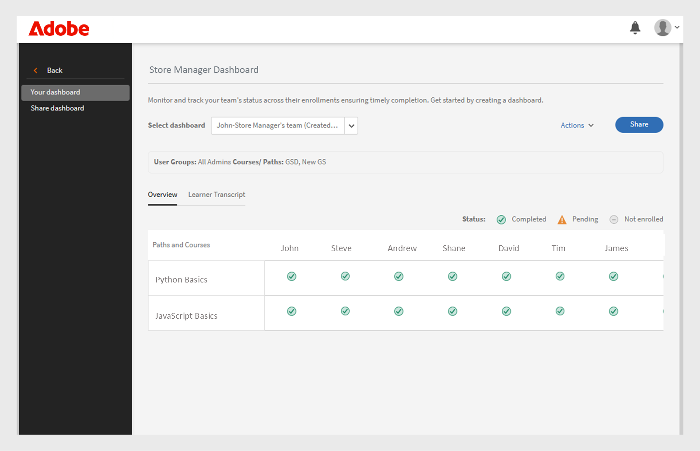

# Tableau de bord de réussite du groupe

## Présentation du tableau de bord de réussite du groupe

Le tableau de bord de réussite de groupe (GSD) de Adobe Learning Manager permet aux administrateurs et aux responsables de surveiller la progression des élèves en temps quasi réel (60 minutes de retard entre l’inscription, la progression ou l’achèvement et la réflexion sur le tableau de bord) dans tous les services ou groupes d’utilisateurs. Il prend en charge le suivi proactif de l’achèvement des cours, de l’inscription et des actions en attente, ce qui facilite la gestion de l’apprentissage pour les équipes. Consultez cet [article](/help/migrated/administrators/feature-summary/add-users-user-groups.md) pour en savoir plus sur les groupes d&#39;utilisateurs.

## Principaux cas d’utilisation

Le tableau de bord de réussite de groupe offre les éléments suivants :

* **Simplifie le suivi de la progression des élèves** : le tableau de bord de réussite de groupe fournit une vue conviviale en temps réel des données des élèves, réduisant ainsi le besoin de relevés de notes Excel. Les responsables et les administrateurs peuvent afficher rapidement les inscriptions des élèves et la progression du cours pour prendre en charge des scénarios clés tels que :

   * **Préparation à l&#39;examen des performances** : les responsables peuvent évaluer la progression du cours pour les membres de l&#39;équipe avant les cycles d&#39;évaluation.
   * **Surveillance de la conformité** : identifiez les élèves qui n&#39;ont pas terminé les formations obligatoires.
   * **Suivi au niveau de l’équipe** : les responsables des franchises, des magasins ou des régions peuvent s’assurer que leurs équipes terminent l’apprentissage requis à temps.

* **Facilite la gestion d’équipe** : le tableau de bord de réussite de groupe est utile pour les responsables disposant de petites équipes (moins de 50 personnes), tels que les responsables de magasins, les responsables de franchise, les responsables de concession ou les équipes internes. Elle fournit une vue d’équipe et permet aux responsables de vérifier rapidement si leur équipe a terminé l’ensemble de cours requis pour atteindre les objectifs de l’entreprise.

## Utilisation du tableau de bord de réussite de groupe

Un administrateur peut activer et créer les tableaux de bord en leur donnant un nom, en sélectionnant des groupes d’utilisateurs et en choisissant les cours ou les parcours d’apprentissage. Les tableaux de bord peuvent être partagés avec d’autres administrateurs ou responsables.

### Activer le tableau de bord de réussite du groupe

L’administrateur doit activer le tableau de bord de réussite de groupe pour le compte. Pour activer le tableau de bord de réussite de groupe, procédez comme suit :

1. Connectez-vous en tant qu’administrateur.
2. Sélectionnez **[!UICONTROL Paramètres]**puis **[!UICONTROL Rapports]**.
3. Sélectionnez le bouton bascule **[!UICONTROL Visibilité du tableau de bord]**.
4. Tapez le nom du tableau de bord (par exemple, **[!UICONTROL Tableau de bord du gestionnaire de magasins]**).
   
   _Champs pour la sélection du nom du tableau de bord, du groupe d’utilisateurs et du parcours d’apprentissage_
5. Sélectionnez **[!UICONTROL Visibilité de la vue d&#39;ensemble]** pour activer la section Vue d&#39;ensemble dans le tableau de bord. Cette section vous permet d’afficher la progression de jusqu’à 50 élèves.
6. Pour la section **[!UICONTROL Relevé de notes de l&#39;élève]**, sélectionnez les colonnes requises que vous souhaitez afficher.

   * Gestion
   * Parcours et cours
   * Statut
   * Date d’inscription
   * Date du dernier accès
   * Date d’achèvement

Après avoir activé cette fonctionnalité, les administrateurs peuvent afficher le tableau de bord de réussite des groupes dans la section **[!UICONTROL Rapports]**.

### Créer un tableau de bord de réussite de groupe

Les administrateurs peuvent créer jusqu’à 100 tableaux de bord pour afficher la progression des élèves. Pour créer un tableau de bord, procédez comme suit :

1. Connectez-vous en tant qu&#39;administrateur et sélectionnez la page **[!UICONTROL Rapports]**.

   
   _Sélectionner des rapports dans la page d&#39;accueil de l&#39;administrateur_

2. Sélectionnez le tableau de bord de réussite du groupe. Le nom du tableau de bord est **[!UICONTROL Tableau de bord Store Manager]**.

   
   _Sélectionner le tableau de bord du Gestionnaire de stockage_

   >[!NOTE]
   >
   >Le nom que vous définissez lors de l’activation du tableau de bord de réussite de groupe s’affiche comme nom du tableau de bord.

3. Sélectionnez **[!UICONTROL Créer un tableau de bord]** dans la liste déroulante Sélectionner le tableau de bord.

   
   _Sélectionnez l’option permettant de créer un GSD_

4. Saisissez le nom du tableau de bord.
5. Sélectionnez un groupe d’utilisateurs à afficher dans le tableau de bord.
6. Recherchez dans les cours ou les parcours d’apprentissage et sélectionnez-les dans les résultats.

   
   _Sélectionner un groupe d&#39;utilisateurs et des cours_

7. Sélectionnez **[!UICONTROL Créer un tableau de bord]**.

Pour les équipes plus importantes, créez un tableau de bord en sélectionnant le **catalogue par défaut** et le groupe d&#39;utilisateurs **Tous les élèves** dans l&#39;onglet **[!UICONTROL Relevé de notes de l&#39;élève]**. Cela inclut tous les cours et les élèves dans la vue **[!UICONTROL Relevé de notes de l&#39;élève]**, ce qui facilite la recherche et le suivi de la progression de chaque élève.

### Afficher le tableau de bord de réussite du groupe

Après avoir créé un tableau de bord, l’administrateur peut l’afficher en procédant comme suit :

1. Connectez-vous en tant qu’administrateur.
2. Sélectionnez **[!UICONTROL Rapports]**, puis **[!UICONTROL Tableau de bord de réussite de groupe]**.
Le nom du tableau de bord est Tableau de bord du gestionnaire de magasins.
3. Dans la section **[!UICONTROL Vos tableaux de bord]**, sélectionnez le tableau de bord créé dans la liste déroulante **[!UICONTROL Sélectionner le tableau de bord]**.
4. Le tableau de bord est divisé en :
   * **[!UICONTROL Présentation]** : vous pouvez voir rapidement la progression des élèves sur chaque cours ou parcours d’apprentissage. Vous pouvez afficher la progression de 50 cours ou parcours d’apprentissage et 50 élèves à la fois. Pour vérifier la progression d&#39;un élève spécifique, sélectionnez la section **[!UICONTROL Relevé de notes de l&#39;élève]**.

   
   _Statut d&#39;apprentissage des élèves dans l&#39;équipe du responsable du magasin_

   * **[!UICONTROL Relevé de notes de l’élève]** : affichez la progression de l’élève en sélectionnant un élève ou un cours spécifique. Recherchez un élève dans le tableau de bord pour vérifier sa progression d’apprentissage. Si vous avez créé le tableau de bord à l’aide du catalogue par défaut et inclus tous les élèves, vous pouvez rechercher n’importe quel élève pour consulter facilement sa progression.

   
   _Vue détaillée du relevé de notes de l’élève avec des colonnes pour l’inscription et l’achèvement_

>[!NOTE]
>
>Pour télécharger le relevé de notes détaillé de l&#39;élève, sélectionnez **[!UICONTROL Accéder au rapport]** dans l&#39;onglet **[!UICONTROL Relevé de notes de l&#39;élève]**.

### Partager le tableau de bord de réussite du groupe

Les administrateurs peuvent partager des tableaux de bord avec d’autres administrateurs ou responsables. Procédez comme suit pour partager un tableau de bord :

1. Sélectionnez **[!UICONTROL Rapports]**, puis **[!UICONTROL Tableau de bord de réussite de groupe]**. Le nom du tableau de bord est **[!UICONTROL Tableau de bord Store Manager]**.
2. Sélectionnez **[!UICONTROL Partager]** dans l&#39;option **[!UICONTROL Vos tableaux de bord]**.

   
   _Sélectionner le bouton Partager_

3. Recherchez des utilisateurs ou des groupes d’utilisateurs par nom et sélectionnez-les.

   
   _Partager le tableau de bord avec des utilisateurs ou des groupes d&#39;utilisateurs_

4. Sélectionnez **[!UICONTROL Continuer]** pour partager le tableau de bord.

Vous pouvez voir les détails du tableau de bord partagé sous **[!UICONTROL Rapports]**, sélectionner **[!UICONTROL Tableau de bord de réussite de groupe]** (Tableau de bord du responsable de boutique), puis sélectionner **[!UICONTROL Tableaux de bord partagés]**.

_Afficher le tableau de bord partagé_

>[!NOTE]
>
>Le responsable ou l’administrateur personnalisé peut uniquement voir les catalogues activés sur le tableau de bord de réussite de groupe partagé par l’administrateur.

### Limitations du tableau de bord de réussite de groupe

Les limitations suivantes sont celles du tableau de bord de réussite de groupe :

* Les certificats périodiques ne sont pas pris en charge dans le tableau de bord.
* La colonne **[!UICONTROL Date du dernier accès]** de l’onglet **[!UICONTROL Relevé de notes de l’élève]** affiche actuellement les données pour les parcours d’apprentissage et les certifications. La prise en charge des cours est prévue pour une mise à jour ultérieure.

## Sélection d&#39;élèves dans plusieurs groupes d&#39;utilisateurs

Lorsque vous sélectionnez plusieurs groupes d’utilisateurs, Adobe Learning Manager utilise des règles spécifiques pour déterminer les élèves à inclure :

* **Groupes d&#39;utilisateurs avec le même champ Actif** : si les groupes d&#39;utilisateurs utilisent le même champ (par exemple, Emplacement), le système inclut tous les élèves des deux groupes. Il combine les valeurs. Par exemple : **Location = Bangalore** et **Location = Chennai**. Il comprend des élèves des deux emplacements.
* **Groupes d&#39;utilisateurs avec différents champs actifs** : si les groupes d&#39;utilisateurs utilisent différents champs (par exemple, Emplacement et Rôle), le système inclut uniquement les élèves qui remplissent toutes les conditions. Par exemple : **Location = Bangalore ou Chennai** et **Role = Manager**. Il ne comprend que les élèves qui ont le rôle de responsable et qui sont situés à Bangalore ou à Chennai.

* Même champ actif : les élèves sont combinés (logique OR)
* Différents champs actifs : les élèves doivent correspondre à tous les critères (logique ET)

Cette approche vous aide à cibler les bons élèves en fonction des conditions sélectionnées.
