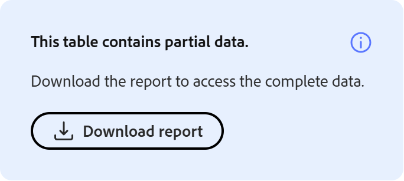

# Qu’est-ce qu’Insights Agent ?

Insights Agent est une fonctionnalité optimisée par l’IA dans Adobe Learning Manager qui permet aux administrateurs d’interroger les données des élèves en utilisant un langage naturel. Au lieu de télécharger des rapports et de manipuler des feuilles de calcul, vous tapez une question telle que « Combien de cours ont été créés au cours des 3 derniers mois dans le compte ? Donnez-moi un rapport mensuel. », et Insights Agent récupère et présente les données directement. Vous pouvez afficher les résultats sous forme de tableaux ou les télécharger sous forme de fichier CSV.

Insights Agent est conçu pour réduire les étapes entre une question sur les données et l’obtention d’une réponse. Les administrateurs qui s’appuient actuellement sur des pivots Excel, des équipes de veille stratégique ou plusieurs rapports combinés peuvent utiliser Insights Agent pour obtenir des réponses plus rapidement.

## Ce que peut faire Insights Agent

Vous pouvez utiliser Insights Agent pour :

- Vérifier les mesures d&#39;achèvement et de conformité par région, service ou groupe d&#39;utilisateurs
- Analyse des tendances d’inscription dans les programmes d’apprentissage
- Afficher les données de progression pour un cours ou un parcours d’apprentissage spécifique
- Récupérer les résultats dans un tableau ou sous forme de fichier CSV téléchargeable
- Obtenez une explication en langage clair de la façon dont vos résultats ont été calculés

## Quelles données Insights Agent ne prend pas en charge

Les types de données suivants ne sont pas concernés par cette version :

- Commentaires et données d’enquête
- Points et badges de ludification
- Historique d’audit et journaux des modifications

Les requêtes qui font référence à ces types de données ne renvoient pas de résultats. Par exemple, « Combien de points de ludification ont été attribués le trimestre dernier ? » ou « Quels élèves ont obtenu un badge de conformité ? » renvoie une erreur ou des données incomplètes.

## Différences entre Insights Agent et Report Builder

Les deux fonctionnalités utilisent les mêmes données d’apprentissage sous-jacentes, mais elles fonctionnent différemment. Insights Agent est conversationnel. Vous décrivez ce que vous voulez et l&#39;agent le récupère. Le Report Builder est structuré. Vous sélectionnez des jeux de données, des colonnes et des filtres pour créer des rapports réutilisables.

| **Cas d&#39;utilisation** | **Recommandation** |
|---|---|
| Poser une question rapide sur les données | Agent d’informations |
| Exploration des données sans connaître le schéma | Agent d’informations |
| Création d’un rapport structuré et reproductible | Créateur de rapports |
| Combinaison de plusieurs jeux de données avec des jointures personnalisées | Créateur de rapports |
| Planifier des abonnements à des rapports | Créateur de rapports |
| Combiner des jeux de données avec des jointures personnalisées ou une modélisation de données avancée | Créateur de rapports |

**IMPORTANT** : l’intégration entre Insights Agent et Report Builder est prévue pour une version ultérieure et n’est pas disponible dans la version Beta actuelle.

## Fonctionnement d’Insights Agent

Lorsque vous saisissez une question, Insights Agent la traite en quatre étapes :

1. **Interprétation** : l&#39;agent analyse votre question pour identifier les données nécessaires. Si une partie de la question est ambiguë, l&#39;agent vous pose une question de clarification avant de poursuivre

2. **Approche** : l&#39;agent décrit les étapes qu&#39;il a suivies pour trouver votre réponse. Cette section vous aide à vérifier que les données ont été récupérées comme vous le souhaitiez, en particulier pour les requêtes complexes.

3. **Résultats** : l&#39;agent présente vos données sous forme de table. Si vos résultats contiennent 50 lignes ou moins, un résumé en langage clair peut être inclus.

4. **Télécharger** : vous pouvez télécharger les résultats sous forme de fichier CSV. Les rapports volumineux peuvent prendre plus de temps ; l&#39;agent vous avertit lorsque le fichier est prêt.

La section **Approche** est particulièrement utile pour les requêtes complexes. Elle montre la logique utilisée par l&#39;agent, similaire à ce qu&#39;un analyste BI expliquerait s&#39;il exécutait la requête manuellement. Examiner l’approche vous permet de confirmer que la sortie est fiable avant d’agir dessus.

## Poser des questions à l’aide d’Insights Agent

Utilisez Insights Agent dans Adobe Learning Manager pour interroger les données des élèves en langage clair et obtenir des résultats sous forme de texte, de tableaux ou de fichiers CSV téléchargeables.

Insights Agent est disponible pour les administrateurs à partir du panneau de l’assistant IA dans Learning Manager. Le panneau est redimensionnable. Vous pouvez le développer pour faciliter la lecture des résultats. Par défaut, le mode **Obtenir des informations** est sélectionné lorsque vous ouvrez le panneau. Un mode **Formation** distinct est également disponible pour les questions d&#39;instructions sur l&#39;utilisation du produit. Le mode **Formation** répond à des questions d’instructions sur l’utilisation de Learning Manager. Par exemple, « Comment créer un parcours d’apprentissage ? » Il ne demande pas les données de l’élève.

### Poser une question

Lorsque le mode **Obtenir des informations** est sélectionné par défaut, vous pouvez immédiatement commencer à interroger les données de l&#39;élève sans avoir à ajuster le mode chaque fois que vous accédez à l&#39;assistant. Cependant, si vous passez en mode **Formation** pour des questions d&#39;ordre pédagogique, assurez-vous de sélectionner à nouveau **Obtenir des informations** avant d&#39;envoyer une requête.

1. Sélectionnez l’icône de l’assistant AI dans Learning Manager pour ouvrir le panneau Assistant.

2. Sélectionnez **Obtenir des informations** dans le sélecteur de mode, s&#39;il n&#39;est pas déjà sélectionné par défaut.
   

3. Saisissez votre question dans le champ de texte. Utilisez un langage simple. Par exemple : **Combien de cours ont été créés au cours des 3 derniers mois ?**

4. Sélectionnez **Envoyer** ou appuyez sur **Entrée** pour soumettre votre question.

### Examiner la réponse

Après avoir envoyé votre question, Insights Agent traite votre demande et renvoie une réponse en quatre parties maximum :

1. **Désambiguïté (si nécessaire) :** si votre question contient un terme ambigu, tel que \« activité d’apprentissage\ » ou \« performances\ », ou « Donnez-moi les données de performance des 3 derniers mois », l’assistant affiche une liste d’options et vous demande d’en sélectionner une avant de poursuivre. Sélectionnez l’option qui correspond le mieux à ce que vous recherchez. Après la question initiale, vous ne pouvez pas saisir d’instructions supplémentaires. La sélection à partir des options fournies est la seule interaction disponible jusqu’à ce que vous commenciez une nouvelle requête à l’aide de l’interface de requête. Vous ne pouvez répondre à la désambiguïsation qu’en sélectionnant l’une des options fournies ; le suivi de texte libre n’est pas disponible dans cette version.

&#x200B;2. **Approche :** la section **Approche** décrit les étapes suivies par l&#39;agent pour récupérer vos données. Elle apparaît sous la forme d’un panneau déroulant sous la question. Sélectionnez l’icône de développement pour afficher l’approche complète. En consultant cette section, vous pouvez vérifier que la logique correspond à votre intention, en particulier pour les requêtes complexes. Par exemple, si vous demandez « tous les élèves inscrits au cours de la dernière année », l’agent peut renvoyer la dernière inscription de chaque élève plutôt que chaque enregistrement d’inscription. La section **Approche** **mai** ou **expliquera** cette décision. Si la logique ne correspond pas à votre intention, démarrez une nouvelle requête avec des termes plus spécifiques.

&#x200B;3. **Résultats :** Insights Agent génère des résultats sous forme de texte ou de tableau. Pour les points de données qui sont les mieux interprétés dans un format tabulaire, Insights Agent renvoie un tableau. Insights Agent ne génère pas de graphiques ou de graphiques. Pour visualiser les données, téléchargez le fichier CSV et ouvrez-le dans l’outil de votre choix. Si vos résultats contiennent 50 lignes ou moins, un résumé en langage clair peut être inclus au-dessus du tableau. Par exemple, \« Quels cours n’ont pas moins de 5 inscriptions qui ont été créés au cours de la dernière année et qui sont les auteurs ?\ »

Et la réponse contient le résumé suivant :

***Résumé***

- *Cours correspondants : 102*
- *Plage de comptage des inscriptions : 24 à 2019*
- *Nombre moyen d’inscriptions par cours correspondant : 589,6*
- *Nombre médian d’inscriptions par cours correspondant : 553,5*

*Un lien de téléchargement pour le rapport complet sera fourni une fois l&#39;exportation terminée.*

**Remarque :** l&#39;agent Insights est probabiliste. Si vous exécutez la même requête deux fois, la formulation de la réponse ou l’ordre des résultats peuvent différer légèrement. Les données sous-jacentes récupérées sont les mêmes, mais la sortie peut varier d&#39;une exécution à l&#39;autre.

### Télécharger le rapport

Sélectionnez **Télécharger le rapport** pour exporter vos résultats au format CSV. Pour les jeux de résultats volumineux, le téléchargement peut prendre plus de temps. L&#39;agent affiche un message lorsque le fichier est prêt ; vous recevez également une notification.

## Démarrer une nouvelle requête

Chaque session Insights Agent traite une question à la fois. Après avoir vérifié vos résultats, sélectionnez **Nouvelle question** pour poser une autre question. Vous ne pouvez pas saisir de question de suivi dans la même session ni demander à l&#39;agent d&#39;affiner ou de développer les résultats qu&#39;il a renvoyés.

>[!TIP]
>
>Si vous souhaitez explorer les données associées, lancez une nouvelle requête qui incorpore ce que vous avez appris de la première. Par exemple, après avoir affiché les totaux d&#39;inscription par région, lancez une nouvelle requête pour vérifier les taux d&#39;achèvement pour la même région.

## Fourniture d’un retour d’informations

Après chaque réponse, sélectionnez l’icône Pouces vers le haut ou Pouces vers le bas pour noter le résultat. Vous pouvez également spécifier si la sortie était inexacte, difficile à comprendre ou si le retour a pris trop de temps. Ce retour d&#39;informations permet d&#39;améliorer l&#39;agent au fil du temps.

## Bonnes pratiques

- Commençons par une question précise plutôt que par une question générale. \« Quel est le taux d&#39;achèvement du cours de formation à la sécurité dans le groupe d&#39;utilisateurs d&#39;Amérique du Nord ?\ » renvoie des résultats plus utiles que \« Afficher les données d&#39;achèvement. »
- Utilisez des termes Adobe Learning Manager exacts pour nommer le contenu et les groupes d’élèves. Le guide d&#39;écriture de requête répertorie les termes corrects à utiliser.
- Si l&#39;agent pose une question de clarification, traitez-la comme un signal pour affiner votre requête originale. Plus votre question est précise, moins il y a de précisions à apporter.
- Passez en revue la section **Approche** avant d&#39;agir sur les résultats, en particulier pour les requêtes liées à la conformité pour lesquelles la précision est essentielle.
- **Indiquez si les élèves inscrits sur liste d&#39;attente doivent être inclus ou exclus**. Par défaut, les requêtes de nombre d&#39;inscriptions incluent les élèves qui sont sur une liste d&#39;attente avec des inscriptions confirmées actives. Si vous n’avez besoin que de participants actifs, excluez explicitement les élèves inscrits sur liste d’attente dans votre requête. Par exemple : « Combien d’élèves sont directement inscrits au cours de formation à la sécurité, à l’exclusion des élèves inscrits sur liste d’attente ? » L&#39;agent doit divulguer dans la section Approche que l&#39;exclusion a été appliquée. Sans cette instruction, les totaux d&#39;inscription peuvent inclure une proportion importante d&#39;élèves inscrits sur liste d&#39;attente qui n&#39;ont pas encore commencé le contenu.

## Rédiger des requêtes efficaces pour Insights Agent

La qualité de votre requête affecte directement la qualité des résultats renvoyés par Insights Agent. Une requête correctement formée comprend trois ingrédients : contexte (quel contenu et quels élèves), portée (état, plage horaire et état de l’utilisateur) et colonnes (les champs exacts que vous souhaitez dans la sortie). Apprenez à utiliser la terminologie, la structure de requête et les exemples de requêtes appropriés comme points de départ.

### Formule de requête en trois parties

Chaque requête effective Insights Agent contient les trois composants suivants :

| **Composant** | **Signification** | **Exemple** |
|---|---|---|
| **Contexte** | Le contenu et les élèves sur lesquels vous posez des questions | «...le parcours d’apprentissage Intégration de nouveaux employés, pour les élèves du service commercial dans l’emplacement 101... » |
| **Portée** | Statut d’inscription, période et état utilisateur |  »...qui sont inscrits mais pas encore terminés, au cours des 90 derniers jours... » |
| **Colonnes** | Chaque champ à inclure dans la sortie |  »...afficher le nom, l’adresse e-mail, le lieu et la date d’inscription » |

L&#39;absence de l&#39;un de ces composants entraîne des résultats ambigus ou une question de clarification de la part de l&#39;agent.

### Utiliser les termes ALM corrects

Insights Agent compare votre requête au modèle de données de Adobe Learning Manager. L’utilisation d’un terme erroné peut renvoyer des résultats incorrects ou inexistants. Utilisez les termes de la colonne de gauche ci-dessous.

| **Utiliser ce terme** | **Non** |
|---|---|
| **Parcours d’apprentissage** | Programme / suivi / curriculum |
| **Cours** | Module / classe / leçon |
| **Certification** | Badge/certificat |
| **Élève** | Étudiant/employé |
| **Session** | Classe/date programmée |
| **Groupe d’utilisateurs** | Équipe / département / cohorte |
| **Champ actif** | Champ/attribut personnalisé |
| **Inscription** | Inscription/affectation |
| **Accomplissement** | Terminé/terminé/réussi |
| **Étiquette de catalogue** | Catégorie/groupe de balises |

Insights Agent ne respecte pas la casse, mais la correspondance exacte des termes améliore la précision.

### Ancrage du contenu

Chaque requête a besoin d&#39;une ancre de contenu afin que l&#39;agent sache quels éléments d&#39;apprentissage examiner. Vous pouvez effectuer l’une des opérations suivantes pour l’ancrer :

| **Type d&#39;ancre** | **Exemple** |
|---|---|
| Nom | «...le parcours d’apprentissage d’intégration des nouveaux employés » |
| Catalogue | « ...tous les parcours d’apprentissage du catalogue d’intégration » |
| Étiquette de catalogue |  »...tous les cours dont le libellé de catalogue est Région = Nord » |
| Balise |  »...tous les cours balisés Conformité » |
| Compétence |  »...tous les cours associés à la compétence du service client » |
| Étiquette de conformité |  »...toutes les certifications étiquetées conformes » |
| Type de contenu |  »...tous les cours publiés » /  »...toutes les certifications » |

### Ancrez vos élèves

Spécifiez les élèves à inclure à l’aide de l’une des méthodes suivantes :

- **Valeur du champ actif** : « Élèves dont le champ actif Fonction = Vendeur associé » ou « Élèves dont le champ actif Emplacement = 101 »
- **Groupe d’utilisateurs** : « élèves du groupe d’utilisateurs Sales Associates »
- **Session** — « élèves inscrits à la session du 15 juin du cours sur la sécurité sur le lieu de travail »

### Définition de l’étendue

Sans une portée claire, les résultats peuvent inclure un état, une période ou un état d’utilisateur incorrect.

| **Type d&#39;étendue** | **Options** |
|---|---|
| Statut de l’inscription | inscrit/terminé/non inscrit/en retard |
| Plage temporelle | toutes les heures / 30 derniers jours / 90 derniers jours / période spécifique |
| État de l’utilisateur | utilisateurs actifs uniquement (par défaut) / ajoutez « inclure les utilisateurs supprimés » pour les utilisateurs inactifs |

### Nommer chaque colonne de sortie

Si vous ne spécifiez pas de colonnes, Insights Agent les choisit automatiquement. Nommez chaque champ que vous souhaitez inclure dans la sortie.

| **Vague** | **Spécifique** |
|---|---|
| « Afficher les numéros de localisation » | « Pour chaque emplacement : nombre total d’élèves, nombre d’inscrits, nombre de non-inscrits » |
| « Afficher les taux d&#39;achèvement » | « Pour chaque parcours d’apprentissage : nom, total des inscrits, total des terminés, % d’achèvement » |
| « Montre-moi qui a échoué » | « Afficher le nom, l’adresse e-mail, le nom du cours et l’état d’achèvement des élèves qui n’ont pas terminé » |

### Exemples de requêtes

Utilisez-les comme point de départ. Adaptez-les en remplaçant les noms de contenu, les groupes d’utilisateurs et les plages horaires qui s’appliquent à votre compte.

**Achèvement et conformité**

- « Quel est le taux d&#39;achèvement du cours de formation sur la sécurité dans le groupe d&#39;utilisateurs de l&#39;Amérique du Nord ? »
- « Afficher le taux d’achèvement par groupe d’utilisateurs pour tous les cours étiquetés comme conformes. Inclure le nom du groupe d’utilisateurs, le nombre total d’inscrits, le nombre total de terminés et le pourcentage d’achèvement. »
- « Quel est le taux de conformité pour tous les élèves dont le champ actif Fonction = VP ? »

**Analyse des inscriptions**

- « Combien d’élèves sont inscrits au parcours d’apprentissage Intégration d’une nouvelle embauche, par lieu ? »
- « Afficher les inscriptions par région pour les 90 derniers jours. Inclure le nom de la région et le nombre d&#39;inscriptions. »
- « Répertoriez tous les élèves inscrits au cours sur la sécurité au travail mais qui ne sont pas encore terminés. Indiquez leur nom, leur adresse e-mail et leur date d&#39;inscription. »

**Progression du programme et du cours**

- « Quelle est la ventilation de l’état d’achèvement du parcours d’apprentissage de perfectionnement en leadership - afficher les décomptes terminé, en cours et non commencé ? »
- « Combien d’élèves ont suivi le cours sur la confidentialité des données le mois dernier ? »

**Vues organisationnelles**

- « Afficher le taux d’achèvement de toutes les certifications étiquetées de conformité, regroupées par service. Inclure le nom du service, le nombre total d’inscrits et le % d’achèvement. »
- « Quelle est la répartition des inscriptions par région au cours des 30 derniers jours ? »

### Erreurs fréquentes à éviter

| **Éviter** | **Effectuer cette opération à la place** |
|---|---|
| Aucune ancre de contenu (« Tout afficher ») | Nommer le chemin, le cours, le catalogue, la balise ou la compétence spécifique |
| Mesure vague (« pourquoi les achèvements sont-ils bas ? ») | Posez une question mesurable : « Quels parcours d’apprentissage ont un taux d’achèvement inférieur à 30 %, par emplacement ? » |
| Ne spécifiant pas l’état de l’utilisateur | Ajouter explicitement « utilisateurs actifs uniquement » ou « inclure les utilisateurs supprimés » |
| Demander des prédictions | Demander ce que montrent les données actuelles, et non ce qui va se passer |
| Demander des informations sur les données non prises en charge (commentaires, compétences, badges) | Utilisation de rapports existants dans la section Rapports |
| Poser plusieurs questions dans une seule requête (« Afficher les inscriptions par région et également dresser la liste des personnes qui n&#39;ont pas terminé la formation sur la sécurité ») | Posez une question ciblée par requête. L&#39;agent ne peut répondre qu&#39;à une partie d&#39;une requête composée, sans garantie que le reste sera traité. |

## Limitations de la version

**Les certifications récurrentes peuvent afficher plusieurs options lors de l&#39;étape de désambiguïsation**

Lorsque vous interrogez des données pour une certification récurrente, Insights Agent peut afficher plusieurs options pendant l’étape de clarification, une pour chaque récurrence de la certification, au lieu de l’afficher comme une seule entrée. La sélection de l’une de ces options peut renvoyer des données incorrectes ou incomplètes. Nous vous recommandons de ne pas utiliser Insights Agent pour interroger les certifications récurrentes.

**Les cours qui font partie d&#39;une certification récurrente peuvent afficher plusieurs options pendant l&#39;étape de désambiguïsation**

Lorsque vous interrogez des données pour un cours associé à une certification récurrente, Insights Agent peut afficher plusieurs options pendant l&#39;étape de clarification, une pour chaque version du cours créée au cours des cycles de certification, au lieu de l&#39;afficher comme une seule entrée. La sélection de l’une de ces options peut renvoyer des données incorrectes ou incomplètes.

**Les données nouvellement ajoutées peuvent prendre jusqu&#39;à 30 minutes pour apparaître dans les résultats**

Une fois le contenu créé, les élèves inscrits ou les enregistrements d’achèvement mis à jour, la disponibilité de ces données dans les résultats de la requête peut prendre jusqu’à 30 minutes. Si les résultats semblent incomplets ou ne reflètent pas une activité récente, attendez 30 minutes et réessayez.

**Nombre d&#39;inscriptions directes et indirectes**

Lorsque vous interrogez les données d’inscription ou d’achèvement pour un cours ou un parcours d’apprentissage, Insights Agent fait la distinction entre les inscriptions directes (élèves inscrits spécifiquement à ce cours ou parcours d’apprentissage) et les inscriptions indirectes (élèves ayant accédé au même contenu dans le cadre d’un parcours d’apprentissage ou d’une certification). Si vous demandez spécifiquement des inscriptions directes ou indirectes, l&#39;agent renvoie le nombre correct pour chaque type.

Si votre requête ne spécifie pas le nombre direct ou indirect, l&#39;agent peut renvoyer un nombre combiné. Pour obtenir des nombres séparés, incluez explicitement la distinction dans votre requête. Par exemple : « Combien d’élèves sont inscrits directement ou indirectement au cours de formation sur la sécurité ? »

**Les requêtes envoyées dans des scripts non latins ne sont pas prises en charge**

Insights Agent prend en charge les requêtes écrites en anglais et dans les langues de l&#39;alphabet latin telles que le français et l&#39;espagnol. Les requêtes soumises à l&#39;aide de scripts non latins, notamment le japonais, le chinois, l&#39;arabe, le coréen, l&#39;hindi et le russe, ne peuvent pas être traitées et l&#39;agent affiche un message indiquant que la requête n&#39;a pas pu être exécutée. Si vous soumettez une requête dans l’une de ces langues, démarrez une nouvelle requête et reformulez-la en anglais. La prise en charge de langues supplémentaires peut être envisagée dans les prochaines versions.

**Les résultats peuvent inclure du contenu et des élèves dans tous les états**

Lorsque vous interrogez des données dans Insights Agent, les résultats peuvent inclure des enregistrements dans tous les états disponibles, sauf indication contraire de votre part. Par exemple, une requête pour des élèves inscrits peut inclure des élèves sur une liste d&#39;attente ou des élèves dont les comptes ont été supprimés. Une requête pour des cours ou des parcours d’apprentissage peut inclure du contenu publié et retiré. Pour affiner vos résultats, incluez des conditions explicites lorsque vous posez votre question. Par exemple, spécifiez des utilisateurs actifs uniquement, excluez les élèves inscrits sur liste d’attente ou limitez les résultats au contenu publié pour vous assurer que la sortie reflète uniquement les enregistrements que vous souhaitez voir.

