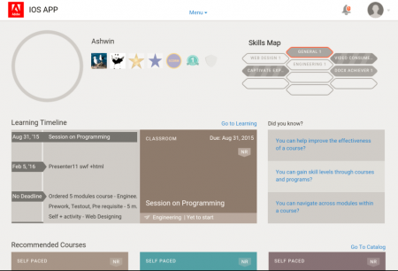

# Utilisateurs de tablettes Android et iPad

Dans l&#39;application Learning Manager sur tablette iPad ou Google Nexus 9 Android, une fois connecté en tant qu&#39;élève, l&#39;écran d&#39;**accueil** suivant s&#39;affiche :

*Écran d&#39;accueil de l&#39;application*

Pour accéder aux fonctions d’apprentissage et de catalogue, appuyez sur la flèche déroulante **Menu**, puis choisissez l’option appropriée.

<!---->

## Accès à l’application hors ligne {#accesstheappoffline}

Vous pouvez accéder à l’application Learning Manager hors ligne dans les tablettes Android (Google Nexus 9) et iPad. Téléchargez et prenez les cours en mode hors ligne, et synchronisez ensuite le contenu avec l’application en ligne quand vous connectez au réseau.

1. Appuyez sur la liste déroulante **Menu** en haut et appuyez sur l&#39;option **Apprentissage**. Une liste de tous les cours disponibles s’affiche sous la forme de vignettes.
1. Appuyez sur l’icône de téléchargement au bas de chaque vignette d’objet de formation pour télécharger le contenu d’apprentissage.

   <!---->

1. Lorsque vous êtes en ligne, une invite s’affiche dans une barre en haut de l’application pour vérifier si vous souhaitez synchroniser votre contenu en ligne. Appuyez sur la barre de couleur rouge si votre réponse est oui. Une barre de couleur verte indique que votre contenu est en cours de synchronisation avec l’application en ligne.

<!--
## Track device storage {#trackdevicestorage}

You can monitor your device storage periodically.

Tap the profile icon at the upper-right corner of the app and tap **Device Storage** menu option.

An app storage information dialog appears as shown below.

Using the app storage information, you can check the total space of device, app and the downloaded courses. This information enables you to download courses accordingly. To delete the downloaded courses in the device, tap X icon adjacent to each course name.
-->
