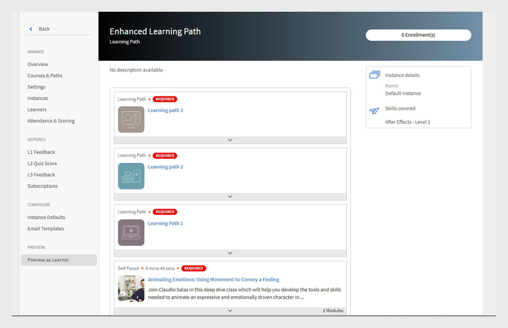

# Parcours d’apprentissage

## Qu’est-ce qu&#39;un parcours d’apprentissage ?

Souvent, les administrateurs souhaitent élaborer un programme détaillé qui offre une connaissance approfondie d’un sujet particulier ou d’un domaine d’expertise. Il peut également s&#39;agir d&#39;une série de cours de formation que les employés ou les clients sont censés suivre. Il faut pour cela regrouper un ensemble de cours et de programmes afin de créer un package de formations complet.

C’est là que le parcours d’apprentissage entre en jeu. Un parcours d’apprentissage est un parcours qu’un élève doit parcourir pour maîtriser un sujet au fil du temps. Les élèves contrôlent leur expérience de formation et peuvent acquérir et conserver leurs connaissances d&#39;une manière individualisée et plus efficace.

Par exemple, lors de l’intégration d’un nouvel employé, une entreprise offre une formation sur les politiques et les procédures, la culture, l’histoire, etc. Un parcours d’apprentissage définit les cours en fonction des besoins des employés, de sorte qu’ils puissent s’inscrire aux cours en fonction du parcours d’apprentissage qui leur est défini. vous choisissez, et vous pouvez inscrire des utilisateurs à ce parcours afin qu’ils puissent progresser d’un cours à l’autre.

## Créer et configurer des parcours d’apprentissage

Dans cette formation, vous apprendrez à créer un parcours d’apprentissage, à y ajouter un cours, à publier et retirer un parcours d’apprentissage, et à configurer des instances dans un parcours d’apprentissage.

Si vous ne pouvez pas lancer la formation, écrivez à <almacademy@adobe.com>.

## Avantages d’un parcours d’apprentissage

Les parcours d&#39;apprentissage rendent la prestation d&#39;un programme de formation pratique et facile. Voici quelques-uns des principaux avantages d’un parcours d’apprentissage :

1. Attribuez directement un niveau de compétence à un parcours d’apprentissage. Pas besoin de faire correspondre les crédits de compétence. Une fois que l’élève a terminé un parcours d’apprentissage, il atteint le niveau de compétence mentionné.
1. Possibilité d’incorporer un parcours d’apprentissage existant dans un nouveau parcours d’apprentissage. La fonctionnalité d’incorporation n’est disponible que pour 1 niveau d’incorporation. Ainsi, un parcours d’apprentissage contenant déjà un parcours intégré ne peut pas être intégré dans un nouveau parcours.
1. Possibilité d’ajouter des conditions préalables, des aides à l’emploi et des ressources à un niveau du parcours d’apprentissage.
1. Possibilité de créer des sections. Chaque section peut avoir un titre.
1. Possibilité de rendre les sections obligatoires et de définir des critères de fin de configuration.

## Ajouter un parcours d’apprentissage dans Learning Manager

Dans Learning Manager, dans l’application d’administration, cliquez sur **[!UICONTROL Parcours d’apprentissage]** dans le panneau de gauche.

Dans la page **[!UICONTROL Parcours d’apprentissage]**, cliquez sur **[!UICONTROL Ajouter]**. Saisissez les détails.

*Ajouter un nouveau parcours d’apprentissage*

Dans l&#39;option **Type d&#39;inscription**, sélectionnez **Auto-inscription** ou **Inscription administrateur**.

>[!NOTE]
>
>Si vous sélectionnez l&#39;option **Inscription administrateur**, les élèves ne verront que des cours nommés ou approuvés par le responsable. Les élèves ne pourront pas voir le parcours d’apprentissage dans la section des recommandations.

Après avoir créé le parcours d’apprentissage, sélectionnez le nouveau parcours d’apprentissage et ajoutez les cours dans le parcours.

Vous pouvez ajouter des compétences et attribuer un badge au parcours d’apprentissage. Pour ajouter une compétence, sélectionnez la ou les compétences requises dans la liste déroulante **[!UICONTROL Choisir une compétence]**. Sélectionnez également le niveau de la compétence ou des compétences.

*Ajouter une compétence*

Attribuez un badge au parcours d’apprentissage. Sélectionnez un badge dans la liste des badges disponibles.

Sélectionnez le niveau de produits, de rôles et de rôles dans la section **[!UICONTROL Recommander pour]** pour suggérer ce parcours d’apprentissage aux utilisateurs qui ont exprimé leur intérêt pour ces produits et rôles.

*Recommandation*

Choisissez le type de séquençage pour les sections et la formation, Ordonné ou Non ordonné, en fonction de vos préférences.

Si vous sélectionnez Ordonné, les cours s’affichent dans la séquence dans laquelle vous les avez créés. Si vous sélectionnez Non ordonné, les cours ne sont pas séquencés. Les élèves peuvent effectuer les cours dans n’importe quel ordre.

Pour ajouter un cours dans le parcours d’apprentissage, cliquez sur **[!UICONTROL Ajouter des cours ou des parcours d’apprentissage]**.

Dans la boîte de dialogue qui s’affiche, sélectionnez la formation que vous souhaitez ajouter au parcours d’apprentissage.

*Ajouter une formation au parcours d’apprentissage*

Vous pouvez trier les cours en fonction des compétences attribuées, de la date de modification et de l’efficacité du cours.

Après avoir sélectionné les cours ou le parcours d’apprentissage, cliquez sur **[!UICONTROL Enregistrer]**.

Dans le parcours d’apprentissage, vous pouvez effectuer les opérations suivantes :

**Créer et configurer une section :** une section est créée pour regrouper plusieurs cours de formation qui complètent un domaine ou un composant important de la formation. Chaque section peut avoir un titre. Chaque section peut également être marquée Obligatoire avec des exigences d’achèvement spécifiques.

**Rendre les cours obligatoires dans chaque section :** Activez ou désactivez la case à cocher Obligatoire si vous souhaitez/ne souhaitez pas rendre les formations obligatoires dans le parcours d’apprentissage. Si vous activez la case à cocher, vous pouvez rendre toutes les formations obligatoires ou certaines formations obligatoires.

*Rendre les cours obligatoires dans chaque section*

**Réorganiser l&#39;ordre :** vous pouvez déplacer les cours vers le haut ou vers le bas et modifier leur ordre.

*Réorganiser l’ordre de la formation*

**Supprimer un cours :** sur la carte du cours, cliquez sur la croix (X), puis supprimez le cours du parcours d’apprentissage.

*Supprimer un cours du parcours d’apprentissage*

Après avoir apporté les modifications, pour publier le parcours d’apprentissage, cliquez sur Publish.

## Parcours d’apprentissage imbriqué ou amélioré

Un parcours d’apprentissage imbriqué ou amélioré est un parcours d’apprentissage qui contient plusieurs parcours d’apprentissage. Pour insérer un parcours d’apprentissage, suivez la même procédure que pour ajouter un cours dans un parcours d’apprentissage.

*Parcours d’apprentissage imbriqué ou amélioré*

## Paramètres du parcours d’apprentissage

Dans la section Paramètres, vous pouvez ajouter les conditions préalables et les aides à la tâche qu’un élève doit suivre avant de commencer le parcours d’apprentissage. Vous pouvez également ajouter des ressources utiles à l’élève.

*Modifier les paramètres d’un parcours d’apprentissage*

## Instances

Les instances du parcours d’apprentissage affichent une mosaïque supplémentaire, **[!UICONTROL Parcours d’apprentissage]**. La mosaïque affiche le numéro. des programmes d’apprentissage ajoutés à un parcours d’apprentissage.

Dans la mosaïque **Cours**, vous pouvez voir les instances de cours qui sont visibles par les élèves inscrits à cette instance.

La case à cocher **[!UICONTROL Autoriser les élèves à choisir des instances (parcours d’apprentissage flexible)]** ne s’applique qu’aux cours. Tous les parcours d’apprentissage enfants auront une option pour mapper une instance de programme d’apprentissage avec le parcours d’apprentissage. Par défaut, le mappage est défini sur Instance par défaut.

*Instances de parcours d’apprentissage*

## Notifications

Trois options s&#39;offrent à vous :

1. **[!UICONTROL Tous les niveaux de compétence, cours et parcours d’apprentissage (sélectionnés par défaut)] :** l’élève reçoit des notifications pour tout cours incomplet, quel que soit le niveau dans un parcours d’apprentissage.
1. **[!UICONTROL Parcours d’apprentissage racine]:** L’élève reçoit des notifications pour tout cours incomplet appartenant à un parcours d’apprentissage parent.
1. **[!UICONTROL Enfants du parcours d’apprentissage + premier niveau de compétence uniquement] :** l’élève reçoit des notifications concernant tout cours incomplet qui est le premier enfant d’un parcours d’apprentissage parent.

Les rappels de notification sont déclenchés en fonction de l’option. Par défaut, l&#39;option **[!UICONTROL Tous les niveaux, cours et parcours d&#39;apprentissage]** est activée pour une instance.

## Abonnements

Vous pouvez vous abonner aux parcours d’apprentissage individuels pour recevoir des données complètes, notamment les scores du quiz et le statut de l’élève directement dans votre boîte de réception.

Procédez comme suit :

1. Accédez à n’importe quel parcours d’apprentissage > Abonnements.
1. Sélectionnez Ajouter.
1. Sélectionnez les détails et saisissez l’ID de messagerie pour recevoir les rapports.

*S’abonner à un parcours d’apprentissage individuel*

## Note importante

Veuillez noter que la fonctionnalité existante des programmes d’apprentissage sera renommée « Parcours d’apprentissage » immédiatement après la publication. Si vous souhaitez continuer à l’appeler Programmes d’apprentissage, nous vous recommandons d’utiliser la fonction « Terminologies » pour appliquer la terminologie requise. Ainsi, vous pouvez utiliser le mot Programme d’apprentissage.

Les parcours d’apprentissage vous offrent une gamme de fonctionnalités. Certains d&#39;entre eux sont disponibles immédiatement après la publication. Les administrateurs/auteurs peuvent commencer à les utiliser. Des fonctionnalités étendues telles que « Sections », « Ajout d’un parcours d’apprentissage dans un autre parcours », etc. sont désactivées et peuvent être activées en cochant la case mentionnée ci-dessous.

Les élèves peuvent continuer à utiliser les programmes d’apprentissage (désormais appelés « parcours d’apprentissage ») et les auteurs/administrateurs peuvent continuer à les créer. Pour tirer parti des fonctionnalités étendues du parcours d’apprentissage mentionné ci-dessus, l’administrateur doit activer le paramètre comme indiqué ci-dessous. Une fois cette option activée, toutes les nouvelles fonctionnalités étendues du parcours d’apprentissage seront disponibles.

La page **[!UICONTROL Paramètres]** > **[!UICONTROL Général]** propose une nouvelle option pour activer les parcours d’apprentissage. Si cette option est activée, vous pouvez ajouter des cours et des programmes d’apprentissage dans un parcours d’apprentissage Vous ne pouvez pas modifier cette option une fois qu’elle est activée.

<!-- ## Other Learning Path-related details 

### Learning Path option is disabled/unchecked in Admin Settings

**Accounts using Native Web apps**

**Learners**

* By default, learners will notice a change in terminology from "Learning Program" to Learning Path". This has been done to make the interface more intuitive. If you do not want this change, refer to the below points.  

* This change however will not be reflected in the UI if you have already used the 'Custom Terminology" function to replace the terminology "Learning Programs" with some custom text. 
* In case you had not used the Custom Terminology function yet but now wish to retain "Learning Programs" as the terminology, you can do so via the 'Custom Terminology' feature post the release.

* The overall cosmetic look and feel of erstwhile 'Learning Programs' will get updated to a more visually rich look and feel.

**Authors and Admins**

* The terminology within the Admin/Author apps is the same as that of learners.
* The UI for Authors and Admins to create, update the erstwhile 'Learning Program' objects will now be updated to the new UI. There is no loss of functionality, just that the User Interface to do the operation will be much more intuitive. These UI changes will reflect in your account, even if you have chosen not to enable 'Extended Features of Learning Path', with no loss in functionality. 

* Note that any existing Learning Program objects will not change so there is no impact on learners (other than the terminology point noted above). Authors/Admins might notice a default grouping called "Section" within their existing objects, which would be of no material impact as far as functionality goes. Authors/Admins will also see added functionalities like Skills, Job Aids etc. But as you haven't used it yet, it will not create any impact on the learner side till you actually start using it.

**Reporting**

* If you do not enable the option, Learning Path , there are no changes in the Learner Transcript report structure due to Learning Path. But as communicated in earlier notice (refer to the table shared in earlier communication); one new column will get added to the extreme right of the Learner Transcript immediately after the release.

**Accounts using Headless LMS**

**Learners**

* There are no changes for learners in headless interface. APIs as well that are used to generate the reports does not have immediate changes. 

**Authors and Admins**

* Same changes as that of Authors/Admins stated above.

**Reporting**

* Same changes as that of Reporting stated above.

### Learning Paths option is enabled/checked in Admin Settings

**Accounts using Native Web apps**

**Learners**

* Same changes as that of Learners when the option is disabled.
* As you start using the extended functionality of Learning Paths, Learners will benefit from seeing more elaborate paths with embedded paths and sections, Skills and badges being earned on path completion, resources at path level, and other benefits.

**Authors and Admins**

* Same changes as that of Authors and Admins when the option is disabled.

* Users will get more functionality in crafting elaborate paths. You can define Skill-Levels that would automatically be achieved by a learner on completion of path (not have to focus on the arithmetic of Credits for the levels). Resources can be added at the path level (Not possible as of today). Sections can be created with each section having the ability to have X of Y options. One can embed a Learning Path within another Learning Path (one level of hierarchy supported)

**Reporting**

* A few new columns will get added to the 'Learner Transcript' and 'Content Report' structures to incorporate the new feature of embedding of paths within paths. This may impact integration code that you may have written to export this data to your custom data warehouse/DB outside Learning Manager. This information is communicated in the table provided in earlier communication.

**Accounts using Headless LMS**

**Learners**

* There is no change for your learners, unless you make changes to your headless LMS implementation, as the APIs on which you have built your headless interface will not be changing.
* If you do start using the extended features of Learning Paths by creating new Learning Paths, however you will have to make changes to the headless LMS implementation to reflect those on your learner app. The Learning Manager APIs will allow you to do that.

**Authors and Admins**

* Same changes as that of Authors/Admins stated above.

**Reporting**

* Same changes as that of Reporting stated above. -->
