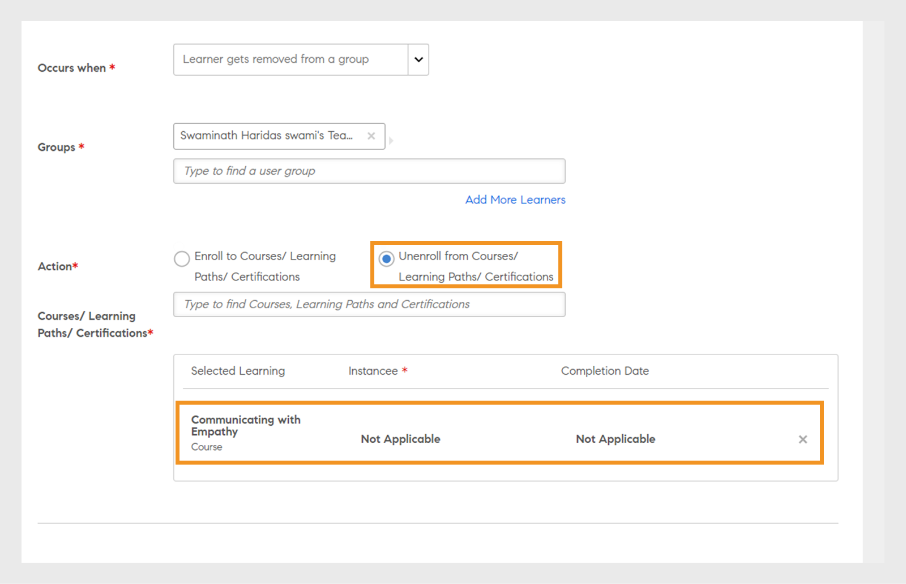
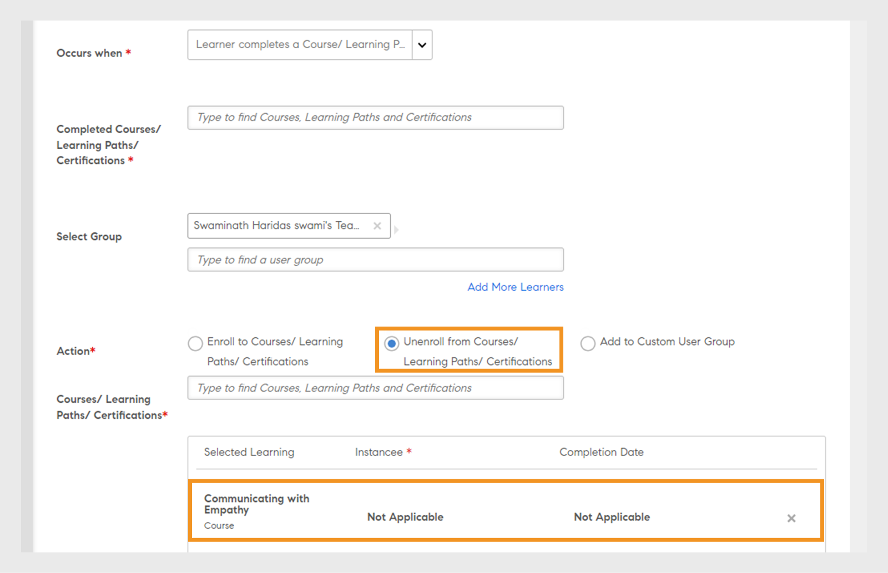
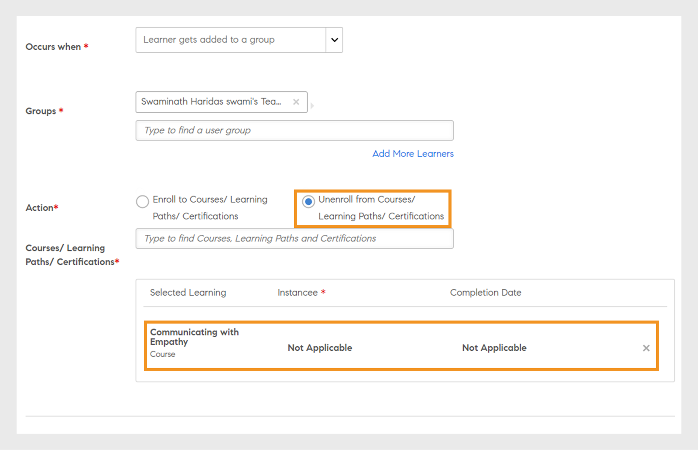
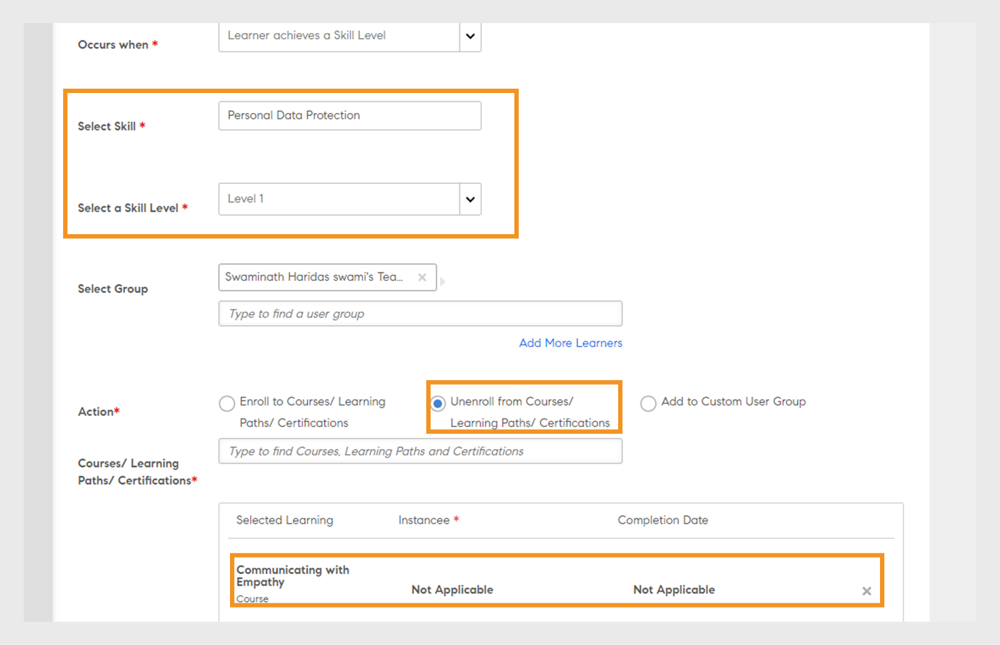

# Plans d’apprentissage

Création de plans d’apprentissage pour les administrateurs de Learning Manager.

## Vue d’ensemble {#overview}

Un plan d’apprentissage est un ensemble de règles qui inscrivent les élèves à des formations spécifiques en fonction de certains critères.

Un plan d’apprentissage permet à un administrateur d’attribuer automatiquement des cours, des programmes d’apprentissage ou des certifications en fonction de l’occurrence de certains événements comme l’intégration d’un nouvel employé ou le changement de désignation ou de localisation des employés.

Par exemple, lorsqu’un employé rejoint une entreprise, le Programme d’orientation des nouveaux employés est automatiquement attribué à l’employé. De même, si un employé est promu comme responsable, un Programme d’orientation des nouveaux responsables est automatiquement attribué à l’employé.

Vous pouvez inscrire des élèves à tout cours et programme d’apprentissage automatiquement sur la base d’un ensemble prédéfini d’événements. Vous pouvez créer des cursus de formation des élèves en affectant automatiquement une formation complémentaire après qu’un élève a acquis une compétence, terminé un cours ou achevé un programme d’apprentissage.

## Création de plans d’apprentissage {#createlearningplans}

Pour créer un plan d’apprentissage, vous devez vous connecter en tant qu’administrateur.

1. Dans le volet de gauche, cliquez sur **[!UICONTROL Plans d’apprentissage]**. S’il existe déjà des événements, ils sont répertoriés sur la page. Toutefois, si vous configurez la fonction de plan d’apprentissage pour la première fois, passez à l’étape suivante.
1. Dans le coin supérieur droit de la page, cliquez sur **[!UICONTROL Ajouter]**. Dans la boîte de dialogue **[!UICONTROL Ajouter un plan d’apprentissage]**, saisissez le nom du plan d’apprentissage qu’un employé doit suivre.

   

1. Dans la liste déroulante **[!UICONTROL Moment d’intervention]**, sélectionnez l’événement requis. Les options déterminent quand un élève suit le cours. Après avoir sélectionné le type d’événement, sélectionnez la formation, les cours, le programme d’apprentissage ou la certification appropriés.

   **Remarque :** Les administrateurs et les auteurs peuvent créer des événements d’inscription automatique.

   Les événements sont :

   **1 - Nouvel élève ajouté :** Lorsqu’un nouvel utilisateur ou un employé rejoint l’organisation.

   

   **2 - L’élève est ajouté à un groupe :** Lorsqu’un nouvel utilisateur ou un employé rejoint un groupe.  Saisissez et sélectionnez le groupe d’utilisateurs dans la liste déroulante, auquel cet événement est applicable. Vous pouvez sélectionner plusieurs groupes. En outre, vous pouvez affecter cet événement à tous les membres de ces groupes en sélectionnant l&#39;option.

   

   Ce plan d’apprentissage est conçu spécialement pour les utilisateurs ***Personnalisé - Groupe***. Saisissez le nom du groupe dans le champ, utilisez la recherche par frappe anticipée et choisissez le ou les groupes.

   **3 - L’élève termine un objet d’apprentissage :** L’événement est déclenché lorsqu’un élève termine un objet d’apprentissage tel qu’un cours, un programme d’apprentissage, etc. Sélectionnez l’élément de formation auquel cet événement s’applique. Sélectionnez l’état d’achèvement de l’événement. Vous pouvez également choisir le groupe d’utilisateurs auquel l’élève appartient. Entrez le nombre de jours après lequel cet événement sera déclenché, une fois l&#39;élément de formation terminé. Sélectionnez l&#39;option si vous souhaitez affecter cet événement aux utilisateurs existants qui ont déjà terminé l&#39;élément de formation.

   

   **4 - L’élève atteint un niveau de compétence :** Saisissez le nom de la compétence et sélectionnez le niveau de compétence. Vous pouvez également choisir le groupe d’utilisateurs auquel l’élève appartient. Cette option est facultative. Saisissez le nombre de jours après lesquels cet événement sera déclenché, une fois la compétence atteinte. Sélectionnez l’option si vous souhaitez attribuer cet événement aux élèves existants qui ont déjà obtenu cette compétence.

   

   De plus, définissez le nombre de jours après lesquels le plan d’apprentissage doit être attribué aux élèves.

   

   **5 - À une date précise :** Lorsque les événements doivent se produire à une date spécifique. Sélectionnez la date à laquelle l’événement doit être attribué. Sélectionnez les groupes d’utilisateurs pour lesquels l’événement doit être affecté automatiquement. Sélectionnez les instances qui doivent être attribuées, puis saisissez éventuellement le nombre de jours après lesquels l’événement doit être déclenché.

   

1. Pour tous les événements, vous pouvez sélectionner l’instance depuis la liste déroulante **[!UICONTROL Instance]**. Vous pouvez également sélectionner les instances de l’apprentissage attribué pour n’importe quel événement.

   

   Dans Learning Manager, un plan d’apprentissage crée sa propre instance, Auto. Lorsque vous choisissez un groupe, par exemple, Tous les élèves, tous les élèves dans le plan d’apprentissage sont inscrits dans l’instance Auto par défaut.

   Lorsque vous enregistrez le plan d’apprentissage, l’instance Auto apparaît en tant qu’option dans la liste déroulante **[!UICONTROL Sélectionner une instance]** de la section Élèves d’un cours.

1. Pour enregistrer le plan d’apprentissage, cliquez sur **[!UICONTROL Enregistrer]**.

## Se désinscrire de la formation {#unenroll-training}

Lors de l’ajout d’un plan d’apprentissage, un administrateur peut désinscrire des utilisateurs de formations spécifiques en fonction de certains déclencheurs.

Dans l’application d’administration, cliquez sur **[!UICONTROL Plans d’apprentissage]** > **[!UICONTROL Ajouter]**.

Les sections suivantes représentent les déclencheurs où l’option **[!UICONTROL Se désinscrire de la formation]** a été ajouté.

## L’élève est supprimé d’un groupe {#learnergetsremovedfromagroup}

1. Ajoutez un ou plusieurs groupes d’utilisateurs. Si plusieurs groupes sont sélectionnés, le plan est déclenché lorsqu’un élève est supprimé de l’un des groupes mentionnés.
1. Choisir l’action en tant que **[!UICONTROL Se désinscrire de la formation]**.

   1. L’administrateur peut choisir les formations desquelles l’utilisateur sera désinscrit lorsqu’il sera supprimé du groupe d’utilisateurs.
   1. L’instance et la date d’achèvement ne s’appliqueront pas à ce scénario.

## L’élève termine une formation {#learnercompletesatraining}

1. Ajoutez un ou plusieurs groupes d’utilisateurs. Si plusieurs groupes sont sélectionnés, le plan est déclenché lorsqu’un élève termine la formation spécifiée.
1. Choisir l’action en tant que **[!UICONTROL Se désinscrire de la formation]**.

   1. L’administrateur peut choisir les formations desquelles l’utilisateur sera désinscrit lorsqu’il sera ajouté au groupe d’utilisateurs.
   1. L’instance et la date d’achèvement ne s’appliqueront pas à ce cas.

## L’élève est ajouté à un groupe {#learnergetsaddedtoagroup}

1. Ajoutez un ou plusieurs groupes d’utilisateurs. Si plusieurs groupes sont sélectionnés, le plan est déclenché lorsqu’un élève est ajouté à l’un des groupes mentionnés.
1. Sélectionnez l’action Se désinscrire de la formation

   1. L’administrateur peut choisir les formations desquelles l’utilisateur sera désinscrit lorsqu’il sera ajouté au groupe d’utilisateurs.
   1. L’instance et la date d’achèvement ne s’appliqueront pas à ce cas.

## L’élève atteint un niveau de compétence {#learnerachievesaskilllevel}

1. Spécifiez la compétence à acquérir.
1. Ajoutez un ou plusieurs groupes d’utilisateurs. Si plusieurs groupes sont sélectionnés, le plan est déclenché lorsqu’un élève acquiert la compétence sélectionnée.

## À une date spécifique {#onaspecificdate}

1. Sélectionnez la date à laquelle les élèves doivent être désinscrits.
1. Ajoutez un ou plusieurs groupes d’utilisateurs. Si plusieurs groupes sont sélectionnés, le plan est déclenché à la date spécifiée et désinscrit les utilisateurs, qui font partie des groupes sélectionnés.
1. Sélectionnez l’action Se désinscrire de la formation

   1. L’administrateur peut choisir les formations desquelles l’utilisateur sera désinscrit lorsqu’il sera désinscrit à la date spécifiée.
   1. L’instance et la date d’achèvement ne s’appliqueront pas à ce cas.

## Modifier un plan d’apprentissage {#editalearningplan}

Après la création d’un plan d’apprentissage, l’administrateur peut éditer/mettre à jour le plan d’apprentissage à tout moment. Pour effectuer des modifications, cliquez sur le nom du plan d’apprentissage et modifiez les valeurs dans la boîte de dialogue contextuelle **[!UICONTROL Modifier le plan d’apprentissage]** qui s’affiche. Cliquez sur **[!UICONTROL Enregistrer]**.

## Activer un plan d’apprentissage {#enablealearningplan}

Par défaut, tous les nouveaux plans d’apprentissage que vous avez créés sont dans un état désactivé. Vous devez activer un plan pour qu’un élève soit affecté à. Lorsque vous activez la case à cocher **[!UICONTROL Élèves actuels]**, l’événement est activé par lui-même.

Pour activer un plan d’apprentissage,

1. Dans la liste des plans d’apprentissage, choisissez le plan que vous souhaitez activer.

   

1. Dans le coin supérieur droit de la page, cliquez sur **[!UICONTROL Actions]** > **[!UICONTROL Activer]**. Cela active le plan d’apprentissage.

## Supprimer un plan d’apprentissage {#deletealearningplan}

Pour supprimer un plan d’apprentissage,

1. Dans la liste des plans d’apprentissage, choisissez le plan que vous souhaitez supprimer.
1. Dans le coin supérieur droit de la page, cliquez sur **[!UICONTROL Actions]** > **[!UICONTROL Supprimer]**.

## Désactiver un plan d’apprentissage {#disablealearningplan}

Pour désactiver un plan d’apprentissage,

1. Cliquez sur l’onglet **[!UICONTROL Activé]**.
1. Dans la liste des plans d’apprentissage, choisissez le plan que vous souhaitez désactiver.
1. Dans le coin supérieur droit de la page, cliquez sur **[!UICONTROL Actions]** > **[!UICONTROL Désactiver]**. Cela déplace le plan vers l’onglet **[!UICONTROL Désactivé]**.

## Filtrer un plan d’apprentissage {#filteralearningplan}

Vous pouvez filtrer les plans d’apprentissage en fonction du type d’événement qui a été utilisé lors de la création d’un plan d’apprentissage. Cliquez sur **[!UICONTROL Type]** et choisissez une option pour afficher les plans d’apprentissage qui correspondent à la sélection.

## Forum aux questions {#frequentlyaskedquestions}

1. Comment configurer Learning Manager pour configurer les inscriptions automatiques pour l’intégration des nouvelles recrues ?

   Dans le panneau **[!UICONTROL Se produit lorsque]** dans la liste déroulante, sélectionnez l’option **[!UICONTROL Nouvel élève ajouté]**. Attribuez ensuite les objets d’apprentissage, l’instance et la date d’achèvement à l’élève. Les administrateurs et les auteurs peuvent créer des événements d’inscription automatique. Activez l’événement après l’avoir créé.

1. Comment configurer un plan d’apprentissage/une inscription automatique pour les cours en salle de classe et en salle de classe virtuelle ?

   Il est recommandé de configurer l’instance de cours avec les détails de session requis. Ensuite, configurez un plan d’apprentissage et mappez-le à l’instance de cours, qui a déjà été créée.

1. Comment afficher la liste des élèves inscrits à un plan d’apprentissage spécifique ?

   Une fois l’instance Auto créée, cliquez sur **[!UICONTROL Cours]** > **[!UICONTROL Élèves]**, puis sélectionnez l&#39;instance requise dans le menu **[!UICONTROL Instance]** liste déroulante.
