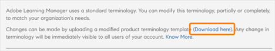
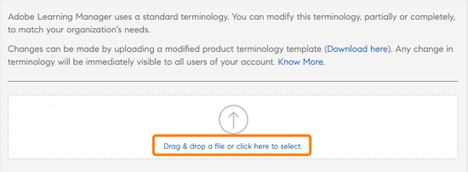
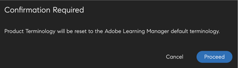

# Terminologie du produit

>[!IMPORTANT]
>
>La terminologie du produit est uniquement disponible pour la version en anglais d’Adobe Learning Manager.

## Qu’est-ce que la terminologie du produit dans Adobe Learning Manager ?

Adobe Learning Manager utilise un ensemble de terminologies standard dans l’interface utilisateur. En tant qu’administrateur, vous pouvez modifier les terminologies en fonction des besoins de votre organisation.

À l’aide de la fonction Terminologie du produit, vous pouvez renommer ces terminologies et respecter les normes d’apprentissage de votre organisation.

## Télécharger le fichier de terminologie CSV

Pour modifier les terminologies, procédez comme suit :

1. En tant qu&#39;administrateur, sélectionnez **[!UICONTROL Paramètres]** > **[!UICONTROL Général]**.
1. Dans la **[!UICONTROL Terminologie du produit]**, sélectionnez **[!UICONTROL Modifier]**.

   
   _Terminologie du produit_

1. Sélectionnez **[!UICONTROL Télécharger ici]** et téléchargez le modèle des terminologies.

   
   _Télécharger le modèle_

## Modifier les terminologies

1. Après avoir téléchargé le fichier CSV, modifiez les terminologies concernées dans la deuxième colonne. Par exemple, vous pouvez changer « module » en « formation » ou « tableau de bord » en « classement ».

   
   _Modifier le fichier csv_

1. Enregistrez les modifications.

## Importer le CSV mis à jour

1. Dans la section **[!UICONTROL Terminologie du produit]**, sélectionnez le lien pour charger le fichier CSV.

   
   _Charger le fichier csv_

1. Importez le CSV mis à jour.
1. Sélectionnez **[!UICONTROL Enregistrer]**.

Les modifications apportées aux terminologies reflètent désormais le rôle d’auteur, d’apprenant, de responsable, d’instructeur ou d’administrateur personnalisé pour ce compte.

## Réinitialiser les terminologies

Après avoir importé le fichier CSV avec les nouvelles terminologies, vous pouvez effectuer une réinitialisation vers les terminologies par défaut.

Sélectionnez **[!UICONTROL Réinitialiser la terminologie du produit]**.

_Réinitialiser la terminologie du produit_

Lorsque vous cliquez sur le lien, un message contextuel de confirmation s’affiche.

_Invite de confirmation_

Les terminologies sont restaurées avec leur nom d’origine.

## Ce qui ne change pas

Les modifications terminologiques ne s’appliquent pas dans les cas suivants :

* Modèles de courrier électronique (**[!UICONTROL Administrateur]** > **[!UICONTROL Modèles de courrier électronique]**)
* Rapports (**[!UICONTROL Administrateur]** > **[!UICONTROL Rapports]**)
