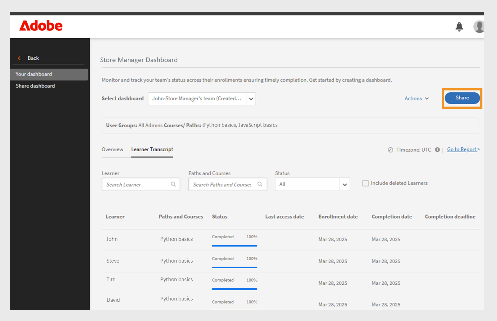

# Rapports

Découvrez les rapports liés au rôle d’administrateur dans l’application Learning Manager.

Adobe Learning Manager vous permet de créer différents rapports pour suivre, surveiller et contrôler les activités des élèves. Les activités des élèves font l’objet d’un suivi et sont capturées automatiquement dans la base de données. Les rapports Responsable et Administrateur sont générés à partir de la base de données.

## Vue d’ensemble {#overview}

Le processus de génération des rapports est similaire pour Administrateur et pour Responsable. Les responsables peuvent afficher les rapports correspondant à leurs subordonnés tandis que les administrateurs peuvent afficher tous les rapports à l’échelle de l’entreprise.

Les rapports sont regroupés dans un tableau de bord. Un rapport se trouve toujours dans un tableau de bord. Un **[!UICONTROL tableau de bord par défaut]** existe par défaut dans la page des rapports. Tout rapport supplémentaire de votre part entre dans ce tableau de bord par défaut. Pour ajouter des rapports à des tableaux de bord individuels, utilisez la flèche déroulante et choisissez **[!UICONTROL Ajouter un rapport]**. Pour plus d’informations sur la création des tableaux de bord, consultez la section Tableaux de bord sur cette page.

## Types de rapports {#typesofreports}

Adobe Learning Manager prend en charge les quatre principaux types de rapports tels que Accomplissement, Temps passé, Compétences et Efficacité. Vous pouvez utiliser les types de rapport suivants pour générer des rapports de plus de 300 variations :

* Statistiques de fourniture des cours aux élèves
* Rapport sur l’efficacité des cours
* Rapport basé sur les compétences de l’élève
* Statistiques d’inscription aux programmes d’apprentissage des élèves
* Temps d’apprentissage des élèves
* Nombre d’élèves
* Fin de certification

## Tableaux de bord Activités des utilisateurs {#useractivitydashboards}

Consultez un résumé de toutes les activités utilisateur sur la plate-forme au fil du temps. Configurez les groupes d’utilisateurs et appliquez des filtres.

Le tableau de bord d’activité des utilisateurs affiche l’activité des utilisateurs dans le compte. Les trois rapports énumérés sont les suivants :

* **Utilisateurs enregistrés :** ce rapport fournit des informations sur le nombre d&#39;utilisateurs enregistrés dans votre compte chaque semaine. Pour les comptes disposant d’une licence Unités mensuelles actives, le rapport affiche les unités MAU à la place.

* **Rapport de visites d&#39;utilisateurs :** ce rapport fournit des informations sur le nombre d&#39;utilisateurs accédant à la plateforme au jour le jour. Un rapport mensuel est également disponible.

* **Rapport sur le temps d&#39;apprentissage passé :** ce rapport fournit des informations sur le temps d&#39;apprentissage passé dans la plateforme au jour le jour. Un rapport mensuel est également disponible.

### Utilisateurs enregistrés {#registeredusers}

Learning Manager consigne le nombre d’utilisateurs enregistrés dans le système chaque semaine. Les administrateurs peuvent consulter ce rapport pour connaître le nombre d’utilisateurs enregistrés ce jour de la semaine. Une fois consigné pour une semaine, le nombre d’utilisateurs enregistrés ne change pas. Par conséquent, le nombre d’utilisateurs enregistrés historiques n’est pas lié à l’ensemble actuel d’élèves dans le système.

Ce rapport fournit des informations sur le nombre d’utilisateurs enregistrés dans votre compte chaque semaine.

Pour les comptes disposant d’une licence Unités mensuelles actives, le rapport affiche les unités MAU à la place.

*Rapport Utilisateurs inscrits*

***Pour les comptes Unités avec accès mensuel :***

**Rapport sur les utilisateurs actifs mensuels**

Ce rapport indique le nombre d’élèves actifs chaque mois dans la plate-forme d’apprentissage. L’utilisateur est considéré comme actif pour le mois s’il exécute l’une des actions d’apprentissage mentionnées ici. Il en va de même pour le décompte des unités actives mensuelles.

Une fois comptabilisé et consigné pour un mois, le nombre d’utilisateurs actifs mensuels ne change pas. Par conséquent, le nombre d’utilisateurs historiques affichés n’est pas lié à l’ensemble actuel d’élèves dans le système.

### Visites d’utilisateurs {#uservisits}

Ce rapport affiche le nombre total d’élèves accédant au système au cours d’une période de jour ou de mois. Parcourir la plate-forme d’apprentissage sans suivre de cours signifie quand même « accéder » à la plate-forme d’apprentissage. Cela permet à l’administrateur de connaître le nombre total d’utilisateurs accédant au système. Le premier jour du mois, Learning Manager crée un enregistrement du nombre total d’utilisateurs accédant à la plate-forme au cours du mois précédent. Il capture également les informations du groupe d’utilisateurs pour ces utilisateurs.

Seuls les groupes d’utilisateurs configurés par l’administrateur sont enregistrés. Cela permet également aux administrateurs d’appliquer un filtre sur les groupes d’utilisateurs pour les données mensuelles historiques. Notez que si la configuration des groupes d’utilisateurs est modifiée et que Learning Manager n’a pas enregistré de données pour ce groupe d’utilisateurs au cours des mois précédents, Learning Manager ne peut pas afficher les données pour ces groupes d’utilisateurs nouvellement configurés pour les mois précédents.

Ce rapport répertorie les utilisateurs qui accèdent à la plate-forme avec tous les formats tels que le Web, l’application mobile, les solutions personnalisées sans interface utilisateur, etc. Le graphique d’utilisation de l’application de l’appareil mentionne spécifiquement uniquement les utilisateurs accédant à la plate-forme à l’aide de l’application de l’appareil Learning Manager. Cela permet aux administrateurs d’identifier l’utilisation de l’application mobile dans leur compte.

*Rapport de visite d&#39;utilisateur*

### Rapport sur le temps d’apprentissage {#learningtimespentreport}

Ici, vous pouvez voir des diagrammes hiérarchiques à deux axes qui affichent le temps d’apprentissage total passé par tous les élèves sur une période de 12 mois. Le deuxième axe représente le temps médian consacré à l’apprentissage d’un élève.

Le temps passé pour différents objets d’apprentissage, notamment les programmes d’apprentissage et les certifications, est calculé pour les éléments suivants :

* Cours en auto-apprentissage avec contenu statique et interactif
* Cours d’activité avec URL.
* Sessions de fin de semaine avec l’indicateur de fin de semaine activé.
* Session de connexion VC où la présence est automatiquement marquée.
* Le temps passé pour différents objets d’apprentissage, notamment les programmes d’apprentissage et les certifications
* Instructions xAPI pour un cours d’activité xAPI.

Vous pouvez exporter le graphique sous la forme d’une feuille de calcul Excel.

Un filtre permettant de choisir la configuration du groupe d’utilisateurs est fourni, permettant de visualiser les données selon différents groupes d’utilisateurs.

Le filtre de date et de groupe d’utilisateurs sélectionné est appliqué à tous les graphiques pertinents du tableau de bord.

>[!NOTE]
>
>Pour les rapports **[!UICONTROL Visites d&#39;utilisateurs]** et **[!UICONTROL Temps d&#39;apprentissage]**, les données par défaut affichées (lorsqu&#39;aucun groupe d&#39;utilisateurs n&#39;est configuré) s&#39;appliqueront à l&#39;ensemble du compte.

## Tableau de bord de contenu de formation {#trainingcontentdashboard}

Le tableau de bord de contenu de formation fournit des informations sur les formations disponibles sur la plate-forme. Vous pouvez consulter les formations très demandées ou suivre toutes les formations disponibles.

### Rapport des formations {#trainingsreport}

Ce rapport fournit des informations sur le nombre total de formations disponibles sur la plate-forme (à l’état publié) au cours d’un mois. Il donne une indication du nombre de formations proposées au fil du temps.

*Rapport de formation*

### Rapport des formations actives {#activetrainingsreport}

Ce rapport fournit des informations sur les formations actives sur la période sélectionnée. Les formations actives sont des formations qui sont inscrites, affichées dans le lecteur ou terminées à cet instant.

Pour les formations actives, les données de tous les groupes internes de l’utilisateur racine (avec rôle de responsable) seront disponibles pour la sélection lorsqu’aucune configuration de groupe d’utilisateurs n’est effectuée. Outre les groupes d’utilisateurs racine, vous pouvez configurer 10 autres groupes d’utilisateurs si nécessaire.

*Rapport de formations actives*

>[!NOTE]
>
>Les données ne s&#39;affichent pas comme prévu lorsque les filtres **[!UICONTROL Tous les utilisateurs]** et **[!UICONTROL 12 mois]** sont sélectionnés, mais les données s&#39;affichent lorsque vous sélectionnez **[!UICONTROL Tous les groupes d&#39;utilisateurs internes].**

<table>
 <tbody>
  <tr>
   <td>
    
<b>Référence</b>
</td>
   <td>
    
<b>Mesure</b>
</td>
   <td>
    
<b>Description</b>
</td>
  </tr>
  <tr>
   <td>
    
1
</td>
   <td>
    
Taux au début (%)
</td>
   <td>
    
Rapport entre le nombre d’élèves ayant commencé le cours et le nombre d’inscriptions.
</td>
  </tr>
  <tr>
   <td>
    
2
</td>
   <td>
    
Taux d’achèvement (%)
</td>
   <td>
    
Rapport entre le nombre total d’utilisateurs ayant suivi le cours et le nombre total d’utilisateurs ayant commencé le cours. 
</td>
  </tr>
  <tr>
   <td>
    
3
</td>
   <td>
    
Retour d’informations de l’élève
</td>
   <td>
    
Moyenne de toutes les réponses des retours d’informations L1 reçues, sur une échelle de 1 à 10, arrondie à l'entier le plus proche. 
</td>
  </tr>
  <tr>
   <td>
    
4
</td>
   <td>
    
Retour d’informations du responsable
</td>
   <td>
    
Moyenne de toutes les réponses des retours d’informations L3 reçues, sur une échelle de 1 à 5, arrondie à l'entier le plus proche. 
</td>
  </tr>
 </tbody>
</table>

Le rapport de formation comporte deux colonnes supplémentaires :

1. Nombre moyen d’étoiles d’un cours.
1. Nombre d’élèves ayant évalué le cours.
1. Chemin incorporé
1. ID du parcours intégré
1. ID de cours incorporé

>[!NOTE]
>
>Les filtres appliqués n’affectent pas le taux au début, le taux d’achèvement, le retour d’informations de l’élève et le retour d’informations du responsable. Les filtres affectent uniquement l’inscription, les vues et les achèvements.

>[!NOTE]
>
>Pour les deux rapports (Contenu de formation, Activité de l&#39;utilisateur), vous pouvez configurer un maximum de 10 groupes d’utilisateurs. Le traitement et la mise à disposition des filtres nouvellement configurés peuvent prendre jusqu’à 24 heures.

## Tableaux de bord récapitulatifs des apprentissages {#dashboards}

### Générer des rapports de tableau de bord

>[!INFO]
>
>Dans cette formation, vous apprendrez à générer des rapports de tableau de bord à partir de la base de données.    

Si vous ne pouvez pas lancer la formation, écrivez à <almacademy@adobe.com>.

Consultez un rapport récapitulatif de toutes les activités d’apprentissage de la plateforme. Sur cette page, vous pouvez voir les informations récapitulatives suivantes pour l’équipe et les profils externes de l’utilisateur racine sélectionné. Vous pouvez également sélectionner une plage horaire :

* Résumé de l’apprentissage sous forme d’inscriptions, de vues et d’achèvements
* Principales compétences
* Résumé de la conformité

*Graphiques récapitulatifs*

S&#39;il y a des gestionnaires internes de niveau racine, ils seront affichés l&#39;un après l&#39;autre.

Tous les profils externes sont répertoriés après les profils internes (utilisateurs racine internes).

Si un profil externe a un responsable, la hiérarchie du responsable s&#39;affiche dans la liste déroulante **[!UICONTROL Afficher les données pour]**. L’utilisateur sera répertorié dans la hiérarchie du responsable dans toutes les pages de détails (Résumé de l’apprentissage, Conformité et État des compétences)

Si ce n’est pas le cas, tous les détails des utilisateurs individuels seront affichés dans la liste.

Pour afficher des détails plus précis sur les inscriptions de diverses équipes internes, cliquez sur **[!UICONTROL Détails du résumé d’apprentissage]**.

*Détails du résumé d’apprentissage*

Lorsque vous cliquez sur une inscription, vous pouvez voir les élèves de chaque responsable et l’inscription à laquelle chaque objet d’apprentissage est associé. Vous pouvez également voir les détails de progression et d’achèvement de chaque élève.

*élèves affectés à un responsable*

Cliquez sur une équipe et exportez son rapport sous la forme d’un fichier .csv. Un administrateur peut exporter le rapport pour n&#39;importe lequel des groupes d&#39;utilisateurs ou des utilisateurs individuels en sélectionnant le groupe d&#39;utilisateurs ou l&#39;utilisateur individuel, puis exporter les détails dans la liste déroulante **[!UICONTROL Action]**.

En outre, vous pouvez voir un graphique à barres des compétences qui sont en cours et ont été acquises. Vous pouvez ajouter/supprimer des compétences que vous souhaitez afficher dans le graphique.

*Graphique à barres empilées de l&#39;état des compétences*

### Tableau de bord Conformité

**Adobe Learning Manager** offre un tableau de bord de conformité à tous les administrateurs et responsables. Les administrateurs peuvent créer un tableau de bord de conformité et le partager avec les responsables. Les responsables pourront afficher le tableau de bord nouvellement partagé sur leur application et peuvent facilement suivre la conformité des membres de leur équipe pour une formation particulière. Le tableau de bord de conformité permet aux administrateurs de classer les cours de conformité personnalisés dans des catégories spécifiques (par exemple, Ventes, Marketing et Juridique). Les catégories de conformité personnalisées sont optimisées par les **[!UICONTROL étiquettes de catalogue]**.

_Vue Administrateur du tableau de bord de conformité_

Les administrateurs peuvent également vérifier l&#39;état de conformité de l&#39;équipe de chaque responsable en sélectionnant **[!UICONTROL Accéder au tableau de bord de conformité]**. Les administrateurs peuvent partager un ensemble de cours de formation avec les responsables individuellement ou en groupe. Cela aide les responsables à suivre facilement la conformité de leurs coéquipiers pour la formation spécifiée.

#### Workflow d’administration

##### Création d’étiquettes de conformité personnalisées

Un libellé de conformité est un type de libellé de catalogue qui catégorise les cours/parcours d’apprentissage/certifications en tant que type de conformité.
Pour créer une étiquette de conformité personnalisée, procédez comme suit :

1. Dans l&#39;application Administrateur, accédez à **[!UICONTROL Paramètres]** > **[!UICONTROL Général]**.
1. Sélectionnez l&#39;option **[!UICONTROL Type de conformité personnalisé]** pour activer l&#39;étiquette de conformité personnalisée.

   
   _Activer la conformité personnalisée_

   >[!NOTE]
   >
   >Ce nouveau libellé de catalogue a été introduit pour classer les cours, les parcours d’apprentissage et les certifications en tant que type de conformité. Pour activer l&#39;option **[!UICONTROL Type de conformité personnalisé]**, vous devez d&#39;abord activer l&#39;option **[!UICONTROL Afficher l&#39;étiquette du catalogue]** dans la même page.

1. Accédez à **[!UICONTROL Paramètres]** > **[!UICONTROL Étiquette de catalogue]** et sélectionnez le **[!UICONTROL Type de conformité]**.
1. Saisissez les valeurs (par exemple, Juridique, Ventes) dans la zone de texte **[!UICONTROL Valeur]** et sélectionnez **[!UICONTROL Ajouter une valeur]**.

   
   _Ajouter des valeurs pour la conformité personnalisée_

1. Sélectionnez **[!UICONTROL Enregistrer]**.

>[!NOTE]
>
>L’auteur doit ajouter ces étiquettes de conformité lors de la création/modification des cours dans son application. Voir [Ajouter des étiquettes de conformité à un cours/parcours d&#39;apprentissage/certification](/help/migrated/authors/feature-summary/courses.md#add-compliance-labels-to-courselearning-pathcertification).

##### Création et partage d’un tableau de bord de conformité

Pour créer et partager un tableau de bord de conformité, procédez comme suit :

1. Accédez à **[!UICONTROL Rapports]** > **[!UICONTROL Résumé de l’apprentissage]**.
1. Dans la section **[!UICONTROL Tableau de bord de conformité]**, sélectionnez **[!UICONTROL Partagé avec les responsables]**.
1. Sélectionnez **[!UICONTROL Partager le tableau de bord]** et sélectionnez les étiquettes créées dans le menu déroulant **[!UICONTROL Sélectionner une étiquette de conformité]**.

   
   _Sélectionner le type de conformité_

1. Saisissez et sélectionnez le nom du responsable dans la zone de texte **[!UICONTROL Partager avec]**.
1. Sélectionnez **[!UICONTROL Partager]** pour envoyer le tableau de bord au responsable sélectionné.

>[!NOTE]
>
>Le partage du nouveau tableau de bord remplacera le tableau de bord existant dans l’application du responsable sélectionné. Les responsables pourront afficher le tableau de bord nouvellement partagé par les administrateurs.

#### Partage du tableau de bord de conformité avec les administrateurs et les administrateurs personnalisés

Les administrateurs peuvent partager le tableau de bord avec d’autres administrateurs et administrateurs personnalisés, ce qui leur donne un accès instantané à tous les tableaux de bord de conformité.

Procédez comme suit pour partager le tableau de bord avec les administrateurs et les administrateurs personnalisés :

1. Connectez-vous en tant qu&#39;**[!UICONTROL administrateur]**.
2. Accédez aux **[!UICONTROL Rapports]** > **[!UICONTROL Résumé de l’apprentissage]**.
3. Sélectionnez **[!UICONTROL Vue Administrateur]** dans la section **[!UICONTROL Tableau de bord de conformité]**.
4. Sélectionnez le bouton **[!UICONTROL Partager le tableau de bord]**.

   
   _Partager le tableau de bord - Administrateur_

5. Sélectionnez les étiquettes de conformité dans le menu déroulant **[!UICONTROL Sélectionner la conformité personnalisée]**. Cette option sélectionne tous les cours ayant les étiquettes de conformité sélectionnées.
6. Sélectionnez les cours, parcours d’apprentissage ou certifications supplémentaires que vous souhaitez partager avec les administrateurs.

   
   _Partager le tableau de bord de conformité_

7. Sélectionnez les utilisateurs ou les groupes d&#39;utilisateurs que vous souhaitez partager le tableau de bord et sélectionnez **[!UICONTROL Partager]**.

##### Afficher le tableau de bord de conformité - Administrateurs personnalisés et autres administrateurs

Tous les administrateurs personnalisés et les autres administrateurs du groupe d’utilisateurs sélectionné peuvent voir le tableau de bord de conformité sur leur application.

Procédez comme suit pour afficher le tableau de bord de conformité :

1. Accédez aux **[!UICONTROL Rapports]** > **[!UICONTROL Résumé de l’apprentissage]** > **[!UICONTROL Tableau de bord de conformité]**.
2. Sélectionnez **[!UICONTROL Votre vue]** dans la section **[!UICONTROL Tableau de bord de conformité]**.
3. Sélectionnez l&#39;option **[!UICONTROL Accéder au tableau de bord de conformité]** pour afficher le nouveau tableau de bord de conformité partagé par l&#39;administrateur.

   
   _Afficher le tableau de bord de conformité - Administrateur personnalisé_

#### Partager avec les responsables de boutique

Les administrateurs peuvent partager le tableau de bord de conformité avec les responsables de boutique, ce qui leur permet de surveiller la progression de la conformité de leurs élèves.

Procédez comme suit pour partager le tableau de bord avec les responsables de magasins :

1. Connectez-vous en tant qu&#39;**[!UICONTROL administrateur]**.
2. Accédez aux **[!UICONTROL Rapports]** > **[!UICONTROL Résumé de l’apprentissage]** > **[!UICONTROL Tableau de bord de conformité]**.
3. Sélectionnez **[!UICONTROL Vue du responsable]** dans la section **[!UICONTROL Tableau de bord de conformité]**.
4. Sélectionnez le bouton **[!UICONTROL Partager le tableau de bord]**.

   
   _Partager le tableau de bord de conformité avec les responsables_

5. Sélectionnez les étiquettes de conformité dans le menu déroulant **[!UICONTROL Sélectionner la conformité personnalisée]**.
Cette option sélectionne tous les cours ayant les étiquettes de conformité sélectionnées.
6. Sélectionnez les cours, parcours d’apprentissage ou certifications supplémentaires que vous souhaitez partager avec les administrateurs.
7. Sélectionnez les utilisateurs ou les groupes d&#39;utilisateurs que vous souhaitez partager le tableau de bord et sélectionnez **[!UICONTROL Partager]**.

##### Afficher le tableau de bord de conformité - Responsable

Reportez-vous à cet article [Afficher le tableau de bord de conformité](/help/migrated/managers/feature-summary/manager-dashboard.md#view-the-dashboard) pour plus d&#39;informations.

#### Modifier le tableau de bord

Procédez comme suit pour modifier le tableau de bord de conformité :

1. Connectez-vous en tant qu&#39;**[!UICONTROL administrateur]**.
2. Accédez aux **[!UICONTROL Rapports]** > **[!UICONTROL Résumé de l’apprentissage]** > **[!UICONTROL Tableau de bord de conformité]**.
3. Sélectionnez **[!UICONTROL Vue Administrateur]** ou **[!UICONTROL Vue Responsable]** dans la section **[!UICONTROL Tableau de bord de conformité]**. Vous pouvez voir les tableaux de bord de conformité dans cette section.
4. Sélectionnez **[!UICONTROL Modifier]** dans le tableau de bord de conformité que vous souhaitez modifier.

   
   _Modifier le tableau de bord de conformité_

5. Modifiez les détails requis et sélectionnez **[!UICONTROL Partager]**.
6. Le tableau de bord de conformité sera partagé avec les responsables sélectionnés.

#### Retirer le tableau de bord - Administrateur

Procédez comme suit pour retirer le tableau de bord de conformité :

1. Connectez-vous en tant qu&#39;**[!UICONTROL administrateur]**.
2. Accédez aux **[!UICONTROL Rapports]** > **[!UICONTROL Résumé de l’apprentissage]** > **[!UICONTROL Tableau de bord de conformité]**.
3. Sélectionnez **[!UICONTROL Vue Administrateur]** ou **[!UICONTROL Vue Responsable]** dans la section **[!UICONTROL Tableau de bord de conformité]**. Vous pouvez voir les tableaux de bord de conformité dans cette section.
4. Sélectionnez **[!UICONTROL Retirer]** sur le tableau de bord de conformité que vous souhaitez supprimer et sélectionnez **[!UICONTROL Continuer]**.
5. Cette action supprimera le tableau de bord de conformité partagé de l’application du responsable.

   
   _Retirer le tableau de bord de conformité_

#### Définir le widget de conformité par défaut pour les élèves

Suivez ces étapes pour définir le widget de conformité par défaut pour les élèves :

1. Connectez-vous en tant qu&#39;**[!UICONTROL administrateur]**.
2. Accédez aux **[!UICONTROL Rapports]** > **[!UICONTROL Résumé de l’apprentissage]** > **[!UICONTROL Tableau de bord de conformité]**.
3. Sélectionnez **[!UICONTROL Vue Élève]** dans la section **[!UICONTROL Tableau de bord de conformité]**.
4. Sélectionnez **[!UICONTROL Modifier]** dans la section **[!UICONTROL Vue Élève]**.

   
   _Définir le widget de conformité par défaut pour les élèves_
5. Sélectionnez les étiquettes de conformité dans la liste déroulante **[!UICONTROL Conformité personnalisée]**. Cette option sélectionne tous les cours ayant les étiquettes de conformité sélectionnées.
6. Sélectionnez **[!UICONTROL Continuer]** pour définir le widget de conformité par défaut.

Les élèves peuvent voir les cours ou parcours d’apprentissage sélectionnés sur le widget Conformité sur leur page d’accueil. Reportez-vous au [widget Tableau de bord de conformité](/help/migrated/learners/feature-summary/learner-home-page.md#compliance-dashboard-widget) pour plus d&#39;informations.

## Rapports personnalisés

Les administrateurs peuvent générer des rapports spécifiques à l&#39;aide du modèle personnalisé disponible dans la section **[!UICONTROL Rapports]**.

### Rapports échantillon {#samplereports}

L’onglet **[!UICONTROL Exemples de rapports]** affiche certains rapports indicatifs basés sur des exemples de points de données. Consultez ces rapports pour avoir une idée des différents types de rapports comportant de nombreuses fonctionnalités et pouvant être générés en utilisant les données de votre compte.

### Rapports de tableau de bord {#dashboardreports}

Un tableau de bord est une série de rapports. Les rapports peuvent être regroupés dans un tableau de bord selon votre choix. Pour afficher tous les tableaux que vous avez créés, cliquez sur cet onglet du tableau. Dans la liste déroulante **[!UICONTROL Afficher le tableau de bord]**, vous pouvez sélectionner le tableau de bord par défaut ou un tableau de bord que vous avez créé.

### Rapports Excel {#excelreports}

L’onglet **[!UICONTROL Rapports Excel]** vous permet d’exporter des rapports au format de fichier XLS.

Vous pouvez télécharger les types de rapport suivants :

* Rapports de cours
* Relevés de notes des élèves
* Rapport des annonces
* Rapport des assistances à la tâche
* Piste d’audit de contenu
* Piste d’audit de l’utilisateur
* Rapport de connexion/d’accès
* Transcriptions de ludification
* Piste d’audit de ludification

### Relevés de notes de l&#39;élève {#learnertranscripts}

Les relevés de notes des élèves dans les rapports Excel affichent les colonnes Crédits requis et Crédits gagnés sous forme de nombres décimaux.

### Rapports de cours {#coursereports}

En tant qu’administrateur, vous pouvez télécharger des rapports pour les cours. Procédez comme suit :

1. Ouvrez **[!UICONTROL Rapports]** > **[!UICONTROL Rapports personnalisés]** > **[!UICONTROL Rapports Excel]** > **[!UICONTROL Rapports de cours]**.
1. La boîte de dialogue **[!UICONTROL Rapport de cours]** s’affiche. Sélectionnez le cours dont vous souhaitez récupérer le rapport et cliquez sur **[!UICONTROL Afficher]**.

   
   *Rapports de cours*

1. Vous êtes redirigé vers la page du cours. Vous pouvez exporter le score du quiz par utilisateur et par question en fonction de chaque inscription en choisissant le type d’inscription spécifique.
1. Sélectionnez **[!UICONTROL Exporter le score du quiz]** pour exporter le rapport. La boîte de dialogue **[!UICONTROL Génération d’une demande de rapport]** s’affiche. Cliquez sur **[!UICONTROL OK]** pour confirmer.

   
   *Génération De La Demande De Rapport*

   >[!NOTE]
   >
   >Un rapport de scores de questionnaires contiendra les détails des scores pour chaque tentative si l’option de multiples tentatives est configurée pour le module.

### Générer des rapports de cours

>[!INFO]
>
>Dans cette formation, vous apprendrez à exporter des rapports de cours et à configurer des abonnements par e-mail pour ces rapports.    

Si vous ne pouvez pas lancer la formation, écrivez à <almacademy@adobe.com>.

### Relevés de notes des élèves {#LearnerTranscripts-1}

Adobe Learning Manager permet aux administrateurs d’une organisation de générer des récapitulatifs liés aux stagiaires. Le rapport Relevé de notes de l’élève comprend les éléments suivants :

1. Relevé de notes de l’élève : tableau de bord Activité d’apprentissage
1. Compétence : Tableau de bord des compétences
1. Tableau de bord Conformité

Les relevés de notes des élèves dans les rapports Excel affichent les colonnes Crédits requis et Crédits gagnés sous forme de nombres décimaux.

Pour plus d&#39;informations sur la génération de rapports de relevé de notes de l&#39;élève et plus d&#39;informations, voir [Relevés de notes de l&#39;élève](learner-transcripts.md).

### Rapports des annonces {#announcementsreports}

En tant qu’administrateur, vous pouvez générer un rapport de toutes les annonces que vous envoyez. Le rapport comporte les informations suivantes :

* Type d’annonce
* Nom de l’annonce
* Date de l’annonce
* État de l’annonce
* Nom de l’élève

Pour télécharger un rapport, suivez l’une de ces étapes :

1. Ouvrez **[!UICONTROL Rapports]** > **[!UICONTROL Rapports personnalisés]** > **[!UICONTROL Rapports Excel]** > **[!UICONTROL Rapport d&#39;annonces]**. La boîte de dialogue **[!UICONTROL Génération d’une demande de rapport]** s’ouvre. Cliquez sur OK.
1. [!UICONTROL **Annonces**] > [!UICONTROL **Actions**] > [!UICONTROL **Rapport D&#39;Exportation**].

   
   *Rapport d&#39;annonces*

1. Vous pouvez extraire un rapport pour une annonce spécifique en cliquant sur **[!UICONTROL Exporter le rapport]** sous l&#39;icône des paramètres.

   
   *Signaler pour des annonces spécifiques*

### Rapport des assistances à la tâche {#jobaidsreport}

Les assistances à la tâche constituent du contenu de formation auquel un élève peut accéder sans s’inscrire à un objet d’apprentissage spécifique comme un cours ou un programme d’apprentissage. Les administrateurs peuvent extraire et télécharger un rapport sur les assistances à la tâche.

Le rapport extrait comprend les informations suivantes :

* Nom
* Type d’assistance à la tâche
* État de l’assistance à la tâche (publiée ou retirée)
* Date d’inscription
* Date de fin
* Date de téléchargement
* Nom de l’élève
* Nom du responsable
* Créé par

Pour télécharger un rapport, effectuez l’une des opérations suivantes :

* Ouvrez **[!UICONTROL Rapports]** > **[!UICONTROL Rapports personnalisés]** > **[!UICONTROL Rapports Excel]** > **[!UICONTROL Rapports d&#39;assistance à la tâche]**. La boîte de dialogue **[!UICONTROL Génération d’une demande de rapport]** s’affiche. Cliquez sur **[!UICONTROL OK]**.
* Ouvrez **[!UICONTROL Assistance à la tâche]** > **[!UICONTROL Actions]** > **[!UICONTROL Rapport d&#39;exportation]**.

*Rapport d&#39;assistances à la tâche*

* Vous pouvez également extraire un rapport pour une assistance à la tâche spécifique en cliquant sur **[!UICONTROL Exporter le rapport]** sous l’icône des paramètres.

*Signaler une assistance à la tâche spécifique*

### Rapport des assistances à la tâche

Après avoir sélectionné **[!UICONTROL Rapport d&#39;assistances à la tâche]** dans la liste, vous voyez deux options :

*Télécharger le rapport d&#39;inscription des utilisateurs des assistances à la tâche*

**Toutes les assistances à la tâche** : si le nombre d&#39;assistances à la tâche dans le compte est inférieur à 10 millions, le rapport généré contiendra les informations d&#39;inscription de toutes les assistances à la tâche. Il s’agira de la sélection par défaut. Si le nombre de lignes dépasse 10 millions, une erreur s&#39;affiche et vous devez sélectionner manuellement les assistances à la tâche requises.

**Assistances à la tâche sélectionnées** : si vous sélectionnez cette option, vous pouvez saisir les assistances à la tâche pour lesquelles vous souhaitez générer le rapport. Vous pouvez sélectionner jusqu&#39;à 10 assistances à la tâche. Adobe Learning Manager vérifie si le nombre d’assistances à la tâche dépasse 10 millions.

Inscription au rapport d&#39;assistances à la tâche 
*Sélectionner une assistance à la tâche*

**Rapport d&#39;assistances à la tâche**

Si vous sélectionnez cette option, les détails de toutes les assistances à la tâche du système, ainsi que leurs métadonnées et formations, sont téléchargés.

Le rapport téléchargé se compose des champs suivants :

* Nom de l’assistance à la tâche
* Langue(s)
* ID
* Type
* Durée (minutes)
* État
* Date de publication (fuseau horaire UTC)
* Créé par nom
* Créé par courrier électronique
* Créé par ID unique utilisateur
* Catalogue(s)
* Parcours d’apprentissage
* Cours
* Balise(s)
* Compétence(s)

**Rapport d&#39;inscription des utilisateurs des assistances à la tâche**

Le rapport d’inscription contient des détails sur l’inscription des utilisateurs et d’autres informations.

Le rapport téléchargé se compose des champs suivants :

* Nom de l’assistance à la tâche
* Type
* État
* Date d’inscription (fuseau horaire UTC)
* Date de fin (fuseau horaire UTC)
* Date de téléchargement (fuseau horaire UTC)
* Nom de l’élève
* Courrier électronique
* ID utilisateur unique
* Nom du responsable
* Adresse électronique du responsable
* ID utilisateur unique de responsable
* Affecté par nom
* Affecté par courrier électronique
* Affecté par ID utilisateur unique
* Créé par nom
* Créé par courrier électronique
* Créé par ID unique utilisateur
* Code tâche
* Nouveau champ
* Profil

### Rapports de piste d’audit de contenu {#contentaudittrailreports}

Utilisez le générateur de rapports de la **[!UICONTROL Piste d&#39;audit de contenu]** pour générer un rapport de toutes les modifications apportées à un cours au cours de sa vie dans le système. Le rapport généré récupère les informations suivantes.

* ID d’objet
* Nom d’objet
* Type d’objet
* Type de modification
* Description
* ID de l’objet référencé
* Nom de l’objet référencé
* Modifié par nom d’utilisateur
* ID utilisateur de l’auteur de la modification
* Date de modification (fuseau horaire UTC)

Dans la colonne **Type de modification**, vous obtiendrez les détails suivants :

| Type de modification | Description |
| --- | --- |
| Créer | Cours créé |
| Ajout de certification | Certification ajoutée au catalogue |
| Suppression de la certification | Certification supprimée du catalogue |
| Ajout de contenu | Contenu ajouté au module |
| Ajout de cours | Cours ajouté au parcours d’apprentissage |
| Suppression de cours | Cours supprimé du parcours d’apprentissage |
| Ajouter une étiquette personnalisée | Libellé personnalisé ajouté au catalogue |
| Supprimer l’étiquette personnalisée | Libellé personnalisé supprimé du catalogue |
| Supprimer | Catalogue supprimé |
| Ajout d’assistance à la tâche | Assistance à la tâche ajoutée au catalogue |
| Suppression de l’assistance à la tâche | Assistance à la tâche supprimée du catalogue |
| Ajout d’un parcours d’apprentissage | Parcours d’apprentissage ajouté au catalogue |
| Suppression du parcours d’apprentissage | Parcours d’apprentissage supprimé du catalogue |
| Ajout de contenu de module | Module ajouté au cours (section Contenu) |
| Suppression de contenu de module | Module supprimé du cours (section Contenu) |
| Publié | Cours ou parcours d’apprentissage publié et ajouté au catalogue par défaut |
| Republié | Cours republié |
| Ajout de ressources | Ressource ajoutée au cours |
| Suppression de ressource | Ressource supprimée du cours |
| Retiré | Cours retiré |
| Ajout de catalogue partagé | Catalogue partagé avec le catalogue |
| Suppression du catalogue partagé | Partage de catalogue supprimé du catalogue |
| Mise à jour du catalogue partagé | État de partage de catalogue : actif |
| Mise à jour  | Cours ou parcours d’apprentissage mis à jour |
| Ajouter un groupe d’utilisateurs | Groupe d’utilisateurs ajouté au catalogue |
| Groupe d’utilisateurs supprimé | Groupe d’utilisateurs supprimé du catalogue |

Les informations relatives aux métadonnées ne sont pas récupérées dans le rapport généré.

Pour générer un rapport d’audit de piste de cours, procédez comme suit.

1. Sélectionnez **[!UICONTROL Rapport]** > **[!UICONTROL Rapports Excel]** > **[!UICONTROL Piste d&#39;audit de cours]**. La boîte de dialogue **[!UICONTROL Piste d’audit de contenu]** s’affiche.

   
   *Piste d&#39;audit du cours*

1. Sélectionnez le cours, le programme d’apprentissage et la certification dont vous souhaitez télécharger le rapport. Si ces informations ne sont pas spécifiées, tous les rapports sont téléchargés par défaut.
1. Sélectionnez une période pour le rapport et cliquez sur **[!UICONTROL Générer]**.
1. Le rapport est généré et vous serez averti que le rapport d’audit de contenu est prêt. Vous pouvez télécharger le rapport.

### Rapports de piste d’audit d’utilisateur {#useraudittrailreports}

Le journal d’audit des utilisateurs capture le cycle de vie des utilisateurs, des groupes d’utilisateurs et des profils d’auto-inscription. Elle indique tout ajout et toute suppression d’utilisateur ainsi que tout changement de responsable. La création et la suppression des profils d’auto-inscription sont enregistrées. Vous pouvez également suspendre et reprendre le processus d’auto-inscription.

Vous pouvez utiliser les fonctions Ajouter, Activer, Désactiver, Suspendre ou Reprendre pour les profils externes, et les fonctions Ajouter, Supprimer, Suspendre ou Reprendre pour le processus d’auto-inscription. Les téléchargements de fichier CSV sont également consignés.

1. Sélectionnez **[!UICONTROL Rapport > Rapport Excel > Piste utilisateur]**. La boîte de dialogue Piste d’audit de l’utilisateur s’affiche.
1. La boîte de dialogue Piste d’audit d’utilisateur s’affiche. Choisissez la plage de dates dans le menu contextuel. Vous pouvez choisir de générer le rapport pour la semaine passée ou le mois passé. Vous pouvez également sélectionner une date personnalisée.

   
   *Piste d&#39;audit de l&#39;utilisateur*

1. Cliquez sur **[!UICONTROL Générer]** pour générer le rapport.

La boîte de dialogue **[!UICONTROL Rapport de piste d’audit d’utilisateur]** contient deux filtres.

**Filtre de plage de dates :** Choisissez la plage de dates pour laquelle vous souhaitez générer le rapport. Trois options s’offrent à vous :

* La semaine dernière
* Le mois dernier
* Date personnalisée

Filtre Sélectionner des élèves : recherchez un utilisateur ou un groupe d’utilisateurs.

Le rapport exporté contient les données des utilisateurs qui répondent aux deux critères de recherche spécifiés.

*Piste d’audit de l’utilisateur*

>[!NOTE]
>
>Lorsqu’une compétence est attribuée ou supprimée, elle peut être suivie dans le rapport d’audit de l’utilisateur.

### Rapport de configuration des extensions

Ce rapport fournit des informations sur les détails de configuration de toutes les extensions natives ajoutées, y compris leur état d’activation. Découvrez comment télécharger le rapport d&#39;extension, voir [Télécharger le rapport d&#39;extension](native-extensibility.md#download-extension-report).

### Rapport d’activité xAPI

Ce rapport fournit les données de toutes les instructions xAPI enregistrées et générées pendant les modules d&#39;activité xAPI.

Pour télécharger ce rapport, procédez comme suit :

1. Sélectionnez **[!UICONTROL Rapport > Rapport Excel > Rapport d&#39;activité xAPI]**. La boîte de dialogue Rapport d’activité xAPI s’affiche.
1. Choisissez la plage de dates dans le menu contextuel. Vous pouvez choisir de générer le rapport pour la semaine passée ou le mois passé. Vous pouvez également sélectionner une date personnalisée.
1. Sélectionnez les élèves et l’activité dans le menu déroulant.
1. Sélectionnez **[!UICONTROL Générer]** pour générer le rapport.

### Rapports de ludification {#gamification}

Les administrateurs peuvent télécharger une transcription de ludification au format CSV. Vous pouvez télécharger le rapport pour un utilisateur individuel ou pour des groupes d’utilisateurs. Le nom d’utilisateur, l’adresse e-mail de l’utilisateur, l’UUID de l’utilisateur, le nombre total de points de l’utilisateur marqués, la répartition des points collectés, le nom des groupes dans lesquels l’utilisateur joue, le nom du responsable et les valeurs des champs actifs sont tous récupérés dans le rapport. Les administrateurs peuvent utiliser ce rapport pour évaluer et comprendre le classement des utilisateurs dans une entreprise ou pour un groupe spécifique.

1. Sélectionnez Rapport > Rapport Excel > Rapport de ludification.

   
   *Rapport de ludification*

1. La boîte de dialogue Transcriptions de ludification s’affiche. Sélectionnez des élèves à l’aide de leur nom, profil, groupes d’utilisateur, ID d’adresse électronique ou UUID.

   
   *Boîte de dialogue des transcriptions de ludification*

1. Cliquez sur **[!UICONTROL Générer]** pour générer le rapport.

   Après avoir généré le rapport d’un élève, vous devez être en mesure d’exporter les informations de niveau actuel et atteint pour tous les utilisateurs (internes, externes ou supprimés) du compte. Vous pouvez également vérifier les dates auxquelles certains niveaux ont été atteints par un élève :

   * Date d’atteinte du niveau Bronze
   * Date d’atteinte du niveau Argent
   * Date d’atteinte du niveau Or
   * Date d’atteinte du niveau Platine

   Ces colonnes contiennent les dates auxquelles le niveau a été atteint pour la toute première fois. La colonne **[!UICONTROL Niveau actuel]** affiche le niveau actuel de l&#39;élève.

   Lorsque l’administrateur réinitialise la ludification, tous les points de l’élève sont réinitialisés en conséquence.

### Rapport de piste d’audit de ludification {#gamification-audit-trail}

Ce rapport contient l’historique et les raisons des points de ludification des élèves obtenus pour chaque règle.

### Télécharger le rapport

1. Sélectionnez l’URL de la piste d’audit de ludification.
1. Dans la fenêtre contextuelle **Piste d&#39;audit de ludification**, sélectionnez la plage de dates.
1. Sélectionnez **Générer**.

Le rapport est téléchargé au format CSV. Le fichier contient les colonnes suivantes :

* Nom
* E-mail/UUID,
* Statut
* Action
* Points,
* Points d’équilibre
* Règle/Tâche
* Sous-tâche Règle/Tâche,
* Détails de la règle/tâche
* Type,
* Nom,
* Nom de l’instance Date d’obtention (fuseau horaire UTC)
* Heure de début de la règle/tâche
* Heure de fin de la règle/tâche

### Rapport d’inscription et de désinscription {#enrollmentandunenrollmentreport}

Les administrateurs et les responsables peuvent extraire un rapport des élèves qui ont été inscrits et désinscrits. En tant qu’administrateur, vous pouvez afficher tout élève, administrateur ou responsable qui a été inscrit ou désinscrit d’une instance d’un cours, d’un programme d’apprentissage ou d’une certification et exporter le rapport. En tant que responsable, vous ne pouvez récupérer qu’un rapport des membres de votre équipe. En tant que responsable, vous ne pouvez pas voir les élèves supprimés ou votre propre nom dans l’application du responsable en tant qu’élève inscrit ou non inscrit.

Pour télécharger un rapport, procédez comme suit : Ouvrez le **[!UICONTROL cours/ programme d&#39;apprentissage/ certification]** > **[!UICONTROL élèves]** > **[!UICONTROL action]** > **[!UICONTROL rapport d&#39;exportation]**.

*Rapport de désinscription*

### Rapport de commentaires {#feedback-report}

En tant qu’administrateur, vous pouvez désormais récupérer le retour d’informations de l’élève (L1) et le retour d’informations du responsable (L3) pour des formations sélectionnées sur une période donnée.

Vous pouvez exporter les données à partir de l’interface utilisateur ou via le connecteur PowerBI pour une analyse plus approfondie.

Les rapports de retour d&#39;informations L1 et L3 offrent la possibilité de télécharger un rapport de retour d&#39;informations consolidé pour les réponses L1 et L3 des formations sélectionnées sur une période de **un an** ou pour jusqu&#39;à 10 formations sélectionnées pour n&#39;importe quelle période.

Connectez-vous en tant qu&#39;administrateur, cliquez sur **[!UICONTROL Rapports]** > **[!UICONTROL Rapports personnalisés]**, puis dans la liste des rapports, cliquez sur **[!UICONTROL Rapport de commentaires]**.

*Télécharger le rapport de commentaires*

En cliquant sur Télécharger après avoir sélectionné les filtres, vous recevrez une notification pour télécharger le rapport au format CSV.

Le rapport téléchargé contiendra des détails tels que le nom et le type de la formation, le nom de l’instance, le nom et l’adresse e-mail de l’élève, le type de retour d’informations : L1 ou L3, les dates du retour d’informations envoyé pour les nouvelles données.

Pour les données existantes avant cette mise en œuvre de la fonctionnalité, la date d’achèvement de l’objet d’apprentissage sera affichée, la date d’achèvement de l’objet d’apprentissage, la question de retour d’informations L1 Texte réel individualisé et le texte de la salle de classe dans différentes colonnes, les réponses respectives du retour d’informations L1, le nom et l’adresse e-mail du responsable, la valeur du retour d’informations L3 et la date de soumission, les champs actifs.

Vous pouvez également exporter les données de l’interface utilisateur ou vers Power BI, qui prend en charge toutes les formations pour n’importe quelle période afin d’effectuer une analyse plus approfondie

### Rapport des formations {#training-report}

Learning Manager prend en charge le rapport de formation, qui permet aux administrateurs de télécharger les détails de la formation et les métadonnées associées, notamment l’auteur, la date de publication, les compétences, les étiquettes de catalogue, etc.

Dans l&#39;application Administration, cliquez sur **[!UICONTROL Rapports]** > **[!UICONTROL Rapports personnalisés]** > **[!UICONTROL Rapports Excel]** > **[!UICONTROL Rapport de formations]**.

Vous pouvez télécharger des rapports pour les éléments suivants :

* Formations sélectionnées (10 maximum) : sélectionne une ou plusieurs formations (jusqu’à 10) dans n’importe quel catalogue
* Formations des catalogues sélectionnés (5 maximum) : (la sélection du catalogue contiendra jusqu’à cinq catalogues)
* Toutes les formations : (toutes les formations dans le compte)

*Télécharger le rapport de formation*

Dans la section Options avancées, les options suivantes sont disponibles :

* Inclure les descriptions de cours dans le programme d’apprentissage et la certification
* Inclure les informations de niveau de module

Après avoir sélectionné les filtres et cliqué sur Télécharger, vous recevrez une notification pour télécharger le rapport au format CSV.

Le rapport contiendra les champs suivants :

*Nom du catalogue, Type de formation, ID de formation, ID unique de formation, Nom de la formation, Sous-formations, Modules, Durée de la formation ou du module, Format, État de la formation, Compétences, Auteur, Date de la dernière publication, Date du dernier achèvement, Nombre d’inscriptions des instructeurs, Nombre de cours démarrés, Nombre d’achèvements, Score L1 moyen, Score L2 moyen, Score L3 moyen, Réponses L1 reçues, Réponses L2 reçues, Réponses L3 reçues, Étiquettes de catalogue et balises.*

*Options supplémentaires*

### Rapport récapitulatif de la session {#session-summary-report}

Le rapport récapitulatif de la session contient toutes les sessions prévues pour un élève à une date spécifiée.

Cela permet à l’administrateur d’exporter tous les détails des sessions Virtuelle et Salle de classe incluses dans la période donnée. L’administrateur peut également exporter le rapport de session en ce qui concerne des formations ou des instructeurs spécifiques.

Cela aidera également l&#39;administrateur à comprendre les sessions planifiées sur une base mensuelle et à identifier le calendrier des instructeurs et les sessions déjà dispensées.

En tant qu&#39;administrateur, cliquez sur **[!UICONTROL Rapports personnalisés]** > **[!UICONTROL Rapport récapitulatif de la session]**.

Dans la boîte de dialogue qui suit, sélectionnez la plage de dates et la formation ou l’instructeur pour obtenir un récapitulatif.

*Rapport récapitulatif de la session*

Le fichier CSV téléchargé contient les champs suivants :

* Date et heure de début
* Date et heure de fin

* Nom du module
* Durée de la session (en minutes)
* Nombre de sièges
* Lieu
* Nom d’instance
* Nom du cours
* ID du cours
* Nom de l’instructeur
* E-mail de l&#39;instructeur
* Nombre d’inscriptions
* Type de session
* Limite de liste d’attente
* Nombre d’utilisateurs en liste d’attente
* E-mails des utilisateurs en liste d’attente
* Informations sur le lieu
* Région de l’emplacement

### Rapport sur l’utilisation de l’instructeur

Ce rapport capture le temps (en minutes) passé chaque jour par un instructeur pour enseigner les sessions qui lui sont assignées. Le rapport peut être téléchargé pendant une période de trois mois à compter de la date de début sélectionnée.

Pour télécharger le rapport, cliquez sur **[!UICONTROL Rapports]** > **[!UICONTROL Rapports personnalisés]** > **[!UICONTROL Rapport d&#39;utilisation de l&#39;instructeur]**.

Sélectionnez un ou plusieurs instructeurs et la plage de dates.

*Télécharger le rapport d&#39;utilisation de l&#39;instructeur*

Le rapport téléchargé contient les champs suivants :

* Nom du formateur
* ID de l’instructeur
* Niveau de compétence
* Dates sous forme de colonnes. Si le formateur est utilisé à une date donnée, le nombre de sessions apparaît. Si l’instructeur n’est pas utilisé un jour, la valeur affiche zéro.

Le rapport contient des enregistrements sur trois mois à partir du mois sélectionné.

Pour récupérer les enregistrements de tous les instructeurs, laissez le champ Instructeur vide.

Un administrateur personnalisé autorisé à générer des rapports peut également récupérer ce rapport.

### Rapport de piste d’audit d’utilisateur

Ce rapport capture des informations sur les élèves qui ont changé d&#39;instance, de « de l&#39;instance » à « vers l&#39;instance », qui ont changé d&#39;heure, de date, etc.

Sélectionnez les élèves ou un groupe d’utilisateurs.

Pour télécharger le rapport, cliquez sur **[!UICONTROL Rapports]** > **[!UICONTROL Rapports personnalisés]** > **[!UICONTROL Rapport de piste d&#39;audit de l&#39;utilisateur]**.

*Télécharger Le Rapport De Piste D&#39;Audit De L&#39;Utilisateur*

### Rapport du plan d’apprentissage

Ce rapport contient des détails sur tous les plans d’apprentissage d’un compte, par exemple, les groupes d’utilisateurs associés, le statut et les informations de déclencheur.

Le rapport contient les éléments suivants :

* Nom du plan d’apprentissage
* Type (se produit lorsque)
* Formation (terminée)
* Compétence (atteinte)
* Date (à la date)
* Action
* Statut, créé par
* Date de création
* Date de dernière modification
* Groupe d’utilisateurs (s’applique à)
* Groupe d’utilisateurs (ajouter à)
* Inscrire après
* Type(s) d’élément d’apprentissage
* Élément(s) d’apprentissage
* Instance(s) d’élément d’apprentissage
* Élément d’apprentissage
* Date d’achèvement
* Rappel des éléments d’apprentissage
* Scope-Catalog
* Scope-Usergroup

### Piste d’audit pour les rôles personnalisés

Les administrateurs peuvent télécharger le rapport d’audit des rôles personnalisés pour suivre toutes les modifications apportées aux rôles personnalisés, y compris la création, la modification et la suppression des rôles personnalisés et leur accès aux fonctionnalités associées.

Pour télécharger le rapport, procédez comme suit :

1. Connectez-vous en tant qu’administrateur.
2. Sélectionnez Rapports > Rapports personnalisés.
3. Sélectionnez Piste d’audit du rôle personnalisé et choisissez la période
4. Sélectionnez Générer pour télécharger le rapport.

Le rapport Piste d’audit du rôle personnalisé contient les champs suivants :

* ID du rôle
* Nom du rôle
* Type d’activité
* Type de modification
* Description
* Type d’objet référencé
* ID d’objet référencé
* Nom d’objet référencé
* Courrier électronique d’objet référencé
* Modifié par le nom de l’utilisateur
* Modifié par l’UUID utilisateur
* Modifié par le courrier électronique de l’utilisateur
* Date de modification (fuseau horaire UTC)
* Source

## Inscription aux courriers électroniques {#emailsubscriptions}

Vous pouvez obtenir vos rapports favoris par courrier électronique en vous abonnant.

### Configuration des abonnements aux e-mails

>[!INFO]
>
>Dans cette formation, vous apprendrez à configurer des abonnements par e-mail pour les rapports de tableau de bord.    

Si vous ne pouvez pas lancer la formation, écrivez à <almacademy@adobe.com>.

Dans la page **[!UICONTROL Rapports]**, cliquez sur l&#39;onglet **[!UICONTROL Abonnement]**. La page Abonnement aux rapports s’affiche.

Pour sélectionner le nom du rapport dans la liste déroulante, commencez à saisir le nom du rapport dans le champ Rapports. Sélectionnez la fréquence du courrier électronique dans la liste déroulante. Vous pouvez ajouter l’objet du courrier électronique et fournir un autre ID de courrier électronique.

Vous pouvez modifier et supprimer des abonnements.

## Rapports historiques

Les rapports historiques dans Adobe Learning Manager (ALM) font référence aux rapports qui capturent les données historiques et les activités au sein de la plate-forme d’apprentissage. Ces rapports fournissent des informations sur les activités passées des élèves, le contenu de la formation, les performances du groupe d’utilisateurs et d’autres données pertinentes. Les rapports historiques permettent aux administrateurs de suivre, de surveiller et d’analyser les progrès et l’efficacité des initiatives d’apprentissage au fil du temps.

### Rapports d’accès aux cours

Les rapports d&#39;accès aux cours fournissent des informations sur la révision de chaque cours.

Pour télécharger ce rapport, procédez comme suit :

1. Accédez à **[!UICONTROL Rapports]** > **[!UICONTROL Rapports personnalisés]** > **[!UICONTROL Rapports historiques]**.
1. Sélectionnez **[!UICONTROL Rapport d&#39;accès au cours]**. La boîte de dialogue Génération de la demande de rapport s’ouvre.
1. Sélectionnez l’année et le trimestre dans le menu déroulant.
1. Sélectionnez **[!UICONTROL Générer]**.

### Rapports de connexion/d’accès

Les rapports de connexion/accès fournissent des informations sur les connexions et les accès des utilisateurs. Vous pouvez générer un rapport contenant des données sur trois mois à la fois.

Pour télécharger ce rapport, procédez comme suit :

1. Accédez à **[!UICONTROL Rapports]** > **[!UICONTROL Rapports personnalisés]** > **[!UICONTROL Rapports historiques]**.
1. Sélectionnez **[!UICONTROL Rapport de connexion/accès]**. La boîte de dialogue Génération de la demande de rapport s’ouvre.
1. Sélectionnez l’année et le trimestre dans le menu déroulant.
1. Sélectionnez **[!UICONTROL Générer]**.

## Création d’un tableau de bord {#createadashboard}

1. Pour commencer à créer vos propres tableaux, cliquez sur Ajouter un tableau de bord sur le côté droit de la page.

   
   *Ajouter des tableaux de bord*

1. Indiquez le nom et la description du tableau de bord.
1. Si vous souhaitez partager le tableau de bord avec n&#39;importe quel responsable, sélectionnez-les dans le champ **[!UICONTROL Partager avec]**. Vous pouvez utiliser tous les critères de sélection habituels pour cette opération.
1. Cliquez sur **[!UICONTROL Enregistrer].**

Vous pouvez afficher le tableau récemment créé dans l’onglet **[!UICONTROL Rapports de tableau de bord]**.

Pour ajouter des rapports à votre tableau, cliquez sur la liste déroulante dans l&#39;angle supérieur droit de la fenêtre de votre tableau et cliquez sur **[!UICONTROL Ajouter un rapport]**. Le rapport créé selon cette procédure est associé à votre tableau de bord.

>[!NOTE]
>
>Les rapports que vous créez en cliquant sur Ajouter dans le coin supérieur droit de la page Rapports sont ajoutés à votre tableau de bord par défaut.

## Tableaux de bord partagés {#shareddashboards}

Les tableaux partagés sont une série de rapports qui ont été partagés avec vous par d’autres utilisateurs au sein de votre entreprise. Tous les rapports que vous ajoutez à un tableau partagé sont automatiquement partagés avec les autres utilisateurs ayant accès à ce tableau.

Vous pouvez partager le forum de deux manières :

* En entrant les utilisateurs dans le champ **[!UICONTROL Partager avec]** avec lesquels le tableau de bord est partagé.
* Choisissez Modifier un tableau dans la liste déroulante et saisissez les détails de l’utilisateur avec lequel partager le tableau de bord.

>[!NOTE]
>
>Un responsable peut uniquement afficher les rapports des membres de son équipe à partir d’un tableau de bord partagé.

## Téléchargements {#downloads}

La feuille exportée de rapports de tableau de bord fournit des informations détaillées au lieu du résumé du rapport. Le rapport téléchargé suit le format d’un relevé de notes d’élève.

## Création de rapports {#report}

1. Cliquez sur Rapports dans le volet de gauche. La page Synthèse des rapports s’affiche.

   >[!NOTE]
   >
   >Par défaut, au moins trois exemples de rapport s’affichent dans l’onglet des exemples du tableau de bord. Les exemples de rapport servent uniquement à offrir un exemple de création et de modification possible.

1. Dans le coin supérieur droit de la page, cliquez sur **[!UICONTROL Ajouter]**.
1. Dans la boîte de dialogue **[!UICONTROL Ajouter un rapport]**, dans la liste déroulante Type, vous pouvez choisir l’un des rapports prédéfinis ou sélectionner **[!UICONTROL Personnalisé]**. Si vous sélectionnez un rapport prédéfini, vous pouvez voir que le formulaire est pré-rempli. Vous pouvez modifier certains champs et cliquer sur **[!UICONTROL Enregistrer]**. Cela ajoute le rapport à votre tableau de bord par défaut.

   
   *Créer un rapport*

   Dans **[!UICONTROL Type de rapport]**, vous pouvez choisir un ensemble prédéfini de rapports ou des valeurs personnalisées. Vous pouvez afficher les rapports suivants en tant que partie d’un ensemble prédéfini de rapports :

   * Compétences attribuées et obtenues
   * Cours inscrits et terminés
   * Efficacité des cours
   * Programmes d’apprentissage inscrits et terminés
   * Temps passé à apprendre par cours
   * Temps passé à apprendre par trimestre
   * Fin de certification

1. Choisissez **[!UICONTROL l’axe Y]** pour votre rapport depuis les options du menu déroulant. Pour certains des critères sélectionnés, vous pouvez choisir un ou plusieurs états dans les options États. Par exemple, pour un critère principal de statistiques d’inscription à un cours, les états peuvent être Terminé, Incomplet et Inscrit. Les données de plage principale sont représentées sous forme de graphiques à barres dans le rapport.

   
   *Axes pour les rapports*

1. Choisissez la plage/les critères secondaires de **[!UICONTROL l’axe Y]** pour votre rapport parmi les options de la liste déroulante. Par exemple, pour une option d’inscription de programme d’apprentissage, choisissez un ou plusieurs états dans la liste déroulante États. Les données de plage secondaire sont représentées sous forme de graphiques linéaires.
1. Choisissez les critères d’axe X**** appropriés pour votre rapport dans les options déroulantes. Si l’axe X est sélectionné en tant que date, une option de regroupement de votre critère d’axe X par Jour, Mois, Trimestre et Année est disponible.
1. Dans la section Intervalle de temps, choisissez l’option appropriée dans la liste déroulante. Les options disponibles sont :

   * 30 derniers jours
   * Trimestre
   * Année
   * QTD (90 derniers jours)
   * YTD (365 derniers jours)
   * Plage de dates. Indiquez des valeurs dans les champs de données **[!UICONTROL De]** et **[!UICONTROL À]**.

   

1. **Section Filtres**

   Les filtres s’affichent dans la boîte de dialogue Ajouter un rapport en bas en fonction des types de rapports que vous avez sélectionnés. Certains de ces filtres principaux sont mentionnés ci-dessous.

   * **Responsable :** vous pouvez sélectionner l’un des responsables en fonction de la hiérarchie. Pour certains responsables, il peut exister des responsables subordonnés ainsi que plusieurs employés supervisés par chaque responsable subordonné.
   * **Profil :** choisissez la désignation de votre employé. Il est plus pratique d’afficher les rapports des employés selon leur profil/désignation. Par exemple, informaticien ou ingénieur.
   * **Groupe d’utilisateurs :** sélectionnez le groupe d’utilisateurs à partir duquel vous souhaitez filtrer les rapports. Learning Manager récupère les groupes d’utilisateurs définis pour votre compte depuis la fonction Utilisateurs.
   * **Contenu :** vous pouvez filtrer votre rapport par rapport à un cours en le sélectionnant dans la liste déroulante.

   Élargissez cette section et choisissez les filtres requis.

   
   *Choisir des filtres*

1. Cliquez sur **[!UICONTROL Enregistrer]** pour terminer la création d&#39;un rapport.

   
   *Exemple de rapport*

## Modification d’un rapport {#editareport}

Dans le rapport, cliquez sur la flèche déroulante, puis sélectionnez l&#39;option **[!UICONTROL Modifier le rapport]**.

*Modifier un rapport*

Apportez les modifications requises au rapport. Cliquez sur **[!UICONTROL Enregistrer]** pour enregistrer les modifications.

## Déplacer un rapport vers un tableau de bord {#moveareporttoadashboard}

Choisissez cette option pour déplacer le rapport actuel vers un tableau de bord existant. Pour déplacer le rapport, cliquez sur l’option **[!UICONTROL Déplacer vers le tableau de bord]**.

*Déplacer un rapport vers un tableau de bord*

Choisissez le tableau de bord vers lequel vous souhaitez déplacer le rapport et cliquez sur **[!UICONTROL Déplacer]**.

## Création d’une copie d’un rapport {#createacopyofareport}

Pour créer une copie du rapport, sélectionnez l&#39;option **[!UICONTROL Créer une copie]**.

*Créer une copie d&#39;un rapport*

Choisissez le tableau vers lequel vous souhaitez copier le rapport. Pour démarrer la copie, cliquez sur **[!UICONTROL Copier]**.

## Suppression d’un rapport {#deleteareport}

Pour supprimer un rapport, sélectionnez l’option **[!UICONTROL Supprimer le rapport]**. Une fois le rapport supprimé, vous ne pouvez pas le restaurer. L’opération est irréversible. Procédez avec prudence lors de la suppression d’un rapport.

*Supprimer un rapport*

## Téléchargement d’un rapport {#downloadareport}

Pour télécharger le report, sélectionnez l’option **[!UICONTROL Télécharger le rapport.]**.

*Télécharger un rapport*

## Redimensionnement d’un rapport {#resizeareport}

Vous pouvez redimensionner vos rapports aux formats 1 × 1 (moyen) et 1 × 2 (grand). Cela vous donne un meilleur aperçu de vos rapports. En outre, vous pouvez facilement effectuer un panoramique et un zoom sur ces rapports.

## Filtres {#filters}

Les filtres s’affichent dans la boîte de dialogue **[!UICONTROL Ajouter un rapport]** en bas de la page en fonction des types de rapport que vous avez sélectionnés. Certains de ces filtres principaux sont mentionnés ci-dessous.

**Responsable :** vous pouvez sélectionner l’un des responsables en fonction de la hiérarchie. Pour certains responsables, il peut exister des responsables subordonnés ainsi que plusieurs employés supervisés par chaque responsable subordonné.

**Profil :** choisissez la désignation de votre employé. Il est plus pratique d’afficher les rapports des employés selon leur profil/désignation. Par exemple, informaticien ou ingénieur.

**Groupe d&#39;utilisateurs** Choisissez le groupe d&#39;utilisateurs à partir duquel vous souhaitez filtrer les rapports. Learning Manager récupère les groupes d’utilisateurs définis pour votre compte depuis la fonction Utilisateurs.

**Cours** Vous pouvez filtrer votre rapport en fonction de n&#39;importe quel cours en le sélectionnant dans la liste déroulante.

*Filtrer un rapport*

Au-dessus de la légende du graphique, vous pouvez afficher une case de zoom. Placez-y le pointeur de la souris, cliquez et faites glisser la barre transversale sur n’importe quelle partie de la zone de zoom à agrandir.

Vous pouvez afficher les valeurs de l’axe Y secondaire sous forme de ligne à travers le graphique à barres. Par exemple, dans l’exemple ci-dessus, vous pouvez voir les valeurs de l’efficacité dans une ligne grise à travers le graphique.

## Rapports de groupes d’utilisateurs {#user-group-reporting}

Suivez la manière dont les groupes d’utilisateurs, tels que des services, des partenaires externes et des rôles se comportent en comparaison d’autres groupes d’utilisateurs ou par rapport à d’autres objectifs pédagogiques.

### Groupes d’utilisateurs {#usergroups}

Pour générer des rapports en fonction des groupes d&#39;utilisateurs, choisissez **[!UICONTROL Groupe d&#39;utilisateurs]** sur l&#39;axe des x dans la liste des options déroulantes comme indiqué dans la capture d&#39;écran ci-dessous.

*Rapports de groupe d&#39;utilisateurs*

Pour choisir un groupe d’utilisateurs, saisissez le nom du groupe. Vous pouvez voir les groupes suggérés qui s’affichent en fonction de la chaîne que vous saisissez. Une fois que vous voyez une liste de groupes, choisissez le groupe d’utilisateurs requis.

Vous pouvez également choisir plusieurs groupes d’utilisateurs à l’aide de la recherche par frappe anticipée.

Une fois que vous avez enregistré et généré le rapport, si vous avez sélectionné plusieurs groupes d’utilisateurs, le rapport est généré avec tous les groupes d’utilisateurs représentés dans le graphique à barres à côté des autres sur l’axe des x.

Ce rapport de groupe d’utilisateurs vous permet de comparer la performance d’un(e) service/division/rôle par rapport à l’autre pour leurs progrès en termes de formation.

### Attributs personnalisés de groupes d&#39;utilisateurs/utilisateur {#customusergroupsuserattributes}

Vous pouvez également créer des groupes d&#39;utilisateurs personnalisés à l&#39;aide de la fonction Ajouter des utilisateurs/un groupe d’utilisateurs dans Learning Manager. Après avoir créé des groupes d’utilisateurs, vous pouvez générer des rapports pour ces groupes d’utilisateurs personnalisés à l’aide d’une liste d’attributs, tels que l’emplacement ou la succursale.

Sur l&#39;axe des x, choisissez l&#39;option d&#39;attribut utilisateur et sélectionnez l&#39;attribut dans la liste déroulante **sélectionner** en regard de celui-ci. Pour créer un rapport de groupe d’utilisateurs personnalisé basé sur ces attributs, vous devez également choisir le groupe d’utilisateurs approprié dans le filtre.

## Affichage des rapports {#viewingreports}

Dans la page Rapports, vous pouvez afficher tous les rapports. Vous pouvez réduire chaque rapport en cliquant sur l’icône moins (-) dans l’angle supérieur droit de chaque rapport. Cliquez sur l’icône (+) pour afficher de nouveau votre rapport.

## Affichage rapide avec différentes dates {#quickviewwithdifferentdates}

Vous pouvez modifier la valeur/plage de dates de tout rapport et afficher rapidement une date différente sans modifier ni enregistrer le rapport. Cliquez sur l’icône Modifier (comme illustré par une flèche dans l’instantané ci-dessous) en regard de la période, telle que QTD, la dernière année. Pour confirmer la modification, choisissez la nouvelle valeur dans le menu déroulant et cliquez sur la coche. Vous pouvez annuler la modification en cliquant sur le symbole X.

>[!NOTE]
>
>Les valeurs de date que vous utilisez pour afficher le rapport sont temporaires. Cette vue du rapport n’est pas téléchargée lorsque vous sélectionnez l’option de téléchargement. Il ne s’agit que d’une vue temporaire.

*Afficher le nombre d’élèves*

## Affichage rapide avec différents responsables {#quickviewwithdifferentmanagers}

Si vous supervisez plusieurs responsables, vous pouvez afficher rapidement les rapports de chaque responsable. Sélectionnez un nom de responsable dans la liste déroulante pour afficher un rapport unique pour chaque responsable.

>[!NOTE]
>
>Les valeurs de responsable que vous utilisez pour afficher le rapport sont temporaires. Cette vue de rapport n’est pas téléchargée lorsque vous sélectionnez l’option de téléchargement. Il ne s’agit que d’une vue temporaire.

## Affichage des rapports sur les cours {#viewcoursereports}

Vous pouvez afficher les rapports spécifiques de chaque cours en procédant comme suit :

1. Cliquez sur le lien **[!UICONTROL Afficher les rapports de cours]** dans l&#39;onglet Mes tableaux de bord de la page Rapports.\
   Une boîte de dialogue contextuelle s’affiche. Un champ de saisie de texte apparaît dans lequel vous pouvez saisir le cours requis et les noms de cours suggérés apparaissent dans la liste déroulante. Sélectionnez le cours dans la liste affichée.

   

   *Affichage des rapports sur les cours*

1. Sélectionnez le cours de votre choix dans la liste déroulante, puis cliquez sur Afficher.
1. Vous êtes redirigé vers la page de résultats de score du quiz du cours sélectionné pour afficher le rapport de ce cours.

**Modifier un rapport/Déplacer vers un tableau de bord/Créer une copie/Supprimer un rapport/Redimensionner**

Cliquez sur la flèche déroulante dans l’angle supérieur droit de chaque rapport pour afficher des options telles que Modifier un rapport/Déplacer vers un tableau de bord/Créer une copie/Supprimer un rapport/Redimensionner.

*Modifier/Déplacer vers le forum/Créer une copie/Supprimer/Redimensionner les rapports*

**[!UICONTROL Modifier]** Pour revenir aux valeurs initiales lors de la modification des données, cliquez sur Réinitialiser. Cliquez sur Enregistrer après avoir modifié les valeurs.

**[!UICONTROL Déplacer vers le tableau de bord]** Vous pouvez déplacer le rapport actuel vers un autre tableau de bord, qui est choisi dans la liste des tableaux de bord.

**[!UICONTROL Créer une copie]** Vous pouvez copier le rapport dans le même tableau de bord ou dans un autre, qui est choisi dans la liste des tableaux de bord.

**[!UICONTROL Supprimer]** Cliquez sur Supprimer pour supprimer le rapport. Un message d’avertissement/de confirmation s’affiche avant de pouvoir supprimer le rapport.

**[!UICONTROL Redimensionner]** Vous pouvez redimensionner vos rapports en tailles 1×1 (moyenne) et 2×2 (grande).

## Générer et consulter des rapports pour un compte d’homologue {#generateandviewreportsforpeeraccount}

En tant qu’administrateur, outre la génération des rapports pour votre compte, vous pouvez également générer et afficher des rapports pour les comptes d’homologue que vous avez définis.

Après avoir créé un compte de pair avec un autre utilisateur, vous pouvez afficher les rapports correspondants à partir de la page **[!UICONTROL Rapports]**. Lorsque vous créez un rapport, le champ **[!UICONTROL Sélectionner un compte]** s’affiche. Dans la liste déroulante qui répertorie tous les comptes de pairs auxquels vous êtes associé, sélectionnez le compte pour lequel vous souhaitez afficher les rapports partagés.

Lors de la création d’un compte d’homologue, si vous n’avez pas sélectionné l’option Partager un catalogue, vous ne pouvez pas afficher ce compte dans cette liste.

*Gérer les rapports pour le compte de pairs*

1. Sélectionnez les axes X et Y et la date du rapport.
1. Remarquez que le bouton Catalogues partagés du champ de filtres est activé automatiquement. Cela est obligatoire. Si le catalogue partagé n’est pas activé, cela signifie que vous ne pouvez pas générer ni afficher de rapports pour le compte d’homologue.
1. Dans la liste déroulante située sous Catalogue partagé, sélectionnez le catalogue partagé pour lequel vous souhaitez afficher le rapport.
1. Cliquez sur [!UICONTROL **Enregistrer**].

   
   *Sélectionner le catalogue partagé pour le compte de pairs*

1. Après avoir cliqué sur **[!UICONTROL Enregistrer]**, vous pouvez afficher la représentation graphique de vos rapports dans votre tableau de bord par défaut. Depuis ce tableau de bord, vous pouvez filtrer davantage le rapport en fonction du responsable pour le compte d’homologue spécifique.
1. Si vous apportez des modifications au catalogue, les modifications sont immédiatement prises en compte dans les rapports et le tableau de bord générés par l’homologue. Toutefois, si l’homologue modifie le catalogue, les modifications ne s’affichent pas automatiquement dans votre tableau de bord.
1. Si vous souhaitez que votre tableau de bord soit mis à jour automatiquement, votre homologue doit vous envoyer une nouvelle requête d’homologue.

   >[!NOTE]
   >
   >Les responsables ne peuvent pas afficher les rapports d’homologue.

## Forum aux questions {#frequentlyaskedquestions}

+++Comment partager un tableau de bord personnalisé avec un responsable ?

Lors de la création d’un tableau de bord, entrez le nom et une description. Pour partager un tableau de bord avec un responsable, entrez le nom du responsable dans le champ **[!UICONTROL Partager avec]**.

*Partager un tableau de bord*
+++
