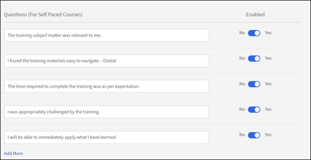
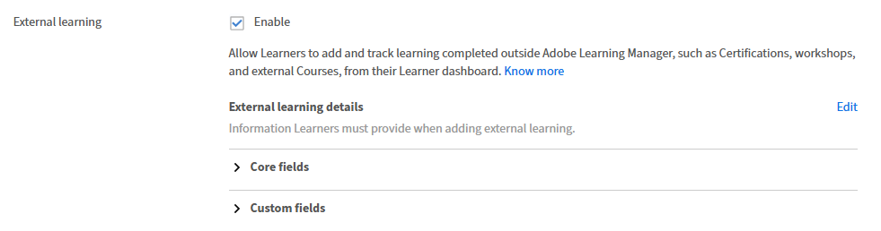

# Paramètres de base dans Adobe Learning Manager

## Présentation

La section Informations de base constitue la base de votre configuration Adobe Learning Manager. Elle contient des paramètres organisationnels essentiels qui définissent le fonctionnement de votre plate-forme d’apprentissage selon les régions, les langues et les contextes métier.

## Principaux avantages

* Fournit la livraison de contenu et l’expérience utilisateur spécifiques à la région.
* Standardise les affichages horaires, les formats de date et les représentations monétaires.
* Permet de régler automatiquement l&#39;heure d&#39;été pour les fuseaux horaires sélectionnés.
* Réduit le besoin de réglages manuels sur toute la plate-forme.

## Configuration des paramètres de base

### Accès aux paramètres d’informations de base

1. Connectez-vous à Adobe Learning Manager en tant qu’administrateur.
2. Sélectionnez **[!UICONTROL Paramètres]** dans la barre de navigation de gauche.

   

3. Sélectionnez **[!UICONTROL Informations de base]** dans la catégorie **[!UICONTROL Bases]**.

   

4. Sélectionnez **[!UICONTROL Modifier]** pour modifier les paramètres de base.

### Modifier les paramètres de base

**Pays/Région**

La liste déroulante Pays/Région dans les paramètres de l’administrateur de Adobe Learning Manager vous permet de spécifier le pays ou la région associé à son organisation. Ce paramètre est utilisé à des fins de localisation, afin de garantir que la plateforme s’aligne sur les préférences régionales, les exigences de conformité et les fuseaux horaires.

**Fuseau horaire**

La liste déroulante Fuseau horaire vous permet de définir le fuseau horaire par défaut de la plateforme. Cela garantit que toutes les activités sensibles au facteur temps, telles que les plannings des cours, les échéances et les rapports, sont correctement alignées sur l&#39;heure locale de l&#39;organisation ou des élèves.

**Paramètres régionaux**

Les paramètres régionaux font référence à la langue et aux paramètres régionaux du compte. La liste déroulante Paramètres régionaux permet aux administrateurs de configurer la langue dans laquelle l’interface et le contenu de la plateforme sont affichés aux utilisateurs. Cette option garantit que les élèves et les administrateurs peuvent interagir avec la plateforme dans la langue de leur choix.

**L&#39;exercice commence à**

Cette option vous permet de définir le mois de début de l&#39;exercice de votre organisation. Par exemple, si l’exercice de votre organisation commence en décembre, vous pouvez définir cette option sur Décembre. Les rapports et les analyses seront ensuite harmonisés avec cet exercice.

**Devise**

L’option Devise vous permet de définir la devise par défaut du compte. Cette devise est utilisée pour fixer le prix des objets d’apprentissage, tels que les cours, les parcours d’apprentissage et les certifications. Par exemple, si votre organisation opère aux États-Unis, vous pouvez définir la devise sur USD ($). De même, pour les opérations en Europe, vous pouvez sélectionner EUR (€).

### Modifier les paramètres de retour d’informations

Les paramètres de retour d’informations de Adobe Learning Manager fournissent aux administrateurs des outils pour recueillir et gérer les commentaires des élèves (L1) et des responsables (L3). Ces paramètres garantissent une évaluation efficace des cours et des objectifs d’apprentissage, permettant ainsi une amélioration continue.

Avant de commencer à recueillir des informations précieuses auprès de vos élèves, vous devez activer la fonctionnalité de retour d&#39;informations L1 et définir ses paramètres. Cette première étape consiste à accéder à la zone Paramètres de retour d&#39;informations et à activer la fonctionnalité pour tous les nouveaux cours, ainsi qu&#39;à choisir la langue principale pour vos formulaires de retour d&#39;informations.

### Activer le retour d&#39;informations L1

Dans l’onglet Retour d’informations L1, recherchez le bouton à bascule Activer le retour d’informations L1 pour le cours et le parcours d’apprentissage nouvellement créés. Sélectionnez l’interrupteur pour l’activer. Cela inclut automatiquement un formulaire de retour d’informations L1 pour tous les nouveaux cours que vous créez.

**Sélectionner une langue par défaut**

Utilisez la liste déroulante Langue pour sélectionner la langue par défaut pour vos formulaires de commentaires. Cela permet de s’assurer que les questions sont présentées aux élèves dans la bonne langue.

**Configuration des questionnaires pour différents types de cours**

Adobe Learning Manager vous permet de personnaliser les questions selon que votre cours est un module individualisé ou une session de classe dirigée par un instructeur. Cela garantit que les commentaires que vous recevez sont spécifiques et pertinents. Au cours de cette étape, vous sélectionnerez et affinerez les questions pour les cours en auto-apprentissage et les cours en salle de classe afin de collecter les données les plus significatives.

**Pour Les Cours En Auto-Apprentissage** :

* **Question obligatoire** : le questionnaire comprend une question obligatoire : « Quelle est la probabilité que vous recommandiez ce cours à un collègue ? ». Il s’agit d’une question standard Net Promoter Score (NPS) qui fournit une mesure clé de la satisfaction globale du cours.
* **Personnaliser les questions** : consultez la liste des questions fournies. Pour inclure une question dans le formulaire de retour d’informations, assurez-vous que le bouton à bascule situé en regard de celui-ci est défini sur Oui. Pour supprimer une question, basculez le bouton sur Non.
* **Ajouter des questions personnalisées** : si vous avez d&#39;autres questions spécifiques à votre contenu d&#39;auto-apprentissage, sélectionnez le lien Ajouter plus pour créer et ajouter de nouvelles instructions personnalisées au questionnaire.

**Pour Les Cours En Classe** :

* **Personnaliser les questions** : consultez la liste des questions adaptées à la formation en salle de classe. Activez le bouton Oui en regard de chaque question pour l’inclure ou Non pour l’exclure du formulaire de retour d’informations.
* **Ajouter des questions personnalisées** : pour ajouter de nouvelles questions spécifiques à votre environnement de classe ou à votre style de facilitation, sélectionnez le lien Ajouter plus pour les créer et les ajouter à la liste.

**Configuration de rappels de retour d&#39;informations**

Pour optimiser vos taux de réponse, il est recommandé de configurer des rappels automatisés. Cette étape vous montre comment configurer et planifier ces rappels, en définissant leur date d’envoi, leur fréquence de répétition et leur durée. En rappelant de manière proactive aux élèves, vous pouvez augmenter considérablement la quantité de commentaires que vous recueillez.

1. **Ajouter un nouveau rappel** : dans la section **[!UICONTROL Rappels de retour d&#39;informations L1]**, sélectionnez **[!UICONTROL Ajouter un nouveau rappel]**.

   

2. **Définir une planification de rappel** : dans le panneau **Paramètres de rappel** qui s’affiche, utilisez les menus déroulants et les champs de saisie pour configurer le rappel :

   a. **[!UICONTROL Quand envoyer]** : indiquez si le rappel doit être envoyé **[!UICONTROL à la fin du cours]** ou **[!UICONTROL après la fin du cours]**.
   b. **[!UICONTROL Récurrence]** : sélectionnez la fréquence du rappel (par exemple, Toutes les semaines).
   c. **[!UICONTROL Pour]** : spécifiez la durée totale (en semaines) pendant laquelle les rappels seront envoyés (par exemple, 4 semaines).

3. **[!UICONTROL Enregistrez le rappel]** : sélectionnez l’icône en forme de coche bleue pour enregistrer la nouvelle configuration de rappel. Vous pouvez répéter cette procédure pour ajouter d’autres rappels si nécessaire.

   

4. Sélectionnez **[!UICONTROL Enregistrer]** dans le coin supérieur droit de la page pour appliquer les paramètres de retour d&#39;informations L1.

### Activer le retour d&#39;informations L3

Avant de pouvoir recueillir les commentaires d’un responsable d’élève, vous devez configurer les paramètres de retour d’informations L3. Cette première étape consiste à accéder à la page Paramètres de retour d&#39;informations et à sélectionner l&#39;onglet Retour d&#39;informations L3. À partir de là, vous pouvez définir la langue de la demande de retour d’informations et consulter la question principale qui sera envoyée au responsable.

**Sélectionnez l&#39;onglet Retour d&#39;informations L3**

Sélectionnez l&#39;onglet Retour d&#39;informations L3 dans la page Paramètres de retour d&#39;informations.

**Vérifier la déclaration de retour d&#39;informations**

Le retour d’informations L3 est demandé au responsable de l’élève sous la forme d’une seule déclaration avec laquelle il peut être d’accord ou non. L&#39;énoncé par défaut fourni est le suivant : « Le rendement de l&#39;employé s&#39;est nettement amélioré après avoir suivi la formation. » Vous pouvez modifier cette instruction pour mieux répondre aux besoins de votre organisation.

**Sélectionner une langue par défaut**

Sélectionnez la liste déroulante Langue pour sélectionner la langue par défaut pour la demande de retour d’informations.

**Configuration de rappels de retour d&#39;informations**

Pour vous assurer que les responsables fournissent des commentaires en temps opportun, vous devez configurer des rappels automatisés. Cette étape implique la configuration du moment où ces rappels sont envoyés et de leur fréquence de répétition. La capture d’écran montre que les rappels de retour d’informations L3 peuvent être configurés pour être envoyés une fois à la fin du cours, mais vous pouvez ajouter d’autres rappels si nécessaire.

1. **[!UICONTROL Ajouter un nouveau rappel]** : pour créer un rappel, sélectionnez le lien **[!UICONTROL Ajouter un nouveau rappel]**.
2. **[!UICONTROL Définir la planification du rappel]** : dans le panneau **[!UICONTROL Paramètres du rappel]**, sélectionnez les menus déroulants et les champs de saisie pour configurer le rappel :
a. **[!UICONTROL Quand envoyer]** : sélectionnez quand le rappel est envoyé. Les options sont : **[!UICONTROL À l&#39;issue du cours]** et **[!UICONTROL Après l&#39;achèvement du cours]**.
b. **[!UICONTROL Récurrence]** : sélectionnez la fréquence du rappel. Si la périodicité est **[!UICONTROL Une fois]**, cela signifie que le responsable recevra une notification pour fournir un retour d&#39;informations. Les options disponibles sont : Une fois, Tous les jours, Toutes les semaines et Tous les mois.
3. Après avoir configuré la planification, sélectionnez l’icône en forme de coche bleue pour enregistrer la configuration de rappel. Le rappel apparaît dans la liste des rappels existants.

   

4. Sélectionnez **[!UICONTROL Enregistrer]** dans le coin supérieur droit de la page pour appliquer les paramètres de retour d&#39;informations L3.

## Paramètres généraux

### Présentation

Les paramètres généraux de Adobe Learning Manager fournissent aux administrateurs un emplacement centralisé pour configurer l’expérience globale de l’élève et les processus administratifs. Ces paramètres vous permettent d’activer ou de désactiver diverses fonctionnalités pour adapter la plateforme aux besoins spécifiques de votre organisation.

Les principaux paramètres généraux configurables sont les suivants :

* **Efficacité et modération du cours :** Choisissez d&#39;afficher une évaluation de l&#39;efficacité du cours pour les élèves et d&#39;activer une fonctionnalité de modération de cours qui nécessite l&#39;approbation de l&#39;administrateur pour toutes les modifications apportées au cours.
* **Fonctionnalités d&#39;engagement des élèves :** vous pouvez activer ou désactiver des fonctionnalités telles que le **forum de discussion** pour les commentaires de cours, les compétences de sources externes pour les élèves et les **e-mails de résumé** pour tenir les élèves informés du nouveau contenu et de la progression.
* **Gestion du contenu et des cours :** les paramètres permettent de configurer **Tentatives multiples** pour l&#39;apprentissage en ligne interactif, d&#39;ajouter **ID d&#39;objet d&#39;apprentissage uniques** au contenu et de définir le comportement par défaut pour les **mises à jour de version de module**.
* **Gestion des utilisateurs :** activez l&#39;**inscription automatique des utilisateurs** pour ajouter automatiquement de nouveaux utilisateurs au système et la **suppression automatique des utilisateurs internes** qui sont inactifs depuis un certain temps.
* **Personnalisation et affichage** : vous avez le contrôle sur ce que les élèves voient, comme l&#39;activation ou la désactivation des **panneaux de filtres** pour la recherche, l&#39;affichage des **étiquettes de catalogue** et la personnalisation de jusqu&#39;à trois **liens de pied de page**.

### Modération de cours

La modération de cours vous permet de superviser et de gérer les mises à jour apportées aux cours par les auteurs. Cela garantit que toutes les modifications apportées au contenu du cours sont révisées et approuvées par les administrateurs avant d&#39;être publiées à l&#39;intention des élèves. La sélection de la modération de cours exige que les auteurs demandent l&#39;approbation des administrateurs pour publier un cours s&#39;ils ont apporté des modifications au cours.

Lorsqu&#39;un auteur met à jour un cours, par exemple, ajoute ou supprime un ou plusieurs modules et tente de publier le cours,

1. Vous recevez des notifications chaque fois que l&#39;auteur republie un cours avec des modifications.
2. Sélectionnez la notification pour afficher les modifications apportées par l’auteur.
3. Comparez l’ancien et le nouveau contenu.
4. Approuver ou rejeter les modifications :
a. Approuvez les modifications pour republier le cours avec les mises à jour.
b. Rejetez les modifications pour que la version précédente du cours reste active.
5. Les auteurs sont informés de votre décision, qu’il s’agisse d’une approbation ou d’un rejet.

### Forum de discussion

L&#39;option Forum de discussion de Adobe Learning Manager permet aux élèves d&#39;engager des discussions liées aux cours, modules ou programmes d&#39;apprentissage. Vous pouvez activer et gérer cette fonctionnalité pour favoriser la collaboration et le partage de connaissances entre les élèves. Les forums de discussion sont liés à des cours ou modules spécifiques, ce qui les rend pertinents du point de vue contextuel.

En tant qu&#39;élève, vous pouvez interagir avec les autres élèves et les formateurs à l&#39;aide de l&#39;onglet Discussion. Vous pouvez afficher les publications pour tout cours que vous affichez ou auquel vous vous inscrivez. Si l&#39;administrateur a activé les discussions pour un cours, vous pouvez afficher l&#39;onglet Discussion en regard de l&#39;onglet Notes du cours en question.

Lorsque vous sélectionnez l&#39;onglet Discussions d&#39;un cours, vous pouvez voir les publications et les commentaires existants pour ce cours. Si vous vous êtes déjà inscrit au cours, vous pouvez également effectuer des publications ou des commentaires à l&#39;intention des autres utilisateurs. Une fois le message saisi, cliquez sur Publier. Votre post doit contenir au moins 10 caractères.

La publication est immédiatement visible dans l&#39;onglet Discussions. Vous pouvez trier les publications par ordre croissant en premier ou par ordre décroissant et supprimer celles que vous avez écrites. Même après votre désinscription du cours, vous pouvez afficher toutes les publications et supprimer les publications que vous avez écrites.

En tant qu’administrateur, vous pouvez modérer les discussions pour garantir leur pertinence et leur pertinence. Les élèves reçoivent des notifications pour les réponses ou les mises à jour des discussions dont ils font partie.

### Tentatives multiples

La sélection de cette option permet aux auteurs de définir le nombre de nouvelles tentatives possibles au niveau d&#39;un cours ou d&#39;un module. Cela permet aux élèves de reprendre le cours ou l’évaluation une fois qu’ils l’ont terminé.  Ce paramètre est utile pour les cours qui incluent des quiz, des tests ou des types de cours qui nécessitent une évaluation.

### Visibilité des compétences, balises, produits et rôles

Cette option détermine si les élèves voient uniquement les compétences ou les balises attribuées, ou celles qui font partie des catalogues visibles aux élèves, ou toutes les compétences et balises. Cela inclut les compétences, les balises, les produits et les rôles associés aux cours ou aux parcours d’apprentissage.

Sélectionnez **[!UICONTROL Modifier]** pour restreindre ce qu&#39;un élève peut voir :

Les élèves explorent ensuite les compétences et les balises qui leur sont visibles et souscrivent aux compétences de leur choix.

### ID d’objets d’apprentissage uniques

L’option vous permet d’attribuer un identifiant unique à chaque objet d’apprentissage (tel que les cours, les parcours d’apprentissage, les certifications ou les assistances à la tâche). Cela garantit que chaque objet d’apprentissage possède un ID distinct, ce qui peut être utile pour le suivi, la génération de rapports et l’intégration avec des systèmes externes.

Lorsque cette option est activée, les auteurs voient un champ pour ajouter l’ID de l’objet d’apprentissage lors de la création d’un objet d’apprentissage. Ils peuvent ajouter les ID en conséquence. Les ID uniques peuvent être intégrés à des systèmes tiers, notamment les magasins de dossiers d’apprentissage (LRS) et les systèmes de gestion de l’apprentissage (LMS). Les ID uniques vous permettent également, à vous ou à un auteur, de rechercher des objets d’apprentissage spécifiques et de les suivre via les relevés de notes des élèves.

### Affichage des panneaux de filtrage

Cette option vous permet de contrôler les options de filtre disponibles pour les élèves dans l’application de l’élève. Ces filtres aident les élèves à affiner leurs résultats de recherche dans les sections Mon apprentissage et Catalogue pour un élève. Les options de filtre suivantes sont disponibles pour la sélection :

* Groupes
* Catalogues
* Type
* Format
* Durée
* Compétences
* Niveaux de compétence
* Balises
* Prix
* Plage de prix
* Emplacements
* Produits
* Niveaux de recommandation

>[!NOTE]
>
>Les filtres **[!UICONTROL Format]** et **[!UICONTROL Durée]** sont désactivés par défaut et n&#39;apparaissent pas immédiatement aux élèves. Vous devez les sélectionner explicitement.

### Terminologie du produit

Adobe Learning Manager utilise une terminologie de produit spécifique pour définir les objets d’apprentissage, tels que les cours, les parcours d’apprentissage ou les assistances à la tâche. Vous pouvez personnaliser la terminologie en anglais et en français, selon vos préférences. Téléchargez le modèle de terminologie du produit et remplacez, par exemple, le plan d’apprentissage par une règle prescriptive. De même, modifiez des entrées similaires en français. Ensuite, chargez le modèle modifié et sélectionnez Enregistrer pour mettre à jour les terminologies du produit.

Voir Terminologie du produit dans Adobe Learning Manager pour plus d’informations.

### Crédits

Lorsque cette option est activée, les auteurs et les instructeurs peuvent enregistrer le nombre de crédits d’enseignement pour chaque session ou module. Les crédits représentent le temps d’instruction qu’un élève recevra pour avoir terminé l’activité. Les valeurs de crédit apparaissent dans les relevés de notes des élèves, les rapports d’apprentissage et contribuent aux calculs de durée totale des parcours d’apprentissage. Si vous désactivez ce paramètre, les valeurs de crédit précédemment saisies sont conservées et restaurées si le paramètre est réactivé.

### Mise à jour de la version du module

Cette option permet aux administrateurs de mettre à jour le contenu d&#39;un module sans interrompre la progression des élèves déjà inscrits aux cours contenant ce module. Cela permet aux élèves de poursuivre leur parcours d’apprentissage en douceur, tandis que les auteurs peuvent maintenir le contenu à jour. Lorsque l’option est activée, les auteurs peuvent télécharger une nouvelle version d’un module (par exemple, les packages SCORM, AICC ou xAPI) pour remplacer l’existant.

* Les élèves qui ont déjà commencé le module continueront avec la version dans laquelle ils étaient inscrits.
* Les nouveaux élèves accèdent automatiquement à la version mise à jour.
* Adobe Learning Manager effectue le suivi des différentes versions du module à des fins de création de rapports et d’audit.

### Enregistrement automatique des utilisateurs

Cette option vous permet d&#39;inscrire automatiquement des utilisateurs à des catalogues spécifiques ou à du contenu d&#39;apprentissage lorsqu&#39;ils sont ajoutés au système. Cela garantit que les utilisateurs ont un accès immédiat aux supports d’apprentissage pertinents sans nécessiter d’intervention manuelle.

* Les nouveaux utilisateurs sont automatiquement enregistrés dans des catalogues ou des cours prédéfinis lorsqu’ils sont ajoutés au système.
* Les administrateurs peuvent définir des règles pour déterminer les catalogues ou cours auxquels les utilisateurs sont automatiquement inscrits, en fonction d&#39;attributs utilisateur tels que des rôles, des groupes ou d&#39;autres critères. Pour plus d&#39;informations, voir [Plans d&#39;apprentissage dans Adobe Learning Manager](/help/migrated/administrators/feature-summary/learning-plans.md) ou [Inscription automatique des groupes d&#39;utilisateurs externes aux cours](https://elearning.adobe.com/2024/05/automatically-enroll-external-user-groups-in-courses-upon-registration/) lors de l&#39;inscription.

### Supprimer automatiquement les utilisateurs internes

Cette option supprime les utilisateurs qui n’accèdent pas à Adobe Learning Manager pendant une durée spécifiée.  Spécifiez le nombre de jours auxquels un utilisateur peut avoir accès sans se connecter à Adobe Learning Manager. À l’aide de cette option, vous pouvez également supprimer automatiquement du système les utilisateurs internes inactifs après une période spécifiée. Cela permet de maintenir une base de données utilisateur propre et organisée en supprimant les utilisateurs qui ne sont plus actifs.

* Les utilisateurs internes qui sont inactifs depuis une durée définie sont automatiquement supprimés.
* Les utilisateurs sont informés avant la suppression, ce qui leur donne la possibilité de se connecter et d’empêcher la suppression.
* Pour que son accès soit restauré, un utilisateur supprimé doit contacter l’administrateur du compte.

### Purge automatique des utilisateurs supprimés

Supprimez automatiquement et définitivement du système les utilisateurs qui ont été à l’état Supprimé pendant une durée spécifiée. Une fois vidées, toutes les données utilisateur associées sont définitivement supprimées et ne peuvent pas être récupérées.

Si cette option est activée, purge les données des utilisateurs qui ont déjà été supprimés dans ALM après le nombre de jours spécifié.

### Afficher les étiquettes de catalogue

Cette option permet à un auteur de définir des étiquettes de catalogue lors de la création d&#39;un objet d&#39;apprentissage. Un élève voit ensuite les étiquettes de catalogue dans la section Catalogue de l’application de l’élève. Ces étiquettes aident les élèves à identifier et à différencier les différents catalogues disponibles. Si l’option est désélectionnée, les cours ou les objets d’apprentissage passent au catalogue par défaut.

### Type de conformité personnalisé

Cette option permet à un auteur de définir et de gérer des types de conformité adaptés aux exigences spécifiques de son organisation, tout en créant des objets d&#39;apprentissage. Les auteurs peuvent ajouter un libellé de conformité et une échéance au cours qu’ils créent.
Cela est particulièrement utile pour suivre et appliquer la formation sur la conformité pour les employés en fonction de politiques organisationnelles uniques.

### Les élèves peuvent consulter leurs scores

La sélection de cette option garantit que les élèves peuvent afficher leurs scores de quiz dans leurs relevés de notes. Dans les relevés de notes, les colonnes Quiz_score, Quiz_score_max, Highest_Quiz_score et Highest_Quiz_score_max permettent à un élève d’afficher ses scores d’évaluation. Ces scores aident les élèves à suivre leur progression et à comprendre leurs performances.

Si vous désélectionnez l’option, les scores du quiz n’apparaissent pas dans les relevés de notes des élèves.

### E-mail de résumé

Cette option vous permet d’envoyer des courriers électroniques de résumé aux élèves, fournissant des mises à jour sur leurs activités d’apprentissage, la progression et les échéances à venir. Ces courriers électroniques sont conçus pour tenir les élèves informés et impliqués dans leurs programmes de formation. Ces e-mails capturent les activités des élèves, telles que les cours terminés.

Vous pouvez modifier la fréquence des e-mails dans les paramètres du modèle d’e-mail. En outre, vous pouvez personnaliser le contenu des e-mails de résumé pour inclure des détails spécifiques pertinents pour les élèves.

>[!NOTE]
>
>* Pour les comptes actifs, les e-mails de résumé sont désactivés par défaut, que vous pouvez activer manuellement.
>* Pour les comptes d’évaluation, l’option pour les e-mails de résumé reste désactivée et vous ne pouvez pas l’activer.

### Activer les icônes de cours/parcours d’apprentissage/certification/carte d’assistance à la tâche

Cette option permet aux auteurs d’ajouter des images de couverture sur les cartes de cours de l’élève pour différents types de contenu d’apprentissage. Ces images aident les élèves à identifier facilement le type de contenu (par exemple, cours, parcours d’apprentissage, certification ou assistance à la tâche) en un seul coup d’œil. Lors de la création d&#39;un objet d&#39;apprentissage, les auteurs peuvent ajouter des images de couverture aux cours.

Si vous ne sélectionnez pas cette option, les cartes n’affichent aucune icône.

### Liens du pied de page

Cette option vous permet de personnaliser la section de pied de page de l&#39;application de l&#39;élève en ajoutant des liens vers des ressources externes, des sites Web de l&#39;entreprise ou d&#39;autres pages pertinentes. Ces liens apparaissent en bas de l&#39;interface de l&#39;application de l&#39;élève et peuvent être utilisés pour fournir un accès rapide à des informations importantes. Les liens peuvent diriger les élèves vers des sites Web externes, des pages d&#39;aide ou des stratégies d&#39;entreprise. Ils permettent aux élèves d’accéder facilement à des ressources supplémentaires directement à partir de l’application.

Voici comment personnaliser les liens du pied de page :

1. **[!UICONTROL Ajouter des liens]** : sélectionnez **[!UICONTROL Ajouter davantage]** et saisissez le nom et l’URL ou l’ID de messagerie dans les champs spécifiés. Vérifiez que l’URL est précédée du préfixe http:// ou https://.
2. **[!UICONTROL Répliquer entre les langues]** : sélectionnez **[!UICONTROL Répliquer]** pour appliquer les modifications en cascade à toutes les langues, en vous assurant que toutes les langues obtiennent le même nom et la même URL.
3. Sélectionnez **[!UICONTROL Enregistrer]** pour appliquer les modifications.

**Options supplémentaires :**

* Réinitialiser les valeurs par défaut : sélectionnez l’icône Réinitialiser pour rétablir les valeurs par défaut dans les champs Aide et Contacter l’administrateur.
* Personnaliser pour toutes les langues : sélectionnez une langue dans la liste déroulante, puis ajoutez le nom et l’URL de cette langue. Enregistrez les modifications pour mettre à jour les liens du pied de page pour la langue sélectionnée.

### Fuseau horaire du rapport

Cette option vous permet de définir une préférence au niveau du compte pour l’exportation des relevés de notes d’apprentissage et du rapport Résumé de la session dans des fuseaux horaires spécifiques. Les options disponibles sont :

* UTC (comportement par défaut)
* Préférence de fuseau horaire au niveau du compte

Cette option garantit également que le relevé de notes de l’élève téléchargé à l’aide de l’API des tâches reflète le fuseau horaire sélectionné.

### Intégration de Badgr

La sélection de l’option permet aux élèves de :

* Chargez leurs badges sur le site Web Badgr.
* Partagez les badges sur les réseaux sociaux.

Fonctionnement :

* Sélectionnez l’option dans la section Intégration Badgr.
* Les élèves se connectent à leur compte Badgr depuis Adobe Learning Manager.
* Les badges gagnés dans Adobe Learning Manager sont automatiquement chargés sur le compte Badgr.

>[!NOTE]
>
>* Adobe Learning Manager ne fournit pas de compte Badgr dans le cadre de l’intégration. Les élèves doivent créer leur propre compte Badgr.
>* Les élèves peuvent configurer leur compte Badgr directement à partir de la page Badges de l’application de l’élève.

Pour plus d&#39;informations, voir Prise en charge des badges Badgr[&#128279;](/help/migrated/learners/feature-summary/badges.md#support-for-badgr-badges).

### Afficher les évaluations

Cette option vous permet d’activer ou de désactiver l’affichage des évaluations de cours dans l’application de l’élève. Lorsque cette option est activée, les élèves peuvent afficher les évaluations des cours, ce qui les aide à prendre des décisions informées concernant leur inscription à un cours.

* Si l’option Efficacité du cours est sélectionnée, les élèves ne pourront voir que la valeur de l’efficacité du cours. L’efficacité du cours est calculée en fonction du retour d’informations de l’élève (L1), des scores du quiz (L2) et du retour d’informations du responsable (L3).
* Si l’option Évaluation par étoiles est sélectionnée, les élèves ne pourront afficher que la note moyenne et le nombre d’élèves ayant évalué le cours. L’évaluation par étoiles est la moyenne de toutes les évaluations données par les élèves à la fin d’un cours.

Pour les nouveaux comptes, l’option Évaluation par étoiles est activée par défaut dans la section Afficher les évaluations.

Pour les comptes existants, si l’option Efficacité du cours était activée pour le compte précédemment, la section Afficher les évaluations sera activée avec l’option Efficacité du cours sélectionnée. Si l’option Efficacité du cours est désactivée, la section Afficher les évaluations sera également désactivée. Lorsque la section Afficher les évaluations est activée, l’option Évaluation par étoiles est activée par défaut.

### Vue par défaut (rôle Élève)

Cette option fait référence à l’affichage du catalogue de cours par les élèves. Cochez la case Mode liste pour passer de la vue grille par défaut à la vue liste.

### Parcours d’apprentissage

Si vous sélectionnez **[!UICONTROL Activer les fonctionnalités étendues du parcours d’apprentissage]**, vous pouvez inclure des parcours d’apprentissage dans les parcours d’apprentissage et associer ces parcours d’apprentissage à des cours. L’option est irréversible.

### Gestion de l’instructeur

Cette option garantit que les auteurs peuvent sélectionner des instructeurs pour une classe virtuelle ou une session de classe à partir d’une liste prédéterminée.

**Fonctionnalités clés :**

* Restreindre la sélection de l’instructeur : seuls les utilisateurs dotés du rôle d’instructeur peuvent être affectés aux sessions.
* Impact sur les flux de migration : cette restriction ne s’applique pas aux flux de migration.

### Aperçu du module

Si vous sélectionnez Activer, les auteurs peuvent prévisualiser un cours en tant qu&#39;élèves après sa création.

### Activer la tarification pour les cours/parcours d’apprentissage/certifications

Cette option vous permet d’activer la fonctionnalité de commerce électronique pour les cours, les parcours d’apprentissage et les certifications. Cette fonctionnalité est principalement utilisée pour intégrer Adobe Learning Manager à Adobe Commerce, ce qui permet aux entreprises de monétiser leurs offres de formation.
Une fois la fonctionnalité activée, le champ Devise apparaît sur la page Informations de base.

Lorsque les cours sont payants, les auteurs peuvent spécifier le cours, le parcours d’apprentissage ou le prix de certification. Les élèves peuvent acheter une formation directement auprès de Adobe Learning Manager ou de [sites AEM personnalisés](/help/migrated/integrate-aem-learning-manager.md).

>[!NOTE]
>
>Certains types de formation, tels que les certifications récurrentes et les cours approuvés par le responsable, ne peuvent pas être achetés.

### Activer Multi Item SKU Cart

Cette option permet aux élèves d’ajouter plusieurs éléments de formation (cours, parcours d’apprentissage, certifications) à un panier et de les acheter ensemble. Cette fonctionnalité fait partie de la fonctionnalité de commerce électronique intégrée à Adobe Commerce.

Cette fonctionnalité est particulièrement utile pour les organisations qui vendent plusieurs éléments de formation et souhaitent rationaliser le processus d’achat pour les élèves.

**Fonctionnalités clés :**

* Achats multiples : les élèves peuvent ajouter plusieurs articles à leur panier et les acheter en une seule transaction. Voir Panier multi-articles pour plus d&#39;informations.
*Paiement simplifié : réduit la nécessité pour les élèves d’effectuer des achats distincts pour chaque élément de formation.
* Gestion des SKU : les administrateurs peuvent gérer les SKU des cours, des parcours d’apprentissage et des certifications pour assurer un suivi et un reporting appropriés.

### Autres cours/parcours

Lorsque les élèves terminent un cours/parcours, un autre ensemble spécifié de cours/parcours peut être marqué comme terminé via un autre. Ceci est utile lorsque les cours couvrent un contenu équivalent ou qui se chevauche. Par exemple, lorsqu’un nouveau cours remplace une ancienne version ou lorsqu’il existe des variantes régionales de la même formation. Les élèves ne sont pas automatiquement inscrits à des cours/parcours marqués comme terminés via une autre plateforme et ne recevront que des crédits, des badges et des points pour le cours/parcours qu’ils ont réellement terminé. Les autres achèvements apparaissent dans le relevé de notes de l’élève et sont pris en compte dans tout parcours d’apprentissage ou certification qui inclut le cours alternatif.

**Activer les terminaisons rétroactives (irréversible)**
Si des élèves ont terminé un cours/parcours plus tôt et qu’un autre cours/parcours est ajouté ultérieurement sous Autres cours/parcours, ceux-ci seront également marqués comme terminés via Autre pour les élèves. Cela s’applique rétroactivement à toutes les réalisations passées, pas seulement aux inscriptions à venir. Utilisez cette option lorsque vous souhaitez que les achèvements historiques soient pris en compte dans les nouveaux cours alternatifs. Une fois activé, cette option ne peut plus être désactivée.

**Activer les inachevements rétroactifs (irréversible)**
Si un cours/parcours est supprimé des autres cours/parcours, les élèves qui étaient précédemment marqués comme terminés via un autre parcours seront marqués comme incomplets. Cela affecte tous les élèves dont l’achèvement était basé uniquement sur l’alternative, et non les élèves qui ont terminé le cours directement. Leur relevé de notes reflétera le statut incomplet mis à jour. Une fois activé, cette option ne peut plus être désactivée.

### Visibilité de Gradebook {#gradebookvisibility}

Lorsque cette option est activée, les auteurs peuvent contrôler la visibilité du cahier de notes au niveau du cours, ce qui permet aux élèves d&#39;afficher leurs scores de module pondérés, le score total du cours et le statut Réussite/Échec directement dans le lecteur de cours. Si ce paramètre est désactivé au niveau du compte, les élèves ne peuvent pas voir le cahier de notes dans un cours, quelle que soit la façon dont les cours individuels sont configurés. Les scores et les calculs du carnet de notes continuent d’être exécutés en arrière-plan à des fins de création de rapports par l’administrateur même lorsque la visibilité des élèves est désactivée.

**Activer l&#39;affichage du carnet de notes pour les élèves**

Active l’autorisation au niveau du compte qui permet aux auteurs d’afficher ou de masquer le journal de notes par cours. Une fois activée, les auteurs voient une option Afficher le carnet de notes aux élèves dans l&#39;éditeur de cours. Les élèves verront un onglet Gradebook dans le lecteur de cours pour tout cours pour lequel l&#39;auteur l&#39;a activé. La désactivation de ce paramètre au niveau du compte remplace toutes les configurations au niveau du cours. Les élèves ne verront pas le cahier de notes dans un cours tant que le paramètre n’est pas réactivé. Pour plus d&#39;informations, voir [Classeur pour administrateur](/help/migrated/administrators/feature-summary/alm-admin-gradebook.md).

### Apprentissage externe

Lorsque cette option est activée, les élèves peuvent envoyer et suivre les activités d’apprentissage terminées en dehors de Adobe Learning Manager, telles que les certifications, les ateliers, les conférences et les cours externes, directement à partir de leur tableau de bord d’élève. Les envois sont révisés et approuvés par le responsable direct de l’élève avant d’être enregistrés. Une fois approuvée, l’activité d’apprentissage externe est ajoutée au relevé de notes de l’élève et est prise en compte dans son enregistrement d’apprentissage global. Les administrateurs peuvent configurer les champs que les élèves doivent remplir lors de l&#39;envoi d&#39;une activité d&#39;apprentissage externe, y compris les champs personnalisés spécifiques à votre organisation.

**Activer**

Active la fonctionnalité Apprentissage externe pour tous les élèves du compte. Une fois activé, un formulaire d’envoi devient disponible sur le tableau de bord des élèves. Les élèves peuvent saisir des détails tels que le nom de la formation, sa durée, la date, le score et le justificatif d’accomplissement. La soumission est envoyée à son responsable pour révision et approbation. Les envois approuvés apparaissent dans le relevé de notes de l’élève et dans les rapports de l’administrateur. Les soumissions rejetées ne sont pas enregistrées dans la transcription.

>[!NOTE]
>
>L’activation de ce paramètre ajoute de nouvelles colonnes au relevé de notes de l’élève pour les soumissions d’apprentissage externes. Si votre organisation utilise des workflows ou des intégrations automatisés qui traitent les données du relevé de notes de l’élève, vérifiez-les avant de les activer pour vous assurer de la compatibilité avec la structure du relevé de notes mise à jour.

L’apprentissage externe est un type d’activité d’apprentissage pour la formation hors plateforme. Les élèves l&#39;utilisent pour enregistrer une formation qui n&#39;existe pas dans Adobe Learning Manager, telle qu&#39;un examen de certification du secteur, une conférence professionnelle, une session de mentorat ou un cours universitaire.

1. Un **élève** remplit un formulaire de soumission avec des détails sur sa formation externe et télécharge éventuellement une preuve d’accomplissement.

2. Le **responsable** de l&#39;élève reçoit une notification l&#39;invitant à examiner l&#39;envoi et l&#39;approuve ou le rejette avec un commentaire facultatif.

3. Lors de l&#39;approbation, l&#39;envoi est ajouté au **relevé de notes de l&#39;élève**, où les administrateurs peuvent le consulter et le signaler.

Ce workflow permet aux entreprises de combiner la formation obligatoire sur la conformité intégrée à la plateforme avec l’apprentissage autonome ad hoc effectué par leurs employés dans le monde réel, et de suivre les deux dans un seul système.

L’apprentissage externe est une fonctionnalité configurable. Les administrateurs contrôlent si les élèves y ont accès, quels champs apparaissent sur le formulaire d’envoi et si chaque champ est obligatoire ou facultatif. Des champs personnalisés peuvent être ajoutés pour capturer des informations spécifiques à l’organisation telles qu’un type de formation ou un numéro de référence de certificat.

### Cycle de vie du statut de la soumission

Chaque soumission d’apprentissage externe passe par un ensemble défini de statuts :

| **Statut** | **Signification** |
|-------------------|--------------------------------------------------------------------------------|
| Attente de l&#39;approbation | L’élève a soumis la demande. Elle est en attente d’examen par le responsable. |
| Approuvé | Le responsable a approuvé l’envoi ; il apparaît dans le relevé de notes de l’élève. |
| Rejeté | Le responsable a rejeté l’envoi. L’élève peut envoyer une nouvelle demande. |

Un élève peut modifier une soumission lorsqu&#39;elle est à l&#39;état **En attente d&#39;approbation**. Une fois qu’un responsable a pris des mesures, la soumission ne peut plus être modifiée. Si une soumission est rejetée, l’élève soumet une nouvelle demande d’apprentissage externe plutôt que de modifier la demande rejetée.

### Disponibilité et visibilité des fonctionnalités

Les administrateurs contrôlent la disponibilité de l’apprentissage externe via un paramètre unique au niveau du compte :

**Lorsque l’apprentissage externe est activé :**

* Les élèves voient l&#39;onglet **Apprentissage externe** dans la navigation et peuvent soumettre de nouvelles demandes
* Les responsables voient l&#39;onglet **Apprentissage externe** dans le tableau de bord de leur équipe et peuvent consulter les envois
* Les relevés de notes des administrateurs et des élèves incluent des données d’apprentissage externes pour les envois approuvés

**Lorsque l’apprentissage externe est désactivé :**

* Les élèves qui n’ont pas de demandes précédentes ne voient aucune interface d’apprentissage externe

* Les élèves qui ont déjà envoyé des fichiers peuvent toujours afficher leur historique et l’état des fichiers envoyés, mais ne peuvent pas créer de nouveaux fichiers envoyés

* Les responsables conservent l’accès à l’onglet Apprentissage externe si leur équipe a déjà soumis des ressources. Sinon, l’onglet est supprimé

* Les données de relevé de notes existantes pour les soumissions approuvées ne sont pas affectées

#### Champs principaux

Ces champs sont disponibles par défaut pour tous les comptes. Les administrateurs peuvent choisir les champs à afficher sur le formulaire de soumission de l’élève et marquer chacun comme obligatoire ou facultatif.

| **Champ** | **Type** | **Notes** |
| --- | --- | --- |
| Titre | Texte | Nom de l’apprentissage, du cours ou de la certification externe. |
| Description/Notes | Texte | L’élève peut ajouter des détails sur le fournisseur ou le contexte de formation. |
| Date/Plage de dates | Date/heure | Date de début, date de fin ou les deux. Prend en charge les heures, les minutes, la semaine, le mois, les jours ou l&#39;année. |
| Durée | Durée (heures) | Temps consacré à la formation externe. |
| Score | Nombre | Score reçu par l’élève, le cas échéant. |
| Pièces jointes | Téléchargement de fichier | Preuve d’accomplissement. L’élève peut envoyer un certificat, un relevé de notes ou toute autre documentation. |

#### Champs personnalisés

Les administrateurs peuvent ajouter jusqu’à 10 champs personnalisés pour capturer des informations supplémentaires spécifiques à l’organisation. Les champs personnalisés prennent en charge les types suivants :

| **Type** | **Description** |
|------------|------------------------------------------------------------------|
| Texte | Saisie de texte libre. |
| Nombre | Saisie numérique. |
| Case à cocher | Bouton Oui/Non unique. |
| Liste déroulante | Sélection unique dans une liste d’options définie par l’administrateur. |

### Exigences relatives au fichier de preuve d’accomplissement

* **Types de fichiers pris en charge :** PDF, DOC, DOCX, PNG, JPEG, JPG

* **Taille maximale de fichier :** 50 Mo par pièce jointe

#### Ce que les administrateurs contrôlent pour l’apprentissage externe

L&#39;apprentissage externe est **désactivé par défaut** pour tous les comptes. Vous devez l’activer explicitement avant que les élèves puissent soumettre des demandes ou que les responsables puissent voir l’onglet Révision.

Lorsque vous activez l’apprentissage externe :

* Les élèves ont accès à l&#39;onglet **Apprentissage externe** et peuvent soumettre de nouvelles demandes

* Les responsables ont accès à l&#39;onglet de révision **Apprentissage externe**

* Les relevés de notes de l’administrateur et de l’élève obtiennent les colonnes de rapport pour les activités d’apprentissage externes approuvées. Une fois l’apprentissage externe activé, cela peut affecter les rapports de relevé de notes de l’élève. Si votre organisation utilise les données du relevé de notes de l’élève pour l’automatisation, passez en revue et mettez à jour tous les workflows dépendants pour tenir compte des nouveaux champs et enregistrements d’apprentissage externes.

Lorsque vous désactivez l’apprentissage externe après son utilisation :

* Les nouvelles demandes d’élèves sont bloquées

* Les élèves avec une approbation envoyée et en attente peuvent être modifiés

* Les responsables ayant soumis des demandes précédentes peuvent toujours agir sur les demandes en attente

* Les données de transcription des soumissions précédemment approuvées sont inchangées

* Vous pouvez réactiver la fonctionnalité à tout moment. Aucune donnée n’est perdue lorsque la fonctionnalité est désactivée.

#### Activation ou désactivation de l’apprentissage externe

**Attention :** l’activation de l’apprentissage externe ajoute de nouvelles colonnes au relevé de notes de l’élève administrateur : **Nom de l’apprentissage externe**, **Commentaire d’achèvement** et tout champ personnalisé configuré pour votre compte. Les colonnes de champs personnalisés apparaissent à la fin du relevé de notes.

Si votre organisation utilise le relevé de notes de l’élève dans des processus automatisés ou des processus de création de rapports en aval, mettez à jour ces systèmes pour gérer les nouvelles colonnes avant d’activer cette fonctionnalité.

1. Connectez-vous à Adobe Learning Manager en tant qu’administrateur.

2. Dans le volet de navigation de gauche, sélectionnez **Paramètres**.

3. Sélectionnez **Général**.

4. Accédez à la section **Apprentissage externe**.

5. Cochez la case **Activer l&#39;apprentissage externe** pour activer la fonctionnalité.

6. Sélectionnez **Enregistrer**.

Les élèves peuvent désormais soumettre des demandes d’apprentissage externes. Leurs responsables recevront des notifications sur la plateforme lors de la création des soumissions.

Pour désactiver la fonctionnalité, suivez les mêmes étapes et désactivez l’option.

#### Configuration du formulaire d’apprentissage externe

Après avoir activé la fonctionnalité, configurez les champs qui apparaissent sur le formulaire de soumission de l’élève.

1. Dans **Paramètres > Général**, ouvrez la section **Apprentissage externe**.

2. Sous **Configuration du formulaire**, passez en revue la liste des champs par défaut.

3. Cochez la case en regard de chaque champ pour l’afficher ou le masquer dans le formulaire de l’élève.

4. Pour chaque champ visible, sélectionnez **Obligatoire** pour contrôler si les élèves doivent le remplir avant l’envoi.

5. Sélectionnez **Enregistrer**.

**Remarque :** le champ **Titre** est toujours obligatoire et ne peut pas être masqué ni rendu facultatif.

Le formulaire de soumission de l’élève reflète immédiatement vos modifications. Les envois existants ne sont pas affectés par les modifications de configuration du formulaire.

#### Ajouter et gérer des champs personnalisés

Vous pouvez ajouter jusqu’à 10 champs personnalisés pour capturer des informations spécifiques à votre organisation.

**Ajouter un champ personnalisé**

1. Dans **Paramètres > Général**, ouvrez la section **Apprentissage externe**.

2. Développez **Champs personnalisés**.

3. Sélectionnez **Nouveau champ**.

4. Sélectionnez un **type de champ** : **Texte**, **Numéro**, **Case à cocher** ou **Liste déroulante**.

   1. Si vous sélectionnez **Liste déroulante**, entrez la liste de valeurs parmi lesquelles les élèves peuvent choisir. Vous pouvez ajouter jusqu’à 100 valeurs de liste déroulante.

   2. Saisissez le nom du champ et, éventuellement, sa description.

5. Sélectionnez ou désélectionnez l&#39;option **Obligatoire** pour les nouveaux champs personnalisés.

6. Sélectionnez **Enregistrer**.

Le nouveau champ s’affiche immédiatement sur le formulaire de soumission de l’élève.

**Modifier un champ personnalisé**

1. Dans **Paramètres > Général**, ouvrez la section **Apprentissage externe**.

2. En regard du champ personnalisé que vous souhaitez modifier, sélectionnez **Modifier**.

3. Mettez à jour le nom du champ ou, pour les champs déroulants, ajoutez, modifiez ou supprimez des valeurs.

4. Sélectionnez **Enregistrer**.

La modification d’un nom de champ ou de valeurs de liste déroulante ne modifie pas les données déjà capturées dans les envois existants. Seules les nouvelles soumissions utilisent les étiquettes et les options mises à jour.

**IMPORTANT**

Une fois que vous avez ajouté un champ personnalisé, vous ne pouvez plus le supprimer. Vous ne pouvez que le modifier. Si vous souhaitez qu’un champ n’apparaisse pas sur le formulaire d’un élève, décochez-le.

### Paramètres du lecteur

Cette option permet aux auteurs de personnaliser le lecteur Fluidic pour différents cours au niveau du cours. Les auteurs peuvent configurer la façon dont le contenu de formation est affiché pour les élèves dans le lecteur. Cela inclut les paramètres liés à la langue du contenu, aux préférences de l’interface et aux options de lecture.

### Les responsables peuvent marquer la formation comme étant terminée

Cette option permet aux responsables de marquer le cours, la certification ou l’achèvement du parcours d’apprentissage pour leur personnel. Cette fonctionnalité est utile dans les scénarios où les élèves ont terminé la formation en dehors de la plateforme ou ont besoin d’une intervention manuelle pour mettre à jour leur progression.
Les responsables peuvent marquer l’achèvement du cours via :

* Module Liste de contrôle : Le module Liste de contrôle permet aux responsables d&#39;évaluer les performances des élèves en fonction de tâches ou de critères spécifiques. Les auteurs doivent activer ce module lors de la création du cours et affecter des responsables en tant que réviseurs.
* Page du cours : sur la page du cours :
a.    Sélectionnez l&#39;onglet **[!UICONTROL Élèves]** dans le volet de gauche.
b.    Sélectionnez l’élève dont vous souhaitez marquer l’assiduité.
c.    Sélectionnez **[!UICONTROL Actions]** > **[!UICONTROL Marquer comme terminé]**.

**Remarques supplémentaires :**

* Les responsables peuvent également exporter la liste des élèves à des fins de création de rapports.
* Si un cours comprend plusieurs instances, les responsables peuvent afficher et gérer les élèves séparément pour chaque instance.

### Suppression

Cette option permet aux auteurs de retirer du contenu de formation (cours, parcours d’apprentissage, certifications) qui n’est plus pertinent ou nécessaire. Le contenu retiré du catalogue de l’élève est supprimé, mais reste accessible dans les rapports et les données historiques à des fins de suivi. Deux options s’offrent à vous :

1. Une fois retirés, les élèves inscrits pourront afficher et effectuer des actions, mais les élèves non encore inscrits perdront l’accès :
a. Élèves inscrits :
i. Les élèves déjà inscrits au cours ou au parcours d’apprentissage retiré peuvent toujours accéder au contenu.
ii. Ils peuvent continuer à effectuer des actions telles que terminer le cours ou consulter le matériel.
b. Élèves non encore inscrits :
i. Les élèves qui ne sont pas inscrits au cours ou au parcours d’apprentissage avant son retrait ne verront plus le contenu dans le catalogue.
ii. Ils perdront complètement l’accès au contenu retiré.
2. Une fois retirés, les élèves inscrits et non encore inscrits perdront l’accès :
a. Élèves inscrits :
i. Les élèves qui étaient déjà inscrits au cours ou au parcours d’apprentissage perdront l’accès au contenu une fois qu’il sera retiré.
ii. Ils ne pourront plus afficher ni effectuer d’actions sur le contenu retiré.
b. Élèves non encore inscrits :
i. Les élèves qui ne sont pas inscrits au cours ou au parcours d’apprentissage perdront également l’accès, car le contenu n’apparaîtra plus dans le catalogue.

### Suppression automatique

Cette option permet aux auteurs de définir une date spécifique pour qu&#39;un cours soit automatiquement retiré. Lorsqu&#39;un cours est retiré, il n&#39;est plus disponible pour les nouvelles inscriptions, mais les élèves déjà inscrits peuvent toujours accéder au cours et le terminer.

Remarques clés :

* Une fois la date de retrait automatique définie, le cours passe automatiquement à l&#39;état Retiré à la date spécifiée.
* Les cours retirés ne sont pas visibles dans le catalogue de cours pour les nouveaux élèves, mais les élèves existants peuvent toujours y accéder et les terminer.

### Afficher tous les cours inscrits dans les résultats de recherche

Cette option permet aux élèves d’afficher les cours dans les résultats de recherche même si les élèves font partie de leur parcours d’apprentissage ou de leur certification inscrit.

### Importation des compétences

Cette option vous permet d’importer des compétences à partir de sources externes, telles que LinkedIn Learning et Go1, à l’aide de connecteurs respectifs. Cette fonctionnalité intègre des Clouds de compétences externes et des systèmes de gestion des talents dans Adobe Learning Manager, améliorant ainsi la capacité de la plateforme à gérer et à utiliser efficacement les compétences.

Les compétences des fournisseurs de contenu externes sont ajoutées au référentiel de compétences défini par l’administrateur dans Adobe Learning Manager. Ces compétences sont mises à la disposition des auteurs pendant le processus de création du cours.

1. Sélectionnez **[!UICONTROL Activer]**.

   

2. Sélectionnez un fournisseur de contenu dans la liste déroulante **[!UICONTROL Sélectionner la source des compétences]**.
3. Sélectionnez **[!UICONTROL Enregistrer]**.
Notez qu’une fois l’option activée, l’action est irréversible. Vous ne pouvez pas désactiver ou passer à une autre source ultérieurement.
