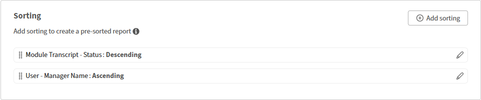

# Tri des colonnes du rapport dans le Report Builder

## Présentation

Le tri détermine l’ordre des lignes dans le fichier de rapport téléchargé. Appliquez le tri chaque fois que la cohérence de la sortie est importante.

## Ajout d’un tri

Dans cet exemple, vous découvrirez les cours qui ont le plus d’achèvements.

1. Lancez Report Builder et sélectionnez **Créer un rapport**.
2. Saisissez le nom et la description du rapport.
3. Sélectionnez les colonnes suivantes : <dataset>:<column name>

   * Objet d’apprentissage - Nom de l’objet d’apprentissage
   * Objet d’apprentissage - État de l’objet d’apprentissage
   * Objet d’apprentissage - Nombre d’achèvements

4. Dans la section Tri, sélectionnez **Ajouter un tri**.
5. Sélectionnez **Objet d’apprentissage - Nombre d’achèvements**.
6. Sélectionner un ordre de tri : **croissant** ou **décroissant**

   

7. Sélectionnez **Ajouter**.
8. Sélectionnez **Enregistrer le rapport** et sélectionnez **Actions** > **Télécharger** pour télécharger le rapport.

Le rapport téléchargé répertorie tous les enregistrements, triés par le nombre de cours terminés.

## Ajout d’un tri sur plusieurs colonnes

Dans cet exemple, vous allez générer un rapport pour mesurer les performances de tous les responsables.

Pour trier sur plusieurs colonnes :

1. Lancez Report Builder et sélectionnez **Créer un rapport**.
2. Saisissez le nom et la description du rapport.
3. Sélectionnez les colonnes suivantes : <dataset>:<column name>

   * Utilisateur - Nom
   * Utilisateur - Nom du responsable
   * Transcription du module - État
   * Transcription du module - Pourcentage de progression

4. Ajouter les agrégats suivants :

   * Regrouper par nom de gestionnaire d’utilisateurs
   * Nombre de noms d’utilisateurs distincts
   * Count If=COMPLETED Module Transcript - État
   * Transcription de module moyenne - Pourcentage de progression

   

5. Dans la section Tri, ajoutez le tri multicolonne suivant :

   * Transcription du module - État : descendant
   * Utilisateur - Nom du responsable : croissant

   

6. Sélectionnez **Enregistrer le rapport** et sélectionnez **Actions** > **Télécharger** pour télécharger le rapport.

Le rapport téléchargé fournit un résumé des performances à l’échelle du responsable, montrant le nombre d’élèves, le nombre d’inscriptions en fonction du statut et les pourcentages de progression moyens. Il met en évidence les niveaux de participation et les progrès de la formation dans les différents groupes de gestionnaires.
