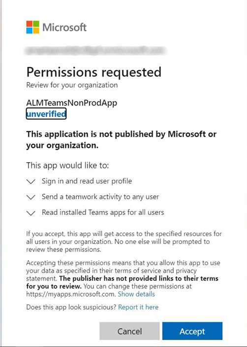

# Application Adobe Learning Manager pour Microsoft Teams

## Configuration

La configuration d’ALM sur MS Teams comprend trois étapes et nécessite l’assistance de l’administrateur ALM et de l’administrateur Microsoft Azure. Dans certaines organisations, l’administrateur Azure et les administrateurs MS Teams ne sont pas les mêmes personnes. Par conséquent, des administrateurs MS Teams supplémentaires sont également nécessaires.

**Administrateur ALM : le rôle Administrateur d’intégration approuve l’application Teams**

Une fois que l’administrateur d’intégration a approuvé l’application MS Teams, l’application Adobe Learning Manager est disponible dans la boutique d’applications MS Teams et vos élèves peuvent y accéder. Cependant, l’application ne recevra pas de notifications, ne se connectera pas en mode silencieux et ne sera pas épinglée pour les élèves dans MS Teams.

**L’administrateur Microsoft Azure approuve l’autorisation pour l’application ALM dans le tableau de bord Azure**

L’administrateur Azure devra approuver les autorisations requises pour l’application ALM. Cela permet à cette application ALM d’envoyer des notifications à MS Teams et de se connecter en mode silencieux. Lors d’une connexion en mode silencieux, les utilisateurs n’ont pas besoin de se connecter séparément à Adobe Learning Manager dans le navigateur.

**L’administrateur MS Teams crée une stratégie pour les équipes ALM**

L’administrateur MS Teams doit, dans son centre d’administration, épingler l’application ALM pour tous ses utilisateurs et l’autoriser en tant que stratégie globale. Dans le cas où ALM n’est utilisé que par un certain groupe dans l’entreprise, l’administrateur MS Teams doit choisir une stratégie personnalisée et l’appliquer uniquement à ce groupe spécifique.

## Le rôle d’administrateur d’intégration approuve l’application Teams

Procédez comme suit :

1. Dans l’application Integration Administrator, sélectionnez **[!UICONTROL Applications]** > **[!UICONTROL Applications fournies]**, puis sélectionnez **[!UICONTROL Application ALM Teams]**.

   
   *Sélectionner l’application ALM Teams*

1. Dans le coin supérieur droit de l’écran, sélectionnez **[!UICONTROL Approuver]**.

   
   *Sélectionnez Approuver sur la page des paramètres de l’application*

1. Sélectionner **[!UICONTROL OK]** dans la boîte de dialogue qui s’affiche.

   
   *Sélectionner OK après approbation*

1. Une fois l’approbation obtenue, vous pourrez voir « Application ALM Teams » dans la section Applications externes.

   
   *L’application ALM Teams apparaît sur la page Applications*

Les utilisateurs peuvent désormais accéder à l’application ALM sur MS Teams.

## L’administrateur Microsoft Azure approuve l’autorisation pour l’application ALM dans le tableau de bord Azure

Procédez comme suit :

1. En tant qu’administrateur Azure, accédez à la section Gérer Azure Active Directory dans le tableau de bord Azure.

   
   *Lancer le tableau de bord Azure*

1. Collez le lien suivant dans une fenêtre de navigateur distincte :

   `https://login.microsoftonline.com/<tenantIdTobeReplaced>/oauth2/authorize?client_id=8d349d9f-bf59-4ece-8022-a41e87d81903&response_type=code&redirect_uri=https://learningmanager.adobe.com`

1. Dans le lien ci-dessus, remplacez `<tenantIdTobeReplaced>` avec l’ID de client disponible dans la page Présentation ci-dessous. Entrez la nouvelle URL.

1. Ajoutez l’application Adobe Learning Manager à vos applications Azure.

   
   *Ajouter à Azure*

1. Sélectionnez l’onglet Applications d’entreprise, puis Toutes les applications. ALMTeamsApp s’affiche dans cette liste.

   
   *Afficher l’application ALM*

1. Cliquez sur l’application et accédez à l’onglet Autorisations.

   
   *Affichage de l’onglet Autorisations*

1. Dans l’onglet Autorisations, sélectionnez **[!UICONTROL Octroyer le consentement de l’administrateur pour MSFT]**&#39; pour accorder des autorisations à l’application ALM abonnement Équipe.

   
   *Sélectionner les autorisations*

1. Sélectionner **[!UICONTROL Accepter]**.

   
   *Sélectionnez Accepter*

1. Une fois accordées, ces autorisations permettront à l’application ALM d’autoriser les connexions silencieuses et d’envoyer des notifications aux élèves dans l’application MS Teams.

   
   *L’accès est accordé*

## L’administrateur MS Teams crée une stratégie pour les équipes Teams

Procédez comme suit :

1. En tant qu’administrateur MS Teams, dans le Centre d’administration, créez une politique pour ajouter l’application Équipes à l’application Équipes de vos élèves.

   
   *Création d’une stratégie*

1. Accédez à la section Configuration de stratégies. Créer une stratégie globale et sélectionner **[!UICONTROL Ajout d’applications]** dans la sous-section Applications épinglées.

   
   *Ajouter la stratégie*

1. Dans la boîte de dialogue qui s’affiche, recherchez **[!UICONTROL Adobe Learning Manager]** et ajoutez l’application. Cela ajoute Adobe Learning Manager dans la section Applications installées.

   
   *Installation de l’application*

1. Enregistrez cette stratégie. Cela rend l’application disponible pour tous les membres de l’organisation.

Les administrateurs peuvent également créer une stratégie personnalisée au lieu d’une stratégie globale. Ajoutez Adobe Learning Manager à cette stratégie personnalisée, puis appliquez la stratégie personnalisée uniquement à l’ensemble d’utilisateurs qui doivent accéder à Adobe Learning Manager.
