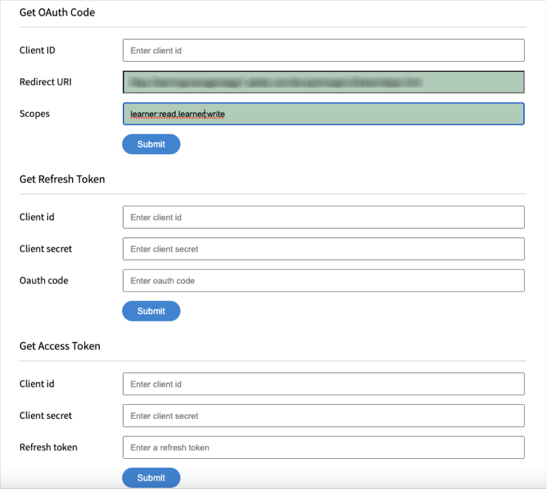

# Package de site de référence Adobe Learning Manager (site de référence ALM) pour AEM Sites.

Adobe Learning Manager (ALM) s’intègre aux sites Adobe Experience Manager (AEM). Cela vous permet de créer votre propre site web et des interfaces mobiles réactives pour Adobe Learning Manager avec un minimum d’effort de codage. Grâce à cette intégration, vous pouvez créer des expériences d&#39;apprentissage personnalisées pour vos utilisateurs.

Pour créer une telle expérience, ALM fournit un package de site de référence Adobe Learning Manager (package de site de référence ALM) pour AEM Sites sous la forme d’un fichier ZIP que vous pouvez installer sur votre instance AEM Sites.

Ce package inclut des modèles de page Web AEM Sites et des composants de site Web ainsi que des widgets incorporables, par exemple, Catalogue d’apprentissage, widgets incorporables, calendrier, etc.

Après avoir installé le package du site de référence ALM, vous pouvez commencer à créer un site Web pour Adobe Learning Manager que vous pouvez héberger sur votre instance AEM Sites. Vos utilisateurs peuvent ensuite faire glisser et déposer les composants sur le site Web.

Installation du package de site de référence ALM

## Prérequis

* Licences pour AEM Sites et Adobe Commerce.
* AEM on-premise 6.5 ou Adobe Experience Manager - Cloud Service
* Adobe Commerce 2.4.3

Après avoir sécurisé votre environnement AEM Sites, vous devez installer le package du site de référence ALM. Ce package comprend des pages Web et des composants de site Web AEM qui aident à construire la plateforme d&#39;apprentissage.

Le package du site de référence est hébergé sur le [**référentiel GitHub**](https://github.com/adobe/adobe-learning-manager-reference-site/releases/tag/1.0.0).

Pour plus d’informations, consultez la section LISEZ-MOI.

## Créer une application dans [!DNL Adobe Learning Manager]

Après avoir installé le package du site AEM, vous devez configurer une application ALM pour connecter votre portail d&#39;apprentissage au site AEM.

Ce scénario s&#39;applique lorsqu&#39;AEM est utilisé avec [!DNL Adobe Learning Manager].

Procédez comme suit :

1. En tant qu’administrateur d’intégration, cliquez sur **[!UICONTROL Applications]**.
1. Pour créer une nouvelle application, cliquez sur **[!UICONTROL Inscrire]** dans le coin supérieur droit de la page.
1. Dans l’écran Enregistrer une nouvelle application, entrez les informations suivantes :

   1. Nom de l&#39;application : nom de l&#39;application que vous créez.
   1. URL : URL de votre organisation.
   1. Rediriger les domaines : domaines d&#39;hébergement du site Web AEM. Vous pouvez également spécifier des caractères génériques.
   1. Description : description de l&#39;application.
   1. Domaines : sélectionnez Accès en lecture au rôle Élève et Accès en écriture au rôle Élève.
   1. Pour ce compte uniquement ? : sélectionnez Oui si vous souhaitez utiliser l&#39;application pour le compte ALM existant.

1. Après avoir apporté les modifications, cliquez sur Enregistrer.

Notez les informations d’identification de l’application depuis l’écran.

*Informations d&#39;identification de l&#39;application*

Pour approuver l’application, cliquez sur **[!UICONTROL Approuver]**.

## Obtention des jetons

1. Dans l&#39;onglet Ressources pour les développeurs, cliquez sur **[!UICONTROL Jetons d&#39;accès pour le test et le développement]**.

   

   *Sélectionner des jetons d&#39;accès pour le test et le développement*

1. Saisissez les détails suivants :

   
   *Saisissez les détails du jeton*

   1. Obtenir le code OAuth : entrez l’ID client de la section précédente et modifiez l’étendue. Cliquez sur Envoyer pour obtenir le code Oauth.
   1. Obtenir le jeton d’actualisation : entrez l&#39;ID et le secret du client de la section précédente. Saisissez également le code OAuth obtenu à l’étape précédente. Cliquez sur Envoyer.
   1. Obtenir le jeton d’accès : entrez l&#39;ID et le secret du client de la section précédente. Saisissez également le jeton d’actualisation obtenu à l’étape précédente. Cliquez sur Envoyer.
   1. Obtenir les détails du jeton d’accès : entrez le jeton d’accès que vous avez obtenu à l’étape précédente. Cliquez sur Envoyer.

1. Vous pouvez obtenir les détails de la réponse JSON qui suit. La réponse comprend le jeton d’accès, le jeton d’actualisation, le rôle d’utilisateur, l’ID de compte, l’ID d’utilisateur et l’heure d’expiration. Notez le jeton d’actualisation, car vous le réutiliserez.

## Configuration d’un compte ALM dans AEM

1. Lancez votre instance AEM.
1. Cliquez sur Paramètres > Cloud Service.
1. Cliquez sur Configuration de Adobe Learning Manager.

   
   *Sélectionner la configuration Adobe Learning Manager*

1. Cliquez sur Créer > Dossier de configuration. Nommez votre dossier.

   
   *Créer une configuration*

1. Dans le projet d’apprentissage, sélectionnez la configuration que vous avez créée.

1. Entrez les détails de la configuration.

   
   *Créer un dossier de configuration*

   1. Mode Adobe Learning Manager : choisissez la manière dont vous souhaitez que l’expérience d’apprentissage soit disponible pour les élèves connectés et non connectés.
   1. URL Adobe Learning Manager : entrez l’URL de l’instance ALM où les services d’apprentissage sont hébergés.
   1. ID de compte : ID du compte ALM.
   1. ID client, secret client et jeton d’actualisation de l’auteur : saisissez les informations d’identification obtenues lors de la création de l’application dans ALM.
   1. Personnalisation du widget : pour plus d&#39;informations, voir [Intégration à AEM](/help/migrated/integrate-aem-learning-manager.md) `.`

1. Enregistrez et fermez la configuration.

### AEM + Adobe Learning Manager (utilisateurs connectés/non connectés)

Adobe Learning Manager vous permet désormais de présenter vos produits et formations à vos clients et partenaires existants et potentiels, sans création de compte ni connexion. Cette fonctionnalité vous aidera à favoriser l’adoption des produits et des formations en fournissant aux élèves un aperçu rapide et facile des formations, ce qui permet de mettre en évidence et de promouvoir les fonctionnalités des produits. Par conséquent, vous pouvez présenter efficacement vos produits et offres, en particulier aux clients et partenaires potentiels, ce qui a pour effet d’accroître la sensibilisation aux produits. La facilité d’accès et l’accessibilité accrue suscitent un intérêt conséquent, ce qui contribue à stimuler les inscriptions à la formation et l’adoption de l’apprentissage.

À l’aide de ce workflow, un élève peut prévisualiser une formation, accéder aux informations sur la formation ou rechercher une formation sans se connecter à Adobe Learning Manager. Ce workflow ne s’applique pas à l’interface Learning Manager native (applicable UNIQUEMENT à AEM Sites et à d’autres interfaces sans tête).

**Configurer et activer le connecteur de plateforme d&#39;apprentissage**

Cette section souligne les étapes nécessaires pour configurer et activer le connecteur suivant :

**Accès aux données de formation**

Ce connecteur permet à votre interface utilisateur sans tête basée sur AEM Sites ou toute autre interface utilisateur personnalisée d’extraire et de restituer des informations de formation aux élèves et d’effectuer une recherche transparente des informations de formation avant ou après la connexion d’un élève.

Ce connecteur n’est requis que si vous utilisez des interfaces AEM Sites ou d’autres interfaces sans tête.

Le connecteur exporte des métadonnées de formation vers une solution de stockage et d&#39;extraction de données ainsi qu&#39;un système d&#39;activation de recherche. Par conséquent, vous pouvez configurer votre interface utilisateur sans tête basée sur AEM Sites ou toute autre interface utilisateur personnalisée pour utiliser ces deux services afin de récupérer les données de formation, de rendre des pages Web et de fournir aux élèves une fonctionnalité de recherche de formation optimisée. Par exemple, une interface AEM Sites non connectée peut utiliser les métadonnées exportées pour aider un élève à rechercher, parcourir et accéder aux pages de formation qui affichent des informations de formation.

Activez ce connecteur pour créer et générer le rendu de vos pages Web AEM Sites et offrir des expériences personnalisées à vos élèves avant et après la connexion. Activez ce connecteur pour créer et générer le rendu de vos pages Web AEM Sites et offrir des expériences personnalisées à vos élèves avant et après la connexion.

* URL de base du réseau CDN de Adobe Learning Manager : entrez l&#39;URL de base du chemin d&#39;accès du service CDN de récupération de données à partir de la page de connexion Accès aux données de formation.
* Jeton d’actualisation d’administrateur : entrez le jeton d’actualisation que vous avez déterminé dans la section précédente.
* URL de base des métadonnées de formation : entrez l&#39;URL de base du chemin du service d&#39;activation de la recherche et de récupération des données de recherche à partir de la page de connexion Accès aux données de formation.
* URL d’inscription d’Adobe Learning Manager : entrez l’URL d’inscription automatique générée par l’administrateur d’intégration pour le compte, qui est utilisée par les élèves pour s’inscrire à la formation.

### AEM + Adobe Learning Manager + Adobe Commerce (utilisateurs connectés/non connectés)

Adobe Learning Manager fournit désormais des solutions pour vous aider à intégrer de manière transparente la plateforme d’apprentissage à Adobe Commerce. Cette version vous permet de connecter facilement vos interfaces de gestion de formation natives, basées sur des sites AEM ou d&#39;autres interfaces sans tête à Adobe Commerce. Cette intégration vous permet de tirer parti des fonctionnalités d&#39;e-commerce de votre plateforme d&#39;apprentissage. Vous pouvez désormais proposer des formations payantes à vos clients et partenaires commerciaux et faciliter l&#39;achat de formations sur des interfaces Learning Manager natives et non natives. Un élève peut également prévisualiser une formation, accéder aux informations sur la formation ou rechercher une formation sans se connecter à Adobe Learning Manager.

Un utilisateur peut utiliser l’application AEM déjà existante et l’approuver au lieu d’en créer une.

* URL de base du réseau CDN de Adobe Learning Manager : entrez l’URL de base du chemin d’accès du service CDN de récupération de données à partir de la page de connexion Adobe Commerce.
* URL Adobe Commerce : saisissez l’URL de l’instance Adobe Commerce que vous utilisez.
* Chemin d’accès du proxy GraphQL : les composants Learning Manager côté client accèdent directement au point d’entrée Adobe Commerce GraphQL et une erreur CORS peut donc se produire. Pour éviter cette erreur, tous les appels doivent être servis à partir du même point de terminaison qu’AEM ou via un proxy qui ajoute des en-têtes CORS.
* Nom de la boutique Adobe Commerce : saisissez le nom de la boutique Adobe Commerce que vous avez déterminé dans la section précédente.
* Durée de vie du jeton client Adobe Commerce (en secondes) : entrez la durée de vie du jeton client indiquant la période prédéterminée pour une session de connexion.
* Jeton d’actualisation d’administrateur : entrez le jeton d’actualisation que vous avez déterminé dans la section précédente.

## Personnalisation des pages Web

Personnalisez vos pages Web à l’aide du site de références AEM et des widgets disponibles.

1. Lancez votre instance AEM.
1. Cliquez sur Sites et ouvrez la page de configuration.
1. Cliquez sur **[!UICONTROL Site d&#39;apprentissage]** > **[!UICONTROL Maîtres linguistiques]** > **[!UICONTROL Anglais]**. Toutes les pages Web du projet sont incluses dans le dossier.

   
   *Afficher toutes les pages web*

1. Sélectionnez un modèle et cliquez sur **[!UICONTROL Modifier]**.

1. Sur la page, cliquez sur le bouton Paramètres du composant et modifiez les propriétés du composant.

   
   *Bouton Sélectionner les paramètres*

1. Affichez un aperçu des modifications ou publiez la page.

## Création de pages Web

Outre les modèles que vous pouvez utiliser et qui sont fournis par le package du site de référence, vous pouvez également créer des pages Web basées sur les modèles dans AEM.

1. Sur la page AEM principale, cliquez sur Créer > Page.

1. Choisissez le modèle que vous souhaitez personnaliser. Cliquez sur Suivant.

1. Saisissez les propriétés de la page.

   
   *Propriétés de page*

1. Pour créer la page, cliquez sur **[!UICONTROL Créer]**.

1. Sélectionnez la nouvelle page et cliquez sur **[!UICONTROL Modifier]**.

1. Insérez un composant sur la page, par exemple **Formation- Contenu**.

   
   *Filtrer par site*

1. Choisissez les filtres de catalogue requis qui seront affichés sur la page.

## Créer un site à partir de Blueprint

Le package du site de référence ALM fournit un « Plan du site d’apprentissage », qui vous permet de créer un site Web pour votre plate-forme d’apprentissage. Les plans AEM vous permettent de créer des pages Web directement à partir de composants AEM Sites. Vous n’avez pas besoin d’utiliser de modèles.

1. Sur la page de démarrage AEM, cliquez sur **[!UICONTROL Sites]**.

1. Cliquez sur **[!UICONTROL Créer]** > **[!UICONTROL Site]**.

1. Cliquez sur Plan du site d&#39;apprentissage.

   

   *Créer un site à partir d&#39;un plan directeur*

1. Cliquez sur Suivant.

1. Sur la page des propriétés, saisissez les métadonnées de la page. Cliquez sur Créer.

   
   *Sélectionner le plan du site d&#39;apprentissage*

1. Cliquez sur le lien hypertexte Accueil pour accéder à la page d’accueil du site que vous avez créé. Sur cette page, vous pouvez personnaliser les widgets et les composants de catalogue.

## Programmation de votre site Web

En plus d’utiliser les modèles intégrés et de créer votre site Web à partir de zéro à l’aide des composants WYSIWYG, vous pouvez également écrire du code et créer le site.

Le code se trouve dans le [Référentiel GitHub du site de référence](https://github.com/adobe/adobe-learning-manager-reference-site) pour que vous puissiez commencer.

Les principales parties du modèle sont les suivantes :

* core : offre groupée Java contenant toutes les fonctionnalités de base telles que les services OSGi, les écouteurs ou les planificateurs, ainsi que le code Java associé aux composants tels que les servlets ou les filtres de requête.
* ui.apps : contient les parties /apps (et /etc) du projet, c&#39;est-à-dire les clients JS&amp;CSS, les composants et les modèles.
* ui.content : contient un exemple de contenu à l’aide des composants de l’interface utilisateur.apps
* ui.frontend : contient des composants React.

Tout le code est dans le référentiel pour vous mettre en route.

## Importer et ajouter des composants du gestionnaire d&#39;apprentissage à une page Web ou un modèle existant

L’installation du package de site de référence AEM ajoute les composants Learning Manager à votre instance AEM Sites. Par défaut, vous pouvez ajouter ces composants au site d’apprentissage du projet Web (site Web) que nous fournissons prêts à l’emploi. Ces composants sont également disponibles dans le site Web que vous créez à partir de Learning Site Blueprint.

Toutefois, si vous souhaitez utiliser ces nouveaux composants Learning Manager dans votre projet Web ou site Web existant, vous devez les importer à l’aide de la procédure suivante.

1. Installez le package du site de référence ALM.

1. Ouvrez le projet Web et accédez au fichier HTML (pour la page Web ou le modèle Web auquel vous souhaitez ajouter les composants Learning Manager).
1. Participation à une réunion

   Ouvrez le fichier HTML et ajoutez les fragments de code ci-après au composant de page afin que le code s’exécute avant les composants d’apprentissage présents dans le rendu de page.

   *`<sly data-sly-use.configModel="com.adobe.learning.core.models.GlobalConfigurationModel"/>`*
   *`<meta name="cp-config" content="${configModel.config}" />`*

   Le code précédent ajoute la configuration mappée dans la balise meta de la page, ce qui est requis pour le rendu des composants d’apprentissage. Pour plus d&#39;informations, voir [Site de référence Adobe Learning Manager](https://github.com/adobe/adobe-learning-manager-reference-site/blob/master/ui.apps/src/main/content/jcr_root/apps/learning/components/page/customheaderlibs.html).

1. Assurez-vous d’avoir mappé la configuration avec le projet Web.
1. Ouvrez le modèle AEM Sites dans lequel importer les composants Learning Manager.
1. Dans l’éditeur de page de modèle, accédez au conteneur Composants autorisés et sélectionnez **Stratégie**.
1. Dans la page Stratégie, accédez à Propriétés > Composants autorisés et sélectionnez les composants suivants « Apprentissage - Contenu », « Apprentissage - Formulaire » et « Apprentissage - Structure »

La procédure suivante permet au modèle de remplir les dépendances de bibliothèque client des composants Learning Manager importés.

Les pages Web qui incluent ces composants doivent charger ces bibliothèques pour effectuer le rendu et utiliser les composants.

1. Dans l&#39;éditeur de page de modèle, cliquez sur Informations sur la page, puis sur Stratégie de page.
1. Dans la page Stratégie, accédez à Propriétés > Bibliothèques client et ajoutez-les à votre page de modèle :

   1. learning.site
   1. learning.ui
   1. learning.commerce

Après avoir enregistré ce modèle, vous pouvez ajouter les composants Learning Manager dans toutes les pages Web dérivées de ce modèle.
