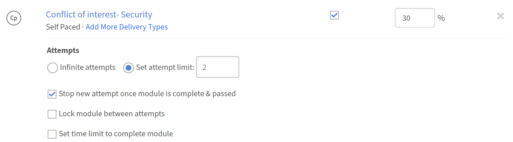
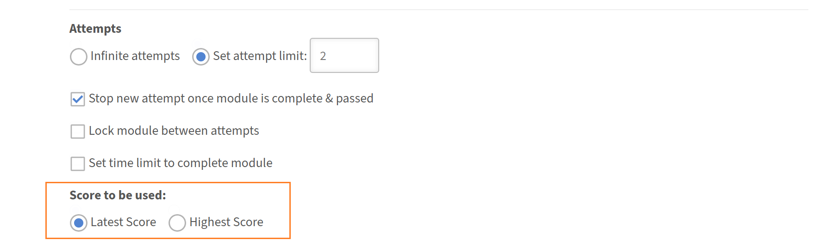

# Gradebook pour les auteurs

## Configuration du carnet de notes d’un cours

Configurez le score pondéré d&#39;un cours dans Adobe Learning Manager afin que chaque élève reçoive un score total calculé à partir des performances de son module et que l&#39;achèvement du cours puisse être lié à l&#39;atteinte d&#39;un seuil de score minimum.

Le carnet de notes est configuré au niveau du cours lors de la création d’un nouveau cours. Il ne peut pas être ajouté à un cours publié existant.

>[!NOTE]
>
>Pour que les élèves puissent voir le Gradebook dans un cours, un administrateur doit d&#39;abord activer la **visibilité du Gradebook** au niveau du compte.

### Activer le carnet de notes pour un cours

* Se connecter à Adobe Learning Manager en tant qu’auteur.
* Dans le volet de navigation de gauche, sélectionnez **Cours**, puis **Ajouter** pour créer un cours.
* Saisissez le nom du cours, la description et d’autres détails requis.
* Dans la section **Modules**, localisez le bouton à bascule **Livre de classement**.

  

* Sélectionnez l&#39;option **Livre de classement** pour l&#39;activer. Deux options s’affichent en dessous. Les deux sont activés par défaut :
  * **Afficher le carnet de notes aux élèves :** les élèves voient un onglet **Carnet de notes** dans le lecteur de cours affichant leurs scores de module, la répartition des pondérations et le résultat global. Désactivez cette option pour calculer les notes en interne sans les exposer aux élèves.
  * **Inclure les modules qui ne contribuent pas à la note finale :** les modules qui ne font pas partie des critères de réussite seront également affichés dans le cahier de notes. Si ce paramètre n’est pas coché, seuls les modules faisant partie des critères de réussite sont affichés.

### Ajout de modules et attribution d’une pondération

Après avoir activé le Gradebook, ajoutez vos modules de contenu et affectez un pourcentage de pondération à chaque module pouvant recevoir des scores. Les pourcentages de poids doivent atteindre exactement 100 pour que vous puissiez enregistrer la configuration.

* Sélectionnez **Ajouter des modules**.
* Dans le sélecteur de modules, sélectionnez les modules que vous souhaitez ajouter et sélectionnez **Ajouter**. Les modules apparaissent dans la section **Contenu**. Les modules évaluables, SCORM, le contenu du Captivate, AICC, xAPI, les quiz natifs, les modules d&#39;activité, les sessions de classe et les sessions de classe virtuelle affichent un champ de saisie **Pondération**. Les modules non marquables affichent un tiret dans la colonne de pondération.
* Entrez une valeur de pourcentage dans le champ **Pondération** pour chaque module pouvant être noté. Un indicateur de **pesage total** est mis à jour au fur et à mesure que vous tapez et doit atteindre exactement **100 %** avant de pouvoir enregistrer.

  

* Pour les modules avec plusieurs types de livraison : la pondération ne peut être attribuée que si les types de livraison **all** dans le module prennent en charge le score. Si un type de livraison ne prend pas en charge l&#39;évaluation, l&#39;ensemble du module ne peut pas être pondéré.

>[!NOTE]
>
>L&#39;échelle de notation ne doit pas nécessairement correspondre entre les types de livraison. Une session de classe notée sur 100 et un module SCORM noté sur 10 peuvent coexister dans le même Gradebook. La formule normalise automatiquement chaque contribution.

### Définition de la note de passage minimale

* Dans l&#39;éditeur de cours, recherchez la section **Critères de réussite**.
* Dans le champ **Score d&#39;agrégation minimal sur les modules**, entrez un pourcentage compris entre 0 et 100.
* Une valeur de **0** signifie que le cours est terminé en fonction de l&#39;achèvement du module requis uniquement, sans seuil de score global.
* Toute valeur supérieure à 0 signifie que l’élève doit terminer les modules requis ET atteindre ou dépasser ce score total.
* Dans le champ **Modules obligatoires**, saisissez le nombre requis ou sélectionnez-le dans la liste déroulante.

  

* Sélectionnez **Enregistrer**.

La note de passage minimale est visible par les élèves dans l&#39;onglet **Gradebook** afin qu&#39;ils connaissent le seuil avant de commencer.

### Configuration des paramètres de score pour les modules avec plusieurs tentatives {#configurescoresettingsmultipleattempts}

Lorsqu&#39;un module autorise plusieurs tentatives, choisissez le score de tentative à utiliser dans le calcul du Gradebook.

* Dans l&#39;éditeur de cours, recherchez un module pour lequel plusieurs tentatives sont activées.

  

* Recherchez le paramètre **Score à utiliser** en regard de ce module.
* Sélectionnez **Latest** ou **Highest** :
  * **Dernière tentative :** le score de tentative le plus récent est toujours utilisé. Un score plus faible lors d’une tentative ultérieure remplace un score plus élevé précédemment.
  * **Le plus élevé :** le meilleur score de toute tentative est conservé. Un score plus faible lors d’une tentative ultérieure ne réduit pas le score stocké.

    

* Sélectionnez **Enregistrer**.

### Publish du cours

Après avoir configuré tous les paramètres du Gradebook, publiez le cours à l’aide du workflow standard. Sélectionnez **Enregistrer**, puis **Publish** pour mettre le cours à la disposition des élèves.

### Bonnes pratiques

* Attribuez une pondération qui reflète l&#39;importance relative de chaque module. Attribuez des pourcentages plus élevés aux modules les plus importants pour l’objectif d’apprentissage.
* Activez **Afficher le carnet de notes pour les élèves**, sauf s&#39;il existe une raison spécifique de masquer les scores. Les élèves qui peuvent voir leur pondération et leur score d&#39;exécution sont mieux placés pour hiérarchiser leurs efforts.
* Définissez le score de réussite minimum avant l’inscription des élèves. Sa modification après les inscriptions actives peut affecter les achèvements en cours.
* Utilisez le paramètre **Maximale** pour les tentatives multiples lorsque les modules sont des évaluations que les élèves doivent réessayer. Utilisez **Dernière** lorsque vous souhaitez capturer le niveau de connaissances actuel plutôt que les meilleures performances.
* Vérifiez que l&#39;indicateur **Pondération totale** affiche exactement 100 % avant d&#39;enregistrer.
