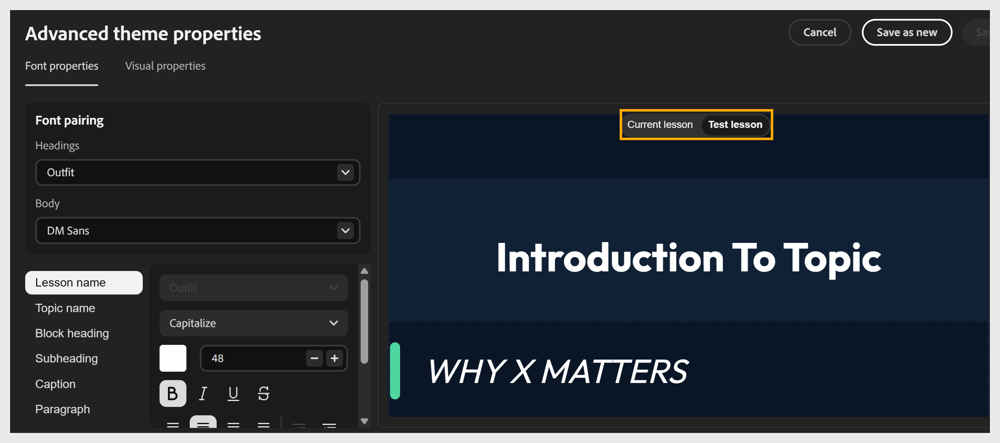

# Personnalisation avancée du thème dans le compositeur de contenu

## Personnalisation des propriétés de thème avancées dans l’application

Utilisez les propriétés de thème avancées pour un contrôle plus précis sur des éléments individuels, tels que les noms des leçons, les noms des rubriques, les en-têtes de bloc, les sous-titres, les légendes et les paragraphes.

1. Sélectionnez **Thèmes**, passez le curseur de la souris sur le thème appliqué, sélectionnez **Modifier**, puis sélectionnez **Avancé**.
   

2. Dans le panneau Propriétés de la police, définissez le **couplage de polices** pour votre cours :

   - Sélectionnez la liste déroulante **Titres** et choisissez une police pour tous les titres.

   - Sélectionnez la liste déroulante **Corps** et choisissez une police pour le corps du texte.
     

3. Définissez la liste des éléments : **Nom de la leçon**, **Nom de la rubrique**, **En-tête de bloc**, **Sous-titre**, **Légende** et **Paragraphe**. Sélectionnez l’élément que vous souhaitez personnaliser.

4. Dans le panneau [!UICONTROL Propriétés visuelles], vous pouvez ajuster la disposition et l&#39;espacement dans le cours.

   - Définissez l’espacement entre les éléments à l’aide des options de densité du contenu.

   - Pour définir le **rayon d&#39;arrondi de la carte/de l&#39;image**, faites glisser le curseur ou entrez une valeur pour définir l&#39;arrondi des cartes et des images. Par exemple, définissez le rayon sur 17 px.

   - Sélectionnez **Leçon** pour modifier la couleur d&#39;arrière-plan ou l&#39;image d&#39;une leçon.

   - Sélectionnez **Rubrique** pour définir la couleur d&#39;arrière-plan ou la bordure d&#39;une rubrique.

   - Sélectionnez **En-tête/Pied de page** pour définir l&#39;en-tête et les propriétés.

   Le compositeur de contenu prévisualise automatiquement vos modifications dans la zone de travail à mesure que vous les apportez.

5. Pour l’élément sélectionné, personnalisez ses propriétés selon vos besoins :

   - Choisissez un **style de police**, tel que Casse.

   - Définissez la **taille de police** à l&#39;aide des commandes **+** et **-**.

   - Choisissez une **couleur de police**.

   - Appliquez la mise en forme, telle que **Gras**, *Italique*, <u>Souligné</u> ou ~~Barré~~.

   - Définissez l&#39;**alignement du texte**.

6. Prévisualisez vos modifications dans la zone de travail à droite. Utilisez les onglets **Leçon actuelle** et **Tester la leçon** pour vérifier comment vos modifications apparaissent dans les différentes leçons.
   

7. Sélectionnez **Enregistrer sous** ou **Enregistrer**.
