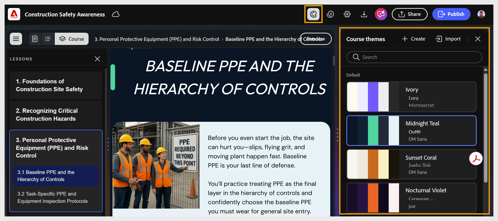

# Application d’un thème

Les thèmes de cours contrôlent les polices, les couleurs, les en-têtes, les pieds de page et le style des composants de l’ensemble de votre cours.

Appliquez un thème à votre cours sans aucune personnalisation pour un aspect rapide, soigné et cohérent.

1. Sélectionnez **Thèmes** dans la barre d’outils. Le panneau **Thèmes de cours** s&#39;ouvre et affiche tous les thèmes disponibles.
   

2. Parcourez les thèmes disponibles :

   1. **Par défaut :** affiche les thèmes intégrés fournis avec le compositeur de contenu.

   2. **Personnalisé :** affiche les thèmes que vous avez créés et enregistrés.

   3. Utilisez la barre de **recherche** pour localiser un thème par nom.

3. Sélectionnez un thème pour l’appliquer. L’aperçu du cours est mis à jour automatiquement.
