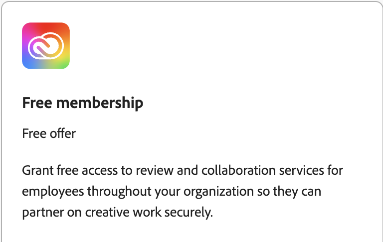

>[!IMPORTANT]
>
>À qui s’adresse ce document : administrateurs qui doivent activer le stockage par Creative Cloud pour les utilisateurs de Adobe Learning Manager afin qu’ils puissent accéder à Content Composer et l’utiliser. Elle est particulièrement utile pour les administrateurs, qui doivent résoudre les problèmes de connexion ou d’accès liés au stockage et attribuer l’offre d’abonnement gratuit via Adobe Admin Console.

Adobe Learning Manager (ALM) Content Composer exige des utilisateurs qu’un espace de stockage de Creative Cloud soit associé à leur compte Adobe. Les utilisateurs qui ne disposent pas d’un espace de stockage de Creative Cloud peuvent ne pas pouvoir accéder au compositeur de contenu et peuvent rencontrer des erreurs de connexion ou d’accès.

Pour aider les organisations à provisionner l’espace de stockage pour les utilisateurs concernés, Adobe propose une offre d’abonnement gratuit que les administrateurs peuvent attribuer via Adobe Admin Console. Cette offre comprend le stockage par Creative Cloud et peut être utilisée lorsqu’un utilisateur ne dispose pas déjà d’une formule qui fournit des droits de stockage.

## Avant de commencer

Assurez-vous que :

* Vous disposez d’un accès administrateur Adobe Admin Console.
* L’utilisateur nécessitant un accès au compositeur de contenu est identifié.
* Vous avez vérifié si l’utilisateur dispose déjà d’une formule incluant un espace de stockage dans un Creative Cloud.

## Pourquoi les utilisateurs ont-ils besoin d’un espace de stockage dans le Creative Cloud ?

Le compositeur de contenu utilise le stockage du Creative Cloud pour stocker les cours. Les utilisateurs qui n’ont pas d’espace de stockage attribué à leur profil d’Adobe peuvent recevoir une erreur lors de la tentative d’utilisation du compositeur de contenu.

De nombreux clients Adobe disposent déjà d’un stockage de mots de Creative Cloud via des produits Adobe existants et ne sont pas affectés. Cependant, certains clients Adobe Learning Manager peuvent ne pas avoir de stockage provisionné par défaut et peuvent avoir besoin d’un administrateur pour l’activer.

## Activer le stockage gratuit des mots de Creative Cloud pour les utilisateurs

Si un utilisateur ne dispose pas d’un espace de stockage pour ses mots de Creative Cloud, attribuez l’offre d’abonnement gratuit Adobe Admin Console.

1. Connectez-vous à [Adobe Admin Console](https://adminconsole.adobe.com/) à l&#39;aide d&#39;un compte avec des droits d&#39;administrateur. Seuls les administrateurs peuvent attribuer des produits et des offres aux utilisateurs.
2. Dans le Admin Console, sélectionnez Produits > Évaluations et offres spéciales.

   

3. Retrouvez l’offre d’abonnement gratuit disponible sous Essais et offres spéciales. Il s’agit de l’offre présentée comme la méthode recommandée pour activer le stockage par Creative Cloud pour les utilisateurs qui n’ont pas encore de droit de stockage.

   

4. Attribuez l’offre d’abonnement gratuit aux utilisateurs requis. L’affectation ne peut être effectuée que par un administrateur disposant des autorisations de Admin Console appropriées.
5. Après l’affectation, vérifiez que l’utilisateur dispose d’un espace de stockage dans son Creative Cloud et demandez-lui de se reconnecter au compositeur de contenu.

## Stockage fourni via l’abonnement gratuit

Les utilisateurs disposant d’une offre d’abonnement gratuit reçoivent environ 2 Go d’espace de stockage pour leur Creative Cloud, ce qui leur permet d’utiliser le compositeur de contenu.

## Dépannage

**L’utilisateur reçoit une erreur lors de l’accès au compositeur de contenu**

Vérifiez si l’utilisateur dispose d’un espace de stockage Creative Cloud disponible dans son profil d’Adobe.

**L’utilisateur ne peut pas voir l’offre d’abonnement gratuit**

Confirmez que :

* Vous êtes connecté en tant qu’administrateur.
* Vous consultez la section Produits de Adobe Admin Console.
* L’organisation peut accéder à l’offre.

## Foire aux questions

**Chaque utilisateur Adobe Learning Manager reçoit-il automatiquement un espace de stockage de Creative Cloud ?**

Non. Certains utilisateurs ALM peuvent ne pas avoir de stockage provisionné par défaut et peuvent avoir besoin de droits supplémentaires via l’offre d’abonnement gratuit.

**Les utilisateurs peuvent-ils activer eux-mêmes le stockage ?**

Non. Le droit de stockage doit être attribué par un administrateur d’Adobe via le Admin Console.

**Un espace de stockage dans le Creative Cloud est-il requis pour le compositeur de contenu ?**

Oui. Le compositeur de contenu dépend des utilisateurs dont le compte d’Adobe est associé à un espace de stockage de Creative Cloud.

**Que doivent faire les administrateurs si un utilisateur rencontre une erreur liée au stockage ?**

Vérifiez que l’utilisateur dispose d’un droit de stockage par Creative Cloud. Si ce n’est pas le cas, attribuez l’offre d’abonnement gratuit via Adobe Admin Console et demandez à l’utilisateur de réessayer.

**Que doivent faire les administrateurs s&#39;ils ont toujours des problèmes d&#39;accès ou de droits ?**

Si l’administrateur Adobe Admin Console face un problème lors de l’affectation d’un stockage de mot de Creative Cloud ou du débogage de problèmes d’accès, le problème peut nécessiter une prise en charge au niveau du compte d’entreprise. Dans ce cas, contactez l’assistance aux entreprises d’Adobe via les options d’assistance disponibles en Admin Console.

Pour plus d&#39;informations, consultez les [options de support Adobe Enterprise](https://helpx.adobe.com/fr/business/enterprise/get-help/support-options/support-for-enterprise.html)
