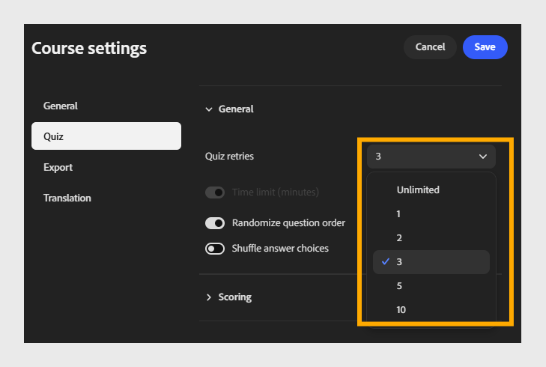

# Configuration des paramètres du quiz

Sélectionnez **Quiz** pour configurer le comportement du quiz et son score.

Cet onglet comporte deux sections : **Général** et **Notation**.

## Section Général

- **Tentatives du quiz** : choisissez le nombre de tentatives qu’un élève peut effectuer pour terminer le quiz. Par exemple, sélectionnez **3** pour autoriser jusqu&#39;à 3 tentatives.
  

- **Limite de temps (minutes)** : sélectionnez le bouton bascule pour activer une limite de temps, puis entrez la durée en minutes. Par exemple, saisissez **60** pour donner aux élèves 60 minutes pour terminer le quiz.

- **Ordre aléatoire des questions** : sélectionnez cette option pour afficher les questions dans un ordre aléatoire pour chaque élève.
  

- **Mélanger les choix de réponses :** sélectionnez le bouton pour mélanger les choix de réponses pour chaque question.
  

## Section Notation

- **Standard** :

Sélectionnez la version SCORM utilisée pour signaler les résultats du quiz à votre système de gestion de l’apprentissage. Choisissez la version qui correspond aux exigences de compatibilité de votre LMS.
Par exemple, sélectionnez **SCORM 1.2**.

>[!NOTE]
>
>Si vous ne savez pas quelle version de SCORM choisir, vérifiez auprès de votre administrateur LMS.

