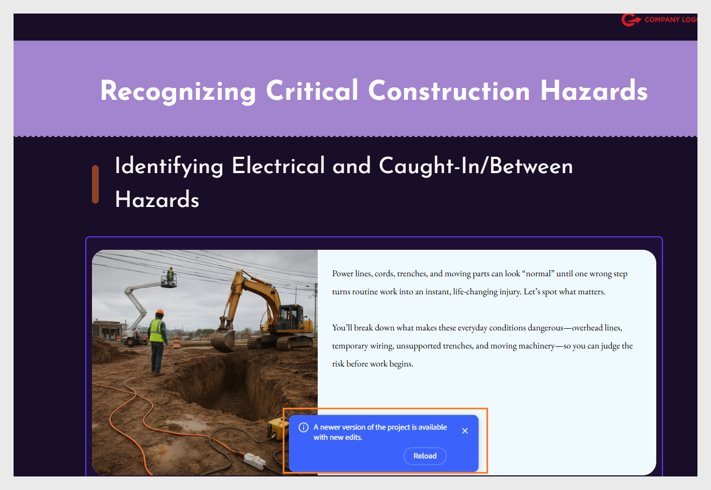

# FAQ sur Adobe Learning Manager Content Composer

Obtenez des réponses aux questions fréquemment posées sur l’utilisation du compositeur de contenu.

**Le bouton Générer le contour est grisé. Que dois-je faire ?**

Les trois champs **Courte**, **Titre**, **Élèves** et **Objectif** doivent contenir du contenu avant l&#39;activation de la fonctionnalité **Générer l&#39;aperçu**. Dans la zone de travail, recherchez tout champ affichant encore du texte de substitution en italique, tel que *Entrez le profil des élèves ici* ou *Entrez l’objectif de ce cours*. Renseignez le champ vide et le bouton s’active immédiatement.

**Je ne peux pas sélectionner le plan pour renommer une leçon. Pourquoi ?**

La modification des contours est conversationnelle dans la version Beta actuelle. Vous ne pouvez pas sélectionner une leçon ou une rubrique sur la zone de travail pour la renommer ou la réorganiser. Saisissez vos modifications en langage clair dans le panneau de conversation de l’assistant.

Exemples :

- « Renommez la leçon 1 en « Fonctionnement du phishing » »

- « Déplacer le sujet 1.3 pour qu’il devienne le premier sujet de la leçon 2 »

- « Supprimer la leçon 4 et répartir ses rubriques dans la leçon 3 »

**Le contour généré ne correspond pas à ce que je voulais. Que s&#39;est-il passé ?**

Le plan reflète l’invite et le bref. Si la structure semble incorrecte, les causes les plus courantes sont une invite qui couvre trop de sujets à la fois ou un objectif d&#39;apprentissage qui ne nomme pas les compétences ou comportements spécifiques que le cours doit développer.

**L&#39;IA a ignoré une section importante de mon fichier chargé. Comment résoudre ce problème ?**

Le compositeur de contenu donne la priorité aux sections de votre fichier source qui sont les plus pertinentes pour votre objectif d’apprentissage. Si une section a été ignorée, cela n&#39;a probablement pas été reflété dans l&#39;objectif.

Pour résoudre ce problème :

1. Revenez au panneau **Courte** et mettez à jour l&#39;objectif pour nommer explicitement la rubrique manquante.

2. Demandez à l&#39;assistant de régénérer l&#39;outline : « Régénérez l&#39;outline en veillant à inclure la section de stratégie de rétention des données. »

Vous pouvez également ajouter manuellement le contenu manquant en tant que nouveau sujet dans la conversation de l&#39;outline : « Ajouter un nouveau sujet à la leçon 2 appelé « Stratégie de rétention des données ». »

**Puis-je utiliser le compositeur de contenu avec Adobe Captivate ?**

Non. Content Composer et Adobe Captivate ne partagent pas de workflow aller-retour. Vous ne pouvez pas ouvrir les projets du compositeur de contenu dans le Captivate, ni les projets du Captivate dans le compositeur de contenu.

Un fichier MP4 exporté dans un Captivate peut être inséré en tant que composant **Vidéo** dans le compositeur de contenu.

**Puis-je utiliser Content Composer pour la conformité ou une formation réglementée ?**

Oui. C&#39;est l&#39;un de ses cas les plus convaincants. Chargez vos documents de stratégie ou de procédure dans Gérer les fichiers sources et sélectionnez Restreindre la sortie au contenu dans les fichiers afin que l’IA ne génère qu’à partir de ce que vous avez fourni au lieu de compléter avec des connaissances générales.

**Pourquoi les vérifications de connaissances ne sont-elles pas notées ?**

Les vérifications de connaissances dans le compositeur de contenu sont conçues pour apprendre le renforcement au cours d’une leçon, et non pour la notation. Ils fournissent un retour d’informations immédiat à l’élève, mais ne produisent pas d’enregistrement de note ou d’achèvement.

Seules les évaluations de quiz de fin de leçon sont notées. Si vous avez besoin d’une évaluation qui contribue au score d’un élève, utilisez le quiz, et non un composant de vérification des connaissances.

**Les questions du quiz ne correspondent pas à ce que le cours enseigne. Comment résoudre ce problème ?**

Le compositeur de contenu utilise l&#39;IA pour générer des questions de quiz, et la sortie IA est non déterministe. Les questions ne reflètent pas toujours exactement ce à quoi vous vous attendez. Passez en revue toutes les questions du quiz après la génération du cours, modifiez celles qui nécessitent un ajustement directement dans l&#39;éditeur de cours et vérifiez que le contenu est exact avant de le publier.

## À propos du partage pour révision

**Qu’est-ce que le partage pour révision dans le compositeur de contenu ?**

Partager pour révision vous permet de distribuer un cours aux réviseurs pour obtenir des commentaires avant de le publier. Les réviseurs ouvrent le cours dans un navigateur, ajoutent des commentaires sur n’importe quel composant et tentent le quiz, sans avoir à installer le compositeur de contenu ou à s’abonner.

**Les réviseurs ont-ils besoin d’une licence de compositeur de contenu ?**

Non. Les réviseurs n’ont pas besoin d’un abonnement ou d’une installation du compositeur de contenu. Toute personne disposant du lien de révision peut ouvrir le cours dans son navigateur.

**Les réviseurs ont-ils besoin d’un Adobe ID pour participer ?**

Oui. La révision d&#39;un cours nécessite une connexion, par conséquent un Adobe ID est requis pour participer. Une fois connectés, les réviseurs peuvent ouvrir le cours, ajouter des commentaires, tenter le quiz et utiliser @mentions pour baliser l’auteur ou les autres réviseurs.

**Les réviseurs peuvent-ils modifier le contenu du cours ?**

Non. L’accès en révision est réservé aux commentaires. Les réviseurs peuvent ajouter des commentaires, y répondre, les résoudre et les filtrer, mais ils ne peuvent pas modifier le texte, les images ou la structure du cours.

Où sont stockés les fichiers de révision ? Les fichiers de révision sont hébergés dans le cloud d’Adobe. Les auteurs n&#39;ont pas besoin de gérer le stockage des fichiers ou d&#39;envoyer directement les fichiers de cours aux réviseurs.

### Partage et accès

**Qui peut accéder à un lien de révision ?**

Par défaut, seules les personnes que vous invitez par nom ou adresse e-mail peuvent accéder au projet. Vérifiez cela dans la section Qui a accès du panneau Partager le projet avant d’envoyer le lien.

**Puis-je inviter des parties prenantes externes qui ne sont pas des utilisateurs Adobes ?**

Oui, vous pouvez inviter n’importe qui par adresse électronique. Cependant, ils ont besoin d’un compte Adobe pour se connecter et consulter le cours.

**Puis-je ajouter des réviseurs une fois que la révision a déjà commencé ?**

Oui. Ouvrez le panneau Partager le projet à tout moment, ajoutez des noms ou des adresses e-mail, puis sélectionnez Inviter à commenter. Les nouveaux réviseurs reçoivent immédiatement une invitation.

**Puis-je supprimer un réviseur après le partage ?**

Oui. Dans le panneau Partager le projet, recherchez le réviseur sous Qui a accès et supprimez-les. S’ils tentent d’ouvrir le cours à l’aide d’un lien précédemment partagé, un message de refus d’accès s’affiche.

**Que se passe-t-il si un réviseur perd l’accès ?**

Ils peuvent sélectionner Demander l’accès sur l’écran Accès refusé. Le propriétaire du cours reçoit une notification pour rétablir l’accès.

### Commentaires et commentaires

Les réviseurs peuvent-ils commenter une partie spécifique du cours ?

Oui. Les réviseurs sélectionnent n&#39;importe quel composant du cours (un bloc de texte, une image ou une question de quiz) et ajoutent un commentaire directement sur cet élément. Les commentaires restent contextuellement liés au composant sur lequel ils ont été ajoutés.

**Plusieurs réviseurs peuvent-ils commenter en même temps ?**

Oui. Tous les réviseurs voient les commentaires des autres dans le panneau Commentaires et peuvent y répondre, les résoudre ou s’@mention mutuellement.

**Puis-je filtrer les commentaires pour trouver les commentaires non résolus ?**

Oui. Utilisez le filtre Résolu dans le panneau Commentaires pour afficher uniquement les commentaires non résolus. Vous pouvez également filtrer par Réviseurs pour voir les commentaires d’une personne spécifique ou par Heure pour trouver les commentaires les plus récents.

**Comment baliser un autre réviseur dans un commentaire ?**

Tapez @ suivi de leur nom ou de leur adresse e-mail et sélectionnez-les dans la liste déroulante. Les utilisateurs balisés reçoivent une notification. Pour cela, le réviseur doit être connecté avec un Adobe ID.

#### Quiz et accès des élèves

**Les réviseurs peuvent-ils répondre au quiz ?**

Oui. Les réviseurs peuvent tenter le quiz jusqu’au nombre spécifié de tentatives. Leurs scores ne sont pas enregistrés et n’affectent pas le cours ou les rapports du LMS.

**Quelle est la différence entre le partage pour révision et le partage pour les élèves ?**

L’option Partager pour révision donne accès au cours avec le panneau de commentaires activé. Il est destiné aux collègues et aux parties prenantes qui donnent leur avis. L’option Partager pour les élèves donne accès au cours sans commentaires, destinée aux élèves qui ne sont pas inscrits via un LMS. Les scores des élèves ne sont pas non plus enregistrés via un lien direct.

### Mise à jour et fermeture d’une révision

**Dois-je créer une nouvelle révision après avoir apporté des modifications ?**

Non. L’URL de révision reste la même après la mise à jour du cours. Sélectionnez **Partager** pour informer les réviseurs qu&#39;une version mise à jour est disponible.

**Les réviseurs seront-ils informés lorsque je mettrai à jour le cours ?**
Les réviseurs voient une bannière de notification lorsqu’ils ouvrent le lien de révision après une mise à jour. Ils peuvent sélectionner Recharger pour afficher la dernière version.

**Les anciens commentaires sont-ils conservés après une mise à jour du cours ?**

Oui. Les commentaires existants sont conservés sur toutes les mises à jour. Les réviseurs et les auteurs peuvent continuer à résoudre les commentaires sur la version mise à jour.

**Qu’advient-il d’un lien d’élève après la mise à jour du cours ?**

Le lien existant de l&#39;élève continue d&#39;afficher la version précédente. Générez un nouveau lien après chaque mise à jour et partagez-le avec les élèves pour vous assurer qu’ils accèdent au contenu le plus récent.

**Comment afficher les mises à jour du projet ?**

Si l&#39;auteur met à jour le cours pendant que vous le révisez, une notification s&#39;affiche.

- Sélectionnez **Recharger** pour charger la dernière version ou ignorez la notification pour continuer la révision de la version actuelle. Le rechargement est sécurisé : vos commentaires existants persistent même après les mises à jour du projet, de sorte que vous ne perdrez pas les commentaires que vous avez déjà ajoutés.

## Tenter le quiz en tant que réviseur

En tant que réviseur, vous pouvez tenter le quiz jusqu’au nombre de fois spécifié, mais vos scores ne sont pas enregistrés.

- Sélectionnez **DÉMARRER LE QUIZ** pour tenter de répondre au quiz.

  

- Une fois l’opération terminée, les résultats s’affichent. À partir de là, vous pouvez sélectionner Vérifier les réponses pour voir quelles questions ont été bonnes ou mauvaises, ou Répondre à nouveau au quiz pour réessayer.

  

