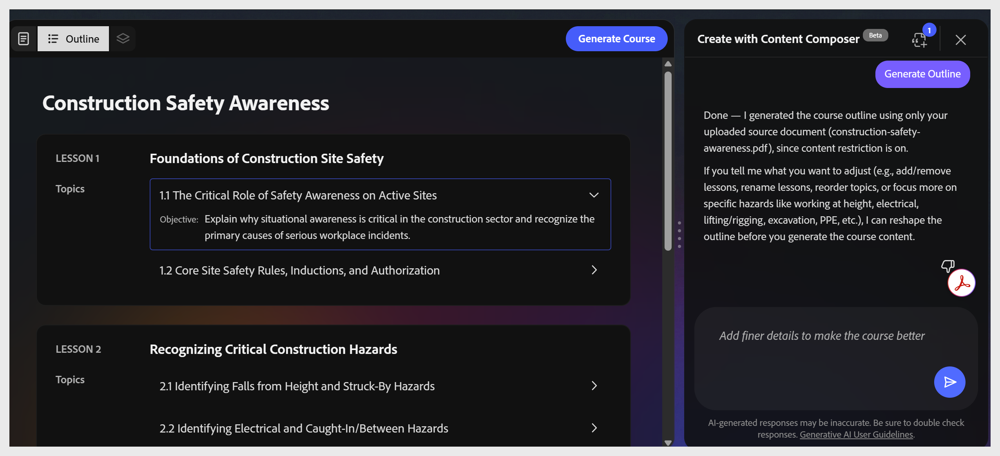

# Modifier le contour du cours

Le compositeur de contenu Adobe Learning Manager génère une structure de leçon et de rubrique à partir de votre bref fichier et de votre fichier source. Le plan s’affiche sur la zone de travail et montre toutes les leçons et leurs rubriques.

**Remarque :** la modification des contours est actuellement discutable dans la version Beta. Vous ne pouvez pas sélectionner une leçon ou une rubrique sur la zone de travail pour la renommer ou la réorganiser. Saisissez votre modification en tant que demande en langage clair dans le panneau de conversation.

L&#39;assistant travaille en conversation. Vous pouvez formuler des demandes avec vos propres mots. Voici quelques exemples de ce que vous pouvez faire :

| **Action** | **Exemple de requête** |
|--------------------------|---------------------------------------------------------------------------|
| Renommer une leçon ou une rubrique | « Renommez la leçon 1 en « Fonctionnement du phishing » » |
| Ajouter une leçon ou une rubrique | « Ajouter un sujet à la leçon 2 sur le phishing lié au code QR » |
| Suppression d’une leçon ou d’une rubrique | « Supprimer la rubrique 1.3 » |
| Diviser une leçon | « Scinder la leçon 3 en deux. Un pour les filtres anti-spam, un autre pour la gestion des correctifs » |
| Fusionner les leçons | « Fusionner les leçons 3 et 4 en une seule leçon » |
| Régénérer le contour | « Regénérez en mettant davantage l’accent sur l’hygiène des mots de passe » |

Utilisez des requêtes en langage clair dans le panneau de conversation pour modifier les leçons, les rubriques ou la structure hiérarchique complète.

La hiérarchie du plan est fixée sous la forme Leçons > Rubriques. Vous ne pouvez pas créer de sous-rubriques ou de structures à trois niveaux.

Lorsque le contour vous convient, sélectionnez **Générer le cours** dans la barre d&#39;outils supérieure.
