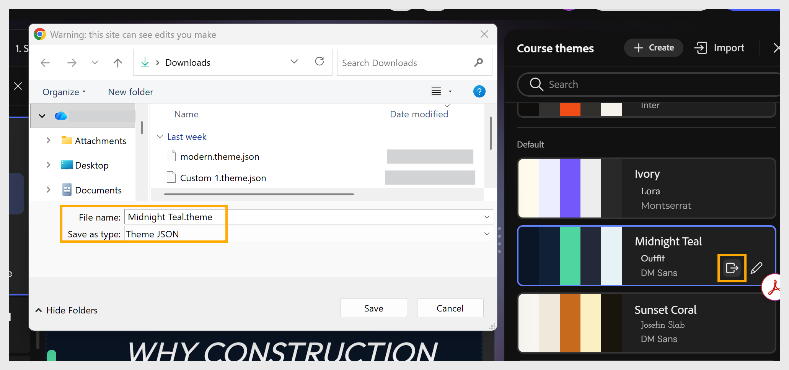

# Exportation d’un thème

Exportez un thème au format JSON pour le personnaliser en dehors du compositeur de contenu ou le partager avec d’autres auteurs.

1. Sélectionnez **Thèmes** dans la barre d&#39;outils pour ouvrir le panneau **Thèmes de cours**.

2. Passez la souris sur le thème que vous souhaitez exporter et sélectionnez l&#39;icône **Exporter**.
   

3. Dans la boîte de dialogue qui s&#39;affiche, choisissez un emplacement, saisissez un **nom de fichier**.
