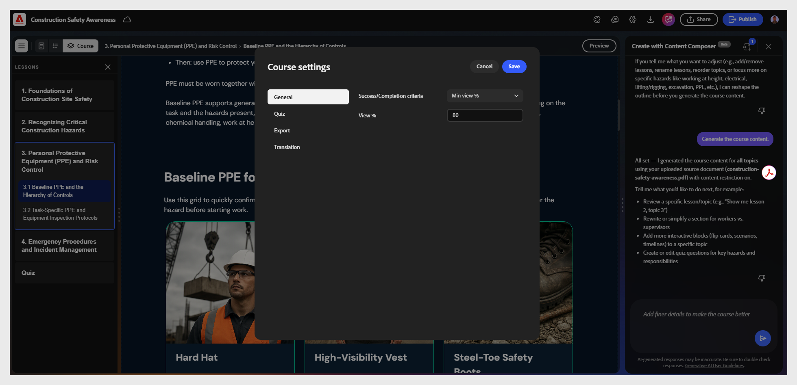

# Paramètres généraux du cours

1. Ouvrez votre cours.

2. Sélectionnez **Paramètres** pour ouvrir **Paramètres du cours**.
   

3. Sélectionnez **Général** pour configurer les critères de **réussite** et de **réussite** :

Les critères d’achèvement déterminent lorsqu’un cours est marqué comme terminé dans le LMS, en fonction de la progression de l’élève et non des performances.
