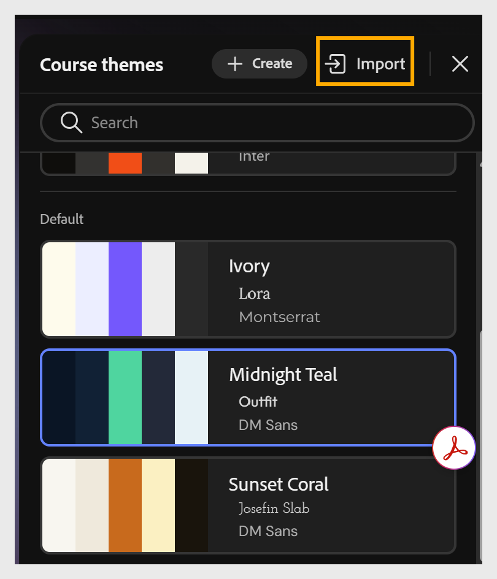

# Importation d’un thème

Importez un fichier JSON personnalisé pour appliquer vos modifications en tant que nouveau thème dans le compositeur de contenu.

1. Sélectionnez **Thèmes** dans la barre d’outils.

2. Sélectionnez **Importer** dans les options du **thème de cours**.
   

3. Choisissez le fichier JSON personnalisé sur votre ordinateur.

4. Sélectionnez **Enregistrer comme nouveau** pour créer un thème personnalisé.

## Vue d’ensemble de la structure JSON du thème

Un fichier JSON de thème comporte cinq zones principales :

| Section | Contrôles |
|----------------------------------------------------------------------|-----------------------------------------------------------------------------------------------------------------------------------------------------------------------------------------------------------------------------------------------------------------------------------------|
| Métadonnées (id, nom, version, description, auteur, source, isDefault) | Identité du thème et informations d’affichage |
| foundation.palette | Les 7 jetons de couleur de base (premier plan, arrière-plan, accent, backgroundSubtle, secondary, textPrimary, textInverse) référencés dans tout le thème via var(—tokenName) |
| foundation.fonts | Piles de polices d’en-tête et de corps |
| foundation.spacing et foundation.radius | Jetons d’échelle d’espacement horizontal/vertical et de rayon d’angle |
| éléments | Typographie et style structurel pour chaque rôle de texte (leçonTitle, topicTitle, blockHeading, sous-titre, question, légende, paragraphe, buttonLabel) et chaque composant (paragraphBlock, imageBlock, videoBlock, imageGrid, accordéon, carrousel, flipCard, onglets, journal, évaluation) |

Étant donné que la plupart des valeurs font référence à des jetons de palette à l’aide de var(—tokenName), la mise à jour d’un seul jeton, tel qu’un accent, se propage automatiquement en cascade et change dans chaque élément qui le référence. Il n’est pas nécessaire de rechercher des valeurs chromatiques individuelles.

