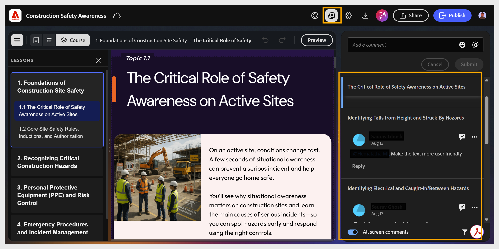

# Gestion et réponse aux commentaires

Si vous êtes l&#39;auteur, vous pouvez utiliser le panneau **Commentaires** de votre projet pour afficher les commentaires et y répondre.

1. Sélectionnez **Commentaires** dans la barre d&#39;outils supérieure. Le panneau **Commentaires** s&#39;ouvre et affiche tous les commentaires du réviseur.

   

2. Sélectionnez un commentaire pour l’afficher en contexte sur la zone de travail.

   

3. Sélectionnez l&#39;icône en forme de coche pour marquer un commentaire comme résolu, ou l&#39;icône **Plus d&#39;options** pour le modifier ou le supprimer.

   

4. Enregistrez le cours mis à jour.

5. Sélectionnez **Partager** pour mettre à jour le lien de révision afin que les réviseurs puissent afficher la dernière version.
