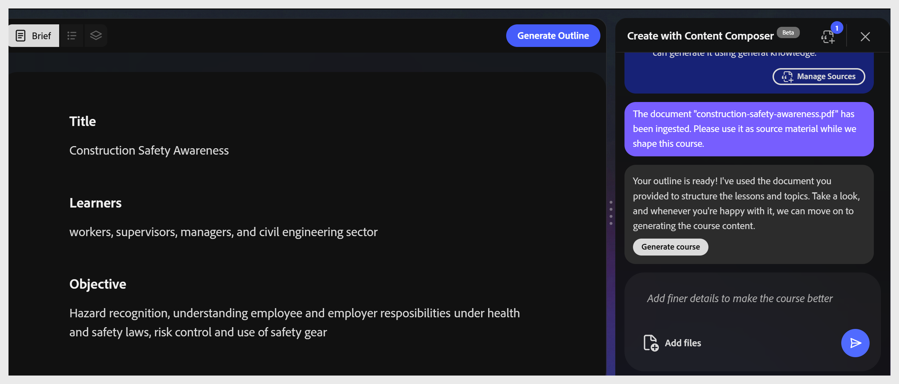

# Gestion des fichiers source

**Gérer les sources** vous permet de contrôler le contenu que le compositeur de contenu utilise pour générer votre cours. Ajoutez vos propres documents à un cours, puis choisissez de restreindre l&#39;IA à ce seul contenu ou de la laisser compléter votre matériel avec ses propres connaissances. Si vous n&#39;ajoutez aucun document, le compositeur de contenu génère le cours en utilisant les connaissances existantes du modèle IA.

## Génération d&#39;un cours à l&#39;aide du matériel source

1. Sélectionnez **Gérer les sources** ou **Ajouter des fichiers** dans le panneau de conversation ou la barre d&#39;outils.
   

2. Faites glisser un fichier dans la boîte de dialogue ou sélectionnez **+ Ajouter des fichiers sources** pour parcourir. Vous pouvez ajouter plusieurs fichiers source.
   

3. Sélectionnez **Restreindre la sortie au contenu dans les fichiers**. Cela permet au compositeur de contenu d&#39;utiliser uniquement le contenu source pour générer le cours. Si cette option est désélectionnée, le compositeur de contenu utilise également le Web pour créer un cours.
   

Format pris en charge :

| **Format** | **Taille maximale** |
|-------------------------|--------------|
| PDF | 100 Mo |
| Markdown (.md) | 100 Mo |
| PowerPoint (.ppt/.pptx) | 100 Mo |
| MS Word (.doc/.docx) | 100 Mo |
| Fichier texte (.txt) | 100 Mo |

Sélectionnez **Continuer** pour générer l&#39;aperçu du cours.

### Générer sans matériel source

Effectuez les étapes ci-dessous pour générer l&#39;outline du cours, lorsque vous n&#39;avez pas de fichier source comme document de référence.

1. Sélectionnez **Gérer les sources**. La boîte de dialogue **Gérer les sources** s&#39;ouvre.

2. Sélectionnez **Je n&#39;ai aucun document source : générez le cours sans fichiers source** pour permettre à l&#39;IA de générer du contenu à partir de ses connaissances générales. Lorsque cette option n&#39;est pas sélectionnée et que les fichiers sont chargés, l&#39;IA restreint le contenu généré à vos documents chargés uniquement.

3. Sélectionnez **Continuer** pour générer l&#39;aperçu du cours.

### Mise à jour d’un cours lorsque la matière source change

Les documents sources peuvent être obsolètes une fois qu&#39;un cours a déjà été généré : une politique est révisée, un SOP obtient une nouvelle version ou une présentation est mise à jour. Utilisez ce flux de travail pour réaligner le cours sur la matière actuelle.

1. Sélectionnez **Gérer les sources** dans le panneau de conversation ou la barre d&#39;outils pour rouvrir la boîte de dialogue.

2. Ajoutez les nouveaux fichiers ou les fichiers révisés en utilisant **+ Ajouter des fichiers sources**.

3. Supprimez ou remplacez tous les fichiers obsolètes afin que la liste source ne reflète que les éléments actuels.

4. Sélectionnez Continuer pour enregistrer la liste source mise à jour.

5. Régénérez les leçons concernées dans le compositeur de contenu, passez en revue les modifications, puis republiez le cours. La republication envoie la mise à jour à Adobe Learning Manager en tant que nouvelle version de module. Reportez-vous à la section Contrôle de version de module dans ALM.

### Confirmer le téléchargement du fichier

Une fois qu’un fichier est joint, l’icône de fichier dans la barre d’outils affiche un nombre de badges. L&#39;assistant confirme le téléchargement et propose un raccourci **Générer le contour**. Sélectionnez-le ou sélectionnez **Générer le contour** dans la barre d&#39;outils supérieure.
