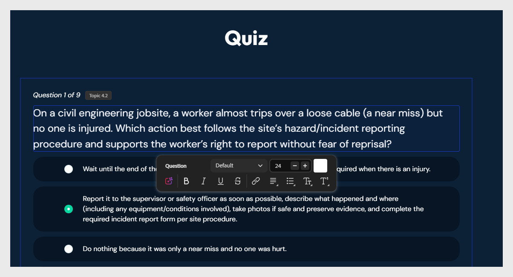

# Réviser et modifier le quiz

Un quiz noté s’affiche à la fin du cours. Chaque question est balisée avec le sujet qu’elle teste.

>[!NOTE]
>
>Les vérifications de connaissances intégrées dans les leçons ne sont pas notées. Seul le quiz de fin de leçon est noté.

Pour modifier une question :

1. Sélectionnez le texte de la question pour le modifier et utilisez les options de modification de texte pour ajuster le style.
   

2. Sélectionnez la case d’option en regard de l’option que vous souhaitez marquer comme correcte.

3. Vous pouvez également attribuer un score à la bonne réponse.
   

4. Pour supprimer une question, sélectionnez **Supprimer l&#39;option**.

5. Pour régénérer les questions, demandez à l&#39;assistant : « Régénérez le quiz pour la leçon 1. »
