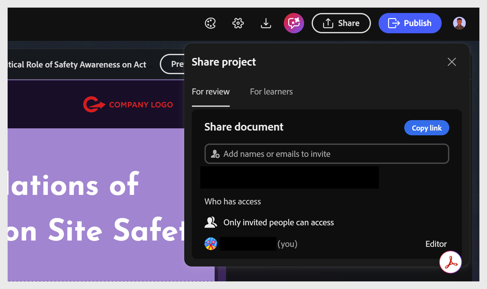

# Partager le projet pour révision

Le compositeur de contenu vous permet de partager un projet avec des réviseurs ou des élèves sans qu’ils aient à installer l’application. Vous disposez ainsi d’un moyen rapide et structuré de recueillir des commentaires et d’obtenir votre approbation avant la publication.

En tant qu’auteur, vous pouvez inviter des réviseurs par nom ou par e-mail, contrôler avec précision qui a accès et révoquer cet accès à tout moment. Les réviseurs peuvent ouvrir le lien partagé, ajouter des commentaires directement sur n&#39;importe quel composant du cours et même tenter le quiz final sans affecter les scores enregistrés, afin de pouvoir prévisualiser l&#39;expérience complète de l&#39;élève.

Les commentaires restent organisés et exploitables : les réviseurs et les propriétaires peuvent y répondre, les résoudre, les filtrer et les mentionner les uns les autres dans les commentaires, le tout à partir du même panneau, qu’ils soient en révision externe ou qu’ils travaillent au sein du projet. Une fois que vous avez traité les commentaires et mis à jour le projet.

Pour partager un projet à des fins de révision :

1. Sélectionnez **Pour révision**.

   

2. Saisissez les noms ou les adresses e-mail de vos réviseurs dans le champ **Inviter des personnes**.

   
3. Vérifiez qui a accès au projet pour confirmer que seules les personnes invitées peuvent y accéder.

4. Sélectionnez **Inviter en tant que commentateur** pour ajouter des réviseurs par nom ou par e-mail. Vous pouvez ajouter autant de réviseurs que nécessaire. Ou sélectionnez **Copier le lien** pour copier l&#39;URL de révision et la partager directement avec les réviseurs qui y ont déjà accès. Il s’agit de deux manières distinctes de partager le projet.

   

## Suppression de l’accès d’un réviseur

Vous pouvez supprimer un réviseur de la liste des personnes ayant accès au projet. Si ce réviseur tente de rouvrir le projet à l’aide d’un lien précédemment partagé.

Vous avez la possibilité de supprimer un commentaire sélectionné. Lorsqu’un commentateur est supprimé de la liste des personnes ayant accès au document.

Pour supprimer l’accès :

* Sélectionnez le nom du réviseur et choisissez Supprimer dans les options affichées.

* Si le réviseur tente d’accéder au document avec un lien précédemment partagé. Le message Accès refusé s’affiche.

  

## Demander l’accès

Si vous tentez d’ouvrir un projet partagé auquel vous n’avez plus accès, vous devez demander l’accès avant de pouvoir l’afficher. Cela peut se produire, par exemple, si le propriétaire vous a supprimé ou si vous ouvrez le lien avec un autre Adobe ID. Dans les deux cas, un écran Accès refusé s’affiche.

* Sélectionnez **Demander l’accès** pour demander au propriétaire l’autorisation de réviser le projet et d’ajouter des commentaires.

  

* Le propriétaire du projet reçoit une notification avec le nom du réviseur demandant l’accès.