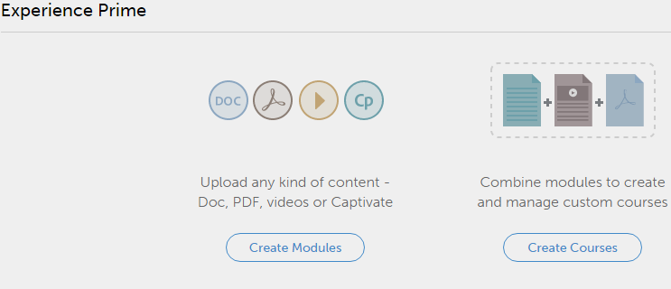

# Prise en main en tant qu’auteur

## Prise en main {#gettingstarted}

La page Prise en main vous permet de parcourir les principales fonctionnalités de l’application.

Après vous être connecté en tant qu’auteur, vous pouvez afficher la fenêtre contextuelle avec une liste de vidéos.

## Affichage d’exemples de vidéos {#viewsamplevideos}

Parcourez les didacticiels des exemples de vidéos pour comprendre les principales fonctionnalités de votre rôle en tant qu’auteur. Si vous ne souhaitez pas que cette fenêtre contextuelle apparaisse lors de la connexion, vous pouvez la désactiver en cliquant sur l’option « Ne pas afficher à la connexion » dans le coin inférieur droit de la fenêtre contextuelle.

Cliquez sur Fermer la fenêtre pour fermer la fenêtre contextuelle.

## Page Prise en main {#gettingstartedpage}

Depuis la page Prise en main, vous pouvez réaliser les activités suivantes :

* Créer des modules
* Créer des cours

Vous pouvez également en savoir plus sur l’application Learning Manager en consultant les didacticiels vidéo, le contenu de l’aide et découvrir les différents rôles.

