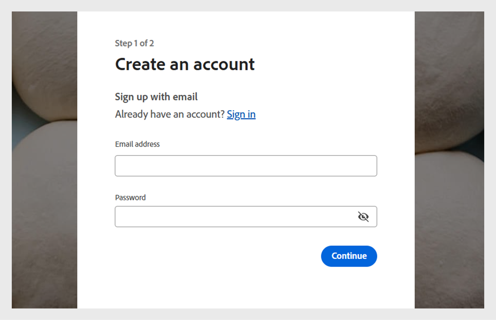

# Création d’un compte d’évaluation dans Adobe Learning Manager

Vous pouvez facilement configurer un compte d’essai gratuit de 30 jours dans Adobe Learning Manager pour explorer les fonctionnalités et tester les workflows d’apprentissage. Ce guide explique par où commencer, comment vous inscrire et comment trouver les détails de votre compte une fois que vous êtes configuré.

Pour créer un compte d’évaluation :

1. Accédez à [Adobe Learning Manager](https://business.adobe.com/products/learning-manager/adobe-learning-manager.html).
2. Sélectionnez **[!UICONTROL Essai gratuit de 30 jours]**.

   

3. Sélectionnez **[!UICONTROL Créer un compte]** sur la page de connexion.

   

4. Saisissez votre **[!UICONTROL adresse électronique]** et votre **[!UICONTROL mot de passe]**.

   

5. Saisissez les détails suivants et sélectionnez **[!UICONTROL Créer un compte]** :
   * Prénom
   * Nom
   * Date de naissance

   

6. Saisissez et remplissez le formulaire avec les détails requis pour configurer votre compte d’essai.
7. Après la configuration, recherchez votre ID de compte dans l’URL de votre URL Adobe Learning Manager.

   
