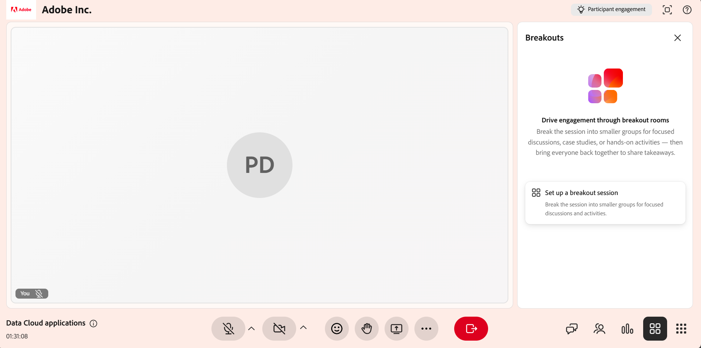
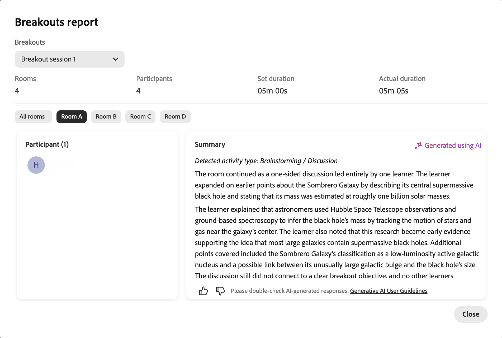

# Créer et gérer des sessions en petits groupes

Les instructeurs peuvent diviser une session Live Hub en petits groupes interactifs pour des activités et des discussions ciblées. Vous pouvez créer des salles d&#39;atelier, affecter automatiquement ou manuellement des élèves, définir des instructions d&#39;activité et contrôler la durée de la session. Tant qu’une session en petits groupes est active, vous pouvez surveiller des salles avec des résumés générés par l’IA, rejoindre une salle pour partager votre écran ou votre chat et prolonger la session.

Ce guide passe en revue toutes les actions de la salle d’atelier disponibles pour les instructeurs, de la création d’une salle à la révision du rapport de session.

## Créer une session en petits groupes

Les sessions en petits groupes divisent une classe virtuelle en petits groupes interactifs. Procédez comme suit pour en créer un.

Pour créer une session en petits groupes :

1. Sélectionnez  dans la barre de contrôle.

   
   *Interface Live Hub affichant le panneau de répartition.*

1. Sélectionnez **Configurer une session de discussion**.

Le panneau Répartitions s’ouvre. À partir de là, vous pouvez configurer les salles d’atelier, affecter des élèves et gérer les paramètres de session d’atelier.

>[!NOTE]
>Si la session d&#39;éclatement ne démarre pas, consultez le [Guide de dépannage pour Live Hub](../kb/troubleshooting-guide-for-live-hub.md#breakout-session-issues) pour obtenir une liste des messages d&#39;erreur courants et savoir comment les résoudre.

## Concevoir une session en petits groupes

Avant de commencer une session en petits groupes, configurez les salles, affectez des élèves et définissez les détails de l&#39;activité à l&#39;aide du panneau **Groupes**. Une configuration appropriée permet de placer les élèves correctement et de comprendre l’objectif de chaque activité d’atelier.

Pour concevoir une session en petits groupes :

1. Sélectionnez  dans la barre de contrôle.   Le panneau Répartitions s’ouvre.

   
   *Panneau des sous-groupes affichant les options de configuration des sous-groupes.*

1. Configurez les salles de réunion à l’aide des options suivantes :

| **Option** | **Description** |
|----|----|
| Icône Modifier | Sélectionnez l’icône Modifier pour renommer la session de découpage. |
| **Salles** | Définissez le nombre de salles de réunion à l&#39;aide des commandes d&#39;augmentation ou de diminution. Le maximum est de **10** chambres. |
| **Durée** | Définissez la durée de la session d’éclatement. La durée minimale est de **5 minutes** et la durée maximale est de **60 minutes**. |
| **Attribuer des participants** | Sélectionnez **Affectation automatique** pour affecter automatiquement des participants aux salles. Vous pouvez également faire glisser et déposer un élève pour le déplacer vers une autre salle. |
| **Définir individuellement pour les salles** | Personnalisez les instructions séparément pour chaque salle de petit déjeuner. |
| **Instructions** | Décrivez l&#39;activité et décrivez les résultats attendus de la séance en petits groupes. |
| **Afficher les allocations de salle** | Prévisualisez la manière dont les élèves seront répartis dans les salles de réunion avant le début de la session. |
| **Démarrer les sous-groupes** | Démarrez la session en petits groupes et déplacez les élèves vers les salles qui leur sont attribuées. |
| Icône Ignorer | Ignorer la configuration de dérivation actuelle sans enregistrer les modifications. |

1. Sélectionnez **Enregistrer**.   La session en petits groupes apparaît dans le panneau **Groupes** avec une balise **Nouveau**.

## Démarrer une session en petits groupes

Une fois la session d&#39;atelier configurée et enregistrée, elle apparaît dans le panneau **Attaques**. Démarrez la session pour déplacer les élèves dans les salles qui leur sont attribuées.

Pour démarrer une session en petits groupes :

1. Ouvrez le panneau **Sous-groupes**.

1. Accédez à la session d&#39;atelier avec la balise **Nouveau**.

1. Sélectionnez **Démarrer les sous-groupes**.   Une notification affiche **À partir de 5 secondes**, et les élèves sont ensuite déplacés vers les salles d’atelier qui leur sont attribuées avec la configuration configurée appliquée.

   
   *Sélectionnez Démarrer les sous-groupes pour démarrer la session de sous-groupes.*

## Gérer les sessions de petits groupes

Après avoir enregistré une session en petits groupes, elle apparaît dans le panneau **Groupes**. Chaque session enregistrée affiche son statut (**Nouveau** ou **Fermé**), le nombre de salles et la durée. À partir de ce panneau, vous pouvez modifier, dupliquer ou supprimer une session selon vos besoins.

### Modification d’une session en petits groupes

Utilisez cette option pour mettre à jour une configuration de dérivation existante. La modification est disponible pour les sessions avec l&#39;état **Nouveau**.

Pour modifier une session en petits groupes :

1. Ouvrez le panneau **Sous-groupes**.

1. Accédez à la session de petits groupes que vous souhaitez modifier.

1. Sélectionnez l’icône de modification (crayon) sur la session.

   
   *Sélectionnez l’icône Modifier (crayon) pour mettre à jour la configuration de la session d’éclatement.*

1. Mettez à jour la configuration selon vos besoins, comme le nombre de salles, la durée ou les instructions.

1. Sélectionnez **Enregistrer**.

### Duplication d’une session de dérivation

Réutilisez une configuration de dérivation existante en dupliquant une session créée précédemment.

Pour dupliquer une session :

1. Ouvrez le panneau **Sous-groupes**.

1. Accédez à la session de découpage que vous souhaitez dupliquer.

1. Sélectionnez les autres options (**...**) sur la session.

   
   *Le menu Plus d’options affiche les actions en double.*

1. Sélectionnez **Dupliquer**.

Une nouvelle session est créée avec la même configuration de salle, les mêmes attributions de participants, les mêmes instructions et la même durée. La salle d&#39;atelier copiée apparaît en haut du panneau avec l&#39;état **Nouveau** et un nom tel que **Session d&#39;atelier 1 (Copie)**.

### Supprimer une session en petits groupes

Utilisez cette option pour supprimer une session d’éclatement qui n’est plus nécessaire.

Pour supprimer une session d’atelier :

1. Ouvrez le panneau **Sous-groupes**.

1. Accédez à la session de petits groupes enregistrée.

1. Sélectionnez les autres options (**...**) sur la session.

1. Sélectionnez **Supprimer**.   Une fenêtre contextuelle de confirmation s’affiche.

   
   *Sélectionnez Supprimer dans la fenêtre contextuelle de confirmation pour supprimer une session en petits groupes.*

1. Sélectionnez **Supprimer**.

## Gestion des activités dans une session en petits groupes active

Au cours d’une session de petits groupes active, les instructeurs peuvent surveiller l’activité dans la salle, communiquer avec les élèves et collaborer avec les participants en rejoignant des salles de petits groupes individuelles. La plupart des outils de collaboration disponibles dans la session principale, tels que le chat, le partage d’écran et le tableau blanc, sont également disponibles dans les salles de réunion et fonctionnent de la même manière.

### Afficher les résumés générés par l’IA des salles de réunion

Les instructeurs peuvent afficher les résumés des discussions générés par l’IA dans chaque salle de réunion pour surveiller les conversations des participants, évaluer l’alignement avec l’activité et décider quand rejoindre une salle. Les résumés sont mis à jour automatiquement tout au long de la session au fur et à mesure des discussions.

>[!NOTE]
>
>Une salle de réunion nécessite au moins 60 secondes de discussion avant qu&#39;un résumé puisse être généré. Les salles avec moins d&#39;activité n&#39;afficheront pas de récapitulatif dans la fenêtre Vérifier la salle.

Pour afficher des résumés :

1. Accédez à la salle que vous souhaitez réviser.

1. Sélectionnez **Vérifier la salle**.   Une fenêtre contextuelle **Vérifier la salle** s&#39;affiche avec le résumé de la salle.

   
   *La fenêtre contextuelle Vérifier la salle affiche le résumé de la salle.*

1. (Facultatif) Sélectionnez une autre salle. Le résumé est mis à jour pour afficher les détails de la salle sélectionnée.

### Utilisation des outils de collaboration dans les salles de réunion

Après avoir rejoint une salle de réunion, les instructeurs peuvent utiliser les mêmes outils de collaboration que ceux disponibles dans la session principale pour guider les élèves et interagir avec eux. Vous pouvez :

* Discutez avec les élèves pour répondre aux questions et faciliter les discussions. Voir [À propos du panneau Conversation](./about-the-chat-panel.md) pour plus d&#39;informations.

* Partagez votre écran ou vos présentations pour expliquer des concepts ou démontrer des tâches. Afficher [À propos du partage d&#39;écran](./about-the-screen-sharing.md) pour plus d&#39;informations.

* Collaborez à l’aide du tableau blanc pour le brainstorming, les annotations et les activités interactives. Voir [À propos du tableau blanc](./about-the-whiteboard.md) pour plus d&#39;informations.

## Terminer une session en petits groupes

Vous pouvez mettre fin à la session en petits groupes à tout moment.

1. Accédez au panneau **Sous-groupes**.

1. Sélectionnez **Terminer les sous-groupes** dans la session de sous-groupes active.   Tous les élèves sont replacés dans la salle principale et la session de petits groupes se termine pour tous les participants.

   
   *Session en petits groupes 2 montrant les options de fin de session pour terminer la session en petits groupes.*

## Afficher un rapport de session en petits groupes

Une fois la session de sous-groupe terminée, vous pouvez accéder au rapport de la session de sous-groupe pour passer en revue l’activité et la participation à la session. Le rapport comprend des détails sur les participants, un résumé global et spécifique à la salle des discussions en petits groupes, des instructions partagées avec les participants, et un aperçu de la durée de la session et de l&#39;engagement.

>[!NOTE]
>
>Les sous-groupes de moins de 60 secondes de discussion n&#39;ont pas de résumé inclus dans le rapport.

Pour afficher un rapport de session en petits groupes :

1. Accédez à la session de petits groupes fermée dans le panneau **Petits groupes**.

1. Sélectionnez **Afficher les rapports**.   La fenêtre contextuelle du rapport sur les groupes s&#39;ouvre avec le résumé de la session.

   
   *Fenêtre contextuelle des rapports des sous-groupes affichant le rapport des sous-groupes.*

1. Effectuez l’une des opérations suivantes :
   * Sélectionnez **Toutes les salles** pour afficher le **résumé global** de la session en petits groupes.
   * Sélectionnez l&#39;onglet d&#39;un espace pour afficher le récapitulatif de cet espace.

Tous les aperçus de session en petits groupes sont également disponibles dans le **tableau de bord de session**, où vous pouvez consulter les résumés, analyser la participation et suivre les résultats de la session après la session. Afficher [Composants du tableau de bord de session](./components-of-the-session-dashboard.md) pour plus d&#39;informations.

## Prolongation d’une session en petits groupes

Si plus de temps est nécessaire, vous pouvez prolonger la session d&#39;éclatement lorsqu&#39;elle est active en sélectionnant **Étendre le temps de 2 minutes** dans les commandes d&#39;éclatement pour augmenter la durée de la session. Vous pouvez prolonger la session jusqu’à deux fois au cours de chaque session de petits groupes. La durée mise à jour est appliquée immédiatement, ce qui permet aux élèves de poursuivre leurs activités sans interruption.
