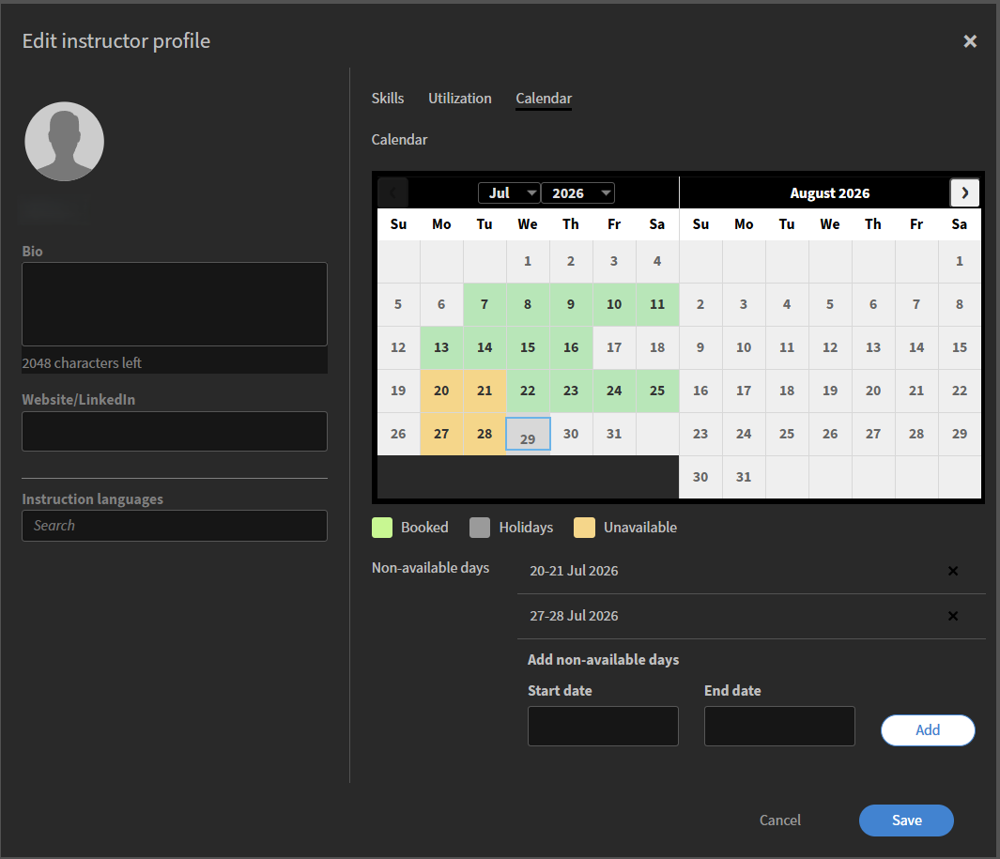

# Ajouter et gérer des instructeurs

Les instructeurs donnent des sessions en direct et impliquent les élèves dans Live Hub. Pour prendre en charge une planification précise et une prestation de cours efficace, les administrateurs peuvent ajouter des instructeurs, créer leurs profils, définir les compétences et les langues d’enseignement et configurer la disponibilité.

L’onglet Instructeurs fournit un emplacement unique pour gérer ces informations dans votre organisation. À partir de là, vous pouvez ajouter des utilisateurs Adobe Learning Manager existants en tant qu’instructeurs, réviser et mettre à jour leurs profils et mettre à jour leurs compétences, leurs langues et leur disponibilité à mesure que les besoins en matière d’enseignement évoluent.

## Accès à l’onglet Instructeurs

Procédez comme suit pour afficher et gérer les instructeurs :

1. Connectez-vous à Adobe Learning Manager.

1. Accédez à **Administrateur** > **Utilisateurs**.

1. Sélectionnez **Instructeurs** dans **Groupes d’utilisateurs**.

   
   *Sélectionnez des instructeurs dans les groupes d’utilisateurs pour afficher et gérer les instructeurs.*

## Ajouter un instructeur

Les instructeurs sont créés à partir d’utilisateurs Adobe Learning Manager existants. Si un utilisateur ne dispose pas encore des autorisations d’instructeur, ajoutez-les en tant qu’instructeur.

Pour ajouter un instructeur :

1. Sélectionnez l&#39;onglet **Instructeurs** dans **Groupes d&#39;utilisateurs**.

1. Sélectionnez **Ajouter des instructeurs**.   Une fenêtre contextuelle de **Ajouter des instructeurs** s&#39;affiche.

   Fenêtre contextuelle 
   *Recherchez un utilisateur par nom et sélectionnez-le pour lui attribuer le rôle d&#39;instructeur.*

1. Recherchez l’utilisateur par nom et sélectionnez-le dans les résultats de recherche pour lui attribuer le rôle d’instructeur.

1. Sélectionnez **Enregistrer**.   L’utilisateur se voit désormais attribuer le rôle d’instructeur et apparaît dans la liste des instructeurs.

## Configuration d’un profil d’instructeur

Un profil d’instructeur définit les informations d’enseignement, les langues, les compétences, l’utilisation et la disponibilité de l’instructeur. Finaliser le profil garantit la correspondance exacte des instructeurs, une planification efficace et l’alignement avec les exigences du cours.

Pour configurer un profil d’instructeur :

1. Recherchez le nom de l’instructeur dans l’onglet Instructeurs.

1. Sélectionnez **Ajouter des compétences et d&#39;autres détails**.   Une fenêtre contextuelle **Modifier le profil d&#39;instructeur** s&#39;affiche.

   
   *La fenêtre Modifier le profil de l’instructeur inclut des onglets pour les détails de base, les compétences, l’utilisation et la disponibilité.*

### Ajout de détails de base

Les détails de base apparaissent dans le panneau de gauche de la boîte de dialogue et sont toujours visibles, quel que soit l’onglet ouvert.

Pour ajouter les détails de base :

1. Accédez à la section du profil.

1. Saisissez les détails suivants :

   | **Champs** | **Action** |
   |----|----|
   | **Bio** | Saisissez une brève description de l’instructeur (2 048 caractères maximum). |
   | **Site Web/LinkedIn** | Entrez un profil externe ou un lien de référence. |
   | **Langues d&#39;enseignement** | Recherchez les langues dans lesquelles l’instructeur peut enseigner. Les langues sélectionnées apparaissent sous forme de balises. |

## Ajout de compétences d’instructeur dans le profil

Les compétences définissent les sujets et l’expertise qu’un instructeur peut enseigner. Cela joue un rôle clé dans l’appariement des instructeurs aux cours pertinents et permet de s’assurer que le bon instructeur est affecté en fonction des exigences du cours.

Pour ajouter des compétences d’instructeur :

1. Accédez à l&#39;onglet **Compétences**.

1. Saisissez un nom de compétence dans le champ **Rechercher**. Une liste contenant les compétences s’affiche.

1. Sélectionnez des compétences dans la liste.   Les compétences sélectionnées apparaissent sous forme de balises.

1. Sélectionnez **Enregistrer**.

### Créer une nouvelle compétence

Si la compétence requise n’est pas disponible, vous pouvez la créer directement à partir du profil.

Pour ajouter une nouvelle compétence :

1. Sélectionnez **Ajouter une nouvelle compétence** dans l&#39;onglet **Compétences**. Un panneau **Ajouter une compétence** s&#39;ouvre.

    *Entrez un nom et une description de compétence, puis sélectionnez Terminé pour ajouter la nouvelle compétence.*

1. Saisissez les détails suivants dans le panneau **Ajouter une compétence** :

   1. Nom de la compétence

   1. Description

1. Sélectionnez **Terminé**.   La nouvelle compétence a été ajoutée et apparaît sous forme de balise.

1. Sélectionnez **Enregistrer**.   Les compétences sont ajoutées au profil de l’instructeur.

## Configuration de l’utilisation des instructeurs

Utilisez l&#39;onglet **Utilisation** pour définir la capacité d&#39;enseignement et les heures de travail préférées d&#39;un instructeur. Vous pouvez définir des contraintes d&#39;utilisation pour établir des objectifs et des limites d&#39;enseignement et spécifier les heures de travail préférées pour indiquer quand l&#39;instructeur est disponible pour mener les sessions. Le fuseau horaire affiché est hérité du profil utilisateur de l’instructeur.

Pour configurer l’utilisation des instructeurs :

1. Accédez à l&#39;onglet **Utilisation**.

1. Entrez les **objectifs minimaux** et les **limites maximales** (en heures) pour la période **mensuelle**.

1. Entrez une **heure de début** et une **heure de fin** pour l&#39;intervalle de temps préféré.

   
   *Entrez une heure de début et une heure de fin pour les heures de travail préférées de l&#39;instructeur.*

1. (Facultatif) Sélectionnez **Ajouter un autre créneau horaire** pour ajouter une disponibilité supplémentaire.

1. Sélectionnez **Enregistrer**. Les contraintes d’utilisation et les temps de travail préférés de l’instructeur sont mis à jour.

## Gérer la disponibilité des instructeurs

Utilisez l&#39;onglet **Calendrier** pour ajouter la planification de l&#39;instructeur et marquer des périodes où l&#39;instructeur n&#39;est pas disponible. Le calendrier utilise un codage couleur pour identifier les dates **Réservé**, **Vacances** et **Non disponible**.

Les **jours fériés** affichés sur ce calendrier sont configurés à partir des paramètres des jours fériés. Voir [Gérer les jours fériés](./manage-holidays.md) pour plus d&#39;informations.

Pour marquer des jours non disponibles :

1. Accédez à l&#39;onglet **Calendrier**.

1. Sélectionnez une date de début et une date de fin dans la section **Ajouter des jours non disponibles**.

   
   *Sélectionnez une date de début et une date de fin pour marquer une plage comme indisponible sur le calendrier de l&#39;instructeur.*

1. Sélectionnez **Ajouter**.   La plage de dates sélectionnée est marquée comme non disponible sur le calendrier.

1. Sélectionnez **Enregistrer**. Les paramètres de disponibilité de l’instructeur sont mis à jour.
