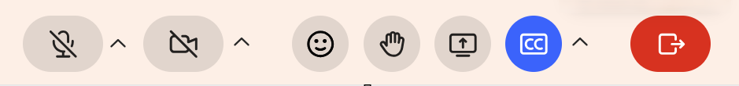

# Gérer les sous-titres en tant qu’élève

Les sous-titres affichent le contenu parlé sous forme de texte à l’écran, ce qui facilite le suivi d’une session Live Hub, par exemple, si vous êtes dans un environnement bruité ou si vous préférez lire en même temps que l’audio. Vous pouvez contrôler vos propres sous-titres à l’aide du bouton Sous-titres (CC) de la barre de contrôle. Ce guide explique comment afficher, ajuster et masquer les légendes en tant qu’élève.

## Afficher les sous-titres

Vous pouvez afficher les sous-titres dans votre propre vue au cours d’une session. Les sous-titres sont mis à jour en temps réel au fur et à mesure que les participants parlent, afin que vous puissiez suivre la conversation sous forme de texte. Chaque participant choisit d’afficher ou non les sous-titres en fonction de ses propres préférences.

Pour afficher des sous-titres, sélectionnez le bouton de sous-titres (**CC**) dans la barre de contrôle.

*Sélectionnez l’icône CC pour afficher les sous-titres dans la session.*

## Modification de l’apparence des sous-titres

Vous pouvez personnaliser l’apparence des sous-titres pour améliorer la lisibilité en fonction de vos besoins d’affichage.

Pour modifier l’aspect d’une légende :

1. Sélectionnez la flèche en regard du bouton Sous-titres (CC) dans la barre de contrôle.

1. Sélectionnez l’une des options suivantes :

   1. **Taille de police** : sélectionnez une taille pour le texte des sous-titres. Les options disponibles sont **Petit**, **Moyen** et **Grand**.

   1. **Style de légende** : sélectionnez une combinaison de couleurs. Les combinaisons disponibles sont les suivantes : **noir sur blanc**, **jaune sur noir**, **blanc sur noir**, **foncé sur jaune** et **jaune sur bleu**.

   Élève de l’aspect des sous-titres 
   *Sélectionnez la flèche en regard de l&#39;icône CC pour modifier la taille de la police et le style de la légende.*
