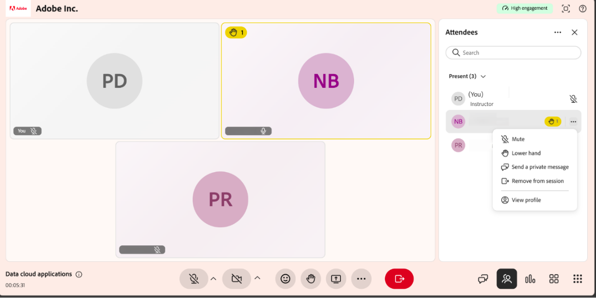

# Gestion des mains levées et des réactions des participants

En tant qu’instructeur, vous pouvez surveiller les réactions des élèves et gérer les mains levées pour organiser les discussions et les rendre attrayantes. Les instructeurs peuvent également lever la main et envoyer des réactions pendant une session.

## Afficher les réactions des participants

Les réactions des élèves fournissent un retour d&#39;informations rapide et non verbal au cours d&#39;une session et vous aident à évaluer l&#39;engagement sans interrompre la discussion.

* Les réactions s’affichent sous forme d’incrustations visuelles dans la session.

* Lorsque plusieurs réactions sont envoyées, elles s’affichent l’une après l’autre.

* Les réactions sont temporaires et disparaissent automatiquement après un court laps de temps.

* Utilisez les réactions pour comprendre rapidement les réponses des élèves et les niveaux de participation.

## Abaisser une main levée

Si la question d’un élève a été traitée ou ne nécessite plus d’attention, vous pouvez baisser sa main levée.

1. Sélectionnez  dans la barre de contrôle.

1. Accédez à l’élève avec la main levée.

1. Sélectionnez l&#39;icône **Plus d&#39;options (⋯)** en regard du nom de l&#39;élève.

   
   *Menu Plus d’options affichant les actions de l’élève à partir du panneau Participants.*

1. Sélectionnez **En bas**.

L’indicateur de main levée de l’élève est immédiatement supprimé.

## Abaisser toutes les mains levées

Lorsque vous avez terminé de répondre aux questions des élèves, vous pouvez baisser toutes les mains levées pour réinitialiser la liste des participants avant de passer à la rubrique ou activité suivante. Cela vous aide à identifier les nouvelles questions au fur et à mesure qu’elles surviennent et à organiser les interactions.

Pour effacer toutes les mains levées en même temps :

1. Sélectionnez  dans la barre de contrôle.

1. Sélectionnez le menu **Autres options (⋯)**. La liste des paramètres du panneau Participants s’affiche.

1. Sélectionnez **Baisser toutes les mains**.

Tous les indicateurs de main levée sont supprimés de la liste des participants.
