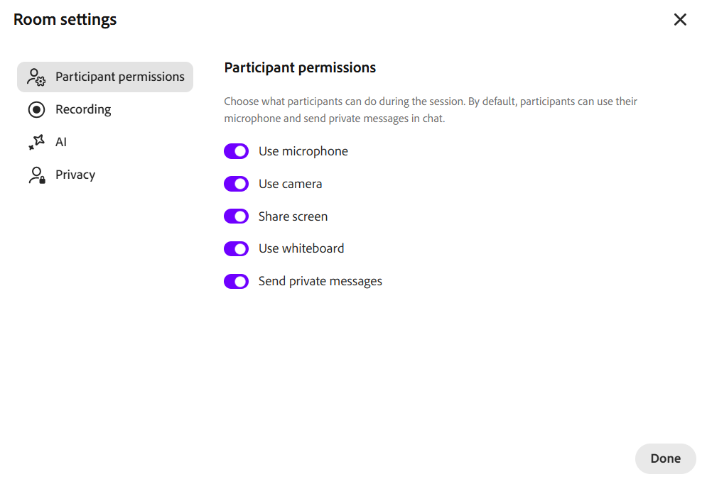

# Gestion des paramètres de la salle

Dans une session Live Hub, les instructeurs peuvent contrôler les autorisations des participants et le comportement de l’espace à l’aide des paramètres de l’espace. Ces paramètres vous permettent de gérer les interactions des participants, ce qui est capturé dans l’enregistrement, la confidentialité et les fonctionnalités d’assistance optimisées par l’IA pour garantir une session structurée et attrayante.

## Accès aux paramètres de la salle

1. Rejoignez la session Live Hub.

1. Sélectionnez **Autres actions** dans la barre de contrôle.

1. Sélectionnez **Paramètres**.   Une fenêtre contextuelle affiche les **paramètres de la salle**.

   Fenêtre contextuelle Paramètres de la salle 
   *Fenêtre contextuelle des paramètres de la salle affichant les options des paramètres de session.*

1. Sélectionnez l’onglet correspondant dans le panneau de gauche :

   1. **Autorisations des participants** : contrôlez ce que les participants peuvent faire pendant la session, comme utiliser leur microphone, leur appareil photo, leur partage d’écran, leur tableau blanc et leur conversation privée.

   1. **Enregistrement** : choisissez ce qui est capturé dans l&#39;enregistrement, y compris les flux vidéo des participants, les sondages et la transcription de la conversation.

   1. **IA** : activez ou désactivez les assistants IA de la session, y compris l&#39;assistant Q&amp;R, l&#39;assistant de sondage, l&#39;agent de surveillance des sous-groupes et la génération de sujets d&#39;enregistrement.

   1. **Confidentialité** : affichez ou masquez les participants inscrits qui n&#39;ont pas encore rejoint la session.

1. Modifiez les paramètres requis.

1. Sélectionnez **Terminé**.

## Options des paramètres de la salle

Les paramètres suivants vous aident à gérer la session en contrôlant ce que les participants peuvent faire, ce qui est capturé dans l’enregistrement, quels assistants IA sont actifs et comment les participants apparaissent les uns aux autres.

<table style="width:100%;">
<colgroup>
<col style="width: 26%" />
<col style="width: 30%" />
<col style="width: 42%" />
</colgroup>
<thead>
<tr>
<th><strong>Catégorie</strong></th>
<th><strong>Option</strong></th>
<th><strong>Description</strong></th>
</tr>
</thead>
<tbody>
<tr>
<td rowspan="5">
<strong>Autorisations des participants</strong>

<strong>Par défaut</strong> : les participants peuvent utiliser leur microphone, partager leur caméra et envoyer des messages privés par chat.
</td>
<td>Utiliser un microphone</td>
<td>Permet aux participants de s'exprimer pendant la session.</td>
</tr>
<tr>
<td>Utiliser la caméra</td>
<td>Permet aux participants d’activer leur vidéo.</td>
</tr>
<tr>
<td>Écran Partager</td>
<td>Permet aux participants de présenter leurs écrans.</td>
</tr>
<tr>
<td>Utiliser le tableau blanc</td>
<td>Permet aux participants de dessiner et de collaborer sur le tableau blanc.</td>
</tr>
<tr>
<td>Envoyer des messages privés</td>
<td>Permet aux participants de s'envoyer des messages privés dans le chat.</td>
</tr>
<tr>
<td rowspan="3">
<strong>Enregistrement</strong>

<strong>Par défaut</strong> : les flux vidéo et les sondages des participants sont capturés dans l’enregistrement, contrairement à la transcription de la conversation.
</td>
<td>Exclure les flux vidéo des participants</td>
<td>Exclut les flux vidéo des participants de l’enregistrement.</td>
</tr>
<tr>
<td>Exclure les sondages</td>
<td>Exclut les sondages de l'enregistrement.</td>
</tr>
<tr>
<td>Inclure la conversation</td>
<td>Ajoute la transcription de la conversation à l’enregistrement.</td>
</tr>
<tr>
<td rowspan="4">
<strong>AI</strong>

<strong>Par défaut</strong> : tous les assistants IA sont activés si les administrateurs les ont activés.
</td>
<td>Activer l’assistant Q&amp;R et la génération de réponses</td>
<td>Détecte les questions des participants dans le chat et rédige des réponses basées sur le contenu chargé et la transcription de la session, pour que les instructeurs puissent les réviser, les affiner et les partager.</td>
</tr>
<tr>
<td>Activer l’assistant de sondage</td>
<td>Crée des sondages à partir du contenu du cours et de la transcription de la session en direct, des brise-glaces ou des vérifications de connaissances, prêts à être examinés et lancés en un clic.</td>
</tr>
<tr>
<td>Activer l'agent de surveillance de rupture</td>
<td>Lit la transcription de chaque salle en fonction de l'objectif de l'instructeur, affiche une fiche d'état toutes les quelques minutes et fournit des résumés des discussions par salle ainsi qu'une synthèse intersalle des thèmes, des décisions et des lacunes pour un compte rendu instantané.</td>
</tr>
<tr>
<td>Activer la génération des rubriques d’enregistrement</td>
<td>Les enregistrements sont segmentés automatiquement en rubriques nommées avec des horodatages et des notes structurées, de sorte qu’un participant peut aller directement à ce dont il a besoin ou apprendre des notes sans les regarder du tout.</td>
</tr>
<tr>
<td>
<strong>Confidentialité</strong>

<strong>Par défaut</strong> : tous les participants inscrits sont visibles par tous.
</td>
<td>Afficher les participants qui ne se sont pas joints</td>
<td>Affiche les participants inscrits qui ne se sont pas encore inscrits. Désactivez-la pour les masquer jusqu’à ce qu’ils rejoignent la réunion.</td>
</tr>
</tbody>
</table>
